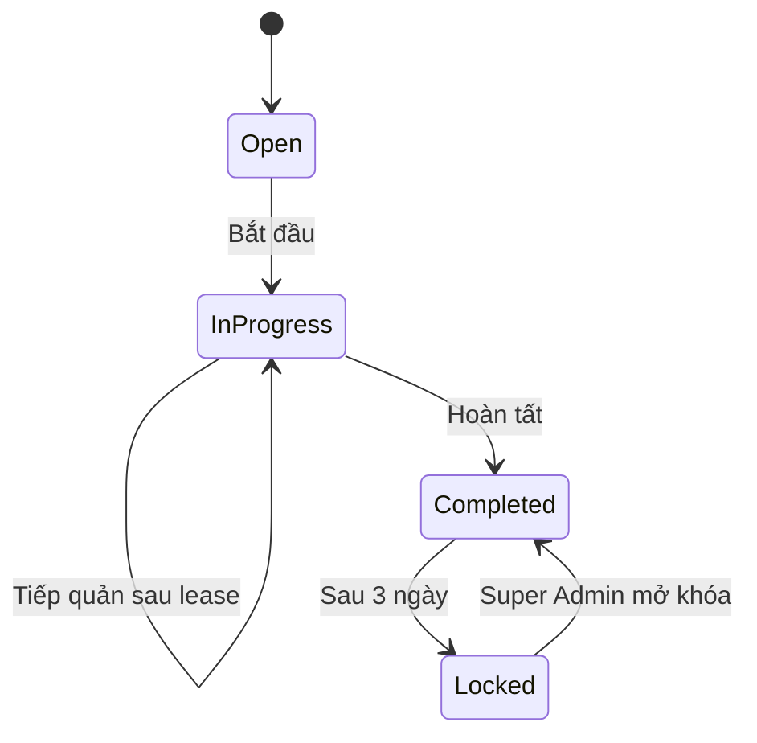
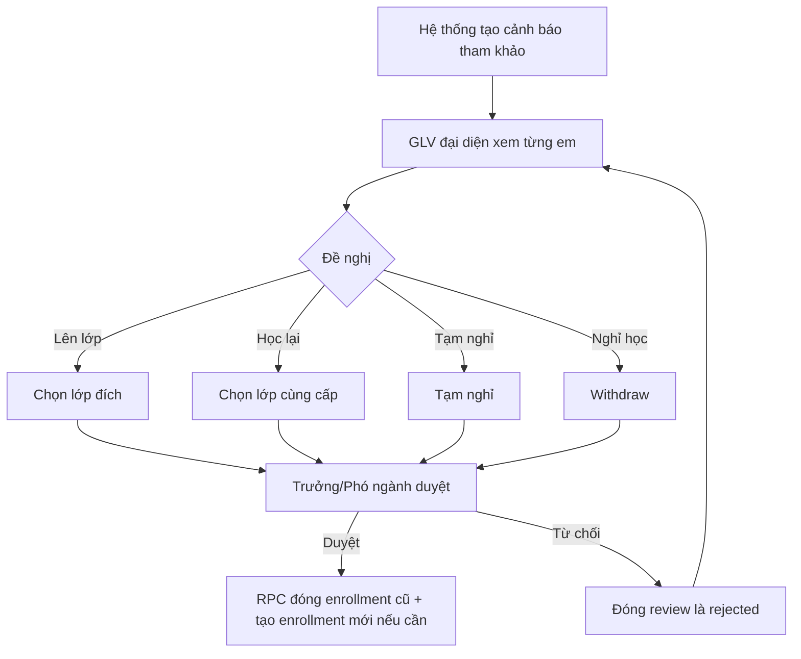

# 03 — Workflow

> ⚠️ **CẬP NHẬT 2026-07-23.** Các workflow sau đã bị ghi đè bởi
> **`docs/system-workflow-redesign/06_DECISION_LOG.md`**. Khi mâu thuẫn, file đó thắng.
>
> | Workflow | Đổi gì | Quyết định |
> |---|---|---|
> | WF-01 | Thêm **ngày kết thúc học tại giáo xứ** (= mốc HK1) vào cấu hình năm học. Sau mốc: cảnh báo, không tự đóng lớp Dự trưởng | D-71 |
> | WF-02 | Tạo account vẫn chỉ SA, nhưng có nút "Cần tạo tài khoản" + hàng chờ duyệt | D-62 |
> | WF-03 | Trưởng/Phó ngành tạo được hồ sơ trong ngành mình | D-63 |
> | WF-05 | ~~"Không lưu before/after log"~~ → **có audit log** | D-65 |
> | WF-05 | Ghi chú điểm danh là **staff-only**, phụ huynh không đọc | D-75 |
> | WF-08 | Khóa bảng điểm: GLV đại diện **+ GLV lớp**; Dự trưởng và global-write không | D-74 |
> | WF-13 | Trả một phần = **còn nợ** (loan vẫn mở, không trừ kho); hỏng/mất là thao tác riêng | D-76 |
> | WF-14 | **Thu hồi được** thông báo đã publish (đánh dấu revoked, không xóa row) | D-77 |
> | WF-12 | Mỗi Ban chỉ **một** Trưởng ban | D-78 |
> | WF-15 | Cha sở/Cha phó **không chốt** báo cáo | D-66 |
> | WF-16 | **Chỉ Super Admin** đóng năm học | D-73 |

## 1. Quy ước

- Mỗi workflow ghi rõ actor, precondition, happy path, exception và trạng thái.
- Mọi write quan trọng đi qua Server Action hoặc RPC.
- RLS vẫn là chốt chặn cuối.
- Không tự động quyết định mục vụ thay người phụ trách.

## WF-01 — Khởi tạo năm học

**Actor:** Super Admin.

**Precondition:** năm học cũ có thể current hoặc đã đóng.

**Luồng:**

1. Tạo năm học với code, ngày bắt đầu/kết thúc.
2. Sao chép danh mục 19 lớp từ template: 18 lớp giáo lý và 1 lớp Dự trưởng trong HK1.
3. Ấu 1..3 và Thiếu 1..2 mặc định có A/B; Thiếu 3 không chia nhánh.
4. Không tạo Chiên Con 3; lớp Dự trưởng được tính vào tổng lớp nhưng không thuộc ngành.
5. Chọn các cấu hình:
   - khóa điểm danh sau 3 ngày;
   - lease 15 phút;
   - trọng số attendance;
   - hệ số điểm;
   - bật/tắt tính năng Top 5.
6. Tạo các lớp ở trạng thái active; lớp Dự trưởng chỉ hoạt động trong HK1.
7. Phân công Trưởng/Phó ngành và nhân sự lớp.
8. Chỉ khi dữ liệu sẵn sàng mới đặt năm học thành current.

**Exception:**

- Không cho hai năm current.
- Không cho ngày kết thúc trước ngày bắt đầu.
- Không cho class trùng grade/section trong cùng năm.

## WF-02 — Tạo tài khoản

**Actor:** Super Admin.

### Thiếu nhi

1. Tạo guardian hoặc chọn guardian đã có.
2. Tạo hồ sơ thiếu nhi; hệ thống sinh `CQxxxx`.
3. Nếu từ Ấu Nhi trở lên và cần account:
   - tạo Auth user với email alias nội bộ;
   - username là mã thiếu nhi;
   - tạo mật khẩu tạm 8 ký tự;
   - `must_change_password = true`.
4. Hiển thị/in phiếu tài khoản đúng một lần.

### Giáo lý viên

1. Tạo staff profile; sinh `GLVxxx`.
2. Chọn danh xưng Anh/Chị/Dì/Sơ/Cha/Thầy.
3. Tạo account.
4. Liên kết account với `staff_profiles`; role lớp chỉ hợp lệ khi hồ sơ có phân công đúng lớp/capacity.
5. Gán đúng một primary role.
6. Nếu role ngành, gán sector.
7. Nếu role lớp, gán class.
8. Có thể thêm tối đa hai membership Ban.

### Phụ huynh

1. Username là số điện thoại chuẩn hóa.
2. Tạo account guardian.
3. Bắt buộc gắn account vào `guardians.profile_id`; không cho lưu role guardian nếu chưa liên kết.
4. Một guardian có thể thấy mọi con liên kết.
5. Nếu guardian đã là Giáo lý viên, không tạo role thứ hai; liên kết guardian profile vào account hiện có.

### Quên mật khẩu

- Không self-reset bằng SMS trong v1.
- Super Admin đặt mật khẩu tạm mới.
- Không ai xem được mật khẩu hiện tại.

### Quản trị account đã có

1. Super Admin có thể đổi username hoặc đặt mật khẩu mới cho account không phải Super Admin; mật khẩu mới luôn bật lại `must_change_password`.
2. Đổi username phải đồng bộ cả email alias nội bộ của Supabase Auth và `profiles.username`.
3. Super Admin có thể xóa account không phải Super Admin sau bước xác nhận.
4. Xóa account giữ nguyên hồ sơ `staff_profiles`/`guardians`/`students` và đặt liên kết `profile_id` về `null`.
5. Không cho sửa/xóa account đang đăng nhập hoặc account có active role `super_admin`.

## WF-03 — Tạo hồ sơ thiếu nhi và ghi danh

**Actor:** cấp global-write, Trưởng/Phó ngành đúng phạm vi, người được phép nhập liệu.

1. Nhập tên thánh, họ tên, ngày sinh, giới tính, bổn mạng, địa chỉ.
2. Nhập/chọn guardian.
3. Nhập sức khỏe và bí tích nếu có.
4. Hệ thống cảnh báo trùng gần đúng; người nhập vẫn được tiếp tục.
5. Chọn lớp hiện tại.
6. Tạo enrollment active.
7. Hệ thống chặn nếu em đã có enrollment mở trong năm học.

Không cần ghi giáo xứ cũ hoặc lịch sử chuyển đến.

## WF-04 — Quản lý nhân sự lớp

**Actor:** Super Admin/global-write; Trưởng/Phó ngành trong phạm vi theo quyền chi tiết.

1. Mỗi lớp có đúng một Giáo lý viên đại diện.
2. Có một hoặc nhiều Giáo lý viên lớp.
3. Có một hoặc nhiều Dự trưởng phụ tá.
4. Một staff chỉ thuộc một lớp tại một thời điểm theo yêu cầu hiện tại.
5. Thay representative phải kết thúc assignment cũ rồi tạo mới.
6. Lưu lịch sử ngày bắt đầu/kết thúc.

Trưởng ban không được tự thêm người vào lớp.

## WF-05 — Điểm danh

> **M05-A ghi chú thực thi (2026-08-03).** Trạng thái `Locked` trong sơ đồ trên **không** là một
> giá trị được ghi vào cột `attendance_sessions.status` — khóa là hàm của thời gian (`locked_at`
> so với `now()`), đúng tinh thần WF-06 "không cần cron". Enum `attendance_session_status='locked'`
> vì vậy là **giá trị chết** trong cơ sở dữ liệu. Từ M05-A, luật suy ra trạng thái hiển thị nằm ở
> **một chỗ duy nhất** — `deriveSessionState()` — dùng chung cho danh sách buổi và trang chi tiết,
> và có thêm nhãn **"Đã mở khóa"** cho `unlocked_at is not null` (trước đó hai màn hình hiện hai
> nhãn khác nhau cho cùng một buổi).

### Bắt đầu

1. Người dùng chọn ngày, thứ Năm/Chúa nhật, lớp. Ngày đổ sẵn tính theo **giờ Việt Nam**
   (M05-A/TB-01; máy chủ chạy UTC nên trước 07:00 sáng Chúa nhật nó từng lùi về thứ Năm tuần trước).
2. Hệ thống tạo hoặc mở session duy nhất.
3. RPC claim session bằng row lock.
4. Nếu chưa có editor hoặc lease hết hạn, claim thành công.
5. Roster active được nạp; mặc định cả Thánh lễ và Giáo lý là `present`.
   **D-140 (2026-08-03):** em có ghi danh `paused` (**Tạm nghỉ**) **không** vào danh sách này —
   giữ tên mà mặc định `present` nghĩa là em nghỉ dài ngày được ghi có mặt. Trang buổi hiện số em
   bị loại để không ai tưởng hệ thống làm mất em.
6. Người khác thấy tên editor và chỉ xem — **và được báo ngay khi vào trang** (M05-A/TB-08).

### Cập nhật

- Chỉ editor hiện tại ghi được.
- Mỗi save/heartbeat cập nhật `last_activity_at`.
  **M05-C/TB-05:** heartbeat trả về **mốc hết hạn mới**, và trang hiện *"Bạn đang giữ quyền sửa ·
  còn khoảng N phút"*, đổi giọng khi còn dưới 3 phút. Bị tiếp quản thì trang **không** lặng lẽ
  chuyển sang chỉ-đọc nữa: có băng-rôn nêu lý do và một ô chép lại phần chưa lưu. Trang **không**
  tự gửi gì lên máy chủ ở thời điểm đó — gửi là ghi đè dữ liệu của người đang phụ trách.
- Mỗi em có hai status độc lập.
  **M05-C/U-10 (D-142):** trạng thái là **hàng nút** ba lựa chọn (Có mặt · Vắng có phép · Vắng
  không phép) cộng nút "…" mở thêm Đi trễ · Về sớm — không còn ô chọn thả xuống.
- Có thể thêm note.
- Cập nhật staff attendance trong cùng trang hoặc tab.
- **M05-C/TB-09 · U-11:** danh sách có bộ lọc **Tất cả · Đang vắng · Có đơn · Cảnh báo** và ô tìm
  tên bỏ dấu, cả hai chạy **thuần trên máy người dùng**. Em đang bị cảnh báo chuyên cần (bốn cờ của
  `v_student_attendance_summary`, xem WF-06) mang badge nêu **lý do**.

### Hoàn tất

1. **M05-C/TB-03: hộp xác nhận trước khi chốt** — bảng phân bố 5 trạng thái × 2 cột tính từ những
   gì người điểm danh vừa chọn, kèm "GLV có mặt x/y" và **tên riêng** những em có đơn xin nghỉ mà
   vẫn đang để "Có mặt" cả hai cột. Bấm Huỷ thì **không request nào** đi tới máy chủ. Cố ý tăng một
   bước bấm: chốt đặt mốc khóa và sau đó chỉ Super Admin mở lại được.
2. Kiểm tra đủ roster.
3. Upsert toàn bộ records nguyên tử.
4. Set `finalized_at`.
5. Phụ huynh/thiếu nhi đọc được.
6. Tính/cập nhật cảnh báo.

### Tiếp quản

- Nếu editor không hoạt động 15 phút, staff khác cùng lớp bấm `Tiếp quản`.
- RPC kiểm lease trong DB, không tin thời gian trên client.

### Khóa

- Khi đã quá 3 ngày từ finalized/date theo cấu hình, session locked.
- Server action từ chối sửa.
- Super Admin có thể mở khóa/sửa.
- Không lưu before/after log.

## WF-06 — Cảnh báo chuyên cần

Chạy khi finalize attendance hoặc theo batch hằng ngày.

1. Tính chuỗi vắng liên tiếp.
2. Tính 3 Chúa nhật liên tiếp.
3. Tính tỷ lệ theo weight.
4. Phát hiện lệch Mass/Catechism.
5. Gắn warning vào view/dữ liệu dẫn xuất.
6. Không tự động nhắn Zalo.
7. Không tự động giữ lớp.

Không cần cron nếu Vercel Hobby không phù hợp; có thể tính qua view khi đọc. Chỉ materialize nếu hiệu năng thực tế yêu cầu.

## WF-07 — Kế hoạch năm và phân công dạy

**Actor:** Giáo lý viên đại diện.

1. Mở lớp/năm học.
2. Tạo các dòng theo tuần/ngày.
3. Nhập tên bài, mục tiêu, giáo lý, Thánh Kinh, trò chơi, bài hát, bài tập, chuẩn bị, tài liệu.
4. Chọn người dạy trong staff assignment của lớp.
5. Có thể đánh dấu `assessment`.
6. Có thể đổi người dạy mà không cần lý do.
7. Phụ huynh/thiếu nhi chỉ thấy dữ liệu được phép của tuần tới.

Projection tuần tới chỉ gồm ngày, tên bài, phần chuẩn bị, người phụ trách và nhãn `Kiểm tra`;
không trả mục tiêu, nội dung giáo lý/Lời Chúa, trò chơi, bài hát, bài tập, ghi chú hay tài liệu.

Tài liệu đi vào bucket private `teaching-materials` (tối đa 5 MB). Representative thay/gỡ tệp;
staff đúng phạm vi lấy signed URL 60 giây. Không duyệt, không version workflow.

## WF-08 — Tạo bài kiểm tra và nhập điểm

1. Giáo lý viên lớp/đại diện tạo bao nhiêu assessment tùy nhu cầu thực tế của lớp; không có bộ cột bắt buộc và có thể bỏ hoàn toàn loại 15 phút.
2. Chọn loại; hệ thống điền hệ số mặc định 1/2/3/1. Giáo lý viên có thể đổi hệ số dương của từng assessment trước khi khóa bảng điểm.
3. Roster điểm sinh động theo enrollment.
4. Nhập điểm 0..10.
5. Ô trống là `null`, không phải 0.
6. Điểm chuyên cần do hệ thống đề xuất và Giáo lý viên có thể sửa.
7. Nhập nhận xét công khai hoặc ghi chú nội bộ.
8. Giáo lý viên đại diện khóa bảng điểm.
9. Chỉ Super Admin mở lại.

Ví dụ hợp lệ: lớp chỉ có hai assessment `Giữa kỳ` hệ số 2 và `Cuối kỳ` hệ số 3. Thêm, xóa hoặc đổi hệ số một assessment phải cập nhật ngay cấu trúc cột và điểm trung bình có trọng số; mọi thay đổi bị chặn sau khi khóa.

Không cần người duyệt.

> **Ghi chú hiện thực — M07-B (2026-08-05).** Bốn bước ở trên nay có nội dung khác:
>
> - **Bước 2** — hệ số mặc định *"1/2/3/1"* đã hết là con số gán cứng từ M07-A: biểu mẫu đọc
>   `assessment_type_settings` của **đúng năm học của lớp**, và hằng số cũ chỉ còn là lưới an toàn
>   khi một loại bị tắt (TB-M07-09).
> - **Bước 6** — *"Giáo lý viên có thể sửa"* nay có luật kèm theo: ô chỉ mang cờ **"đang chỉnh
>   tay"** khi giá trị lưu **khác** đề xuất, và cờ **tự gỡ** khi giá trị trùng lại đề xuất
>   (BR-M07-31). Nút *"Lấy đề xuất mới"* nói ra **hai** con số — đã cập nhật bao nhiêu và **bao
>   nhiêu ô bị giữ nguyên vì đang chỉnh tay** (TB-M07-04). Trước đợt này nó đếm gộp, nên màn hình
>   báo *"Đã cập nhật 50 đề xuất"* trong khi không ô nào đổi.
> - **Bước 7** — mức hiển thị mặc định của nhận xét là **nội bộ**, không còn là công khai; chọn
>   công khai hiện câu *"Nội dung này sẽ hiện trên cổng phụ huynh/thiếu nhi."* (BR-M07-32). Sửa và
>   xóa một nhận xét dành cho **tác giả · Giáo lý viên đại diện lớp · Ban điều hành xứ đoàn**
>   (BR-M07-33 / D-152) — bảng không lưu lịch sử nên xóa là mất hẳn.
> - **Bước 8** — *"Giáo lý viên đại diện khóa bảng điểm"* nay là **đại diện + Giáo lý viên lớp**
>   của chính lớp đó, cộng **Super Admin** làm đường thoát (D-74 + D-151). Xứ đoàn trưởng, Phó Xứ
>   đoàn và Thư ký **không còn** khóa được; Dự trưởng phụ tá **không**, kể cả khi năm học bật cờ
>   cho họ chấm điểm. Bấm khóa lần thứ hai **không đẩy lùi mốc khóa** (AC-10-02) — mốc ấy là thứ
>   duy nhất trả lời được câu *"bảng điểm chốt lúc nào"*.
>
> **Ghi chú hiện thực — M07-C (2026-08-06).** Câu *"mọi thay đổi bị chặn sau khi khóa"* ở đoạn
> trên nay có **đúng một ngoại lệ**, và nó là hạng mục rủi ro nghiệp vụ cao nhất của module:
>
> - 🔴 **Khóa bảng điểm KHÔNG còn chặn việc bật/tắt công bố kết quả cho phụ huynh** (BR-M07-29,
>   **D-154**). Luật cũ buộc phải nhờ Quản trị viên hệ thống **mở khóa cả bảng điểm** — tức mở luôn
>   quyền sửa điểm và hệ số của cả lớp — chỉ để công bố một cột vào cuối năm. Ai được công bố thì
>   **không đổi** (Giáo lý viên lớp/đại diện, `app.can_grade_class`); chỉ đổi *lúc nào* công bố
>   được. Khóa vẫn chặn **tuyệt đối** cấu trúc cột, hệ số, điểm và nhận xét, **kể cả khi gửi thẳng
>   câu lệnh vào cơ sở dữ liệu** — policy giữ nguyên, ngoại lệ chỉ tồn tại bên trong một RPC riêng.
> - **Bước 8** nay có một câu kèm theo trên hộp xác nhận khóa: *"Riêng việc công bố kết quả cho phụ
>   huynh thì vẫn bật/tắt được sau khi khóa."* Đó là **thứ duy nhất** người dùng nhìn thấy của cả
>   thay đổi này; không nói ra thì họ vẫn tưởng khóa là đóng sạch.
> - **Cột đã ẩn có đường hiện lại** ngay trên màn hình (mục *"Cột đã ẩn"*, nợ #21). M07-B mở đường
>   ẩn nhưng không mở đường về, nên ẩn nhầm phải nhờ Quản trị viên hệ thống can thiệp thẳng vào cơ
>   sở dữ liệu.
> - Bốn chỗ hỏi lại bằng hộp thoại của trình duyệt (`window.confirm`) — **bốn chỗ cuối cùng của
>   toàn hệ thống** — đã thành hộp thoại của bộ giao diện, nêu hậu quả **bằng tên riêng**.

> **Và câu *"xóa … một assessment"* ở đoạn trên tới đợt này mới đúng.** Trước M07-B nó là việc
> **không làm được**: biểu mẫu ghi cả roster nên cột nào cũng có một dòng điểm rỗng cho mỗi em,
> khoá ngoại chặn lại, và câu lỗi đọc được là *"Cột đã có điểm"* khi chưa ai nhập gì. Nay:
> cột **chưa có điểm thật** → *"Xóa cột"*, mất hẳn cùng các dòng rỗng; cột **đã có điểm** →
> *"Ẩn cột"*, giữ nguyên điểm và biến khỏi bảng điểm, bản xuất, điểm trung bình, Top 5 **và cổng
> phụ huynh** (BR-M07-26/27/28).

## WF-09 — Top 5

1. Super Admin bật feature cho năm học.
2. Giáo lý viên đại diện tạo leaderboard cho lớp.
3. Chọn nguồn:
   - assessment;
   - weighted temporary;
   - final;
   - custom competition.
4. Preview danh sách.
5. Chốt đúng 5 vị trí hoặc ít hơn nếu lớp thiếu dữ liệu.
6. Publish.
7. Phụ huynh/thiếu nhi lớp đó thấy tên thánh, họ tên, điểm, thứ hạng.
8. Có thể unpublish bởi representative/Super Admin theo policy.

Không cần chờ final average.

> **Ghi chú hiện thực — M07-C (2026-08-06).** Bước 8 trước đây giấu một hệ quả không ai đọc ra
> được từ nhãn *"Ẩn khỏi portal"*: bấm công bố lại thì hệ thống **âm thầm tính lại** theo điểm mới
> nhất — em đứng hạng 5 hôm trước biến khỏi bảng, không ai được báo, và bản cũ không còn ở đâu
> (F16). `04_TO_BE_FLOWS` khuyến nghị cấm hẳn việc tính lại; **chủ dự án chọn hướng ngược lại
> (D-155):** giữ khả năng tính lại, nhưng phải lưu bản cũ và phải nói ra.
>
> Một bảng Top 5 nay có **ba** trạng thái, không phải hai:
>
> | Trạng thái | Phép thử | Làm được gì |
> |---|---|---|
> | **Bản nháp** | chưa từng công bố (`published_at is null`) | xem trước · công bố · **xóa** |
> | **Đã chốt · đang ẩn** | đã công bố rồi ẩn | **hiện lại bản đang có** (không tính lại) · **chốt lại danh sách** (tính lại) · **không xóa được** (BR-M07-35) |
> | **Đang công bố** | `is_published` | ẩn khỏi cổng |
>
> *"Chốt lại danh sách"* hỏi lại bằng hộp thoại nói rõ danh sách 5 em có thể khác, và bản đang giữ
> sẽ xuống **lịch sử** (`leaderboard_snapshots`, append-only, chỉ nhân sự phạm vi lớp đọc — cổng
> phụ huynh **không** có nhánh đọc nào ở đó). Thẻ Top 5 hiện luôn số bản đã nằm trong lịch sử.

## WF-10 — Gửi đơn xin nghỉ

**Actor:** guardian.

1. Chọn con.
2. Chọn buổi/ngày.
3. Nhập lý do.
4. Gửi đơn.
5. Staff lớp thấy đơn trước khi điểm danh.
6. Khi điểm danh, hệ thống gợi ý `vắng có phép`, nhưng editor vẫn xác nhận.
7. Đơn không tự sửa attendance đã khóa.

Bảng đề xuất: `absence_requests`.

> **Ghi chú hiện thực — M05-B (2026-08-03).**
> Bước 5 và 6 tới đợt này mới thật sự tồn tại. Trước đó `acknowledgeAbsenceRequest` là hàm **không
> màn hình nào gọi**, nên trạng thái `acknowledged` chưa bao giờ đạt tới được và mọi đơn nằm ở
> *"Đang chờ"* vĩnh viễn.
>
> - **Bước 5** — thẻ *"Đơn xin nghỉ tuần này"* trên `/attendance`, cửa sổ **±7 ngày** quanh hôm
>   nay, phạm vi do RLS quyết định. Nhìn cả về trước để đơn của buổi vừa rồi chưa ai ghi nhận không
>   lặng lẽ rơi khỏi màn hình. Cha sở/Cha phó **xem được nhưng không ghi nhận** (D-139).
> - **Bước 6** — nút *"Áp dụng gợi ý: Vắng có phép"* đặt **cả hai** cột (Thánh lễ và Giáo lý, vì
>   đơn khai theo buổi) và **chỉ trong bản nháp phía client**. Không trigger nào từ
>   `absence_requests` ghi vào `student_attendance_records` — D-36 giữ nguyên.
> - **Bước mới, TB-11 · D-141** — đơn cho **buổi đã chốt** bị trigger từ chối
>   (`ABSENCE_SESSION_ALREADY_FINALIZED`). Chặn theo **trạng thái buổi**, không theo ngày: buổi còn
>   mở thì phụ huynh báo muộn vài giờ vẫn kịp.
> - `staff_note` (lời nhắn của Giáo lý viên cho phụ huynh) phụ huynh **đọc được**; ghi chú điểm
>   danh `student_attendance_records.note` thì **không** — xem D-75 ở đầu tài liệu.

## WF-11 — Chuyển lớp cuối năm

### Quy tắc

- Mặc định giữ nhánh A/B.
- Cho phép đổi A/B.
- Chỉ lớp cuối ngành xét điều kiện bí tích.
- Cảnh báo không hard-block.
- Approval nguyên tử.
- Review bị từ chối có thể được đại diện gửi lại; cùng `source_enrollment_id` được cập nhật về `pending`.
- Duyệt lại một review đã approved là idempotent, không tạo enrollment thứ hai.
- Hiệp 2: tạo đề xuất Dự trưởng, không tạo role tự động.
- Không hiển thị workflow này trên trang chi tiết thiếu nhi.

## WF-12 — Ban

### Thành viên

- Super Admin/global-write tạo Ban và membership.
- Trigger chặn quá hai Ban active.

### Thông báo/lịch họp/công việc tuần

- Chỉ Trưởng/Phó Ban tạo/sửa/xóa; global-write cũng ghi được.
- Thành viên Ban và cố vấn tối cao chỉ đọc.
- `Công việc tuần` là nội dung/checklist chung, chưa có assignee/deadline.
- Mốc tuần luôn là thứ Hai và mỗi Ban chỉ một bản cho mỗi tuần — sửa lại tuần cũ
  là ghi đè, không tạo bản thứ hai.

## WF-13 — Mượn/trả thiết bị Ban Kỹ thuật

### Mượn

1. Chọn thiết bị và số lượng.
2. Chọn người mượn.
3. Ghi người bàn giao, thời gian, note.
4. RPC lock item, kiểm available.
5. Trừ available và tạo loan.

### Trả — hai thao tác RIÊNG (D-76, cài đặt ở 2B · M09-B)

Phiếu mang theo `outstanding_quantity` = số cái người mượn còn giữ, và hiển thị
"Đã mượn 5 · đã nhận lại 3 · còn nợ 2".

**Nhận lại hàng** (`receive_equipment`):

1. Mở loan đang mượn, nhập số cái nhận về (mặc định = số còn nợ), tình trạng, note.
2. RPC lock loan/item, cộng `available` đúng phần nhận về, trừ `outstanding`.
3. **Không đụng tổng số.** Phiếu chỉ chuyển sang "Đã trả" khi `outstanding` về 0.

**Báo hỏng/mất** (`write_off_equipment`):

1. Nhập số cái, tình trạng và **ghi chú bắt buộc**.
2. Giao diện hỏi lại bằng con số thật: *"Tổng kho giảm từ 5 xuống 3. Thao tác này
   không hoàn tác được."* — quyền vẫn là mọi thành viên Ban Kỹ thuật (D-93) nên
   hộp thoại này là hàng rào duy nhất.
3. RPC trừ tổng số, trừ `outstanding`, `available` **không** đổi, cập nhật condition.

Mỗi lần nhận lại hoặc báo hỏng/mất là một dòng trong `equipment_loan_events`.
Trả lại một phiếu đã đóng là idempotent: không cộng kho thêm lần nữa.

### Đổi tổng kho ngoài phiếu mượn (`adjust_equipment_stock`, 2B · M09-B)

1. Trưởng/Phó Ban Kỹ thuật chọn "Nhập thêm" (mua mới / tìm lại / kiểm kê) hoặc
   "Giảm tồn kho" (kiểm kê / hỏng khi trong kho).
2. Chiều giảm bắt buộc có ghi chú và có hộp xác nhận nêu đúng con số; chỉ giảm
   được tối đa số đang nằm trong kho.
3. Mỗi lần là một dòng trong `equipment_stock_adjustments` kèm người thực hiện.

Sau khi M09-A khoá `total_quantity`, đây là đường hợp lệ duy nhất để tổng kho tăng.

## WF-14 — Thông báo

1. Actor chọn phạm vi mà mình được phép.
2. Nhập title/content.
3. Publish ngay.
4. Hệ thống materialize recipients ngay trong cùng giao dịch với bước 3.
5. Người dùng mở thông báo → set `read_at`.
6. Badge dùng count unread.

Danh sách người nhận chốt tại thời điểm publish: người vào lớp sau đó không nhận
ngược, người rời lớp vẫn giữ thông báo cũ và số chưa đọc không nhảy.

Deep-link kèm theo chỉ được trỏ tới route đã tồn tại; DB từ chối đường dẫn lạ.

Không schedule hoặc chat.

## WF-15 — Báo cáo

1. Chọn năm học, phạm vi, thời gian và filter.
2. Preview dữ liệu theo RLS.
3. Export Excel/PDF phải dùng chính filter object hiện tại.
4. Khi chọn `Chốt báo cáo`, server dựng lại số liệu từ CHÍNH bộ lọc đang xem rồi
   lưu snapshot; người chốt, thời điểm và checksum do server đặt, không nhận từ client.
5. Snapshot final không bị thay đổi khi DB thay đổi, và không có luồng người dùng
   nào sửa/xóa được.
6. Chỉ user có quyền scope tương ứng tải.

## WF-16 — Lưu trữ năm học

1. Đảm bảo chuyển lớp hoàn tất.
2. Khóa gradebook/attendance còn mở theo policy.
3. Chốt báo cáo năm.
4. Đặt academic year `closed`.
5. Không cho ghi mới trừ Super Admin.
6. Sau thời hạn lưu 5 năm, việc xóa/ẩn phải là tác vụ quản trị có xác nhận; không tự động xóa ở v1.

## WF-17 — Sa mạc

Chưa triển khai cho đến Phase 8.

Phần đã chốt:

1. Phụ huynh đăng ký con.
2. Sa mạc trưởng theo event quản lý danh sách.
3. Có phí.
4. Sa mạc trưởng xác nhận/công bố biên lai.
5. Phụ huynh xem biên lai.

Không code các giả định còn bỏ ngỏ. Đọc `docs/13-summer-camp-backlog.md`.
