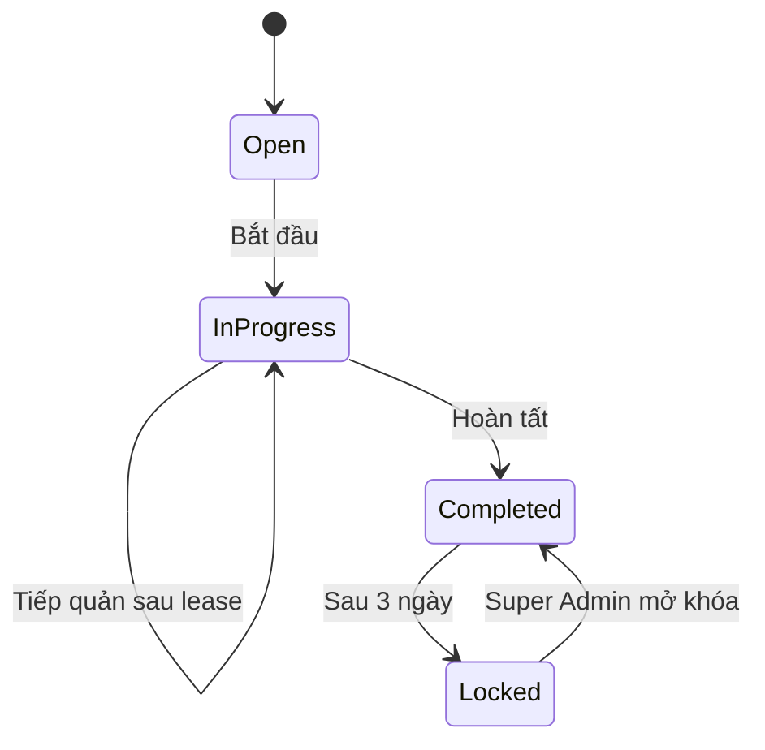
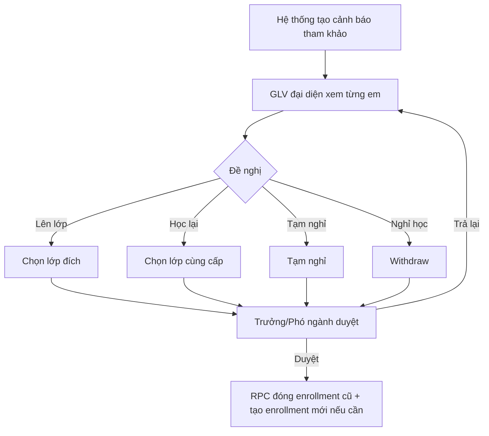

# 03 — Workflow

## 1. Quy ước

- Mỗi workflow ghi rõ actor, precondition, happy path, exception và trạng thái.
- Mọi write quan trọng đi qua Server Action hoặc RPC.
- RLS vẫn là chốt chặn cuối.
- Không tự động quyết định mục vụ thay người phụ trách.

## WF-01 — Khởi tạo năm học

**Actor:** Super Admin.

**Precondition:** năm học cũ có thể current hoặc đã đóng.

**Luồng:**

1. Tạo năm học với code, ngày bắt đầu/kết thúc.
2. Sao chép danh mục 20 lớp từ template.
3. Ấu/Thiếu mặc định có A/B.
4. Chọn các cấu hình:
   - khóa điểm danh sau 3 ngày;
   - lease 15 phút;
   - trọng số attendance;
   - hệ số điểm;
   - bật/tắt tính năng Top 5.
5. Tạo các lớp ở trạng thái active.
6. Phân công Trưởng/Phó ngành và nhân sự lớp.
7. Chỉ khi dữ liệu sẵn sàng mới đặt năm học thành current.

**Exception:**

- Không cho hai năm current.
- Không cho ngày kết thúc trước ngày bắt đầu.
- Không cho class trùng grade/section trong cùng năm.

## WF-02 — Tạo tài khoản

**Actor:** Super Admin.

### Thiếu nhi

1. Tạo guardian hoặc chọn guardian đã có.
2. Tạo hồ sơ thiếu nhi; hệ thống sinh `CQxxxx`.
3. Nếu từ Ấu Nhi trở lên và cần account:
   - tạo Auth user với email alias nội bộ;
   - username là mã thiếu nhi;
   - tạo mật khẩu tạm 8 ký tự;
   - `must_change_password = true`.
4. Hiển thị/in phiếu tài khoản đúng một lần.

### Giáo lý viên

1. Tạo staff profile; sinh `GLVxxx`.
2. Chọn danh xưng Anh/Chị/Dì/Sơ/Cha/Thầy.
3. Tạo account.
4. Gán đúng một primary role.
5. Nếu role ngành, gán sector.
6. Nếu role lớp, gán class.
7. Có thể thêm tối đa hai membership Ban.

### Phụ huynh

1. Username là số điện thoại chuẩn hóa.
2. Tạo account guardian.
3. Một guardian có thể thấy mọi con liên kết.
4. Nếu guardian đã là Giáo lý viên, không tạo role thứ hai; liên kết guardian profile vào account hiện có.

### Quên mật khẩu

- Không self-reset bằng SMS trong v1.
- Super Admin đặt mật khẩu tạm mới.
- Không ai xem được mật khẩu hiện tại.

## WF-03 — Tạo hồ sơ thiếu nhi và ghi danh

**Actor:** cấp global-write, Trưởng/Phó ngành đúng phạm vi, người được phép nhập liệu.

1. Nhập tên thánh, họ tên, ngày sinh, giới tính, bổn mạng, địa chỉ.
2. Nhập/chọn guardian.
3. Nhập sức khỏe và bí tích nếu có.
4. Hệ thống cảnh báo trùng gần đúng; người nhập vẫn được tiếp tục.
5. Chọn lớp hiện tại.
6. Tạo enrollment active.
7. Hệ thống chặn nếu em đã có enrollment mở trong năm học.

Không cần ghi giáo xứ cũ hoặc lịch sử chuyển đến.

## WF-04 — Quản lý nhân sự lớp

**Actor:** Super Admin/global-write; Trưởng/Phó ngành trong phạm vi theo quyền chi tiết.

1. Mỗi lớp có đúng một Giáo lý viên đại diện.
2. Có một hoặc nhiều Giáo lý viên lớp.
3. Có một hoặc nhiều Dự trưởng phụ tá.
4. Một staff chỉ thuộc một lớp tại một thời điểm theo yêu cầu hiện tại.
5. Thay representative phải kết thúc assignment cũ rồi tạo mới.
6. Lưu lịch sử ngày bắt đầu/kết thúc.

Trưởng ban không được tự thêm người vào lớp.

## WF-05 — Điểm danh

### Bắt đầu

1. Người dùng chọn ngày, thứ Năm/Chúa nhật, lớp.
2. Hệ thống tạo hoặc mở session duy nhất.
3. RPC claim session bằng row lock.
4. Nếu chưa có editor hoặc lease hết hạn, claim thành công.
5. Roster active được nạp; mặc định cả Thánh lễ và Giáo lý là `present`.
6. Người khác thấy tên editor và chỉ xem.

### Cập nhật

- Chỉ editor hiện tại ghi được.
- Mỗi save/heartbeat cập nhật `last_activity_at`.
- Mỗi em có hai status độc lập.
- Có thể thêm note.
- Cập nhật staff attendance trong cùng trang hoặc tab.

### Hoàn tất

1. Kiểm tra đủ roster.
2. Upsert toàn bộ records nguyên tử.
3. Set `finalized_at`.
4. Phụ huynh/thiếu nhi đọc được.
5. Tính/cập nhật cảnh báo.

### Tiếp quản

- Nếu editor không hoạt động 15 phút, staff khác cùng lớp bấm `Tiếp quản`.
- RPC kiểm lease trong DB, không tin thời gian trên client.

### Khóa

- Khi đã quá 3 ngày từ finalized/date theo cấu hình, session locked.
- Server action từ chối sửa.
- Super Admin có thể mở khóa/sửa.
- Không lưu before/after log.

## WF-06 — Cảnh báo chuyên cần

Chạy khi finalize attendance hoặc theo batch hằng ngày.

1. Tính chuỗi vắng liên tiếp.
2. Tính 3 Chúa nhật liên tiếp.
3. Tính tỷ lệ theo weight.
4. Phát hiện lệch Mass/Catechism.
5. Gắn warning vào view/dữ liệu dẫn xuất.
6. Không tự động nhắn Zalo.
7. Không tự động giữ lớp.

Không cần cron nếu Vercel Hobby không phù hợp; có thể tính qua view khi đọc. Chỉ materialize nếu hiệu năng thực tế yêu cầu.

## WF-07 — Kế hoạch năm và phân công dạy

**Actor:** Giáo lý viên đại diện.

1. Mở lớp/năm học.
2. Tạo các dòng theo tuần/ngày.
3. Nhập tên bài, mục tiêu, giáo lý, Thánh Kinh, trò chơi, bài hát, bài tập, chuẩn bị, tài liệu.
4. Chọn người dạy trong staff assignment của lớp.
5. Có thể đánh dấu `assessment`.
6. Có thể đổi người dạy mà không cần lý do.
7. Phụ huynh/thiếu nhi chỉ thấy dữ liệu được phép của tuần tới.

Không duyệt, không version workflow.

## WF-08 — Tạo bài kiểm tra và nhập điểm

1. Giáo lý viên lớp/đại diện tạo assessment.
2. Chọn loại và hệ số mặc định; có thể chỉnh nếu quyền cho phép.
3. Roster điểm sinh động theo enrollment.
4. Nhập điểm 0..10.
5. Ô trống là `null`, không phải 0.
6. Điểm chuyên cần do hệ thống đề xuất và Giáo lý viên có thể sửa.
7. Nhập nhận xét công khai hoặc ghi chú nội bộ.
8. Giáo lý viên đại diện khóa bảng điểm.
9. Chỉ Super Admin mở lại.

Không cần người duyệt.

## WF-09 — Top 5

1. Super Admin bật feature cho năm học.
2. Giáo lý viên đại diện tạo leaderboard cho lớp.
3. Chọn nguồn:
   - assessment;
   - weighted temporary;
   - final;
   - custom competition.
4. Preview danh sách.
5. Chốt đúng 5 vị trí hoặc ít hơn nếu lớp thiếu dữ liệu.
6. Publish.
7. Phụ huynh/thiếu nhi lớp đó thấy tên thánh, họ tên, điểm, thứ hạng.
8. Có thể unpublish bởi representative/Super Admin theo policy.

Không cần chờ final average.

## WF-10 — Gửi đơn xin nghỉ

**Actor:** guardian.

1. Chọn con.
2. Chọn buổi/ngày.
3. Nhập lý do.
4. Gửi đơn.
5. Staff lớp thấy đơn trước khi điểm danh.
6. Khi điểm danh, hệ thống gợi ý `vắng có phép`, nhưng editor vẫn xác nhận.
7. Đơn không tự sửa attendance đã khóa.

Bảng đề xuất: `absence_requests`.

## WF-11 — Chuyển lớp cuối năm

### Quy tắc

- Mặc định giữ nhánh A/B.
- Cho phép đổi A/B.
- Chỉ lớp cuối ngành xét điều kiện bí tích.
- Cảnh báo không hard-block.
- Approval nguyên tử.
- Hiệp 2: tạo đề xuất Dự trưởng, không tạo role tự động.
- Không hiển thị workflow này trên trang chi tiết thiếu nhi.

## WF-12 — Ban

### Thành viên

- Super Admin/global-write tạo Ban và membership.
- Trigger chặn quá hai Ban active.

### Thông báo/lịch họp/công việc tuần

- Chỉ Trưởng/Phó Ban tạo/sửa.
- Thành viên Ban đọc.
- `Công việc tuần` là nội dung/checklist chung, chưa có assignee/deadline.

## WF-13 — Mượn/trả thiết bị Ban Kỹ thuật

### Mượn

1. Chọn thiết bị và số lượng.
2. Chọn người mượn.
3. Ghi người bàn giao, thời gian, note.
4. RPC lock item, kiểm available.
5. Trừ available và tạo loan.

### Trả

1. Mở loan đang mượn.
2. Nhập người nhận, thời gian, tình trạng, note.
3. RPC lock loan/item.
4. Cộng available.
5. Nếu hỏng/mất, cập nhật condition và số lượng theo quyết định người quản lý.

## WF-14 — Thông báo

1. Actor chọn phạm vi mà mình được phép.
2. Nhập title/content.
3. Publish ngay.
4. Hệ thống materialize recipients.
5. Người dùng mở thông báo → set `read_at`.
6. Badge dùng count unread.

Không schedule hoặc chat.

## WF-15 — Báo cáo

1. Chọn năm học, phạm vi, thời gian và filter.
2. Preview dữ liệu theo RLS.
3. Export Excel/PDF phải dùng chính filter object hiện tại.
4. Khi chọn `Chốt báo cáo`, server tạo snapshot/file/checksum.
5. Snapshot final không bị thay đổi khi DB thay đổi.
6. Chỉ user có quyền scope tương ứng tải.

## WF-16 — Lưu trữ năm học

1. Đảm bảo chuyển lớp hoàn tất.
2. Khóa gradebook/attendance còn mở theo policy.
3. Chốt báo cáo năm.
4. Đặt academic year `closed`.
5. Không cho ghi mới trừ Super Admin.
6. Sau thời hạn lưu 5 năm, việc xóa/ẩn phải là tác vụ quản trị có xác nhận; không tự động xóa ở v1.

## WF-17 — Sa mạc

Chưa triển khai cho đến Phase 8.

Phần đã chốt:

1. Phụ huynh đăng ký con.
2. Sa mạc trưởng theo event quản lý danh sách.
3. Có phí.
4. Sa mạc trưởng xác nhận/công bố biên lai.
5. Phụ huynh xem biên lai.

Không code các giả định còn bỏ ngỏ. Đọc `docs/13-summer-camp-backlog.md`.
