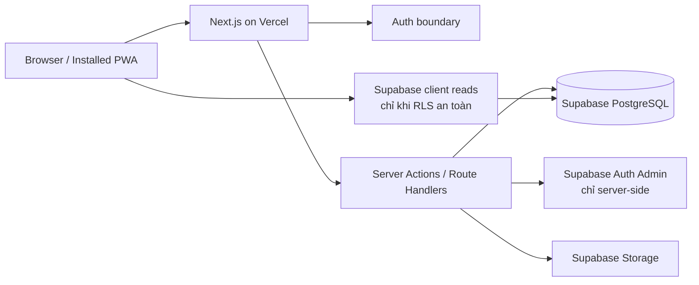

# 04 — System Architecture

## 1. Quyết định kiến trúc

- Modular monolith.
- Next.js App Router + TypeScript.
- Supabase PostgreSQL/Auth/Storage.
- Vercel Hobby là target deploy cố định theo yêu cầu.
- PWA.
- Tailwind CSS + shadcn/ui + Radix UI.
- Zod + React Hook Form.
- Server Components ưu tiên cho đọc.
- Server Actions/RPC cho write.
- Supabase RLS là ranh giới dữ liệu.
- Không microservices.
- Không background worker bắt buộc trong v1.

## 2. Sơ đồ



## 3. Thành phần

### Web/PWA

- Responsive cho laptop và mobile.
- Mobile bottom navigation.
- Offline shell có thể cache, nhưng attendance không cần offline sync.
- PWA installable nếu trình duyệt hỗ trợ.
- Không native push ở v1.

### Next.js

- Render server-side.
- Route protection ở layout/server.
- Không dựa vào middleware duy nhất để phân quyền.
- Mỗi Server Action tự authorize.
- Không truyền `role`, `user_id`, `class_id` nhạy cảm từ client rồi tin thẳng.

### Supabase

- Auth: email alias nội bộ + password.
- Database: schema nghiệp vụ.
- RLS: fail-closed.
- Storage: private.
- Admin API: tạo/reset/khóa account, chỉ dùng trong server-only module.
- Không đưa `service_role` xuống browser.

## 4. Cấu trúc source đề xuất

```text
src/
├── app/
│   ├── (auth)/
│   │   ├── login/
│   │   └── change-password/
│   ├── (dashboard)/
│   │   ├── dashboard/
│   │   ├── students/
│   │   ├── classes/
│   │   ├── staff/
│   │   ├── attendance/
│   │   ├── teaching-plan/
│   │   ├── results/
│   │   ├── committees/
│   │   ├── notifications/
│   │   ├── reports/
│   │   └── admin/
│   ├── parent/
│   └── student/
├── features/
│   ├── academic-years/
│   ├── auth/
│   ├── students/
│   ├── guardians/
│   ├── staff/
│   ├── classes/
│   ├── attendance/
│   ├── teaching-plans/
│   ├── assessments/
│   ├── promotions/
│   ├── committees/
│   ├── equipment/
│   ├── notifications/
│   ├── reports/
│   └── camps/
├── components/
│   ├── ui/
│   ├── layout/
│   └── shared/
├── lib/
│   ├── auth/
│   ├── permissions/
│   ├── supabase/
│   ├── validation/
│   ├── dates/
│   ├── exports/
│   └── errors/
└── types/
supabase/
├── migrations/
├── tests/
├── seed.sql
└── seed.dev.sql
tests/
├── unit/
├── integration/
└── e2e/
```

Mỗi feature:

```text
feature/
├── components/
├── server/
│   ├── queries.ts
│   ├── actions.ts
│   └── permissions.ts
├── schemas.ts
├── types.ts
└── constants.ts
```

## 5. Authentication

### Login flow

1. Người dùng nhập username/password.
2. Server Action normalize username.
3. Derive hoặc lookup email alias server-side.
4. `signInWithPassword`.
5. Đọc profile + active role assignment.
6. Nếu disabled/locked → sign out và từ chối.
7. Nếu `must_change_password` → redirect `/change-password`.
8. Sau đổi mật khẩu, redirect dashboard theo role.

### Alias

- Student: `CQ0123`.
- Staff: `GLV023`.
- Guardian: phone.
- Admin/cấp cao: code ngắn unique.

Không dùng public query trả alias.

### Reset password

- Super Admin nhập mật khẩu tạm mới hoặc hệ thống sinh.
- Server-only Admin API update password.
- Set `must_change_password = true`.
- Không hiển thị hash hoặc mật khẩu cũ.

## 6. Authorization

Ba lớp bảo vệ:

1. Navigation/UI: chỉ hiển thị module được phép.
2. Server: authorize action/query.
3. Database: RLS/constraint/RPC.

Không coi ẩn menu là bảo mật.

### Role và scope

```text
active role assignment
+ sector scope nếu role ngành
+ class scope nếu role lớp
+ class_staff_assignment nếu người có role khác vẫn đứng lớp
+ guardian/student ownership
+ committee/camp assignment
```

## 7. Data access

### Read

- Server Component gọi query server là mặc định.
- Client Supabase chỉ dùng cho use case realtime/interactive rõ ràng.
- Query luôn dùng session user; không service role.
- View phải security_invoker.

### Write

- Server Action:
  - parse FormData;
  - Zod validation;
  - authorize;
  - gọi RPC/upsert;
  - map lỗi;
  - revalidate route.
- Nghiệp vụ đa bảng/row-lock dùng PostgreSQL RPC.
- Không write quan trọng trực tiếp từ client.

## 8. RPC cần thiết

- `claim_attendance_session`.
- `heartbeat_attendance_session`.
- `save_and_finalize_attendance`.
- `takeover_attendance_session`.
- `unlock_attendance_session`.
- `calculate_attendance_score`.
- `approve_promotion_review`.
- `borrow_equipment`.
- `return_equipment`.
- `publish_notification`.
- `create_report_snapshot`.
- `provision_user_account` chỉ server-side wrapper, không public RPC.

## 9. Error model

Dùng error code ổn định:

```text
AUTH_REQUIRED
FORBIDDEN
OUT_OF_SCOPE
VALIDATION_ERROR
CONFLICT
ATTENDANCE_ALREADY_CLAIMED
ATTENDANCE_LOCKED
LEASE_NOT_EXPIRED
GRADEBOOK_LOCKED
DUPLICATE_ENROLLMENT
CAPACITY_CONFLICT
RESOURCE_NOT_FOUND
```

UI hiển thị tiếng Việt, không lộ SQL/raw stack.

Invalid UUID route phải 404, không 500.

## 10. Cache và revalidation

- Dashboard có thể no-store hoặc revalidate ngắn.
- Dữ liệu điểm danh/điểm dùng no-store trong form.
- Sau write: `revalidatePath` đúng phạm vi.
- Không cache response chứa dữ liệu user khác.
- Signed URL ngắn hạn.

## 11. Export Excel/PDF

- Server generates.
- Filter schema được serialize và lưu vào snapshot.
- Không re-query thiếu filter.
- Excel ưu tiên thư viện server-side.
- PDF có logo, tiêu đề, năm học, phạm vi, ngày xuất, người xuất.
- Filename ASCII-safe hoặc UTF-8 được kiểm thử.
- Không lưu file tạm trong git.

## 12. PWA

- `manifest.webmanifest`.
- Icon 192/512.
- `display: standalone`.
- Theme color cam pastel.
- Cache static shell/assets.
- Không cache response hồ sơ/điểm danh kiểu public.
- Attendance vẫn yêu cầu mạng ổn định theo quyết định nghiệp vụ.
- Service worker update strategy phải tránh giữ bundle cũ lâu.

## 13. Observability

Tối thiểu:

- Structured server logs.
- Error boundary.
- Request correlation ID nếu có.
- Không log mật khẩu, token, health data, full child profile.
- Sentry tùy chọn nếu free plan và user đồng ý.
- Dashboard health không cần public.

## 14. Environment variables

```text
NEXT_PUBLIC_SUPABASE_URL
NEXT_PUBLIC_SUPABASE_ANON_KEY
SUPABASE_SERVICE_ROLE_KEY
SUPABASE_DB_URL
APP_URL
INTERNAL_AUTH_DOMAIN
REPORT_SIGNING_SECRET (nếu dùng)
```

- `.env.local` không commit.
- `.env.example` chỉ placeholder.
- Service role chỉ import trong file `server-only`.

## 15. Vercel Hobby constraints

Target cố định Vercel Hobby. Thiết kế phải tránh:

- Job nền phụ thuộc chạy liên tục.
- File system local bền vững.
- Function dài bất thường.
- Export quá lớn trong một request.

Nếu tác vụ báo cáo lớn, tạo theo phạm vi hợp lý hoặc chunk. Không tự đổi target deploy nếu chưa hỏi user.

## 16. NFR

- 900 thiếu nhi, 19 lớp (18 lớp giáo lý thuộc 5 ngành và 1 lớp Dự trưởng trong HK1).
- Điểm danh một lớp cần phản hồi UI dưới khoảng 1 giây trong điều kiện mạng bình thường sau khi roster tải.
- Bulk save attendance một lần.
- Danh sách dùng pagination/filter server-side.
- Mobile width 360px trở lên.
- Laptop 1366px ưu tiên.
- Accessibility: label form, keyboard, contrast, touch target >= 44px.
- Không mất dữ liệu khi double-submit.
- Write idempotent nơi phù hợp.

## 17. ADR đã chốt

- Modular monolith, không microservices.
- Class ≠ sector.
- Dự trưởng không phải sector.
- One active role.
- Ban/Sa mạc assignment không phải role.
- Không audit history đầy đủ.
- Password reset, không password read.
- RLS mọi bảng.
- Vercel Hobby.
- Sa mạc Phase 8.
