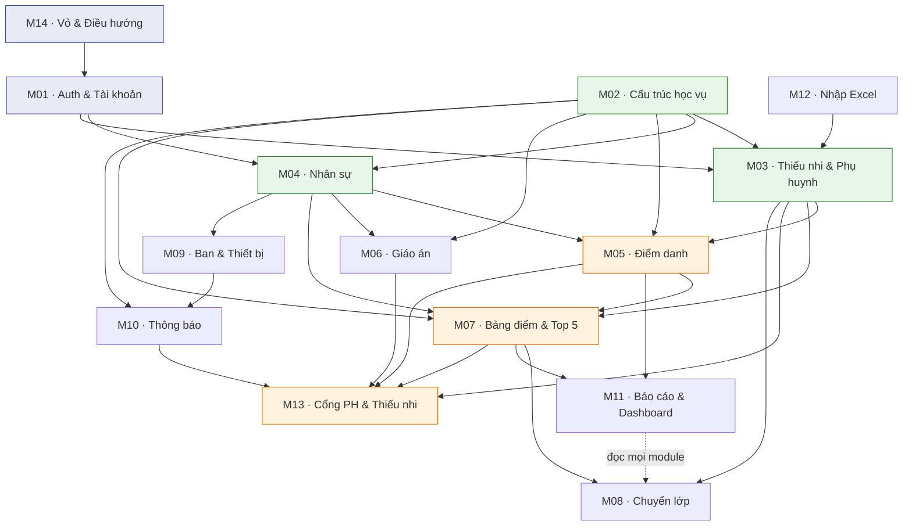

# 01 — System Module Map

> Bản đồ **module thực sự tồn tại trong source code**, không suy ra từ sidebar.
> Một module có thể tồn tại mà chưa có menu riêng (ví dụ `M03` guardians, `M13` portal).

---

## 1. Nền tảng kỹ thuật (xác định từ code)

| Hạng mục | Thực tế | Bằng chứng |
|---|---|---|
| Framework | Next.js 15 App Router, React Server Components mặc định | `package.json`, `src/app/**` |
| Ngôn ngữ | TypeScript strict | `tsconfig.json` |
| UI | Tailwind CSS + component thủ công kiểu shadcn (chỉ 6 primitive: badge, button, card, form-message, input, label) | `src/components/ui/`, `components.json` |
| State management | **Không có thư viện global state.** Server Components + `useState`/`useTransition` cục bộ + `revalidatePath` | `src/features/*/components/*.tsx` |
| Form | `react-hook-form` + `@hookform/resolvers` + Zod | `package.json` |
| API architecture | **Server Actions** là chính; Route Handler chỉ cho export file (4 route) | `src/features/*/server/actions.ts` |
| Database | PostgreSQL qua Supabase; **không dùng ORM** — truy vấn bằng `supabase-js` + RPC SQL | `src/lib/supabase/*` |
| Migration | SQL thuần, 27 file, đánh số theo ngày | `supabase/migrations/` |
| Authentication | Supabase Auth, email alias nội bộ, **không public sign-up** | `src/features/auth/aliases.ts` |
| Authorization | 3 lớp: route rule → server action → RLS (xem `02_ROLE_PERMISSION_MAP.md`) | — |
| Storage | Supabase Storage, bucket private `teaching-materials`, signed URL 60s | `20260722000300_teaching_materials.sql` |
| PWA | Service worker thủ công, **cố ý không cache HTML** | `public/sw.js`, WORKLOG |
| Test | Vitest (unit/integration), pgTAP (23 suite), Playwright (9 spec × 3 viewport) | `tests/`, `supabase/tests/` |
| Deploy | Vercel Hobby + Supabase cloud | `docs/12-deployment-runbook.md` |
| Quy mô | 172 file TS/TSX, ~20.300 dòng; 40 bảng, 9 view, 32 enum, 28 RPC public | đo trực tiếp |

**Đánh giá kiến trúc:** modular monolith feature-based đúng như `docs/04`. Mỗi feature có
`components/`, `server/{queries,actions,permissions}`, `schemas.ts`, `constants.ts`. Không có
generic repository, không có `updateAnyTable`. ✅

---

## 2. Danh sách module (14) — bảng tổng hợp

| ID | Module | Mục tiêu nghiệp vụ | Actor chính | Mức quan trọng |
|---|---|---|---|---|
| M01 | Auth & Quản trị tài khoản | Đăng nhập, đổi mật khẩu, cấp/khóa/xóa account, gán role | Super Admin, mọi người dùng | **Rất cao** |
| M02 | Cấu trúc học vụ | Năm học, ngành, cấp giáo lý, 19 lớp, cấu hình năm, lưu trữ năm | Super Admin, global-write | **Rất cao** |
| M03 | Thiếu nhi & Phụ huynh | Hồ sơ thiếu nhi, người giám hộ, ghi danh, sức khỏe, bí tích | Global-write, Trưởng/Phó ngành | **Rất cao** |
| M04 | Nhân sự (GLV/Huynh trưởng) | Hồ sơ nhân sự, phân công lớp, chức danh | Global-write | **Cao** |
| M05 | Điểm danh | Điểm danh Thứ Năm/Chúa nhật, claim/lease, chốt, khóa, đơn xin nghỉ, cảnh báo chuyên cần | GLV lớp | **Rất cao** (dùng hằng tuần) |
| M06 | Giáo án | Kế hoạch năm, phân công người dạy, tài liệu, projection tuần tới | GLV đại diện | Cao |
| M07 | Kiểm tra & Bảng điểm | Assessment động, nhập điểm, nhận xét, khóa bảng điểm, Top 5, cổng kết quả | GLV đại diện/lớp | **Rất cao** |
| M08 | Chuyển lớp | Đề nghị → duyệt → đóng/mở enrollment nguyên tử | GLV đại diện, Trưởng/Phó ngành | Cao (theo mùa) |
| M09 | Ban & Thiết bị | 6 Ban, membership ≤2, nội dung Ban, kho thiết bị Ban Kỹ thuật | Trưởng/Phó Ban | Trung bình |
| M10 | Thông báo | Publish theo phạm vi, materialize người nhận, badge chưa đọc | Global-write, Trưởng ngành, GLV đại diện | Trung bình |
| M11 | Báo cáo & Dashboard | Dashboard theo role, báo cáo có filter, export, **chốt snapshot bất biến** | Mọi staff theo scope | Cao |
| M12 | Nhập Excel | Import hàng loạt thiếu nhi/phụ huynh/ghi danh | 4 role global-write | Cao (khởi tạo dữ liệu) |
| M13 | Cổng phụ huynh & thiếu nhi | Xem con/bản thân: điểm danh, kết quả, tuần tới, thông báo | Phụ huynh, Thiếu nhi | **Rất cao** (số người dùng lớn nhất) |
| M14 | Vỏ ứng dụng & Điều hướng | Layout, sidebar, bottom nav, route guard, empty/error state, PWA | Mọi người dùng | **Rất cao** (cross-cutting) |
| — | Sa mạc (`camps`) | **Chưa triển khai** — `src/features/camps/` chỉ có `.gitkeep`, hoãn tới Phase 8 | — | Ngoài phạm vi GĐ1 |

---

## 3. Chi tiết từng module

### M01 — Auth & Quản trị tài khoản
- **Route:** `/login`, `/change-password`, `/account`, `/admin`
- **Component:** `login-form`, `change-password-form`, `account-admin-panel`, `password-field`
- **Server:** `features/auth/server/{actions,queries,passwords}.ts`, `features/auth/{aliases,permissions,schemas}.ts`
- **Hạ tầng:** `lib/supabase/{admin,server,client,middleware}.ts`, `lib/auth/{session,guards,types}.ts`
- **Bảng:** `profiles`, `role_assignments`, `auth.users` (Supabase)
- **Quyền:** `/admin` chỉ `super_admin`; `service_role` chỉ dùng ở đây (2 điểm gọi)
- **Phụ thuộc:** M04 (`staff_profiles`), M03 (`guardians`, `students`) qua trigger liên kết
- **Test:** pgTAP `001,003,004,007`; unit `auth-aliases`, `auth-schemas`, `identity-security`; E2E `security`, `authenticated-shell`

### M02 — Cấu trúc học vụ
- **Route:** `/classes`, `/classes/[classId]`
- **Component:** `academic-year-switcher`
- **Server:** `features/academic-years/server/{actions,queries,permissions}.ts`, `features/classes/server/queries.ts`
- **Bảng:** `academic_years`, `sectors`, `grade_levels`, `class_templates`, `classes`, `attendance_weight_settings`, `assessment_type_settings`
- **RPC:** `generate_default_classes()`, `set_current_academic_year()`
- **Quyền:** `can_global_write()`
- **Phụ thuộc:** **là gốc của toàn hệ thống** — mọi module khác tham chiếu `academic_year_id`/`class_id`
- **Test:** pgTAP `002,008`; unit `academic-year-schemas`

### M03 — Thiếu nhi & Phụ huynh
- **Route:** `/students`, `/students/[studentId]`
- **Server:** `features/students/server/{actions,queries,permissions}.ts`, `features/guardians/server/actions.ts`, `features/enrollments/server/actions.ts`
- **Bảng:** `students`, `guardians`, `enrollments`, `student_health_profiles`, `student_sacraments`
- **Quyền:** hồ sơ = `can_global_write()`; ghi danh = `can_manage_class()` (⚠️ lệch — xem `02_ROLE_PERMISSION_MAP.md` §6.1)
- **Phụ thuộc:** M02 (lớp/năm học); là gốc cho M05, M07, M08, M13
- **Test:** pgTAP `006,009,010`; integration `gate-phase2-scope`

### M04 — Nhân sự
- **Route:** `/staff`
- **Server:** `features/staff/server/{actions,queries}.ts`
- **Bảng:** `staff_profiles`, `class_staff_assignments`
- **RPC:** `end_class_staff_assignment()`
- **Trigger quan trọng:** `app.validate_staff_role_link()` — mọi account role GLV **bắt buộc** liên kết đúng một `staff_profiles`
- **Phụ thuộc:** M01 (account), M02 (lớp); cấp quyền lớp cho M05, M06, M07
- **Test:** pgTAP `005`

### M05 — Điểm danh
- **Route:** `/attendance`, `/attendance/[sessionId]`, `/parent/absence-requests`
- **Component:** `attendance-editor`, `absence-request-panel`
- **Bảng:** `attendance_sessions`, `student_attendance_records`, `staff_attendance_records`, `absence_requests`, `attendance_weight_settings`
- **View:** `v_class_attendance_summary`, `v_student_attendance_summary`, `v_staff_attendance_summary`, `v_students_at_risk`
- **RPC:** `claim_`, `heartbeat_`, `takeover_`, `save_and_finalize_`, `unlock_attendance_session`
- **Bảng ghi trực tiếp:** ❌ không — `authenticated` chỉ có SELECT
- **Phụ thuộc:** M02, M03, M04; cung cấp dữ liệu cho M07 (điểm chuyên cần), M11, M13
- **Test:** pgTAP `012`; unit `attendance-schemas`; E2E `attendance`

### M06 — Giáo án
- **Route:** `/teaching-plan`, `/teaching-plan/[classId]`
- **Component:** `teaching-plan-editor`, `week-ahead-schedule`
- **Bảng:** `teaching_plans`, `teaching_plan_items`; bucket `teaching-materials`
- **View/RPC:** `v_upcoming_teaching_items`, `get_week_ahead_teaching_items()`
- **Phụ thuộc:** M02, M04; cung cấp cho M13
- **Test:** pgTAP `013,014,015`; E2E `teaching-plan`

### M07 — Kiểm tra & Bảng điểm
- **Route:** `/results`, `/results/[classId]`, `/results/[classId]/export`
- **Component:** `gradebook-editor`, `published-results-portal`
- **Bảng:** `assessments`, `assessment_scores`, `gradebook_locks`, `assessment_type_settings`, `student_comments`, `leaderboards`, `leaderboard_entries`
- **View:** `v_student_weighted_average`
- **RPC:** `save_assessment_scores()`, `lock_gradebook()`, `unlock_gradebook()`, `refresh_attendance_assessment_scores()`, `reset_attendance_score_override()`, `preview_leaderboard()`, `publish_leaderboard()`
- **Phụ thuộc:** M02, M03, M05 (điểm chuyên cần); cung cấp cho M08, M11, M13
- **Test:** pgTAP `016,017,018`; unit `assessment-schemas`, `gradebook-export`; E2E `results`

### M08 — Chuyển lớp
- **Route:** `/promotions`
- **Component:** `promotion-board`
- **Bảng:** `promotion_reviews` (chỉ SELECT cho `authenticated`)
- **RPC:** `propose_promotion()`, `approve_promotion_review()`
- **Phụ thuộc:** M02, M03 (enrollments), M07 (điểm), M05 (chuyên cần)
- **Test:** pgTAP `019`; unit `promotion-schemas`

### M09 — Ban & Thiết bị
- **Route:** `/committees`, `/committees/[committeeId]`
- **Component:** `committee-list`, `committee-workspace`, `equipment-board`
- **Bảng:** `committees`, `committee_memberships`, `committee_announcements`, `committee_meetings`, `committee_weekly_plans`, `equipment_items`, `equipment_loans`
- **RPC:** `borrow_equipment()`, `return_equipment()`
- **Phụ thuộc:** M04 (`staff_profiles`) — độc lập với M02/M03
- **Test:** pgTAP `020,021`; unit `committee-schemas`; E2E `committees`

### M10 — Thông báo
- **Route:** `/notifications`; badge ở `notification-button`
- **Bảng:** `notifications`, `notification_recipients` (chỉ SELECT)
- **RPC:** `publish_notification()`, `mark_notification_read()`, `mark_all_notifications_read()`
- **Phụ thuộc:** M02, M03, M04, M09 (mọi phạm vi người nhận)
- **Test:** pgTAP `022`; unit `notification-schemas`

### M11 — Báo cáo & Dashboard
- **Route:** `/dashboard`, `/reports`, `/reports/export`, `/reports/snapshots/[id]/export`
- **Component:** `dashboard-overview`, `report-workbench`
- **Bảng/View:** `report_snapshots`, `v_dashboard_summary`, `v_incomplete_student_profiles`, `v_upcoming_celebrations`, `v_students_at_risk`
- **RPC:** `report_attendance_rows()`, `report_results_rows()` (**security invoker** — RLS người gọi vẫn áp dụng)
- **Phụ thuộc:** đọc từ **tất cả** module khác
- **Test:** pgTAP `023`; unit `report-filters`

### M12 — Nhập Excel
- **Route:** `/imports`, `/imports/[batchId]`, `/imports/template`
- **Server:** `features/imports/{parse,normalize,dedup,build-row,columns,template}.ts`
- **Bảng:** `import_batches`, `import_rows` (bảng staging, có DELETE)
- **RPC:** `commit_import_rows()`
- **Phụ thuộc:** ghi vào M03 (students/guardians/enrollments), cần M02 sẵn sàng
- **Test:** pgTAP `011`; unit `import-normalize`, `import-rows`; integration `gate-phase2-import`, `import-sample-workbooks`

### M13 — Cổng phụ huynh & thiếu nhi
- **Route:** `/parent/children/[studentId]`, `/parent/absence-requests`, `/student/attendance`
- **Component:** `attendance-history`, `published-results-portal`
- **Bảng:** đọc qua RLS ownership (`own_student_ids()`)
- **Phụ thuộc:** M03, M05, M06, M07, M10 — **không có bảng riêng**, thuần đọc
- **Test:** phủ trong pgTAP RLS negative + E2E `security`

### M14 — Vỏ ứng dụng & Điều hướng
- **Route:** toàn bộ layout, `/`, `/access-denied`
- **Component:** `app-shell`, `app-header`, `app-sidebar`, `mobile-bottom-navigation`, `user-menu`, `page-container`, `page-header`, `notification-button`, `academic-year-switcher`, 6 shared state component
- **Config:** `src/config/navigation.ts`, `src/lib/permissions/route-map.ts`
- **Phụ thuộc:** mọi module
- **Test:** unit `navigation`, `permissions`, `button`, `errors`, `dates`; E2E `home`, `authenticated-shell`, `responsive`, `pwa`, `security`

---

## 4. Đồ thị phụ thuộc giữa các module

**Đọc đồ thị:**
- **M02 (Cấu trúc học vụ) là gốc duy nhất.** Hỏng ở đây làm chết toàn hệ thống — ví dụ
  `generate_default_classes()` tạo 0 lớp im lặng khi `class_templates` rỗng (đã xảy ra thật khi
  deploy production, ghi trong WORKLOG).
- **M01 + M04 là cặp không tách rời.** Trigger `validate_staff_role_link` bắt buộc account role GLV
  phải có `staff_profiles`. Đây là gốc kỹ thuật của vấn đề "hai quy trình rườm rà" user nêu.
- **M05 → M07 → M11/M13 là chuỗi dữ liệu chính** (điểm danh → điểm chuyên cần → bảng điểm →
  báo cáo & cổng phụ huynh). Sửa một mắt xích phải kiểm cả chuỗi.
- **M09 (Ban) gần như độc lập.** Có thể redesign riêng, rủi ro lan thấp nhất.
- **M13 không có bảng riêng** — mọi thay đổi phân quyền ở M03/M05/M07 đều ảnh hưởng trực tiếp
  tới cái phụ huynh nhìn thấy.

---

## 5. Thứ tự an toàn khi sửa (rút ra từ đồ thị)

| Bậc | Module | Lý do |
|---|---|---|
| 0 | M14 (state/empty/error dùng chung) | Không đụng nghiệp vụ, cải thiện mọi màn hình |
| 1 | M09 | Độc lập nhất, rủi ro lan thấp |
| 2 | M01 + M04 | Phải đi cùng nhau; là điểm đau user nêu đích danh |
| 3 | M02 | Gốc — sửa sau khi M01/M04 ổn định để không phải migrate hai lần |
| 4 | M03, M12 | Phụ thuộc M02 |
| 5 | M05, M06 | Phụ thuộc M02/M03/M04 |
| 6 | M07, M08 | Phụ thuộc M05 |
| 7 | M10, M11, M13 | Tiêu thụ dữ liệu của mọi module trên |

Chi tiết ưu tiên theo mức nghiêm trọng/rủi ro nằm ở `05_REDESIGN_PRIORITY_PLAN.md`.
