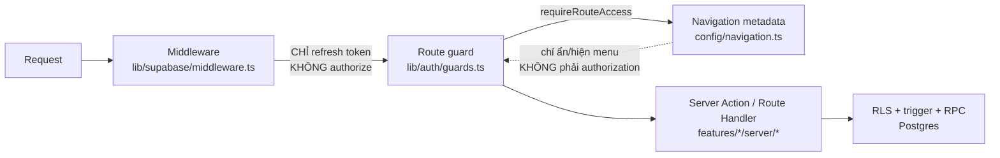

# 02 — Role & Permission Map (As-Is, trích từ source code)

> Tài liệu này mô tả **phân quyền thực tế đang chạy trong code**, không phải phân quyền
> mong muốn trong `docs/05-permission-matrix.md`. Mọi khẳng định đều có `file:line`.
> Chỗ nào code lệch docs đều được đánh dấu ⚠️.

---

## 1. Kiến trúc phân quyền — 4 lớp

| Lớp | File | Vai trò | Có phải authorization? |
|---|---|---|---|
| Middleware | `src/lib/supabase/middleware.ts:12-40` | Refresh Supabase session cookie | **Không** — có ghi chú rõ ở `:7-11` |
| Route rules | `src/lib/permissions/route-map.ts:19-63` | Chặn theo `pathname` + `role` | Có (lớp 1) |
| Route guard | `src/lib/auth/guards.ts:7-21` | `requireAuthContext` / `requireRouteAccess` → `redirect` | Có (lớp 1, thi hành) |
| Navigation | `src/config/navigation.ts:107-129` | Ẩn/hiện mục menu theo `audience`/`scope`/`role` | **Không** — chỉ trình bày |
| Server Action | `src/features/*/server/actions.ts` | Tự authorize từng thao tác | Có (lớp 2) |
| RLS / trigger / RPC | `supabase/migrations/*` | Chốt chặn cuối | Có (lớp 3 — quyết định) |

**Nguyên tắc đã được tuân thủ:** `AGENTS.md` §5 "Ẩn nút không phải authorization" — navigation
metadata và route rules là hai cấu hình **độc lập**, và cả hai đều không phải nguồn quyết định cuối.

---

## 2. Danh sách role (14) và phân loại

Nguồn: `src/lib/permissions/roles.ts:1-81`.

| Role | Nhãn UI | Audience | Scope kind | Nhóm hạ tầng |
|---|---|---|---|---|
| `super_admin` | Quản trị viên hệ thống | staff | global | GLOBAL_ROLES |
| `parish_priest` | Cha sở | staff | global | GLOBAL_ROLES |
| `chaplain` | Cha phó/Tuyên úy | staff | global | GLOBAL_ROLES |
| `group_leader` | Xứ đoàn trưởng | staff | global | GLOBAL_ROLES |
| `deputy_group_leader` | Phó Xứ đoàn | staff | global | GLOBAL_ROLES |
| `secretary` | Thư ký | staff | global | GLOBAL_ROLES |
| `treasurer` | Thủ quỹ | staff | global | GLOBAL_ROLES |
| `sector_leader` | Trưởng ngành | staff | sector | SECTOR_ROLES |
| `sector_deputy` | Phó ngành | staff | sector | SECTOR_ROLES |
| `class_representative` | Giáo lý viên đại diện | staff | class | CLASS_ROLES |
| `class_teacher` | Giáo lý viên lớp | staff | class | CLASS_ROLES |
| `trainee_assistant` | Dự trưởng phụ tá | staff | class | CLASS_ROLES |
| `guardian` | Phụ huynh | guardian | ownership | — |
| `student` | Thiếu nhi | student | ownership | — |

**Bất biến:** một account chỉ **một** role active — `src/lib/auth/session.ts:33-38` dùng
`.eq("is_active", true).maybeSingle()`; nếu DB có 2 dòng active, `maybeSingle()` trả lỗi và
`role` thành `null` (fail-closed, không phải fail-open). Ràng buộc thật nằm ở
`app.validate_role_assignment_scope()` (`20260715000200_academic_structure.sql:153`,
redefine ở `20260715000400:156`).

**Scope bắt buộc:** role ngành phải có `sector_id`, role lớp phải có `class_id` — enforce bằng
trigger `validate_role_assignment_scope`, không phải bằng UI.

---

## 3. Ma trận hàm quyền ở Database (`app.*`) — nguồn sự thật thực tế

Đây là **định nghĩa vận hành** của mọi quyền. Mọi RLS policy đều gọi các hàm này.

| Hàm | Định nghĩa | File:line | Bao gồm role |
|---|---|---|---|
| `app.current_role()` | role active của user, **và** `profiles.account_status='active'` | `20260715000100:107` | — |
| `app.is_super_admin()` | `current_role() = 'super_admin'` | `20260715000100:149` | super_admin |
| `app.can_global_read()` | 6 role | `20260715000100:157` | super_admin, parish_priest, chaplain, group_leader, deputy_group_leader, secretary |
| `app.can_global_write()` | 4 role | `20260715000100:170` | super_admin, group_leader, deputy_group_leader, secretary |
| `app.can_access_sector(s)` | `can_global_read()` OR `current_sector_id() = s` | `20260715000100:182` | +sector_leader/deputy đúng ngành |
| `app.can_access_class(c)` | `can_global_read()` OR `current_class_id()=c` OR lớp thuộc ngành mình | `20260715000200:183` | +sector roles (mọi lớp trong ngành), +class roles (lớp mình) |
| `app.is_class_staff(c)` | role lớp đúng lớp **HOẶC** có `class_staff_assignment` active | `20260715000400:202` | class roles + **bất kỳ ai có phân công GLV còn hiệu lực** |
| `app.is_class_representative(c)` | role đại diện đúng lớp **HOẶC** assignment `capacity='representative'` | `20260715000400:222` | class_representative + người được phân công đại diện |
| `app.can_manage_class(c)` | `can_global_write()` OR sector_leader/deputy đúng ngành của lớp | `20260716000500:66` | 4 global-write + 2 sector role |
| `app.can_access_staff(sp)` | `can_global_read()` OR chính mình OR có assignment ở lớp mình truy cập được | `20260715000400:243` | — |
| `app.can_access_student(st)` | global read / sector-class scope / guardian / self | `20260716000500:90` | — |
| `app.can_view_student_sensitive(st)` | hẹp hơn `can_access_student` — **loại guardian/student** | `20260716000500:113` | staff trong scope |
| `app.can_edit_attendance(c)` | `is_super_admin()` OR `is_class_staff(c)` | `20260721000300:243` | SA + staff đứng lớp |
| `app.attendance_is_locked(sid)` | `status='locked'` OR `now() >= locked_at` (**giờ DB**) | `20260721000300:255` | — |
| `app.can_manage_teaching_plan(c)` | (xem M06) | `20260722000100:146` | — |
| `app.is_gradebook_locked(c)` | `gradebook_locks.is_locked` | `20260722000400:94` | — |
| `app.can_grade_class(c)` | `can_global_write()` OR (`is_class_staff` AND (không phải trainee OR cờ `trainee_can_grade` của năm học)) | `20260722000400:108` | — |
| `app.can_comment_class(c)` | như trên với `trainee_can_comment` | `20260722000400:133` | — |
| `app.can_create_report(type,id)` | global→`can_global_read`; sector→`can_access_sector`; class→`can_access_class` OR `is_class_staff` | `20260723000500:217` | — |
| `app.is_committee_member(id)` / `is_committee_leader_or_deputy(id)` | `20260723000100` | — | — |
| `app.scope_class_ids()` / `staff_class_ids()` / `class_scoped_student_ids()` / `own_student_ids()` | Bản mảng của các hàm trên, dùng cho InitPlan | `20260721000200:21-107` | — |

**Ghi nhận thiết kế tốt:** mọi hàm đều `security definer` + `set search_path = ''` (chống
search_path hijack) và `revoke all ... from public, anon` (`20260715000100:236-237`).
`app.current_role()` join `profiles` để kiểm `account_status='active'` — **account bị khóa
mất quyền ngay ở tầng DB**, không phụ thuộc app nhớ kiểm.

---

## 4. Ma trận quyền GHI theo bảng — ai được INSERT/UPDATE/DELETE

Cột "Grant" là quyền SQL cấp cho `authenticated`; cột "Policy" là điều kiện RLS.
Bảng nào **không có grant ghi** thì mọi thay đổi bắt buộc đi qua RPC `security definer`.

| Bảng | Grant cho `authenticated` | Ai ghi được (policy/RPC) | Ghi chú |
|---|---|---|---|
| `profiles`, `role_assignments` | **chỉ SELECT** (`20260715000100:238`) | chỉ `service_role` → Server Action auth | Account admin đi qua `createAdminClient()` |
| `academic_years` | select, insert, update | `can_global_write()` (`:281,:288`) | không DELETE |
| `sectors`, `grade_levels`, `class_templates` | **chỉ SELECT** | chỉ `service_role`/seed | Danh mục bất biến từ `seed.sql` |
| `classes` | select, insert, update | `can_global_write()` (`:307,:310`) | không DELETE |
| `staff_profiles`, `class_staff_assignments` | select, insert, update | `can_global_write()` (`20260715000400:273,276,284,287`) | ⚠️ xem §6.1 |
| `guardians`, `students`, `student_health_profiles`, `student_sacraments` | select, insert, update | `can_global_write()` (`20260716000100`) | không DELETE — đúng "không hard delete" |
| `enrollments` | select, insert, update | `can_manage_class()` (`20260716000500:146,149`) | +sector roles |
| `import_batches`, `import_rows` | select, insert, update, **delete** | `can_global_write()` (`20260721000100:83-108`) | delete chỉ trên bảng staging |
| `attendance_sessions`, `student_attendance_records`, `staff_attendance_records` | **chỉ SELECT** (`20260721000300:283-285`) | RPC: `claim_`/`heartbeat_`/`takeover_`/`save_and_finalize_`/`unlock_attendance_session` | ✅ Không thể ghi trực tiếp |
| `absence_requests` | select, insert, update | insert: guardian của em đó; update: theo scope (`20260721000400:151,158`) | |
| `attendance_weight_settings` | chỉ SELECT | `can_global_write()` | |
| `teaching_plans`, `teaching_plan_items` | select, insert, update, **delete** | `can_manage_teaching_plan()` | |
| `teaching_materials` | select, insert, update, delete | manager | bucket private + signed URL |
| `assessments` | select, insert, update, delete | `can_grade_class()` **AND NOT** `is_gradebook_locked()` (`20260722000400:534-552`) | Lock chặn ở RLS, không chỉ ở action |
| `assessment_scores` | **chỉ SELECT** (`:488`) | RPC `save_assessment_scores()` | ✅ |
| `gradebook_locks` | **chỉ SELECT** (`:486`) | RPC `lock_gradebook()` / `unlock_gradebook()` | ✅ |
| `assessment_type_settings` | select, **update** | `can_global_write()` + `updated_by = auth.uid()` | |
| `student_comments` | select, insert, update, delete | `can_comment_class()` | visibility `student_visible`/`staff_only` |
| `leaderboards` | select, insert, update, delete | manager | |
| `leaderboard_entries` | chỉ SELECT | RPC `publish_leaderboard()` | ✅ snapshot bất biến |
| `promotion_reviews` | chỉ SELECT (`20260722000700:349`) | RPC `propose_promotion()` / `approve_promotion_review()` | ✅ nguyên tử |
| `committees`, `committee_memberships` | select, insert, update | `can_global_write()` | trigger chặn >2 Ban |
| `committee_announcements/meetings/weekly_plans` | s,i,u,d | `is_committee_leader_or_deputy()` OR global-write | |
| `equipment_items` | select, insert, update | leader/deputy Ban KT | trigger chặn sửa tay `available_quantity` |
| `equipment_loans` | **chỉ SELECT** (`20260723000300:263`) | RPC `borrow_equipment()` / `return_equipment()` | ✅ row lock |
| `notifications`, `notification_recipients` | **chỉ SELECT** | RPC `publish_notification()` / `mark_notification_read()` | ✅ materialize cùng transaction |
| `report_snapshots` | select, **insert** (không update/delete) | `can_create_report()` + `generated_by = auth.uid()`; trigger `seal_report_snapshot()` ghi đè `generated_by/at/status/checksum` | ✅ **bất biến** — không có luồng người dùng nào sửa/xóa |

**Kết luận tầng DB: PASS.** Mọi thao tác đa dòng / cần nguyên tử / cần chống race đều nằm sau
RPC `security definer` và `authenticated` không có quyền ghi trực tiếp. Đây là điểm mạnh nhất
của hệ thống và **không nên đụng vào khi redesign UI**.

---

## 5. Ma trận Route × Role (lớp 1)

Nguồn: `src/lib/permissions/route-map.ts:19-48`.
`STAFF_ROLES` = 12 role staff. `OPERATIONAL_STAFF_ROLES` = STAFF_ROLES trừ `parish_priest`,
`chaplain`, `treasurer`.

| Route | Rule | Role được vào |
|---|---|---|
| `/login` | public | mọi người |
| `/change-password`, `/dashboard`, `/notifications`, `/account`, `/access-denied` | không giới hạn role | mọi account active |
| `/students`, `/classes`, `/staff`, `/committees`, `/reports` | `STAFF_ROLES` | 12 role staff |
| `/attendance` | `OPERATIONAL_STAFF_ROLES` | 9 role (loại cha sở, cha phó, thủ quỹ) |
| `/promotions` | STAFF_ROLES trừ `treasurer` | 11 role |
| `/teaching-plan`, `/results` | **không giới hạn role** | mọi account active — cố ý, RLS lọc |
| `/parent` | **không giới hạn role** | cố ý (D-25): một GLV vẫn có thể là phụ huynh |
| `/student` | `["student"]` | chỉ thiếu nhi |
| `/imports` | 4 role | super_admin, group_leader, deputy_group_leader, secretary |
| `/admin` | `["super_admin"]` | chỉ Super Admin |

**Cơ chế fail-closed đúng:** `getRouteRule()` (`:50-54`) sắp xếp theo độ dài path giảm dần
(prefix dài thắng), và `canAccessRoute()` (`:56-63`) trả `false` khi **không tìm thấy rule**.
Route mới quên khai báo → bị chặn, không phải mở toang.

**Điều kiện chung mọi route non-public** (`:60`): `context.accountStatus === 'active'`.
`requireAuthContext` (`guards.ts:11-13`) ép `mustChangePassword` → `/change-password`.

---

## 6. Điểm cần lưu ý / lệch giữa code và docs

### 6.1 ⚠️ `staff_profiles` INSERT/UPDATE chỉ `can_global_write()`
`20260715000400:273-279`. Nhưng `docs/05` §5 ghi "Tạo student: SA/global-write; **sector leader/deputy
trong sector**" và §4.6 cho sector role "Read/write student/staff/class trong sector".
→ Sector leader/deputy **không** tạo/sửa được hồ sơ nhân sự trong ngành mình, dù docs cho phép.
Cùng lúc, `students` INSERT cũng chỉ `can_global_write()` (`20260716000100:201`) trong khi
`enrollments` thì `can_manage_class()` (có sector role). **Không nhất quán trong cùng một
luồng "tạo thiếu nhi rồi ghi danh"**: sector leader ghi danh được nhưng không tạo được hồ sơ.
→ Cần user xác nhận: giữ chặt (an toàn hơn) hay mở theo docs.

### 6.2 ⚠️ Feature flag `sector_leader_can_manage_class_staff` chưa được dùng
`docs/05` §7 liệt kê cờ này (mặc định `false`). Không tìm thấy cột/điều kiện tương ứng trong
migration. Hiện trạng tương đương cờ luôn `false`. Đây là **hành vi an toàn**, nhưng docs mô tả
một cơ chế cấu hình chưa tồn tại → xếp NEEDS_CONFIRMATION, không phải bug.

### 6.3 ⚠️ `can_create_report` cho phép `parish_priest`/`chaplain` chốt báo cáo
`20260723000500:217-232` + policy insert `:268-270`. Đây là INSERT nghiệp vụ, trong khi
`docs/05` §4.2 ghi hai role này "Không insert/update/delete nghiệp vụ". Nhưng `docs/05` §6 Report
lại ghi "Chốt báo cáo: mọi vai trò xem được phạm vi đó, **trừ thủ quỹ** (D-19)". Hai câu trong
cùng một tài liệu mâu thuẫn nhau; code chọn theo D-19.
→ Cần user chốt: cha sở/cha phó có được chốt snapshot báo cáo không.

### 6.4 `treasurer` bị loại đúng cách
`treasurer` nằm trong `GLOBAL_ROLES` (roles.ts) → `scopeKind = "global"`, nên **thấy** menu
`/students`, `/classes`, `/staff`, `/committees`, `/reports`. Nhưng ở DB, `treasurer` **không**
nằm trong `can_global_read()` lẫn `can_global_write()` → mọi truy vấn scope trả rỗng.
→ Hệ quả UX: thủ quỹ vào `/students` và thấy **danh sách rỗng**, không thấy "bạn không có quyền".
Đây là biểu hiện của vấn đề toàn hệ thống "rỗng vì không có dữ liệu" ≡ "rỗng vì bị RLS chặn"
(xem `04_SYSTEM_WIDE_FINDINGS.md`). Bảo mật ĐÚNG; trải nghiệm SAI.

### 6.5 `role === null` (account chưa gán role)
`navigation.ts:107-110`: chỉ hiện `/dashboard`, `/notifications`, `/account`.
`route-map.ts:62`: mọi route có `roles` đều bị chặn; nhưng route **không** khai báo `roles`
(`/teaching-plan`, `/results`, `/parent`, `/change-password`, `/dashboard`, `/notifications`,
`/account`, `/access-denied`) vẫn **vào được**. RLS sẽ trả rỗng.
→ Không rò dữ liệu, nhưng user thấy trang trắng không giải thích được. Xem §6.4.

### 6.6 `service_role` chỉ dùng ở 2 chỗ
`src/features/auth/server/actions.ts:49` và `:107`, qua `src/lib/supabase/admin.ts:13`.
Không có import nào vào Client Component. Tuân thủ `AGENTS.md` §5. ✅

---

## 7. Ma trận tổng hợp Module × Role (thực tế trong code)

Ký hiệu: `✅` ghi được · `👁` chỉ đọc · `📍` trong phạm vi (ngành/lớp/sở hữu) · `∅` truy cập được
nhưng dữ liệu rỗng · `❌` bị chặn ở route.

| Module | SA | Cha sở | Cha phó | XĐ trưởng | Phó XĐ | Thư ký | Thủ quỹ | Trưởng/Phó ngành | GLV đại diện | GLV lớp | Dự trưởng | Phụ huynh | Thiếu nhi |
|---|---|---|---|---|---|---|---|---|---|---|---|---|---|
| Dashboard | ✅ | 👁 | 👁 | ✅ | ✅ | ✅ | ∅ | 📍 | 📍 | 📍 | 📍 | 📍 | 📍 |
| Năm học / Lớp | ✅ | 👁 | 👁 | ✅ | ✅ | ✅ | ∅ | 👁📍 | 👁📍 | 👁📍 | 👁📍 | ❌ | ❌ |
| Thiếu nhi (hồ sơ) | ✅ | 👁 | 👁 | ✅ | ✅ | ✅ | ∅ | 👁📍 ⚠️§6.1 | 👁📍 | 👁📍 | 👁📍 | ❌ | ❌ |
| Sức khỏe / Bí tích | ✅ | 👁 | 👁 | ✅ | ✅ | ✅ | ∅ | 👁📍 | 👁📍 | 👁📍 | 👁📍 | ❌ | ❌ |
| Ghi danh (enrollment) | ✅ | 👁 | 👁 | ✅ | ✅ | ✅ | ∅ | ✅📍 | 👁📍 | 👁📍 | 👁📍 | ❌ | ❌ |
| Nhân sự | ✅ | 👁 | 👁 | ✅ | ✅ | ✅ | ∅ | 👁📍 ⚠️§6.1 | 👁📍 | 👁📍 | 👁📍 | ❌ | ❌ |
| Điểm danh | ✅ | ❌route | ❌route | ✅ | ✅ | ✅ | ❌route | 👁📍 (✅ nếu có phân công lớp) | ✅📍 | ✅📍 | ✅📍 | 👁 con, đã chốt | 👁 mình, đã chốt |
| Đơn xin nghỉ | ✅ | 👁 | 👁 | ✅ | ✅ | ✅ | ∅ | 👁📍 | ✅📍 | ✅📍 | ✅📍 | ✅ tạo cho con | ❌ |
| Giáo án | ✅ | 👁 | 👁 | ✅ | ✅ | ✅ | ∅ | 👁📍 | ✅📍 | 👁📍 | 👁📍 | 👁 tuần tới (RPC) | 👁 tuần tới (RPC) |
| Bảng điểm / Nhận xét | ✅ | 👁 | 👁 | ✅ | ✅ | ✅ | ∅ | 👁📍 (✅ nếu có phân công lớp) | ✅📍 | ✅📍 | ⚙ cờ năm học | 👁 con, đã publish | 👁 mình, đã publish |
| Khóa/mở bảng điểm | ✅ mở | ❌ | ❌ | ✅ khóa | ✅ khóa | ✅ khóa | ❌ | ❌ | ✅ khóa | ❌ | ❌ | ❌ | ❌ |
| Top 5 | ✅ | 👁 | 👁 | ✅ | ✅ | ✅ | ∅ | 👁📍 | ✅📍 | 👁📍 | 👁📍 | 👁 lớp con | 👁 lớp mình |
| Chuyển lớp | ✅ | 👁route | 👁route | ✅ | ✅ | ✅ | ❌route | ✅ duyệt📍 | ✅ đề nghị📍 | 👁 | 👁 | ❌ | ❌ |
| Ban | ✅ | 👁 | 👁 | ✅ | ✅ | ✅ | ∅ | 📍 Ban mình | 📍 Ban mình | 📍 Ban mình | 📍 Ban mình | ❌ | ❌ |
| Thiết bị | ✅ | 👁 | 👁 | ✅ | ✅ | ✅ | ∅ | 📍 Ban KT | 📍 Ban KT | 📍 Ban KT | 📍 Ban KT | ❌ | ❌ |
| Thông báo | ✅ | 👁 | 👁 | ✅ | ✅ | ✅ | 👁 | ✅📍 ngành | ✅📍 lớp | 👁 | 👁 | 👁 | 👁 |
| Báo cáo | ✅ | 👁/chốt ⚠️§6.3 | 👁/chốt ⚠️§6.3 | ✅ | ✅ | ✅ | ∅ | ✅📍 | ✅📍 lớp | 👁📍 | 👁📍 | ❌ | ❌ |
| Nhập Excel | ✅ | ❌ | ❌ | ✅ | ✅ | ✅ | ❌ | ❌ | ❌ | ❌ | ❌ | ❌ | ❌ |
| Quản trị tài khoản | ✅ | ❌ | ❌ | ❌ | ❌ | ❌ | ❌ | ❌ | ❌ | ❌ | ❌ | ❌ | ❌ |
| Portal con / bản thân | — | — | — | — | — | — | — | — | — | — | — | ✅📍 | ✅📍 |
| Sa mạc | *chưa triển khai — `src/features/camps/` rỗng, Phase 8* |

---

## 8. Kết luận

| Khía cạnh | Trạng thái | Lý do |
|---|---|---|
| Kiến trúc 3 lớp (route guard → server action → RLS) | **PASS** | Fail-closed đúng ở cả 3 lớp; middleware không bị dùng làm authorization |
| Hàm quyền DB | **PASS** | `security definer` + `search_path=''` + `revoke from public,anon` toàn bộ |
| Ghi dữ liệu nhạy cảm | **PASS** | Attendance/score/loan/notification/promotion/leaderboard/snapshot đều bắt buộc qua RPC |
| Bất biến snapshot báo cáo | **PASS** | Không có grant UPDATE/DELETE + trigger `seal_report_snapshot` ghi đè metadata |
| Nhất quán quyền ghi hồ sơ theo ngành | ✅ **ĐÃ CHỐT — D-63** | Trưởng/Phó ngành **được** tạo/sửa hồ sơ trong ngành mình. Cần sửa cơ sở dữ liệu |
| Quyền chốt báo cáo của cha sở/cha phó | ✅ **ĐÃ CHỐT — D-66** | **Không** chốt được, chỉ xem/export. Cần tách quyền |
| Feature flag `sector_leader_can_manage_class_staff` | ⏸ Không dùng | D-63 giải quyết nhu cầu gốc bằng quyền cố định thay vì cờ. Nên **gỡ mô tả** khỏi `docs/05` §7 |
| Phân biệt "rỗng" vs "không có quyền" cho người dùng | **NEEDS_IMPROVEMENT** | §6.4, §6.5 — Đợt 5, hạng mục 5.2 |

### Các thay đổi phân quyền đã chốt 2026-07-23

> Nguồn: [`06_DECISION_LOG.md`](06_DECISION_LOG.md). **Ma trận §7 bên trên là hiện trạng As-Is,
> chưa phản ánh các thay đổi này.** Sau khi triển khai Giai đoạn 2 phải cập nhật lại §7.

| Mã | Thay đổi | Hướng | Cần sửa DB |
|---|---|---|---|
| D-63 | Trưởng/Phó ngành tạo/sửa hồ sơ thiếu nhi + guardian trong ngành mình | **Nới** | ✅ |
| D-67 | Thủ quỹ có mức đọc riêng: danh sách em theo lớp, SĐT guardian, sĩ số, nhân sự cơ bản | **Nới** | ✅ |
| D-68 | Cha sở/Cha phó/Thủ quỹ vào xem được `/attendance` | **Nới** | ❌ chỉ route |
| D-66 | Cha sở/Cha phó **không** chốt báo cáo | **Siết** | ✅ |
| D-70 | Guardian/student chỉ đọc lớp của mình | **Siết** | ✅ |
| D-74 | Khóa gradebook: GLV đại diện + GLV lớp; global-write **không** còn khóa được | **Siết** | ✅ |
| D-75 | Ghi chú điểm danh là staff-only | **Siết** | ✅ |
| D-73 | Chỉ Super Admin đóng năm học; sau khi đóng chỉ SA ghi được | **Siết** | ✅ |
| D-65 | Nhật ký thao tác: chỉ Super Admin đọc; không ai sửa/xóa | **Mới** | ✅ |

**Bắt buộc:** mỗi thay đổi trên phải có kiểm thử phân quyền âm tính chạy bằng JWT thật của từng vai trò
trước khi coi là xong (`CLAUDE.md` §4).
