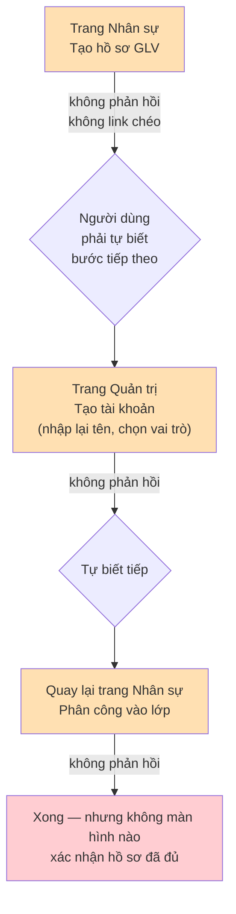
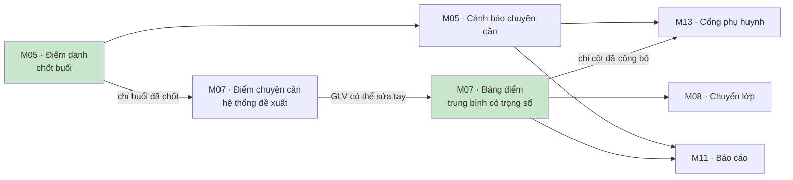

# 03 — Quy trình đi qua nhiều module

> Các quy trình nghiệp vụ **không nằm gọn trong một module**. Đây là nơi lỗi hay xuất hiện nhất,
> vì mỗi module được xây và nghiệm thu riêng lẻ.

---

## CM-01 — Đưa một Giáo lý viên mới vào hệ thống 🔴

**Đi qua:** M04 (hồ sơ nhân sự) → M01 (tài khoản) → M04 (phân công lớp) → M01 (vai trò)
**Tài liệu gốc:** WF-02 phần "Giáo lý viên"
**Trạng thái: CRITICAL** — đây chính là điểm đau user nêu đích danh.

### Hiện trạng

**Đo được:** 2 trang · 3 biểu mẫu · ít nhất 3 lần bấm gửi · khoảng 15 ô nhập · **0 liên kết chéo** ·
thứ tự bắt buộc **không được viết ở bất kỳ đâu trong giao diện**.

### Điều đáng ngạc nhiên

Phần khó **đã làm đúng**: máy chủ **tự điền** thông tin từ hồ sơ khi tạo tài khoản, và có cơ chế chống
trùng lặp khi hai người cùng thao tác. Chỉ là **giao diện không cho thấy điều đó**.

### Vấn đề nghiêm trọng nhất — mất vai trò khi đổi lớp

Khi kết thúc phân công lớp của một Giáo lý viên, hệ thống **cũng vô hiệu hóa vai trò** của tài khoản đó.
Nhưng bước phân công lớp mới **không tạo lại vai trò**, và **không có màn hình nào để gán vai trò**.

Kết quả: tài khoản rơi vào trạng thái *"đang hoạt động nhưng không có vai trò nào"*. Người đó đăng nhập
được nhưng gần như không làm được gì, và **không màn hình nào cảnh báo**. Cách khắc phục duy nhất hiện
nay là xóa tài khoản rồi tạo lại.

### Ranh giới quyền cắt ngang quy trình

| Bước | Ai được làm |
|---|---|
| Tạo hồ sơ nhân sự | 4 vai trò quản lý cấp xứ đoàn |
| Phân công vào lớp | 4 vai trò quản lý cấp xứ đoàn |
| Tạo tài khoản | **Chỉ Super Admin** |
| Gán vai trò | **Chỉ Super Admin** (nhưng chưa có giao diện) |

Một quy trình liền mạch về nghiệp vụ bị cắt làm đôi về quyền hạn. Thư ký làm được nửa đầu rồi phải
chờ Super Admin. **Đây là nguyên nhân gốc chung của nhiều luồng gãy**, và là quyết định cần user chốt.

### Đánh giá phương án user đề xuất

| Đề xuất | Đánh giá |
|---|---|
| Tạo hồ sơ tại trang Giáo lý viên | ✅ Đang đúng, giữ nguyên |
| Mở trang chi tiết Giáo lý viên sau khi tạo | ✅ **Nên làm** — đặc tả đã có nhưng chưa xây |
| Cho tạo tài khoản ngay tại đó | ✅ Nên làm — nhưng xem cảnh báo bên dưới |
| Tự điền thông tin từ hồ sơ | ✅ **Máy chủ đã làm rồi**, chỉ cần giao diện thể hiện |
| Cho liên kết tài khoản đã tồn tại | ✅ Nên làm |
| Ngăn trùng email/số điện thoại | ⚠️ Nên là **cảnh báo mềm**, không phải chặn cứng — theo đúng tinh thần WF-03 |
| Tự động liên kết tài khoản với hồ sơ | ✅ **Đã làm rồi**, có chống trùng lặp đúng cách |
| Tách trạng thái phục vụ khỏi trạng thái tài khoản | ✅ **Cơ sở dữ liệu đã tách sẵn**; tầng ứng dụng mới làm một nửa |

**Phản biện quan trọng:**
1. **Không nên gộp "tạo hồ sơ" và "tạo tài khoản" thành một bước bắt buộc.** Nhiều Giáo lý viên không
   cần tài khoản đăng nhập. Hồ sơ không có tài khoản là trạng thái **hợp lệ theo thiết kế** và phải giữ.
2. **Trang chi tiết nhân sự sinh rủi ro mới:** quy tắc hiện tại cho phép Giáo lý viên cùng lớp đọc hồ sơ
   của nhau. Phải chốt danh sách trường nào được hiện cho ai, giống cách đã làm cho hồ sơ thiếu nhi.
3. **Nếu nới quyền tạo tài khoản ra ngoài Super Admin, bắt buộc phải có đồng thời:** giới hạn không cho
   tạo vai trò cao hơn mình, ghi vết thao tác, và yêu cầu nhập mật khẩu hiện tại khi đổi mật khẩu.
   Hiện tại **cả ba đều chưa có**, và người cấp tài khoản luôn biết mật khẩu đầu tiên của người khác.
   **Khuyến nghị: giữ Super Admin-only trong phiên bản 1.**

---

## CM-02 — Đưa một thiếu nhi mới vào lớp 🟠

**Đi qua:** M03 (người giám hộ) → M03 (hồ sơ) → M03 (ghi danh, ở trang lớp) → M01 (tài khoản, nếu cần)
**Tài liệu gốc:** WF-03

**Hiện trạng:** 3–4 màn hình cho một việc mà tài liệu mô tả là một luồng liền mạch.

**Ba vấn đề nối tiếp nhau:**
1. **Không có cảnh báo trùng** khi nhập tay — trong khi đường nhập bằng Excel **có** đủ 3 mức cảnh báo.
   Cùng một bảng dữ liệu, cùng một rủi ro, hai đường vào khác nhau.
2. Người giám hộ trùng lặp tích tụ, và có **hệ quả phân quyền thật**: nếu một gia đình có hai bản ghi
   người giám hộ mà chỉ một bản có tài khoản, phụ huynh đăng nhập chỉ thấy **một phần số con của mình**.
3. Ghi danh nằm ở trang lớp, không ở trang em ⇒ tạo hồ sơ xong không biết đi đâu tiếp.

**Mâu thuẫn quyền trong cùng một quy trình:** Trưởng ngành **ghi danh được** nhưng **không tạo được hồ sơ**.
Nghĩa là Trưởng ngành không thể tự hoàn thành quy trình trong ngành mình. Cần user chốt.

---

## CM-03 — Chuỗi dữ liệu chính: Điểm danh → Điểm → Báo cáo & Cổng phụ huynh ✅

**Đi qua:** M05 → M07 → M11 / M13

**Đánh giá: đây là chuỗi làm tốt nhất hệ thống.** Ba điểm đáng ghi nhận:
- Điểm chuyên cần do hệ thống đề xuất **không ghi đè** điểm Giáo lý viên đã sửa tay, và có đường quay lại.
- Cổng phụ huynh lọc **hai tầng** cho dữ liệu chưa chốt/chưa công bố.
- Cảnh báo chuyên cần tính qua khung nhìn cấu hình theo năm học, chỉ tính buổi đã chốt.

**Rủi ro cần theo dõi:** ba module M08, M11, M13 đều tiêu thụ số trung bình của M07. Bất kỳ thay đổi nào
về cách tính (đặc biệt việc ẩn cột điểm) **phải kiểm chéo ở cả ba nơi**.

**Một điểm lệch nhỏ:** trung bình phụ huynh nhìn thấy (tính trên cột đã công bố) **khác** trung bình
Giáo lý viên nhìn thấy, mà không có chú thích. Phụ huynh so số với Giáo lý viên sẽ thắc mắc.

---

## CM-04 — Đóng ghi danh: hai đường vào, chỉ một đường có duyệt 🔴

**Đi qua:** M03 (trang lớp) ↔ M08 (chuyển lớp)

**Vấn đề.** Cùng một kết quả — đóng ghi danh với lý do "chuyển lớp" — có **hai đường đi tới**:
- Đường có quy trình: đề xuất → Trưởng ngành duyệt → hệ thống đóng và mở ghi danh nguyên tử.
- Đường tắt: mở trang lớp, chọn "Kết thúc" với lý do "Chuyển". **Không qua ai duyệt.**

Không có ràng buộc nào nối hai bảng, nên đường tắt có thể đóng một ghi danh **đang có đề xuất chờ duyệt**.

**Nguyên nhân gốc:** hàm quản trị ghi danh của M03 là API tổng quát, không biết gì về quy trình duyệt
của M08.

**Hệ quả kép với lỗi "tạm nghỉ":** lựa chọn "Tạm nghỉ" ở cùng màn hình đó **luôn thất bại im lặng** vì
hai tầng định nghĩa trái ngược nhau về trạng thái này.

---

## CM-05 — Từ dữ liệu Excel tới hồ sơ chính thức 🔴

**Đi qua:** M12 (nhập) → M03 (hồ sơ, người giám hộ, ghi danh)

**Ba vấn đề nghiêm trọng nối tiếp:**
1. **Mặc định "tạo mới" cho cả dòng trùng gần như chắc chắn** (trùng tên + ngày sinh + số điện thoại).
   Không có trạng thái "chưa quyết định" để ép người dùng chọn.
2. **Xóa lô dữ liệu đã ghi được phép, không xác nhận, không hoàn tác** ⇒ mất liên kết giữa dòng Excel và
   hồ sơ đã tạo. Và vì không có chức năng hoàn tác, xóa lô là thứ duy nhất người dùng làm được khi hoảng.
3. **Ghi danh trùng bị bỏ qua im lặng** ⇒ báo "đã nhập xong" nhưng em vẫn ở lớp cũ, người nhập không biết.

**Khoảng trống tổ chức đáng chú ý.** Người sửa dữ liệu sai là **Giáo lý viên của lớp**, nhưng Giáo lý viên
**không có quyền vào trang nhập dữ liệu**. Chức năng "tải file lỗi về" chính là cầu nối giữa hai bên —
nó nằm trong tiêu chí nghiệm thu của tài liệu nhưng chưa được làm.

**Mâu thuẫn trong chính tài liệu:** một chỗ nói "có thể xóa dữ liệu thô sau thời hạn ngắn"; chỗ khác yêu cầu
"giữ liên kết dòng ↔ mã thiếu nhi". Hai câu này được gộp thành một quyết định "xóa tất".

---

## CM-06 — Khởi tạo năm học mới 🔴

**Đi qua:** M02 (năm học, lớp) → M04 (phân công) → M03 (ghi danh) → M02 (đặt năm hiện hành)
**Tài liệu gốc:** WF-01

**Lỗi nghiêm trọng đã xảy ra thật.** Hàm sinh 19 lớp mặc định **tạo 0 lớp và báo thành công** khi bảng
danh mục mẫu lớp trống. Sự cố này đã xảy ra khi triển khai thật: toàn bộ migration chạy đủ, ứng dụng
chạy, đăng nhập được, nhưng trang lớp trống rỗng. Môi trường thử nghiệm không bao giờ lộ vì quy trình
khởi tạo lại có chạy dữ liệu mẫu.

**Ngoài ra:** nút "Sinh lớp mặc định" hiện trên **mọi** năm học, kể cả năm đã đóng.

**Quy trình đóng năm học chưa được cài bước nào.** Trạng thái "đã lưu trữ" chưa bao giờ được ghi, và
**không có chốt chặn nào ngăn ghi dữ liệu mới vào năm đã đóng** — vì lớp bảo vệ không đọc trạng thái năm học.

---

## CM-07 — Đơn xin nghỉ: từ phụ huynh tới buổi điểm danh 🟠

**Đi qua:** M13 (phụ huynh gửi) → M05 (Giáo lý viên xem) → M05 (điểm danh)
**Tài liệu gốc:** WF-10

**Phần làm đúng:** đơn **không** tự động sửa điểm danh; phụ huynh không gửi được đơn cho con người khác;
đơn không sửa được buổi đã khóa.

**Phần đứt gãy:** bước 5 của quy trình — *"Giáo lý viên thấy đơn trước khi điểm danh"* — **chưa có màn hình
nào**. Hàm ghi nhận đơn đã viết xong nhưng không nơi nào gọi ⇒ trạng thái "đã ghi nhận" **không bao giờ
đạt tới được**, và phụ huynh luôn thấy "Đang chờ" mãi mãi.

---

## CM-08 — Một người đồng thời là Giáo lý viên và phụ huynh ✅⚠️

**Đi qua:** M01 → M04 → M13 → M10

**Phần làm đúng:** trang phụ huynh **cố ý không giới hạn vai trò** (đúng quyết định D-25); thông báo
chống trùng nên người thuộc nhiều nhánh chỉ nhận một bản.

**Phần chưa xong:** người này thấy menu của Giáo lý viên, **không thấy mục "Con của tôi"** ⇒ biết mình có
quyền nhưng không tìm được đường vào. Đây là biểu hiện cụ thể của vấn đề "trang không có lối vào".

---

## CM-09 — Đổi người giám hộ: thao tác đổi quyền đọc ngay lập tức ⚠️

**Đi qua:** M03 → M13

Đổi người giám hộ của một em **thay đổi tức thì** danh sách con mà phụ huynh cũ và phụ huynh mới nhìn thấy.
Đây là thao tác phân quyền đội lốt thao tác sửa thông tin.

Hiện tại: **không có giao diện để làm việc này**, nên rủi ro chưa hiện thực hóa. Nhưng khi xây màn hình
quản lý người giám hộ, đây là điểm **bắt buộc phải có xác nhận nêu rõ hậu quả** và nên ghi vết.

---

## CM-10 — Thông báo tới đúng người 🟡

**Đi qua:** M02, M03, M04, M09 (nguồn người nhận) → M10 (gửi) → M13 (nhận)

**Phần làm đúng:** quyền công bố theo phạm vi khớp chính xác với tài liệu và được kiểm ở tầng hàm chuyên
dụng; danh sách người nhận chốt ngay trong giao dịch.

**Hố đen:** người **chưa được gán vai trò** không bao giờ nhận được thông báo, kể cả khi gửi đích danh —
và người gửi **không được báo** rằng thông báo tới 0 người. Kết hợp với vấn đề "tài khoản mất vai trò"
ở CM-01, có thể có những tài khoản im lặng không nhận được gì.

---

## Bảng tổng hợp

| Mã | Quy trình | Module | Trạng thái | Ưu tiên |
|---|---|---|---|---|
| CM-01 | Đưa Giáo lý viên mới vào hệ thống | M04→M01→M04→M01 | **CRITICAL** | **P0** |
| CM-06 | Khởi tạo & đóng năm học | M02→M04→M03 | **CRITICAL** | **P0** |
| CM-05 | Từ Excel tới hồ sơ chính thức | M12→M03 | **CRITICAL** | **P0** |
| CM-04 | Đóng ghi danh — hai đường vào | M03↔M08 | **CRITICAL** | **P1** |
| CM-02 | Đưa thiếu nhi mới vào lớp | M03→M01 | NEEDS_IMPROVEMENT | **P1** |
| CM-07 | Đơn xin nghỉ tới buổi điểm danh | M13→M05 | NEEDS_IMPROVEMENT | **P1** |
| CM-08 | Giáo lý viên kiêm phụ huynh | M01→M13 | NEEDS_IMPROVEMENT | **P1** |
| CM-10 | Thông báo tới đúng người | nhiều→M10→M13 | NEEDS_IMPROVEMENT | P2 |
| CM-09 | Đổi người giám hộ | M03→M13 | NEEDS_CONFIRMATION | P2 |
| CM-03 | Điểm danh → Điểm → Báo cáo/Cổng | M05→M07→M11/M13 | **PASS** | — |
