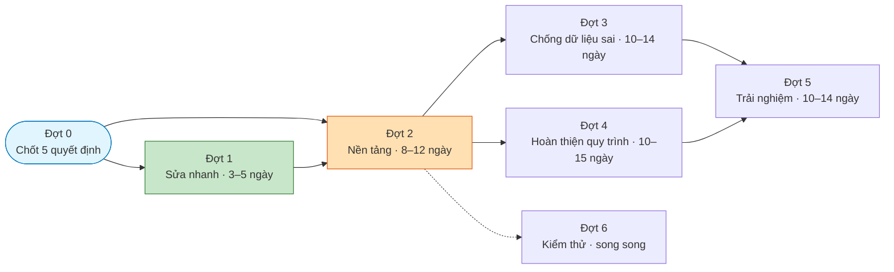

# 05 — Kế hoạch ưu tiên triển khai

> Thứ tự dựa trên: mức nghiêm trọng · tần suất sử dụng · số người bị ảnh hưởng · rủi ro dữ liệu ·
> rủi ro phân quyền · chi phí triển khai · quan hệ phụ thuộc.
>
> **Nguyên tắc xuyên suốt:** sửa nghiệp vụ trước, giao diện sau. Không đụng vào 16 điểm mạnh
> liệt kê ở `04_SYSTEM_WIDE_FINDINGS.md`.

---

## Bảng chấm điểm ưu tiên

Thang 1–5 mỗi tiêu chí. Điểm cao = làm sớm.

| Hạng mục | Nghiêm trọng | Tần suất | Số người | Rủi ro dữ liệu | Rủi ro quyền | Rẻ (5=rẻ) | **Tổng** |
|---|--:|--:|--:|--:|--:|--:|--:|
| Lọc hộp thư & chuông theo người dùng (M10) | 5 | 5 | 4 | 2 | 5 | **5** | **26** |
| Kênh phản hồi thao tác toàn hệ thống (SW-01) | 5 | 5 | 5 | 4 | 3 | 3 | **25** |
| Có nút Đăng xuất (M01) | 5 | 5 | 5 | 2 | 5 | **5** | **27** |
| Lối vào cổng phụ huynh (M13) | 5 | 5 | **5** | 1 | 2 | 4 | **22** |
| Gán/đổi vai trò + không mất vai trò khi đổi lớp (CM-01) | 5 | 3 | 3 | 4 | 5 | 3 | **23** |
| Sinh 19 lớp báo lỗi khi danh mục trống (M02) | 5 | 1 | 5 | 5 | 1 | **5** | **22** |
| Chống công thức lạ trong file xuất (M07) | 4 | 3 | 3 | 4 | 2 | **5** | **21** |
| Kiểm quyền route cho trang thiếu nhi (M13) | 4 | 2 | 2 | 1 | 5 | **5** | **19** |
| Sửa buổi mặc định theo giờ Việt Nam (M05) | 4 | **5** | 4 | 3 | 1 | 4 | **21** |
| Nhập Excel: mặc định trùng + xóa lô + ghi danh im lặng (M12) | 5 | 2 | 4 | **5** | 2 | 2 | **20** |
| Vòng đời ghi danh: tạm nghỉ/khôi phục (M03) | 4 | 3 | 3 | 3 | 1 | 4 | **18** |
| Cảnh báo trùng khi nhập tay (M03) | 4 | 4 | 4 | **5** | 1 | 3 | **21** |
| Màn hình ghi nhận đơn xin nghỉ (M05) | 3 | 4 | 4 | 2 | 1 | 4 | **18** |
| Công việc tuần ghi đè mất dữ liệu (M09) | 4 | 2 | 2 | 4 | 1 | 4 | **17** |
| Đóng năm học (M02) | 4 | 1 | 4 | **5** | 3 | 2 | **19** |
| Tìm kiếm/lọc/phân trang (SW-07) | 3 | **5** | 4 | 1 | 1 | 3 | **17** |
| Xác nhận thao tác nguy hiểm (SW-06) | 4 | 3 | 3 | 4 | 2 | 4 | **20** |
| Trạng thái rỗng phân biệt lý do (SW-03) | 2 | 4 | **5** | 1 | 1 | 4 | **17** |
| Nhập điểm khi nhiều người cùng làm (M07) | 4 | 3 | 2 | 4 | 1 | 2 | **16** |
| Tương phản màu & cỡ chữ (SW-14) | 3 | 5 | **5** | 1 | 1 | 4 | **19** |

---

## Đợt 0 — ✅ ĐÃ CHỐT 2026-07-23

Toàn bộ 19 quyết định đã có câu trả lời. **Không còn gì chặn Giai đoạn 2.**

📌 **Nguồn sự thật: [`06_DECISION_LOG.md`](06_DECISION_LOG.md)** — đọc trước khi code.

| Quyết định cũ | Kết quả chốt | Mã |
|---|---|---|
| D-A Cách báo kết quả thao tác | Form ngắn → chuyển hướng + thông báo; form dài → giữ dữ liệu, lỗi tại chỗ | **D-61** |
| D-B Ai tạo tài khoản | **Giữ chỉ Super Admin**, thêm nút "Cần tạo tài khoản" + hàng chờ duyệt | **D-62** |
| D-C Ai tạo hồ sơ thiếu nhi | Thư ký & cấp xứ đoàn: toàn xứ đoàn · **Trưởng/Phó ngành: ngành mình** | **D-63** |
| D-D Lối vào cổng phụ huynh | Mục "Con của tôi"; 1 con vào thẳng, nhiều con hiện danh sách | **D-64** |
| D-E Ghi vết thao tác | 🔴 **Làm nhật ký đầy đủ** — đảo ngược quyết định cũ D-34 | **D-65** |

**14 quyết định khác** (D-66…D-79) giải quyết mọi mâu thuẫn giữa tài liệu và mã nguồn — xem
[`06_DECISION_LOG.md`](06_DECISION_LOG.md) phần "Thay đổi so với kế hoạch ban đầu".

### ⚠️ Hai thay đổi lớn với kế hoạch bên dưới

1. **Nhật ký thao tác (D-65) là hạng mục mới, chưa có trong kế hoạch gốc** → thêm vào Đợt 2,
   làm Đợt 2 tăng từ 8–12 lên **16–22 ngày**.
2. **Sáu thay đổi phân quyền cần sửa cơ sở dữ liệu** (D-63, D-66, D-67, D-70, D-74, D-75) → phân bổ
   vào Đợt 2 và Đợt 4, mỗi cái **bắt buộc** có kiểm thử phân quyền bằng tài khoản thật.

**Tổng thời gian: 46–68 → 60–86 ngày-người.**

---

## Đợt 1 — Sửa nhanh, rủi ro thấp, giá trị cao ⚡

**Mục tiêu:** gỡ các lỗi nghiêm trọng mà chi phí gần như bằng không.
**Ước lượng: 3–5 ngày.** Không hạng mục nào cần thay đổi cơ sở dữ liệu.

| # | Việc | Module | Cỡ | Vì sao đợt 1 |
|---|---|---|---|---|
| 1.1 | Lọc hộp thư và chuông theo người đăng nhập | M10 | **S** | Hai dòng mã, gỡ 2 lỗi nghiêm trọng, không rủi ro |
| 1.2 | Thêm nút Đăng xuất | M01 | **S** | Máy dùng chung ở nhà xứ; hiện **không có cách đăng xuất** |
| 1.3 | Sửa buổi điểm danh mặc định theo giờ Việt Nam | M05 | **S** | Dùng hằng tuần bởi ~40 người; sáng Chúa nhật đang chọn nhầm buổi |
| 1.4 | Chống công thức lạ ở mọi ô file xuất | M07 | **S** | An toàn dữ liệu; đã có sẵn hàm, chỉ chưa áp dụng hết |
| 1.5 | Kiểm quyền route cho trang điểm danh thiếu nhi | M13 | **S** | Một dòng; quy tắc đang khai báo mà không thi hành |
| 1.6 | Sinh 19 lớp phải báo lỗi khi danh mục trống | M02 | **S** | Đã gây sự cố thật khi triển khai |
| 1.7 | Sửa link bảng tổng quan trỏ vào trang chỉ dành nhân sự | M11/M13 | **S** | Phụ huynh bấm vào bị từ chối truy cập |
| 1.8 | Ẩn nút "Sinh lớp mặc định" ở năm đã đóng | M02 | **S** | — |
| 1.9 | Gỡ dòng chữ tạm "Bản nền giao diện · P0-T3" ở thanh bên | M14 | **S** | Đang hiện trên mọi trang cho **mọi** người dùng |
| 1.10 | Cho Cha sở/Cha phó/Thủ quỹ vào xem trang điểm danh | M14 | **S** | **D-68** — gỡ link chết trong menu; không đụng cơ sở dữ liệu |

---

## Đợt 2 — Nền tảng: kênh phản hồi và vai trò 🏗️

**Mục tiêu:** dựng hai nền tảng mà mọi việc sau đều dựa vào.
**Ước lượng: 8–12 ngày.** ⚠️ Cần D-A và D-B đã chốt.

| # | Việc | Module | Cỡ | Ghi chú |
|---|---|---|---|---|
| 2.1 | Áp dụng cách phản hồi thống nhất cho **mọi** thao tác ghi | Toàn hệ thống | **L** | Theo D-A. Đây là việc quan trọng nhất của cả kế hoạch |
| 2.2 | Mọi câu lệnh ghi phải kiểm số dòng thay đổi, 0 dòng = thất bại | Toàn hệ thống | **M** | Đi kèm 2.1 |
| 2.3 | Màn hình gán/đổi vai trò cho tài khoản | M01/M04 | **M** | Theo D-B |
| 2.4 | Đổi lớp cho Giáo lý viên **không làm mất vai trò** | M04 | **M** | Lỗi nghiêm trọng nhất của CM-01 |
| 2.5 | Trang chi tiết Giáo lý viên (sửa hồ sơ, nút "Cần tạo tài khoản", hàng chờ duyệt) | M04/M01 | **L** | **D-62** — chính là điều user yêu cầu |
| 2.6 | Tách trạng thái phục vụ khỏi trạng thái tài khoản ở tầng giao diện | M04 | **M** | Cơ sở dữ liệu đã tách sẵn |
| **2.7** | 🔴 **Nhật ký thao tác toàn hệ thống** | Toàn hệ thống | **L** | **D-65** — hạng mục mới, xem chi tiết bên dưới |
| 2.8 | Trưởng/Phó ngành tạo/sửa được hồ sơ thiếu nhi + người giám hộ trong ngành mình | M03 | **M** | **D-63** — nới quyền, cần sửa cơ sở dữ liệu |
| 2.9 | Mức đọc riêng cho Thủ quỹ | M03/M11 | **M** | **D-67** — nới quyền, cần sửa cơ sở dữ liệu |

**Vì sao 2.1 đi trước tất cả:** không có kênh phản hồi thì mọi việc sau đều **không kiểm chứng được
bằng tay**, và nhiều lỗi hiện tại chỉ vô hình *vì* thiếu kênh này.

### 2.7 chi tiết — Nhật ký thao tác (D-65)

Đây là hạng mục **mới hoàn toàn**, đảo ngược quyết định cũ. Ba phần:

| Phần | Nội dung | Cỡ |
|---|---|---|
| a | Bảng nhật ký + quy tắc chỉ-ghi-thêm (không ai sửa/xóa, kể cả Super Admin) | **M** |
| b | Nối vào ~30 thao tác trong 12 nhóm nghiệp vụ — xem danh sách ở `06_DECISION_LOG.md` D-65 | **L** |
| c | Màn hình Super Admin xem/lọc nhật ký | **M** |

**Ràng buộc bắt buộc:**
- **Không ghi** mật khẩu, mã đăng nhập, hay nội dung hồ sơ sức khỏe vào nhật ký. Với dữ liệu nhạy cảm
  chỉ ghi *"đã sửa hồ sơ sức khỏe của em X"*.
- Chỉ Super Admin đọc được.
- Ghi nhật ký lỗi **không được** làm hỏng thao tác nghiệp vụ chính.

**Vì sao đặt ở Đợt 2:** nhật ký phải có **trước** khi làm các đợt sau, nếu không mọi thao tác của
Đợt 3–5 sẽ phải quay lại nối nhật ký lần thứ hai.

---

## Đợt 3 — Chống dữ liệu sai và dữ liệu trùng 🛡️

**Ước lượng: 10–14 ngày.** ⚠️ Cần D-C, D-E đã chốt.

| # | Việc | Module | Cỡ |
|---|---|---|---|
| 3.1 | Cảnh báo trùng khi nhập hồ sơ tay — **dùng chung** định nghĩa với đường Excel | M03 | **M** |
| 3.2 | Sửa vòng đời ghi danh: tạm nghỉ hoạt động được, có khôi phục | M03 | **M** |
| 3.3 | Nhập Excel: bỏ mặc định "tạo mới" cho dòng trùng chắc chắn | M12 | **M** |
| 3.4 | Nhập Excel: chặn xóa lô đã ghi, thêm xác nhận | M12 | **S** |
| 3.5 | Nhập Excel: báo rõ khi ghi danh bị bỏ qua | M12 | **M** |
| 3.6 | Nhập Excel: tải file lỗi về cho Giáo lý viên sửa | M12 | **M** |
| 3.7 | Xác nhận cho mọi thao tác nguy hiểm (danh sách ở SW-06) | Toàn hệ thống | **M** |
| 3.8 | Công việc tuần: nạp bản đã có, không ghi đè trắng | M09 | **S** |
| 3.9 | Sửa/xem người giám hộ | M03 | **M** |
| 3.10 | Sửa bản ghi bí tích | M03 | **S** |

---

## Đợt 4 — Hoàn thiện quy trình còn dang dở 🔗

**Ước lượng: 10–15 ngày.**

| # | Việc | Module | Cỡ |
|---|---|---|---|
| 4.1 | Lối vào cổng phụ huynh + chuyển đổi giữa các con | M13 | **M** |
| 4.2 | Màn hình Giáo lý viên xem/ghi nhận đơn xin nghỉ | M05 | **M** |
| 4.3 | Quy trình đóng năm học | M02 | **L** |
| 4.4 | Chặn đường tắt đóng ghi danh khi đang có đề xuất chờ duyệt | M03/M08 | **M** |
| 4.5 | Xóa/ẩn cột điểm | M07 | **M** |
| 4.6 | Bảng chuyển lớp: bỏ truy vấn lặp, thêm lọc và phân trang | M08 | **M** |
| 4.7 | Báo số người nhận sau khi gửi thông báo; cảnh báo khi bằng 0 | M10 | **M** |
| 4.8 | Nhận xét mặc định là nội bộ | M07 | **M** |
| 4.9 | Vòng đời Top 5 rõ ràng | M07 | **M** |
| **4.10** | Thêm ngày kết thúc học kỳ 1 vào cấu hình năm học | M02 | **M** | **D-71** |
| **4.11** | Thu hồi thông báo đã gửi | M10 | **M** | **D-77** |
| **4.12** | Trả thiết bị một phần = còn nợ; tách thao tác báo hỏng/mất | M09 | **M** | **D-76** |
| **4.13** | Siết quyền khóa bảng điểm về Giáo lý viên đại diện + lớp | M07 | **M** | **D-74** — siết quyền |
| **4.14** | Cha sở/Cha phó không chốt báo cáo | M11 | **S–M** | **D-66** — siết quyền |
| **4.15** | Phụ huynh/Thiếu nhi chỉ thấy lớp của mình | M02/M13 | **M** | **D-70** — siết quyền |
| **4.16** | Ẩn ghi chú điểm danh khỏi cổng phụ huynh | M05/M13 | **S** | **D-75** — siết quyền |
| **4.17** | Mỗi Ban chỉ một Trưởng ban | M09 | **S** | **D-78** |

> ⚠️ **Bốn hạng mục siết quyền (4.13–4.16) làm giảm quyền của người đang dùng.**
> Phải báo trước cho người bị ảnh hưởng, nếu không họ sẽ tưởng hệ thống hỏng.
> Riêng 4.15 cần kiểm lại toàn bộ cổng phụ huynh — siết quá tay sẽ làm hiện *"lớp không xác định"*.

---

## Đợt 5 — Trải nghiệm và khả năng dùng ở quy mô thật 📱

**Ước lượng: 10–14 ngày.** Đây là lúc **được phép** chỉnh giao diện — sau khi nghiệp vụ đã đúng.

| # | Việc | Module | Cỡ |
|---|---|---|---|
| 5.1 | Tìm kiếm / lọc / phân trang cho các danh sách lớn | M03, M08, M09, M12 | **L** |
| 5.2 | Ba loại trạng thái rỗng chuẩn, áp dụng toàn hệ thống | Toàn hệ thống | **M** |
| 5.3 | Sửa tương phản màu và cỡ chữ (**D-79** — giữ hệ màu cam/da người, không dark mode) | M14 | **M** |
| 5.4 | Xem lại thanh điều hướng dưới cho từng vai trò | M14 | **M** |
| 5.5 | Cải thiện tiếp cận: khung thoại di động, thứ bậc tiêu đề, chú thích bảng | M14 | **M** |
| 5.6 | Bảng tổng quan riêng cho phụ huynh/thiếu nhi | M11 | **M** |
| 5.7 | Chú thích cách tính trung bình cho phụ huynh | M07/M13 | **S** |

---

## Đợt 6 — Củng cố kiểm thử 🧪

**Ước lượng: 5–8 ngày.** Có thể làm song song từ Đợt 2.

| # | Việc | Vì sao |
|---|---|---|
| 6.1 | Kiểm thử chạy bằng **vai trò quyền cao** cho mọi màn hình "của tôi" | Lỗ hổng để lọt 2 lỗi nghiêm trọng của M10 |
| 6.2 | Kiểm thử **theo hành trình**: vai trò X từ đăng nhập tới chức năng Y trong N bước | Để lọt toàn bộ nhóm "trang không có lối vào" |
| 6.3 | Kiểm thử kiến trúc: mọi trang có giới hạn vai trò đều thực thi giới hạn đó | Chống tái phát ở mức cấu trúc |
| 6.4 | Kiểm thử tình huống **đồng thời**: hai người cùng nhập điểm, cùng lưu công việc tuần | Kiểm thử hiện **cố ý né** các tình huống này |
| 6.5 | Kiểm thử luồng **ghi** của M03 (hiện không có bất kỳ bài nào) | — |
| 6.6 | Sửa bài kiểm thử đang **chốt cứng một hành vi sai** | Sửa lỗi sẽ làm bài này đỏ |

---

## Lộ trình tổng thể

**Tổng ước lượng: 46–68 ngày-người**, chưa kể Đợt 6 chạy song song.

---

## Chi tiết 5 quyết định của Đợt 0

### D-A · Cách phản hồi kết quả thao tác

**Vấn đề:** 9/14 module có cùng lỗi "bấm nút không biết kết quả". Có hai cách sửa, cả hai đều chạy được.
**Điều quan trọng không phải chọn cách nào, mà là chọn MỘT cách cho cả hệ thống.**

| | Cách 1 — Chuyển hướng kèm mã kết quả | Cách 2 — Cơ chế trạng thái của React |
|---|---|---|
| Cần mã chạy trên trình duyệt | Không | Có |
| Giữ lại dữ liệu đã nhập khi lỗi | Khó | Dễ |
| Phù hợp máy yếu / mạng kém | ✅ Rất tốt | Khá |
| Công sức | Thấp hơn | Cao hơn |

**Khuyến nghị:** Cách 1 cho các biểu mẫu đơn giản, Cách 2 cho các biểu mẫu dài (tạo hồ sơ, nhập điểm) —
**nhưng phải viết thành quy tắc rõ ràng** để không mỗi module một kiểu.

### D-B · Ai được tạo tài khoản và gán vai trò

Hiện tại chỉ Super Admin. Hệ quả: Thư ký làm được nửa quy trình rồi phải chờ.

**Nếu mở rộng, bắt buộc phải có đồng thời ba thứ** (hiện chưa có cái nào): không cho tạo vai trò cao hơn
mình · ghi vết thao tác · yêu cầu mật khẩu hiện tại khi đổi mật khẩu.

**Khuyến nghị: giữ Super Admin-only ở phiên bản 1**, nhưng làm cho quy trình liền mạch hơn (trang chi
tiết nhân sự có nút "Yêu cầu tạo tài khoản" hiển thị rõ trạng thái đang chờ).

### D-C · Ai được tạo hồ sơ trong ngành mình

Hiện tại có mâu thuẫn: Trưởng ngành **ghi danh được** nhưng **không tạo được hồ sơ thiếu nhi/nhân sự**.
Tài liệu cho phép, mã nguồn chặn.

**Hai hướng:** siết theo mã nguồn (sửa tài liệu) hoặc mở theo tài liệu (sửa mã nguồn + kiểm thử phân quyền).
**Khuyến nghị: hỏi thực tế vận hành** — ai đang thực sự nhập hồ sơ ở giáo xứ?

### D-D · Lối vào cổng phụ huynh

Ba cách: trang danh sách con · vào thẳng khi chỉ có một con · gộp vào bảng tổng quan.
**Khuyến nghị: cách 2** (đa số phụ huynh có 1–2 con).
**Kèm theo phải chốt:** thanh dưới của phụ huynh đang đủ 5 mục, thêm "Con của tôi" thì **bỏ mục nào**?

### D-E · Ghi vết thao tác nhạy cảm

Quyết định "không làm nhật ký đầy đủ trước/sau" **vẫn giữ nguyên**. Câu hỏi khác: có ghi lại *ai làm gì
lúc nào* cho một số ít thao tác không? Ứng viên: xóa/khóa tài khoản · đổi vai trò · đổi người giám hộ ·
xóa lô dữ liệu nhập · báo hỏng/mất thiết bị.

**Khuyến nghị:** làm ở mức tối thiểu cho 5 thao tác trên. Chi phí thấp, và đây là những việc mà khi có
tranh cãi sẽ không có cách nào truy lại.

---

## Nguyên tắc cho người triển khai giai đoạn 2

1. **Sửa nghiệp vụ trước, giao diện sau.** Đợt 5 mới được chỉnh giao diện.
2. **Không đụng 16 điểm mạnh** ở `04_SYSTEM_WIDE_FINDINGS.md`.
3. **Không giảm số bước nếu làm tăng rủi ro** dữ liệu, phân quyền, hoặc thao tác nhầm.
4. **Cơ sở dữ liệu đã đúng ở phần lớn chỗ** — 6/8 hạng mục của M03, toàn bộ M13, phần lớn M10 **không cần
   thay đổi cơ sở dữ liệu**. Trước khi viết migration, hãy kiểm xem cột/ràng buộc đã có sẵn chưa.
5. **Mỗi module xong phải cập nhật `00_SYSTEM_AUDIT_BOARD.md`** và ghi số kiểm thử thật vào WORKLOG.
6. **Không ghi "đã xong" khi chưa chạy kiểm thử thật.**
