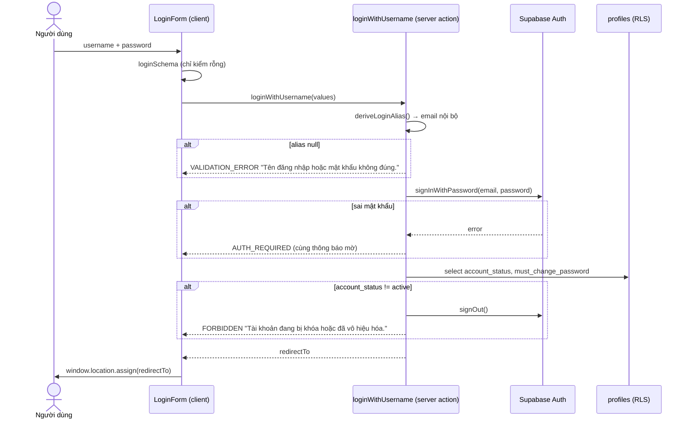
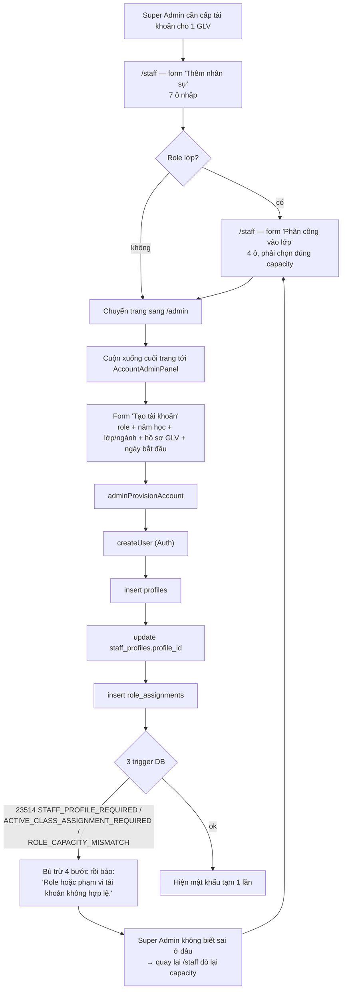

# M01-AUTH-ACCOUNT — Luồng As-Is

Ký hiệu: `M01-F01` … `M01-F12`. Mọi bước đều trích `file:line`.

---

## M01-F01 — Đăng nhập bằng tên đăng nhập nghiệp vụ

**Actor:** ẩn danh. **Precondition:** đã được Super Admin cấp tài khoản.

| # | Bước | Bằng chứng |
|---|---|---|
| 1 | Người dùng mở `/login` (layout hai cột, ẩn cột trái dưới `lg`) | `src/app/(auth)/login/page.tsx:7-16`, `src/app/(auth)/layout.tsx:9-31` |
| 2 | Nhập username + password; validate client bằng `loginSchema` (chỉ kiểm rỗng) | `src/features/auth/components/login-form.tsx:16-19`, `src/features/auth/schemas.ts:4-7` |
| 3 | Submit → Server Action `loginWithUsername` | `login-form.tsx:23` |
| 4 | Server parse lại bằng `loginSchema` | `actions.ts:65` |
| 5 | Suy ra alias email theo 4 namespace: `CQ\d{4,}`→students, `GLV\d{3,}`→staff, SĐT VN→guardians, còn lại→accounts | `src/features/auth/aliases.ts:22-35` |
| 6 | `supabase.auth.signInWithPassword({email: alias.email, password})` | `actions.ts:70` |
| 7 | Đọc `profiles.account_status`, `must_change_password` | `actions.ts:73-77` |
| 8 | Nếu `account_status !== 'active'` → `signOut()` + `FORBIDDEN` | `actions.ts:78-81` |
| 9 | Trả `redirectTo` = `/change-password` nếu `must_change_password`, ngược lại `/dashboard` | `actions.ts:82` |
| 10 | Client `window.location.assign(redirectTo)` (full reload để middleware set cookie) | `login-form.tsx:28` |

**Error path / edge case**

- Username sai định dạng (`@@`) → cùng thông báo với sai mật khẩu (`actions.ts:67`) — **tốt cho bảo mật**, không lộ tài khoản tồn tại hay không.
- **Không có rate limiting / lockout** ở tầng ứng dụng. Chỉ dựa vào giới hạn mặc định của Supabase Auth. Không có bảng `login_attempts`.
- `last_login_at` không bao giờ được ghi (`20260715000100:51` vs. không có code ghi).
- Nếu `profiles` chưa tồn tại (auth user mồ côi) → coi như không active, signOut. Đúng.
- `/login` **không kiểm tra người dùng đã đăng nhập** → một người đang có phiên vẫn mở lại `/login` và thấy form.
- Tham số `?next=` do `requireAuthContext` sinh ra (`guards.ts:9`) **không được `/login` đọc lại** → sau khi đăng nhập luôn về `/dashboard`, mất deep-link.
- `?error=account_unavailable` do `guards.ts:10` sinh ra **cũng không được hiển thị**.

---

## M01-F02 — Đổi mật khẩu của chính mình

**Actor:** mọi tài khoản active. **Precondition:** đã đăng nhập.

| # | Bước | Bằng chứng |
|---|---|---|
| 1 | Guard `requireAuthContext("/change-password")` | `src/app/(auth)/change-password/page.tsx:9` |
| 2 | Form 2 ô: mật khẩu mới + xác nhận; validate `min(8)` + khớp nhau | `change-password-form.tsx:15-18`, `schemas.ts:9-17` |
| 3 | Server action `changeOwnPassword` → `requireAuthContext` → `supabase.auth.updateUser({password})` | `actions.ts:90-94` |
| 4 | RPC `complete_password_change()` xóa cờ `must_change_password` | `actions.ts:95`, `20260715000300:3-24` |
| 5 | Redirect `/dashboard` | `actions.ts:97`, `change-password-form.tsx:27` |

**Error path / edge case**

- **Không yêu cầu mật khẩu hiện tại** (`actions.ts:88-101`). Ai chiếm được phiên là đổi được mật khẩu.
- Nếu `updateUser` thành công nhưng RPC lỗi → mật khẩu **đã đổi** nhưng cờ vẫn bật; thông báo `"Mật khẩu đã đổi nhưng chưa thể hoàn tất tài khoản"` (`actions.ts:96`). Người dùng bị kẹt vòng lặp `/change-password` cho tới khi thử lại. Không có bù trừ.
- Không chặn đặt lại **đúng mật khẩu tạm** vừa nhận.
- Không có kiểm tra độ mạnh ngoài `min(8)`; docs không yêu cầu thêm.
- Thông báo lỗi được render với `tone="muted"` (`change-password-form.tsx:43`) → lỗi trông như chú thích, không như lỗi.
- Trang này là **cách duy nhất** để người dùng tự đổi mật khẩu; nhưng không có link nào tới nó từ shell đã đăng nhập (`user-menu.tsx:22` chỉ trỏ `/account`, mà `/account` là placeholder — xem M01-F10).

---

## M01-F03 — Super Admin tạo tài khoản (WF-02)

**Actor:** Super Admin. **Precondition:** đã có hồ sơ nghiệp vụ tương ứng (và với role lớp: đã có phân công lớp active đúng capacity).

Đây là luồng phức tạp nhất của hệ thống. Có **4 biến thể** rẽ theo `role`.

### Bước As-Is (biến thể role Giáo lý viên — trọng tâm audit)

| # | Bước | Màn hình | Bằng chứng |
|---|---|---|---|
| 0a | Tạo hồ sơ GLV | **`/staff`** | `src/app/(dashboard)/staff/page.tsx:52-61` → `createStaffFromForm` |
| 0b | Phân công GLV vào lớp (bắt buộc nếu role lớp) | **`/staff`** | `staff/page.tsx:66-72` → `assignStaffFromForm` |
| 1 | Chuyển sang **`/admin`**, cuộn xuống cuối trang tới `AccountAdminPanel` | `src/app/(dashboard)/admin/page.tsx:156` |
| 2 | Chọn “Role chính” (mặc định `class_teacher`) | `account-admin-panel.tsx:120-122` |
| 3 | UI ẩn khối username/displayName/saintName/phone/email vì `needsStaffProfile` | `account-admin-panel.tsx:108,125-133` |
| 4 | Chọn Năm học (nếu role ngành/lớp) | `:155` |
| 5 | Chọn Ngành **hoặc** Lớp | `:156-157` |
| 6 | Chọn “Hồ sơ Giáo lý viên” từ dropdown — **chỉ liệt kê hồ sơ có `profile_id IS NULL`** | `:158`, `queries.ts:35` |
| 7 | Nhập “Ngày bắt đầu” | `:159` |
| 8 | Submit → client tự tra `staff` trong `options` và **điền lại** username/displayName/saintName/phone/email từ hồ sơ | `account-admin-panel.tsx:39-45` |
| 9 | Server `requireSuperAdmin()` | `actions.ts:105,37-41` |
| 10 | Zod `provisionAccountSchema` (kiểm scope theo role, bắt buộc `staffProfileId` cho 9 role GLV) | `actions.ts:106`, `schemas.ts:21-63` |
| 11 | Server **đọc lại `staff_profiles` bằng service role** và ghi đè username = `staff_code`, displayName = `full_name`, … | `actions.ts:114-128` |
| 12 | `deriveLoginAlias(username)` → email `glvxxx@staff.<domain>` | `actions.ts:160-161` |
| 13 | Sinh mật khẩu tạm 8 ký tự (alphabet không nhập nhằng, `randomInt`) | `actions.ts:162`, `passwords.ts:9-20` |
| 14 | `admin.auth.admin.createUser({email, password, email_confirm:true})` | `actions.ts:163-169` |
| 15 | `insert into profiles` (service role, bypass RLS) | `actions.ts:172-181` |
| 16 | Nếu lỗi → **bù trừ**: `deleteUser` | `actions.ts:182-185` |
| 17 | `update staff_profiles set profile_id` với điều kiện `.is("profile_id", null)` (chống race) | `actions.ts:190-204` |
| 18 | Nếu lỗi → bù trừ: xóa profile + deleteUser | `actions.ts:198-202` |
| 19 | `insert into role_assignments` — kích hoạt 3 trigger DB | `actions.ts:241-249` |
| 20 | Nếu lỗi → bù trừ: gỡ link staff/guardian/student, xóa profile, deleteUser | `actions.ts:250-263` |
| 21 | `revalidatePath("/admin")`, trả `{profileId, username, temporaryPassword}` | `actions.ts:265-266` |
| 22 | UI hiện mật khẩu tạm **một lần** trong khối cảnh báo | `account-admin-panel.tsx:56-58,163` |

### Biến thể khác

- **Role toàn cục không phải GLV** (`super_admin`, `parish_priest`, `chaplain`): hiện khối 5 ô nhập tay (username, tên hiển thị, tên thánh, SĐT, email) (`account-admin-panel.tsx:125-133`).
- **`guardian`**: chọn hồ sơ phụ huynh chưa có account; username = SĐT chuẩn hóa (`actions.ts:130-143`).
- **`student`**: chọn hồ sơ thiếu nhi chưa có account; username = `student_code` (`actions.ts:145-158`).

### Error path / edge case

| Tình huống | Hành vi thực tế | Bằng chứng |
|---|---|---|
| Hồ sơ GLV đã có account | Không xuất hiện trong dropdown (lọc `profile_id IS NULL`) + server chặn `CONFLICT` | `queries.ts:35`, `actions.ts:120-121` |
| Hai Super Admin cùng chọn một hồ sơ | Bên thứ hai thua ở `.is("profile_id", null)` → `CONFLICT` + rollback đầy đủ | `actions.ts:194-202` |
| Email alias đã tồn tại (username trùng) | `authError.status === 422` → `CONFLICT` **không kèm message** → UI hiện fallback `"Không thể tạo tài khoản. Vui lòng thử lại."` | `actions.ts:169`, `:32-35` |
| `profiles.username` trùng (23505) | `CONFLICT` không message → cùng fallback mơ hồ, và **auth user đã bị xóa** | `actions.ts:182-185` |
| Role lớp nhưng hồ sơ chưa được phân công lớp/sai capacity | Trigger `validate_role_assignment_scope` raise `ACTIVE_CLASS_ASSIGNMENT_REQUIRED`/`ROLE_CAPACITY_MISMATCH` → gộp thành một message duy nhất | `20260715000400:188-196`, `actions.ts:262` |
| Bù trừ thất bại giữa chừng (mạng đứt) | Không có retry, không log → **auth user / profile mồ côi** | `actions.ts:182-263` |
| Phiên Super Admin hết hạn khi submit | `requireAuthContext` gọi `redirect()`, ném `NEXT_REDIRECT`, bị `catch` nuốt (`actions.ts:267-269`) → hiện “Không thể tạo tài khoản…” thay vì đưa về `/login` | `actions.ts:104,267-269` |
| Empty state (chưa có hồ sơ GLV nào) | Dropdown chỉ còn option placeholder, **không có thông báo hướng dẫn** | `account-admin-panel.tsx:158` |
| Người dùng mất mật khẩu tạm (F5 trang) | Không có cách xem lại; phải dùng M01-F06 | `account-admin-panel.tsx:163` |

**Đếm As-Is (role lớp):** 2 trang, 3 form, 15 ô nhập, ~2 lần điều hướng, tối thiểu 3 lần submit. Dữ liệu nhập lại: 0 ô trùng lặp về mặt kỹ thuật (server tự lấy từ hồ sơ) nhưng **phải nhớ và chọn lại**: hồ sơ, lớp, ngày bắt đầu (đã nhập ở bước phân công).

---

## M01-F04 — Đổi tên đăng nhập

**Actor:** Super Admin.

| # | Bước | Bằng chứng |
|---|---|---|
| 1 | Sửa trực tiếp ô `Input` trong thẻ tài khoản (không có form, không có nút hủy) | `account-admin-panel.tsx:178-179` |
| 2 | `adminUpdateUsername(profileId, value)` | `:82` |
| 3 | `requireManageableAccount` — chặn tự sửa mình, chặn target là super_admin | `actions.ts:43-61` |
| 4 | `adminUsernameSchema` + `deriveLoginAlias` | `actions.ts:308-310` |
| 5 | Kiểm trùng thủ công trên `profiles` (service role) | `actions.ts:312-318` |
| 6 | `getUserById` lưu `previousEmail`, rồi `updateUserById({email: alias.email})` | `actions.ts:320-327` |
| 7 | `update profiles.username` | `actions.ts:329-332` |
| 8 | Nếu bước 7 lỗi → **rollback email Auth về `previousEmail`** | `actions.ts:333-338` |

**Error path / edge case**

- Kiểm trùng ở bước 5 là **TOCTOU** — hai request song song vẫn có thể vượt qua; chốt cuối là unique index `profiles.username` (`20260715000100:44`) và unique email của Auth.
- **Đổi username của một GLV làm lệch với `staff_code`.** `staff_profiles.staff_code` không đổi (`20260715000400:15`); `deriveLoginAlias` sẽ đưa username mới sang namespace khác (ví dụ `GLV007` → `NGUYENA` → `@accounts.` thay vì `@staff.`). Không có ràng buộc nào ngăn.
- Không confirm, không cảnh báo “người dùng sẽ phải đăng nhập bằng tên mới”.
- Nếu người dùng gõ rồi bỏ đi (không bấm Lưu), state `usernames[id]` vẫn giữ giá trị nháp nhưng danh sách hiển thị đã lệch dữ liệu thật.

---

## M01-F05 — Đặt mật khẩu thủ công · M01-F06 — Sinh mật khẩu ngẫu nhiên

| Luồng | Bước | Bằng chứng |
|---|---|---|
| F05 | Nhập ô password (min 8, `type="password"`) → `adminSetPassword` → `requireManageableAccount` → `adminPasswordSchema` → `updateUserById({password})` → set lại `must_change_password = true` | `account-admin-panel.tsx:182-183`, `actions.ts:287-303`, `schemas.ts:68` |
| F06 | Bấm “Tạo mật khẩu ngẫu nhiên” → `adminResetPassword` → `generateTemporaryPassword()` → `updateUserById` → `must_change_password = true` → hiện 1 lần | `account-admin-panel.tsx:186`, `actions.ts:272-285` |

**Edge case**

- F06 **không confirm** — một cú chạm nhầm là khóa ngay người đang dùng (mật khẩu cũ mất hiệu lực).
- F05: `passwords[profileId]` được giữ trong React state; sau khi lưu thành công mới xóa (`account-admin-panel.tsx:75`). Nếu thất bại, mật khẩu vẫn nằm trong DOM/state.
- Cả hai đặt lại `must_change_password = true` — đúng `docs/03-workflow.md:94`.
- **Không thu hồi phiên đang hoạt động** của tài khoản bị đổi mật khẩu (không gọi `signOut` scope global) → access token cũ vẫn dùng được tới khi hết hạn.

---

## M01-F07 — Vô hiệu hóa / kích hoạt tài khoản

| # | Bước | Bằng chứng |
|---|---|---|
| 1 | Bấm “Vô hiệu hóa”/“Kích hoạt” (không confirm) | `account-admin-panel.tsx:187` |
| 2 | `adminSetAccountStatus(profileId, status)` → `requireManageableAccount` | `actions.ts:359-361` |
| 3 | `accountStatusSchema` chấp nhận `active|locked|disabled` | `schemas.ts:66` |
| 4 | `updateUserById({ban_duration: status === 'active' ? 'none' : '876000h'})` | `actions.ts:363-365` |
| 5 | `update profiles.account_status` + `updated_by` | `actions.ts:367` |

**Edge case**

- Trạng thái `locked` **không thể đạt được từ UI** (chỉ 2 nút active/disabled) → enum 3 giá trị nhưng nghiệp vụ chỉ dùng 2. Không có test pgTAP cho `locked`.
- Nếu bước 5 lỗi sau khi bước 4 thành công → tài khoản bị ban ở Auth nhưng `profiles.account_status` vẫn `active` → **lệch trạng thái**, không có bù trừ (khác với F04 có rollback).
- Vô hiệu hóa **không** deactivate `role_assignments`; đúng thiết kế vì `app.current_role()` đã lọc theo `account_status` (`20260715000100:107-121`, test `004:60-63`).
- Access token đang lưu hành vẫn hợp lệ tới hạn refresh; `requireAuthContext` chặn ở request kế tiếp (`guards.ts:10`) và RLS chặn ở DB. Chấp nhận được.

---

## M01-F08 — Xóa tài khoản

| # | Bước | Bằng chứng |
|---|---|---|
| 1 | `window.confirm("Xóa tài khoản của …? Hồ sơ nghiệp vụ vẫn được giữ lại.")` | `account-admin-panel.tsx:98` |
| 2 | `adminDeleteAccount` → `requireManageableAccount` | `actions.ts:347-349` |
| 3 | `admin.auth.admin.deleteUser(profileId)` | `actions.ts:350` |
| 4 | Cascade DB: `profiles` xóa (`20260715000100:43`), `role_assignments` **xóa theo cascade** (`:64`) | — |
| 5 | `staff_profiles.profile_id` → `null` (ON DELETE SET NULL, `20260715000400:14`); tương tự `guardians`/`students` | — |

**Edge case**

- ✅ Hồ sơ nghiệp vụ được giữ lại và bỏ link — đúng `docs/03-workflow.md:96` và `docs/01-business-analysis.md:85`.
- ❌ **Toàn bộ lịch sử `role_assignments` bị xóa vĩnh viễn** do `on delete cascade` (`20260715000100:64`), trong khi bảng được thiết kế để lưu lịch sử (`role_assignments_profile_history_idx`, `:89-90`) và `docs/02` mô tả nó là “Primary role history”. Không thể trả lời “năm ngoái ai làm Trưởng ngành Ấu”.
- ❌ **Không có audit log** — không bảng nào ghi ai xóa, lúc nào.
- ❌ `class_staff_assignments` **vẫn active** sau khi xóa account → hồ sơ vẫn đứng lớp nhưng không có ai đăng nhập được.
- `window.confirm` chặn UI thread và không dùng được trên một số WebView; không nhập lại tên để xác nhận với thao tác không hoàn tác được.

---

## M01-F09 — Xem danh sách tài khoản

| # | Bước | Bằng chứng |
|---|---|---|
| 1 | `/admin` → `getAccountAdminOptions()` chạy **7 query song song không phân trang** | `queries.ts:30-38` |
| 2 | Trả toàn bộ `profiles` + toàn bộ `academic_years`, `sectors`, `classes`, `staff_profiles` chưa link, `guardians` chưa link, `students` chưa link | `queries.ts:31-37` |
| 3 | Render danh sách phẳng, sắp theo `username` | `account-admin-panel.tsx:170` |

**Edge case**

- Không tìm kiếm, không lọc theo role/trạng thái, không phân trang. Với ~200 GLV + ~1000 thiếu nhi có account, trang `/admin` tải toàn bộ vào một payload client.
- Badge hiển thị **giá trị enum thô tiếng Anh** `active`/`disabled` (`account-admin-panel.tsx:174`) trong một UI hoàn toàn tiếng Việt.
- Không hiển thị `must_change_password` → Super Admin không biết ai chưa từng đăng nhập.
- Tài khoản `super_admin` khác vẫn hiển thị nhưng bị vô hiệu hóa mọi thao tác (`:171,191`) — đúng nghiệp vụ.
- Empty state có (`:170`).

---

## M01-F10 — Trang `/account` (chưa triển khai)

`src/app/(dashboard)/account/page.tsx:3-5` chỉ render `ProtectedModulePlaceholder`. `user-menu.tsx:22` là link duy nhất tới đây. Hệ quả: người dùng đã qua lần đăng nhập đầu **không có đường vào UI để tự đổi mật khẩu** (phải gõ tay `/change-password`).

---

## M01-F11 — Đăng xuất (KHÔNG TỒN TẠI)

Grep toàn `src/`: `signOut` chỉ xuất hiện đúng một lần, bên trong `loginWithUsername` khi từ chối tài khoản bị khóa (`actions.ts:79`). **Không có nút, không có server action, không có route đăng xuất.** `UserMenu` chỉ có một link `/account` (`user-menu.tsx:22`).

---

## M01-F12 — Gán / đổi primary role cho tài khoản đã có (KHÔNG TỒN TẠI)

`docs/11-api-and-server-actions.md:25` đặc tả `assignPrimaryRole(input) // SA only`. Grep `assignPrimaryRole` trong `src/` → **0 kết quả**. Ghi vào `role_assignments` trong toàn bộ `src/` chỉ có đúng một chỗ: `actions.ts:241` (lúc tạo mới tài khoản).

**Hệ quả dây chuyền (xem chi tiết ở M04-F06):** khi RPC `end_class_staff_assignment` deactivate role lớp (`20260715000400:136-141`), tài khoản GLV mất role vĩnh viễn; cách duy nhất khôi phục là **xóa và tạo lại tài khoản** (đổi mật khẩu, mất lịch sử role).
