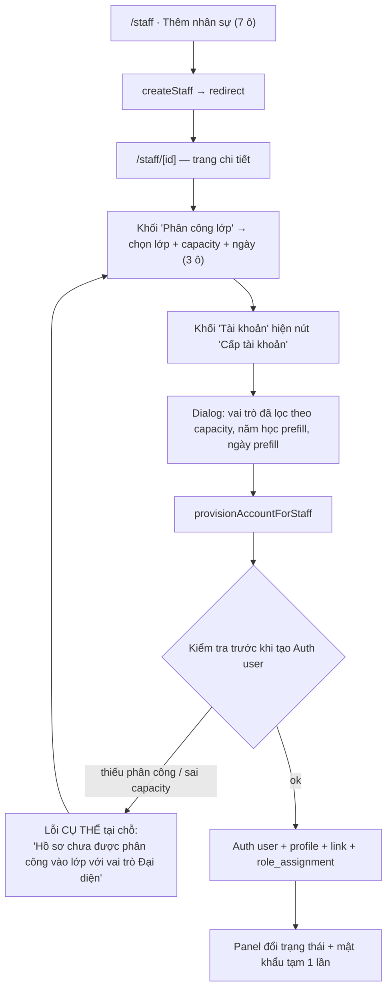

# M01-AUTH-ACCOUNT — Thiết kế To-Be

Chỉ viết cho các luồng **NEEDS_IMPROVEMENT / CRITICAL** trong `03_AUDIT_RESULTS.md`.
Các luồng PASS (F01, F05, F06) **giữ nguyên**.

---

## TB-01 — Cấp tài khoản cho Giáo lý viên ngay tại hồ sơ (thay M01-F03 + M04-F02/F04)

> Đây là trọng tâm user nêu đích danh. Có **2 phương án**; kèm phần phản biện ở §TB-01.7.

### TB-01.1 Mục tiêu người dùng

“Tôi thêm một Huynh trưởng mới. Tôi muốn nhập thông tin **một lần**, ở **một chỗ**, rồi cấp cho người ta tài khoản đăng nhập mà không phải nhớ đi sang trang khác.”

### TB-01.2 Actor

- **Người tạo hồ sơ & phân công:** `super_admin`, `group_leader`, `deputy_group_leader`, `secretary` (đúng `can_global_write()`, `20260715000100:170-180`).
- **Người bấm “Cấp tài khoản”:** **chỉ `super_admin`** (giữ nguyên `docs/05-permission-matrix.md:187`). Xem phản biện §TB-01.7 về việc nới quyền.

### TB-01.3 Điểm bắt đầu

`/staff` → nút “Thêm nhân sự” → sau khi lưu thành công **điều hướng thẳng tới `/staff/[staffId]`** (trang chi tiết mới, đã có trong `docs/06-ui-ux-spec.md:103` nhưng chưa triển khai).

### Phương án A — “Hồ sơ là trung tâm” (khuyến nghị)

Tạo `/staff/[staffId]` làm nơi duy nhất chứa mọi thao tác về một GLV. `/admin` giữ lại `AccountAdminPanel` nhưng chỉ còn vai trò **tra cứu + xử lý ngoại lệ** (tài khoản không gắn hồ sơ, khôi phục sự cố).

**Bước To-Be:**

1. `/staff` → “Thêm nhân sự” → form 7 ô như hiện tại → `createStaff` trả `{id, staffCode}` → **redirect `/staff/[id]`** kèm toast `“Đã tạo hồ sơ GLV045.”`
2. `/staff/[id]` hiển thị 4 khối:
   - **Hồ sơ** (sửa tại chỗ — kích hoạt `updateStaff` hiện đang chết, `src/features/staff/server/actions.ts:55-78`)
   - **Trạng thái phục vụ** (`service_status`: đang phục vụ / tạm nghỉ / đã nghỉ) — độc lập với tài khoản
   - **Phân công lớp** (lịch sử + nút “Phân công vào lớp” / “Kết thúc phân công”)
   - **Tài khoản đăng nhập** — 3 trạng thái hiển thị:
     - `Chưa có tài khoản` → nút **“Cấp tài khoản”** (chỉ Super Admin thấy; role khác thấy chữ “Liên hệ Super Admin để cấp tài khoản”)
     - `Đã có tài khoản GLV045 · Đang hoạt động · Chưa đổi mật khẩu lần đầu` → nút Đặt lại mật khẩu / Vô hiệu hóa / Gỡ liên kết
     - `Hồ sơ chưa gán vai trò` (role null) → cảnh báo đỏ + nút **“Gán vai trò”**
3. Bấm “Cấp tài khoản” → **dialog một bước**, đã điền sẵn từ hồ sơ và **chỉ đọc**: tên đăng nhập = `staff_code`, tên hiển thị, tên thánh, SĐT, email. Người dùng chỉ chọn:
   - **Vai trò** — dropdown **đã lọc theo phân công hiện có**:
     - có `class_staff_assignments` active capacity `representative` → chỉ cho `class_representative`
     - capacity `member` → `class_teacher`; `trainee` → `trainee_assistant`
     - không có phân công lớp → chỉ hiện role toàn cục/ngành
   - **Năm học** (prefill = năm hiện hành), **Ngành** (chỉ khi role ngành), **Ngày bắt đầu** (prefill = `starts_on` của phân công lớp)
4. Submit → `provisionAccountForStaff({staffProfileId, role, academicYearId?, sectorId?, startsOn})` — **payload gọn, không truyền username/displayName từ client nữa**.
5. Kết quả: panel “Tài khoản” đổi trạng thái ngay, mật khẩu tạm hiện một lần trong khối cảnh báo + nút “Sao chép”.

**Số bước:** As-Is 2 trang / 3 form / ≥3 submit / ~15 ô → To-Be **1 trang chi tiết / 2 form / 3 submit / 11 ô** (tạo hồ sơ 7 + phân công 3 + cấp tài khoản 1–3), **0 lần chuyển vùng menu**.

### Phương án B — “Wizard 3 bước” trong `/admin`

Giữ nguyên vị trí `/admin`, nhưng biến `AccountAdminPanel` thành wizard: Bước 1 chọn/tạo hồ sơ GLV (có thể tạo mới ngay trong wizard) → Bước 2 phân công lớp → Bước 3 chọn vai trò & tạo tài khoản.

| | Phương án A | Phương án B |
|---|---|---|
| Số trang phải nhớ | 1 (`/staff/[id]`) | 1 (`/admin`) |
| Hồ sơ GLV không cần tài khoản (Dì/Sơ dạy nhưng không dùng app) | Xử lý tự nhiên: bỏ qua khối Tài khoản | Wizard ép đi hết luồng, phải có nhánh “bỏ qua” |
| Sửa hồ sơ về sau | Có sẵn nơi để làm | Vẫn không có nơi |
| Người có quyền tạo hồ sơ (secretary) nhưng không có quyền tạo account | Thấy hồ sơ, không thấy nút — rõ ràng | Bị chặn ngay bước 1 vì cả wizard nằm trong `/admin` (super_admin only) |
| Công sức | M (thêm 1 route + tách action) | M–L (viết lại panel + state wizard) |
| Rủi ro | Thấp | Trung bình (wizard nhiều state, dễ mất dữ liệu giữa chừng) |

→ **Khuyến nghị Phương án A.** Phương án B chỉ nên chọn nếu quyết định không mở `/staff/[staffId]` trong phase này.

### TB-01.4 Business rules (To-Be)

| Mã | Phát biểu | Nơi enforce |
|---|---|---|
| BR-TB-01 | Một `staff_profiles` liên kết tối đa một `profiles` và ngược lại | đã có: `staff_profiles.profile_id unique` (`20260715000400:14`) |
| BR-TB-02 | Vai trò khả dụng khi cấp tài khoản = suy ra từ `class_staff_assignments` active, không cho người dùng tự chọn tùy ý | **mới**: server `provisionAccountForStaff` + UI lọc dropdown |
| BR-TB-03 | Nếu hồ sơ chưa có phân công lớp active thì không được chọn role lớp; báo lỗi **cụ thể trước khi tạo Auth user** | **mới**: pre-check trong action, trước `createUser` |
| BR-TB-04 | `service_status` (phục vụ) và `account_status` (đăng nhập) là hai trạng thái độc lập; đổi cái này không tự đổi cái kia | **mới**: UI hai khối riêng; giữ nguyên schema (đã tách sẵn) |
| BR-TB-05 | Chặn trùng hồ sơ: cảnh báo (không chặn cứng) khi `phone` hoặc `full_name + date_of_birth` trùng hồ sơ đang có | **mới**: query cảnh báo trong `createStaff` + index hỗ trợ |
| BR-TB-06 | Chỉ `super_admin` được tạo/xóa/khóa tài khoản | giữ nguyên (`permissions.ts:3-5`) |

### TB-01.5 Validation

- Client: giữ Zod hiện có, thêm `zodResolver` cho form tạo hồ sơ (hiện đang dùng `FormData` thô, `staff/page.tsx:52`).
- Server: `provisionAccountForStaff` **pre-check trước khi chạm Auth**:
  1. hồ sơ tồn tại và `profile_id IS NULL` → nếu không: `"Hồ sơ này đã có tài khoản <username>."`
  2. nếu role ∈ CLASS_ROLES: tồn tại `class_staff_assignments` active với capacity khớp → nếu không: `"Hồ sơ chưa được phân công vào lớp với vai trò <X>. Hãy phân công trước."`
  3. `academic_year_id` của role = `academic_year_id` của lớp → nếu không: `"Lớp thuộc năm học khác."`
- Map mã lỗi Postgres → thông báo tiếng Việt riêng biệt thay vì gộp một câu (`actions.ts:262`).

### TB-01.6 Trạng thái dữ liệu · Error handling · Audit

- Thứ tự ghi giữ nguyên (Auth → profiles → link → role_assignments) vì trigger `validate_staff_role_link` yêu cầu link tồn tại trước (`20260716000400:15-18`). Bù trừ giữ nguyên nhưng **bổ sung log** (bảng `audit_events` hoặc tối thiểu `console.error` có mã tương quan) để phát hiện auth user mồ côi.
- Mọi thao tác tài khoản (tạo/đổi username/reset/khóa/xóa/gán role) ghi audit: `actor_profile_id`, `target_profile_id`, `action`, `at`. Hiện **không có bảng nào** làm việc này.

### TB-01.7 Phản biện phương án user đề xuất

User đề xuất: *tạo hồ sơ → mở trang chi tiết → tạo/liên kết account ngay tại đó, tự điền từ hồ sơ, chặn trùng, tự liên kết, tách 2 trạng thái.*

**Đồng ý (có bằng chứng ủng hộ):**

- “Mở trang chi tiết” — đúng với `docs/06-ui-ux-spec.md:103` (`/staff/[staffId]` đã được đặc tả, chưa làm).
- “Tự điền từ hồ sơ” — **server đã làm rồi** (`actions.ts:114-128`); chỉ là UI chưa cho thấy điều đó. Chi phí thấp, lợi ích cao.
- “Tự liên kết” — cơ chế đã có và đúng (`actions.ts:190-204`).
- “Tách 2 trạng thái” — schema **đã tách sẵn**: `staff_profiles.service_status` (`20260715000400:25`) vs `profiles.account_status` (`20260715000100:47`). Vấn đề thuần UI: `service_status` không được select trong query (`src/features/staff/server/queries.ts:21`), không hiển thị, không sửa được, và bị hardcode `"active"` khi tạo (`staff/actions.ts:125`).

**Không đồng ý / cần thận trọng:**

1. **“Tạo hồ sơ và tài khoản trong MỘT bước” là sai với nghiệp vụ.** Không phải GLV nào cũng cần tài khoản: `docs/03-workflow.md:53-63` tách rõ “tạo staff profile” và “tạo account”; `staff_profiles.profile_id` là **nullable** có chủ đích (`20260715000400:14`); pgTAP đang chèn hồ sơ `profile_id = null` như trạng thái hợp lệ (`supabase/tests/005_staff_assignments_test.sql:26-30`). Dì/Sơ hoặc GLV cao tuổi có thể chỉ cần hồ sơ. → **Giữ hai bước, nhưng đặt cạnh nhau trên một trang.**
2. **“Chặn trùng” phải là cảnh báo, không phải chặn cứng.** `docs/03-workflow.md:87` cho luồng thiếu nhi ghi rõ “hệ thống cảnh báo trùng gần đúng; người nhập vẫn được tiếp tục”. Hai GLV trùng họ tên là chuyện bình thường ở giáo xứ. Số điện thoại cũng có thể dùng chung trong gia đình. → **Cảnh báo mềm + yêu cầu xác nhận**, không thêm unique constraint trên `phone`.
3. **“Gộp trang chi tiết vào một form duy nhất” sẽ phá mô hình quyền.** `/staff` mở cho toàn bộ `STAFF_ROLES` đọc (`route-map.ts:28`), `/admin` chỉ super_admin (`:47`). Nếu đặt nút “Cấp tài khoản” trên `/staff/[staffId]`, trang đó **phải render có điều kiện theo role** và server action vẫn phải tự authorize — không được dựa vào việc ẩn nút (`AGENTS §5`).
4. **Không được để trang chi tiết làm rò dữ liệu.** `staff_profiles` RLS dùng `app.can_access_staff(id)` (`20260715000400:243-260`): một `class_teacher` **được đọc hồ sơ đồng nghiệp cùng lớp**. Trang chi tiết mới không được hiển thị `date_of_birth`, `address`, `email` cho mọi người đọc được; phải giới hạn theo `can_global_read()` giống cách `docs/05:167,174` xử lý dữ liệu nhạy cảm của thiếu nhi. Đây là **rủi ro mới do chính To-Be sinh ra**, phải xử lý trong thiết kế.

**Rủi ro bảo mật nếu nới quyền tạo account ra ngoài Super Admin:**

| Rủi ro | Vì sao nghiêm trọng ở hệ thống này |
|---|---|
| **Leo thang đặc quyền** | `adminProvisionAccount` dùng **service role** (`actions.ts:111`, `admin.ts:13-24`) — bypass toàn bộ RLS. Ai gọi được nó là gián tiếp có quyền ghi bất kỳ bảng nào mà action chạm tới. Hiện chỉ `super_admin` (`actions.ts:39`). Nới cho `secretary` = trao quyền tạo `role_assignments` với **role tùy ý**, kể cả `super_admin`, vì schema không cấm role nào ở tầng action. |
| **Không có “role ceiling”** | `provisionAccountSchema.role` là `z.enum(APP_ROLES)` (`schemas.ts:27`) — 14 role, **không giới hạn theo role của người thao tác**. Nếu nới quyền mà không thêm rào “không được cấp role cao hơn hoặc bằng chính mình”, một `group_leader` có thể tự cấp cho mình một tài khoản `super_admin` thứ hai. |
| **Bỏ qua kiểm soát “không sửa được Super Admin”** | `requireManageableAccount` chặn target super_admin (`actions.ts:57-59`) nhưng **`adminProvisionAccount` không dùng hàm đó** — nó chỉ gọi `requireSuperAdmin()` (`:105`). Tức là hiện tại **tạo mới** một `super_admin` là hợp lệ và không bị chặn. Với 1 Super Admin đây là chấp nhận được; với 4 người có quyền tạo account, đây là lỗ hổng. |
| **Mật khẩu tạm là kênh chiếm tài khoản** | Mật khẩu hiển thị plaintext một lần (`account-admin-panel.tsx:163`). Người cấp tài khoản **luôn biết mật khẩu đầu tiên** của người khác. Cộng với việc `changeOwnPassword` không hỏi mật khẩu cũ (5W-04), người cấp có thể đăng nhập trước và chiếm luôn. Càng nhiều người có quyền cấp, bề mặt tấn công càng rộng. |
| **Không có audit** | Không bảng nào ghi ai tạo/xóa/khóa tài khoản. Với một người thì còn truy được trách nhiệm; với nhiều người thì **không thể điều tra**. |

**Kết luận phản biện:** nới quyền tạo tài khoản là **không nên** trong v1. Nếu buộc phải nới (ví dụ cho `group_leader` khi Super Admin vắng), điều kiện tối thiểu:
(a) thêm **role ceiling** ở Zod + server (không cấp `super_admin`, không cấp role ≥ role của actor);
(b) thêm **bảng audit** ghi mọi thao tác tài khoản;
(c) bắt buộc **mật khẩu hiện tại** khi đổi mật khẩu (đóng 5W-04);
(d) thêm pgTAP/RLS negative test cho từng role bị từ chối.

---

## TB-02 — Đăng xuất (đóng M01-F11) — P0, công sức S

Thêm `signOutAction` (`"use server"`, gọi `supabase.auth.signOut()` rồi `redirect("/login")`) và một `<form action={signOutAction}>` với nút “Đăng xuất” trong `UserMenu` (`user-menu.tsx:22` ngay dưới link Tài khoản) và trong `/account`.
Business rule: đăng xuất phải xóa cookie phiên ở response, không chỉ ở client. Error handling: kể cả khi `signOut` lỗi, vẫn redirect `/login` (fail-safe).

## TB-03 — Trang `/account` thật (đóng M01-F10) — P1, công sức S/M

Hiển thị: tên hiển thị, tên đăng nhập, vai trò hiện tại + phạm vi (lớp/ngành), trạng thái “đã đổi mật khẩu lần đầu chưa”; hành động: **Đổi mật khẩu** (link `/change-password`), **Đăng xuất**. Không cho tự sửa `username`/`role` (đúng `docs/05:48`).

## TB-04 — Đổi mật khẩu yêu cầu mật khẩu hiện tại (đóng M01-F02) — P1, công sức S

Tách hai chế độ:
- `mustChangePassword === true` → giữ nguyên form 2 ô (không hỏi mật khẩu cũ; người dùng vừa nhận mật khẩu tạm).
- `mustChangePassword === false` → thêm ô “Mật khẩu hiện tại”, xác thực bằng `signInWithPassword` với chính username của phiên trước khi `updateUser`.
Thêm rule: mật khẩu mới ≠ mật khẩu hiện tại.

## TB-05 — `assignPrimaryRole` (đóng M01-F12) — P0, công sức M

Server action **Super-Admin-only**: nhận `{profileId, role, academicYearId?, sectorId?, classId?, startsOn}`; trong **một RPC transaction**:
1. `update role_assignments set is_active=false, ends_on = startsOn - 1 day where profile_id = ? and is_active`
2. `insert into role_assignments (...) values (..., is_active = true)`
Cả hai trigger hiện có (`validate_role_assignment_scope`, `validate_staff_role_link`, `validate_ownership_link`) tự động là chốt chặn. Phải là RPC `security definer` chứ không phải 2 lần gọi từ Node, nếu không unique index `one_active_per_profile` sẽ khiến thứ tự sai gây lỗi và để lại trạng thái “không role”.
UI: nút “Đổi vai trò” trên `/staff/[staffId]` và trên thẻ tài khoản ở `/admin`.

## TB-06 — Tăng chất lượng luồng quản trị còn lại — P1/P2, công sức S

| Luồng | Thay đổi |
|---|---|
| M01-F04 đổi username | Cảnh báo khi username mới lệch `staff_code`; confirm dialog; giữ nút “Hủy”. |
| M01-F07 khóa/mở | Thêm confirm; bù trừ khi bước 2 lỗi (giống F04 đã làm); cân nhắc bỏ hẳn `locked` khỏi enum hoặc bổ sung UI cho nó (**NEEDS_CONFIRMATION**, Q4). |
| M01-F08 xóa | Confirm bằng cách gõ lại tên đăng nhập; ghi audit; **quyết định về cascade lịch sử role** (Q3). |
| M01-F09 danh sách | Thêm ô tìm kiếm + lọc theo role/trạng thái + phân trang; Việt hóa badge trạng thái; hiện cờ “chưa đổi mật khẩu lần đầu”. |

---

## So sánh số bước tổng hợp

| Nghiệp vụ | As-Is | To-Be (PA A) |
|---|---|---|
| Cấp tài khoản cho 1 GLV lớp | 2 trang · 3 form · 3 submit · ~15 ô · 0 gợi ý thứ tự | 1 trang chi tiết · 2 form · 3 submit · 11 ô · thứ tự hiển thị rõ |
| Đổi lớp cho 1 GLV (giữ tài khoản) | **Không làm được** (mất role vĩnh viễn) | 2 thao tác trên `/staff/[id]`: Kết thúc phân công → Phân công mới → nút “Cập nhật vai trò” gợi ý sẵn |
| Đăng xuất | **Không làm được** | 2 chạm |
| Người dùng tự đổi mật khẩu | gõ tay URL `/change-password` | 2 chạm từ `UserMenu` |

## Ảnh hưởng module khác / API / DB

Xem `07_IMPLEMENTATION_IMPACT.md`.

## Rủi ro migration & kế hoạch rollback

- **Không cần migration schema bắt buộc** cho TB-01/02/03/04/06 — tất cả là tầng ứng dụng. `service_status` và `account_status` đã tách sẵn ở DB.
- **Cần migration** cho: TB-05 (RPC `assign_primary_role`), bảng audit (mới), và quyết định về cascade `role_assignments` (Q3 — nếu đổi sang `on delete set null` thì phải cho phép `profile_id` nullable, ảnh hưởng RLS `role_assignments_select_self_or_global`; **rủi ro cao, cần chốt trước khi làm**).
- **Rollback:** TB-01..04, TB-06 là thay đổi UI/action → revert commit là đủ, không có dữ liệu bị biến đổi. TB-05 tạo dữ liệu `role_assignments` mới có `is_active=false` cho bản ghi cũ → rollback cần script đảo ngược theo `updated_at`; giữ RPC nhưng thu hồi `grant execute` là cách dừng nhanh.
