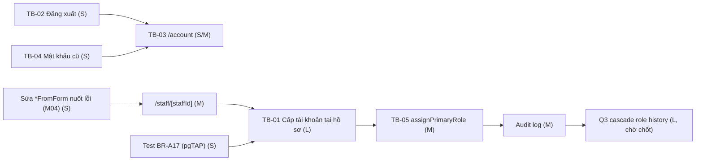

# M01-AUTH-ACCOUNT — Ảnh hưởng triển khai To-Be

Ước lượng: **S** ≤ 0,5 ngày · **M** 1–2 ngày · **L** > 2 ngày.

## 1. Bảng tổng hợp theo To-Be

| To-Be | File phải sửa/thêm | Server Action / RPC | Schema / Migration | RLS | Dữ liệu hiện có | Test phải thêm | Công sức |
|---|---|---|---|---|---|---|---|
| **TB-02** Đăng xuất | `src/features/auth/server/actions.ts` (+`signOutAction`); `src/components/layout/user-menu.tsx` | +1 action | Không | Không | Không ảnh hưởng | E2E: đăng nhập → đăng xuất → `/dashboard` chuyển về `/login` | **S** |
| **TB-04** Đổi mật khẩu cần mật khẩu cũ | `src/features/auth/schemas.ts`; `src/features/auth/server/actions.ts:88-101`; `src/features/auth/components/change-password-form.tsx`; `src/app/(auth)/change-password/page.tsx` (truyền `mustChangePassword`) | sửa `changeOwnPassword` | Không | Không | Không | unit: schema 2 chế độ; E2E: sai mật khẩu cũ bị từ chối | **S** |
| **TB-03** `/account` thật | `src/app/(dashboard)/account/page.tsx` (viết mới); dùng lại `getAuthContext` | Không (chỉ query) | Không | Không | Không | E2E: 3 audience mở `/account` thấy đúng role của mình | **S/M** |
| **TB-06** Chất lượng luồng quản trị | `src/features/auth/components/account-admin-panel.tsx`; `src/features/auth/server/queries.ts` (thêm `must_change_password`, phân trang); `src/features/auth/server/actions.ts:359-374` (bù trừ) | sửa 2 action | Không | Không | Không | unit: bù trừ khi `profiles.update` lỗi; E2E: tìm kiếm/lọc | **M** |
| **TB-05** `assignPrimaryRole` | `supabase/migrations/<new>_assign_primary_role.sql`; `src/features/auth/schemas.ts`; `src/features/auth/server/actions.ts`; UI ở `/staff/[staffId]` + `/admin` | **+1 RPC `security definer`** + 1 action | **Có** — RPC mới, không đổi bảng | Chỉ `grant execute to authenticated` + tự kiểm `app.is_super_admin()` bên trong | Không đổi dữ liệu cũ | pgTAP: đổi role atomic, giữ đúng 1 active; RLS negative: non-SA gọi RPC bị `42501`; E2E: đổi lớp GLV vẫn đăng nhập được | **M** |
| **TB-01** Cấp tài khoản tại hồ sơ | **Xem §2** | tách `adminProvisionAccount` | Không bắt buộc | Cần xem lại hiển thị field nhạy cảm | Không | **Xem §4** | **L** |
| Audit log (điều kiện bắt buộc nếu nới quyền) | `supabase/migrations/<new>_account_audit.sql`; mọi action trong `auth/server/actions.ts` | +1 bảng | **Có** — bảng `account_audit_events` | policy SELECT cho `can_global_read()` hoặc chỉ SA | Không | pgTAP: RLS bảng audit; unit: action ghi audit | **M** |
| Q3 — cascade lịch sử role | `supabase/migrations/<new>` đổi FK | — | **Có, rủi ro cao** | `role_assignments_select_self_or_global` phải xử lý `profile_id NULL` | **Ảnh hưởng dữ liệu hiện có** | pgTAP đầy đủ | **L** — chỉ làm sau khi chốt Q3 |

## 2. TB-01 — chi tiết file phải sửa

| File | Việc |
|---|---|
| `src/app/(dashboard)/staff/[staffId]/page.tsx` | **Tạo mới**. Server component, guard `requireRouteAccess("/staff")`, render 4 khối (hồ sơ / trạng thái phục vụ / phân công / tài khoản). Render khối “Tài khoản” chỉ khi `canManageAccounts(context.role)`; **server action vẫn phải tự authorize** |
| `src/features/staff/server/queries.ts` | Thêm `getStaffDetail(staffId)`: select thêm `service_status`, `profile_id`, join `profiles(username, account_status, must_change_password)` và `role_assignments(role, is_active)`; xử lý `staffId` không phải UUID → trả `null` (không để 500) |
| `src/features/staff/server/queries.ts:21` | Thêm `service_status` và `profile_id` vào query danh sách để `/staff` hiện cột “Trạng thái phục vụ” và “Tài khoản” |
| `src/features/staff/server/actions.ts:115-140` | Đổi 3 wrapper `*FromForm` từ `Promise<void>` sang trả kết quả (hoặc dùng `useActionState`) — hiện đang **nuốt toàn bộ lỗi** |
| `src/features/staff/server/actions.ts:32-53` | `createStaff` trả `{id, staffCode}` (đã có) → page redirect tới `/staff/[id]`; thêm cảnh báo trùng SĐT/họ tên+ngày sinh |
| `src/features/auth/server/actions.ts:103-270` | Tách `adminProvisionAccount` thành: `provisionAccountForStaff`, `provisionAccountForGuardian`, `provisionAccountForStudent`, `provisionStandaloneAccount`. Bổ sung **pre-check** trước khi gọi `createUser`. Map mã lỗi trigger → thông báo riêng |
| `src/features/auth/schemas.ts:21-63` | Tách `provisionAccountSchema` theo 4 biến thể (discriminated union) — hiện `superRefine` 28 dòng khó test và khó mở rộng |
| `src/features/auth/server/queries.ts:35` | Query hồ sơ GLV cho dropdown phải join `class_staff_assignments` active để **thực sự lọc theo lớp/capacity** như placeholder đang hứa (`account-admin-panel.tsx:158`) |
| `src/features/auth/components/account-admin-panel.tsx` | Thu hẹp vai trò: giữ danh sách tài khoản + xử lý ngoại lệ; chuyển phần “tạo tài khoản GLV” sang trang chi tiết |
| `src/config/navigation.ts` | Không cần đổi (`/staff/[id]` khớp prefix `/staff`) |
| `src/lib/permissions/route-map.ts` | Không cần đổi (`getRouteRule` đã match prefix, `:53`) |

## 3. Ảnh hưởng module khác

| Module | Ảnh hưởng | Mức |
|---|---|---|
| **M04-STAFF** | Nhận toàn bộ trang chi tiết mới; `updateStaff` (đang chết) được kích hoạt; `service_status` được đưa vào UI | Cao — **phải làm cùng lúc**, không tách được |
| **M02-ACADEMIC-STRUCTURE** | Dropdown năm học/lớp cần prefill năm hiện hành; query lớp hiện lấy `status='active'` không lọc theo năm (`staff/server/queries.ts:22`) | Trung bình |
| **M03-STUDENTS-GUARDIANS** | Nếu áp cùng mô hình “cấp tài khoản tại hồ sơ” cho guardian/student thì cần trang chi tiết tương ứng (`/students/[studentId]` đã tồn tại) | Trung bình |
| **M14-NAVIGATION-SHELL** | Thêm nút Đăng xuất vào `UserMenu`; `/account` hết là placeholder | Thấp |
| **M05..M13** | Không đổi trực tiếp. Nhưng TB-05 (`assignPrimaryRole`) sửa `role_assignments` → **ảnh hưởng gián tiếp mọi RLS** qua `app.current_role()`; bắt buộc chạy lại toàn bộ pgTAP RLS | Cao (rủi ro hồi quy) |

## 4. Test phải thêm

**pgTAP (`supabase/tests/`)**

1. `003_auth_account_flows_test.sql` — bổ sung **hành vi**: `complete_password_change()` với account `disabled` phải raise `42501`; với `auth.uid()` null phải raise.
2. `007_account_identity_links_test.sql` — bổ sung nhánh **role lớp**: insert `role_assignments` role `class_teacher` khi (a) chưa có `class_staff_assignments` → `23514 ACTIVE_CLASS_ASSIGNMENT_REQUIRED`; (b) có nhưng sai capacity → `23514`; (c) đúng → `lives_ok`. Đây là BR-A17 hiện **hoàn toàn không có test**.
3. File mới `0xx_assign_primary_role_test.sql` — RPC đổi role: giữ đúng 1 active, `ends_on` bản cũ hợp lệ, non-SA bị `42501`, đổi sang role lớp không có phân công bị chặn.
4. `004_identity_rls_test.sql` — bổ sung `account_status = 'locked'` (nếu giữ giá trị này).

**Unit (`tests/unit/`)**

5. `auth-schemas.test.ts` — nhánh `STAFF_PROFILE_ROLES` bắt buộc `staffProfileId`; “role toàn cục không nhận scope”; role không phải guardian/student mà truyền `guardianId`/`studentId` bị từ chối.
6. `auth-aliases.test.ts` — va chạm namespace: `GLV12` (2 chữ số) rơi vào namespace `accounts` chứ không phải `staff` — xác nhận đây là hành vi mong muốn.
7. `staff-schemas.test.ts` — `updateStaffSchema` partial; `serviceStatus` các giá trị.

**E2E (`tests/e2e/`)**

8. `security.spec.ts` — non-SA (GLV901 là `group_leader`) mở `/admin` phải về `/access-denied`; mở `/staff/<uuid-rác>` không 5xx.
9. File mới `account-admin.spec.ts` — SA tạo tài khoản GLV happy path; tạo lại cho hồ sơ đã có account bị chặn; vô hiệu hóa rồi đăng nhập bị từ chối; đăng xuất.
10. `authenticated-shell.spec.ts` — thêm `/admin` và `/staff/[id]` vào vòng kiểm 3 viewport.

## 5. Thứ tự phụ thuộc (đề xuất)

**Giải thích thứ tự**

1. **TB-02, TB-04** làm trước vì độc lập, rủi ro gần 0, và đóng hai lỗ hổng bảo mật cộng hưởng.
2. **Sửa `*FromForm` nuốt lỗi** phải làm trước mọi việc khác ở M04 — nếu không, mọi thay đổi tiếp theo vẫn im lặng khi thất bại và không thể kiểm thử.
3. **`/staff/[staffId]`** là hạ tầng cho TB-01; làm trước, ban đầu chỉ hiển thị + `updateStaff`.
4. **Test BR-A17 (pgTAP)** làm **trước** TB-01 để có lưới an toàn cho phần pre-check.
5. **TB-05** sau TB-01 vì cần chỗ đặt nút (“Đổi vai trò” trên trang chi tiết).
6. **Audit log** trước khi bàn tới bất kỳ việc nới quyền nào.
7. **Q3** cuối cùng, chỉ khi user chốt.
