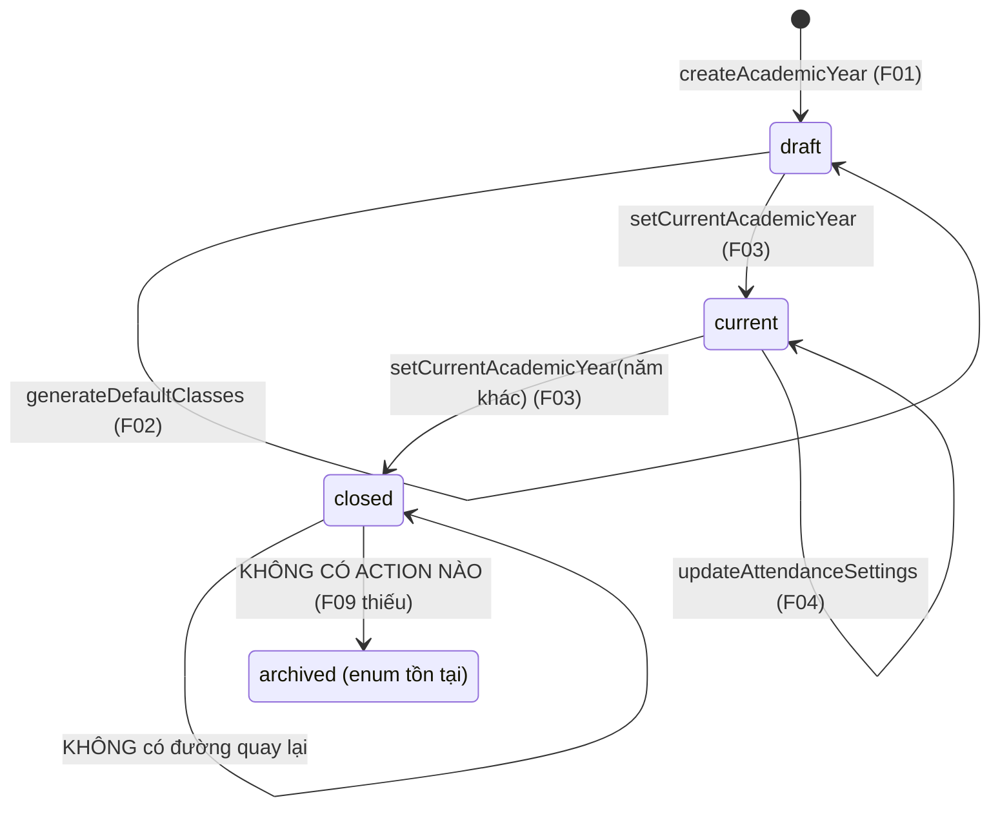
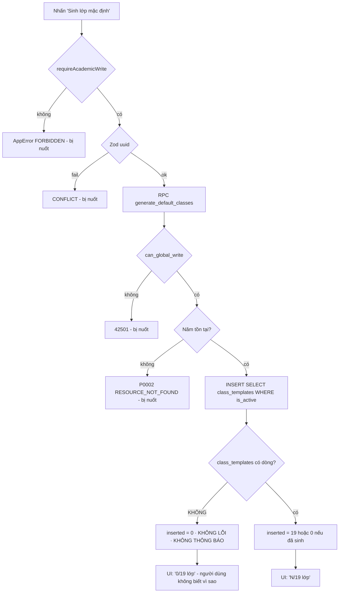

# M02 — ACADEMIC STRUCTURE · As-Is Flows

Tổng: **11 luồng** (`M02-ACADEMIC-STRUCTURE-F01` … `F11`).

---

## Sơ đồ tổng thể vòng đời năm học (As-Is)

---

## F01 — Tạo năm học (draft)

- **Actor:** `super_admin` (route), `super_admin`/`group_leader`/`deputy_group_leader`/`secretary` (action).
- **Precondition:** đăng nhập, `account_status='active'`, `must_change_password=false`.
- **Màn hình:** `/admin` → card "Tạo năm học" (`src/app/(dashboard)/admin/page.tsx:68-110`).

### Bước As-Is

1. Guard route: `requireRouteAccess("/admin")` → `admin/page.tsx:23`; không phải `super_admin` → redirect `/access-denied` (`src/lib/auth/guards.ts:19`).
2. Nhập `code`, `name`, `startDate`, `endDate`, `attendanceLockDays`, `attendanceEditLeaseMinutes`, `top5Enabled` (`admin/page.tsx:74-107`).
3. Validation client: `required`, `pattern="[0-9]{4}-[0-9]{4}"` trên `code` (`admin/page.tsx:77`), `type="number" min/max` (`:96,:100`). **Không có kiểm `endDate > startDate` phía client.**
4. Submit → `createAcademicYearFromForm` (`academic-years/server/actions.ts:146-156`) → ép kiểu thô từ `FormData`, `top5Enabled` = `on` checkbox (`:152`).
5. Server: `requireAcademicWrite()` (`actions.ts:29` → `permissions.ts:14-20`).
6. Zod: `academicYearInputSchema.parse` (`actions.ts:30` → `schemas.ts:5-16`) — regex code, `endDate > startDate`.
7. Tính `retention_until = end_date + 5 năm` (`actions.ts:32`).
8. Insert `academic_years` với `status='draft'`, `updated_by = actor.profileId` (`actions.ts:33-44`).
9. RLS `academic_years_insert_global_write` (`20260715000200_academic_structure.sql:281-287`): `can_global_write()` ∧ `updated_by = auth.uid()` ∧ `status <> 'current'` → thỏa.
10. CHECK DB: `code ~ '^[0-9]{4}-[0-9]{4}$'` (`:8`), `end_date > start_date` (`:20`), `retention_until >= end_date` (`:21`).
11. Trigger `academic_years_seed_attendance_weights` (`20260721000500_attendance_alerts_and_score.sql:74-77`) tạo `attendance_weight_settings`.
12. Trigger `academic_years_seed_assessment_types` (`20260722000400_assessments_gradebooks.sql:53-55`) tạo `assessment_type_settings`.
13. `revalidatePath("/admin")` (`actions.ts:46`), trả `{ok:true,{id}}`.
14. **Adapter `createAcademicYearFromForm` bỏ giá trị trả về → UI không hiện thông báo nào** (`actions.ts:146-156`).

### Trạng thái cuối
`academic_years` có 1 dòng `status='draft'`, kèm 1 dòng `attendance_weight_settings` và N dòng `assessment_type_settings`.

### Thông báo cho user
**Không có.** Trang tự render lại; người dùng suy đoán thành công bằng cách nhìn danh sách.

### Error path
| Tình huống | Hành vi As-Is |
|---|---|
| `code` trùng | Insert lỗi `23505` → `AppError("CONFLICT")` (`actions.ts:45`) → **nuốt, im lặng** |
| `endDate <= startDate` | ZodError → `catch` → `failure()` (`actions.ts:22-25`) → `CONFLICT` (không phải `VALIDATION_ERROR`) → **nuốt** |
| Không đủ quyền | `AppError("FORBIDDEN")` → **nuốt**; form vẫn hiển thị |
| Ngày rỗng | Regex ISO fail → như trên |

---

## F02 — Sinh 19 lớp mặc định

- **Actor:** như F01.
- **Precondition:** đã có ít nhất 1 năm học; `class_templates` phải có dữ liệu.
- **Màn hình:** `/admin` → nút "Sinh lớp mặc định" trên **mỗi** dòng năm học (`admin/page.tsx:52-55`).

### Bước As-Is

1. Nút submit form ẩn chứa `academicYearId` (`admin/page.tsx:53`).
2. `generateDefaultClassesFromForm` (`actions.ts:162-164`) → `generateDefaultClasses` (`actions.ts:70-85`).
3. `requireAcademicWrite()` (`:72`), Zod `academicYearIdSchema` uuid (`:73`).
4. RPC `supabase.rpc("generate_default_classes")` (`:75-77`).
5. DB (`20260716000300_canonical_19_classes.sql:89-117`):
   - `app.can_global_write()` sai → `42501 FORBIDDEN` (`:98-100`);
   - năm không tồn tại → `P0002 ACADEMIC_YEAR_NOT_FOUND` (`:101-103`);
   - `insert ... select from class_templates where is_active on conflict do nothing` (`:105-112`);
   - `get diagnostics inserted_count = row_count` (`:114`).
6. Trigger `classes_validate_section` (`:84-86`) kiểm A/B theo `grade_levels.allows_sections`.
7. Unique `classes_year_grade_section_idx` (`20260715000200:102-103`) + `classes_one_trainee_per_year_idx` (`20260716000300:42-43`) khiến lần chạy thứ hai trả `0` — idempotent (test `008:45-48`).
8. `revalidatePath("/admin")`, `revalidatePath("/classes")` (`actions.ts:79-80`).
9. Trả `{inserted}` — **adapter vứt bỏ** (`actions.ts:162-164`).

### Trạng thái cuối
19 dòng `classes` cho năm đó (nếu seed đủ), hoặc **0 dòng nếu `class_templates` rỗng**.

### Error path / Edge case — điểm nóng

| Tình huống | Hành vi As-Is | Bằng chứng |
|---|---|---|
| **`class_templates` rỗng** | `insert ... select` chèn 0 dòng, `row_count = 0`, hàm trả `0`, **không exception**, UI không báo gì | `20260716000300:105-114`; đã xảy ra thật `WORKLOG.md:95-100` |
| Sinh lớp cho năm `closed`/`archived` | **Được phép** — hàm chỉ kiểm năm tồn tại (`:101`), không kiểm `status` | `20260716000300:101-103`; nút hiện trên mọi dòng (`admin/page.tsx:52`) |
| Chạy lần 2 | Trả `0` (idempotent) — **không phân biệt được với trường hợp template rỗng** | `008:45-48` |
| Chỉ một phần template `is_active=false` | Sinh thiếu lớp, không cảnh báo | `20260716000300:111` |
| `academicYearId` không phải UUID | Zod fail → `CONFLICT` → nuốt | `actions.ts:73` |

---

## F03 — Đặt năm học hiện hành

- **Actor:** `super_admin` (route + action), `group_leader` (action, không vào được route).
- **Precondition:** năm học ở trạng thái `draft` (UI) hoặc `draft`/`current` (RPC).
- **Màn hình:** `/admin` → nút "Đặt hiện hành", **chỉ hiện khi `year.status === 'draft'`** (`admin/page.tsx:56-61`).

### Bước As-Is

1. `setCurrentAcademicYearFromForm` (`actions.ts:158-160`) → `setCurrentAcademicYear` (`actions.ts:53-68`).
2. `requireSetCurrentYear()` — chỉ `super_admin`/`group_leader` (`permissions.ts:22-28`).
3. Zod uuid (`actions.ts:56`).
4. RPC `set_current_academic_year` (`20260715000200:234-261`):
   - kiểm `app.current_role() in ('super_admin','group_leader')` → `42501` (`:241-243`);
   - `perform 1 from public.academic_years for update;` — **khóa toàn bộ dòng** để chống race (`:245`);
   - năm không tồn tại hoặc không ở `draft`/`current` → `P0002` (`:246-251`);
   - đóng năm `current` cũ (`:253-255`);
   - đặt năm đích thành `current` (`:257-259`).
5. Unique partial index `academic_years_one_current_idx` (`:24-25`) là chốt chặn cuối.
6. `revalidatePath("/admin")`, `revalidatePath("/classes")` (`actions.ts:62-63`).

### Trạng thái cuối
Đúng một năm `current`; năm cũ thành `closed`.

### Error path

| Tình huống | Hành vi |
|---|---|
| Hai request đồng thời | `for update` (`:245`) serial hóa; index unique là chốt cuối → an toàn |
| Năm đã `closed` | RPC `P0002` → `RESOURCE_NOT_FOUND` → **nuốt**; UI cũng đã ẩn nút (`admin/page.tsx:56`) |
| Đặt hiện hành khi **chưa sinh lớp** | **Được phép** — không có kiểm nào, trái WF-01 bước 8 ("chỉ khi dữ liệu sẵn sàng") | `20260715000200:234-261` |
| Muốn quay lại năm cũ | **Không thể** — `closed` không nằm trong `('draft','current')` (`:248-249`) và nút bị ẩn |

---

## F04 — Cấu hình điểm danh theo năm học

- **Actor:** `super_admin` (route).
- **Precondition:** tồn tại năm học `current`.
- **Màn hình:** `/admin` → card "Cấu hình điểm danh" (`admin/page.tsx:112-154`).

### Bước As-Is

1. `getCurrentAttendanceSettings()` (`academic-years/server/queries.ts:37-48`) — `status='current'`, `maybeSingle`.
2. Nếu `null` → empty state "Chưa có năm học hiện hành…" (`admin/page.tsx:121-124`). ✔ Empty state có.
3. Form 5 trường + `academicYearId` ẩn (`:127-149`), `min/max` khớp Zod.
4. `updateAttendanceSettingsFromForm` (`actions.ts:135-144`) → `updateAttendanceSettings` (`:107-133`).
5. Zod `attendanceSettingsSchema` (`schemas.ts:22-29`), giới hạn khớp CHECK migration (`20260721000500:19-24`).
6. `%` → tỷ lệ 0..1 (`actions.ts:122`).
7. `UPDATE academic_years ... .eq("id", parsed.academicYearId)` (`:114-125`).
8. RLS `academic_years_update_global_write` (`20260715000200:288-295`): USING `can_global_write()`, WITH CHECK thêm `status <> 'current' or current_role() in ('super_admin','group_leader')`.

### Edge case đáng chú ý

| Tình huống | Hành vi |
|---|---|
| `secretary`/`deputy_group_leader` sửa cấu hình năm `current` | Action cho phép (`permissions.ts:7-12`) nhưng **RLS WITH CHECK từ chối** (`:294`) → `42501` → `FORBIDDEN` → nuốt. Hiện chưa lộ vì `/admin` chỉ cho `super_admin` |
| RLS chặn / id không tồn tại | `.update().eq()` **không lỗi, 0 dòng** → action trả `ok:true` → **báo thành công sai** (`actions.ts:126-129`) |
| Sửa cấu hình năm `draft` | Không có UI (form chỉ gắn với năm `current`) |

---

## F05 — Xem danh sách năm học

- **Actor:** `super_admin`.
- **Màn hình:** `/admin` card "Năm học" (`admin/page.tsx:34-66`).

1. `listAcademicYears()` (`queries.ts:12-23`) — `select ... classes(count)` sắp xếp `start_date desc` (`:18`).
2. Lỗi query → **trả `[]` im lặng** (`:19`) → UI hiển thị y hệt trạng thái "chưa có năm học" (`admin/page.tsx:40-41`).
3. Render: tên, `code`, khoảng ngày **định dạng ISO thô** `2026-09-01 → 2027-05-31` (`:47`), `classCount/19` với **19 hardcode** (`:47`), badge `status` bằng **chuỗi tiếng Anh thô** `draft/current/closed/archived` (`:49`).

**Empty state:** có (`admin/page.tsx:40-41`).

---

## F06 — Xem danh sách lớp theo ngành

- **Actor:** 12 role staff (`route-map.ts:27`).
- **Màn hình:** `/classes` (`src/app/(dashboard)/classes/page.tsx:25-90`).

1. `getClassesPageData()` (`classes/server/queries.ts:56-104`) → `requireRouteAccess("/classes")` (`:57`).
2. Lấy năm `current` (`:60-64`); không có → trả `year:null` → empty state "Chưa có năm học hiện hành…" (`classes/page.tsx:28-41`). ✔
3. Query lớp + `grade_levels(sectors(...))` + `class_staff_assignments` + `enrollments(status)` (`:70-77`), lọc `academic_year_id = year.id` (`:75`) → **không rò dữ liệu năm khác**.
4. `toCard` (`:42-54`): sĩ số = enrollment `active`/`paused`; GLV đại diện = `capacity='representative'` và `is_active`; `staffCount` = số assignment `is_active`.
5. Phân nhóm theo ngành, sắp xếp `sectors.sort_order` (`:82-101`); lớp `class_kind='trainee'` **hoặc thiếu quan hệ ngành** rơi vào nhóm "Dự trưởng" (`:83-86`).
6. Render section theo ngành + section Dự trưởng (badge "Học kỳ 1") (`classes/page.tsx:47-73`).
7. Empty state khi không có lớp nào (`classes/page.tsx:75-86`) — dẫn người dùng sang `/admin`. ✔

### Edge case

| Tình huống | Hành vi |
|---|---|
| Lớp `status='inactive'`/`closed` | **Vẫn hiển thị y hệt lớp active** — `status` được `select` (`:73`) nhưng không dùng ở `toCard` |
| Lớp catechism thiếu `grade_levels` | Bị gom nhầm vào nhóm "Dự trưởng" (`:83`) |
| Treasurer/Cha sở | Thấy đầy đủ tên lớp; sĩ số = 0 vì RLS `enrollments` chặn (`20260721000200:145-152`) → **hiển thị "Sĩ số: 0" gây hiểu nhầm** |
| Lớp Dự trưởng ngoài HK1 | Vẫn hiển thị quanh năm; badge "Học kỳ 1" chỉ là nhãn tĩnh (`classes/page.tsx:65`) |
| Không có filter/search | Trang đổ toàn bộ 19 lớp |

---

## F07 — Xem chi tiết lớp

- **Actor:** 12 role staff.
- **Màn hình:** `/classes/[classId]` (`src/app/(dashboard)/classes/[classId]/page.tsx:16-125`).

1. `getClassDetail(classId)` (`classes/server/queries.ts:118-193`) → `requireRouteAccess('/classes/{id}')` (`:123`); `getRouteRule` khớp tiền tố `/classes` (`route-map.ts:50-54`).
2. `canManage = canManageEnrollments(role)` (`:124` → `enrollments/permissions.ts:6-17`) — 6 role.
3. Query lớp + năm học + ngành + đội ngũ + roster (`:127-134`).
4. `data` rỗng (không tồn tại, RLS chặn, **hoặc UUID sai cú pháp**) → `classDetail: null` → `notFound()` (`page.tsx:19`) → **404, không 500** ✔ (E2E `tests/e2e/security.spec.ts:50-51`).
5. Roster: lọc `OPEN_STATUSES` (`:149`), sắp xếp `localeCompare(...,"vi")` (`:158`).
6. Đội ngũ: lọc `is_active` (`:187`).
7. `availableStudents` chỉ tính khi `canManage` (`:161-174`): lấy mọi enrollment `active`/`paused` trong năm của lớp rồi loại trừ khỏi danh sách `students` có `status='active'`.

### Edge case

| Tình huống | Hành vi |
|---|---|
| **Lớp của năm học cũ** | Mở được bình thường — `getClassDetail` **không lọc `academic_year_id`** (`:127-134`); form ghi danh vẫn hiển thị |
| Lớp `status <> 'active'` | Trang không hiển thị trạng thái lớp; form ghi danh vẫn render, chỉ bị chặn ở action (`enrollments/server/actions.ts:42`) |
| `availableStudents` với 900 em | Kéo **toàn bộ** bảng `students` + toàn bộ enrollment mở của năm (`:162-169`), render vào `<select>` không tìm kiếm |
| Không có quyền xem em nào | Roster rỗng → "Lớp chưa có thiếu nhi ghi danh." (`page.tsx:43`) — **thông điệp sai** với treasurer/Cha sở (thực tế là bị chặn quyền) |
| Đội ngũ rỗng | "Chưa phân công nhân sự." ✔ (`page.tsx:76`) |

---

## F08 — Sửa thông tin lớp (`updateClass`)

- **Trạng thái:** **Server action tồn tại nhưng KHÔNG có UI nào gọi.**
- Bằng chứng: `updateClass` chỉ xuất hiện ở `academic-years/schemas.ts:31-40` và `academic-years/server/actions.ts:11,87-105`; grep toàn `src/**/*.tsx` không có call site.
- Hệ quả: **không thể** đổi `status` (đóng lớp), `meeting_location`, `notes` của bất kỳ lớp nào qua giao diện.
- docs/11 §3 liệt kê `updateClass` là action bắt buộc (`docs/11-api-and-server-actions.md:36`).

### Nếu gọi trực tiếp (đường tấn công/kịch bản tương lai)

1. `requireAcademicWrite()` (`actions.ts:89`).
2. Zod whitelist 4 field (`schemas.ts:31-36`) — `academic_year_id`, `grade_level_id`, `display_name` **không sửa được** ✔ (unit test `tests/unit/academic-year-schemas.test.ts:26-35`).
3. `.update().eq("id")` (`actions.ts:92-97`) — RLS `classes_update_global_write` (`20260715000200:311-313`).
4. **RLS chặn hoặc id sai → 0 dòng, không lỗi → trả `ok:true`** (`actions.ts:98-101`).

---

## F09 — Đóng / Lưu trữ năm học (WF-16)

- **Trạng thái: KHÔNG TỒN TẠI.**

| Yêu cầu WF-16 (`docs/03-workflow.md:335-341`) | Hiện trạng |
|---|---|
| 1. Đảm bảo chuyển lớp hoàn tất | Không có kiểm tra nào |
| 2. Khóa gradebook/attendance còn mở | Không có hành động gom theo năm |
| 3. Chốt báo cáo năm | Thuộc M11, không có móc nối từ M02 |
| 4. Đặt academic year `closed` | **Chỉ xảy ra như tác dụng phụ** của F03 (`20260715000200:253-255`); không có nút "Đóng năm học" |
| 5. Không cho ghi mới trừ Super Admin | **Không được enforce ở đâu** — RLS `classes`/`enrollments` không đọc `academic_years.status` |
| 6. Xóa sau 5 năm là tác vụ có xác nhận | Cột `retention_until` được ghi (`actions.ts:32`) nhưng **không có tác vụ/UI nào đọc** |

- Enum `academic_year_status` có nhãn `'archived'` (`20260715000200:3`) nhưng **không có câu lệnh nào trong `src/` hay migration đặt giá trị này**.

---

## F10 — Đổi năm học đang xem (Academic Year Switcher)

- **Trạng thái: STUB TĨNH.**

1. `AcademicYearSwitcher` là nút `disabled`, chuỗi **"Năm học 2026–2027" hardcode**, `aria-label="Năm học hiện tại, dữ liệu mẫu"` (`src/components/layout/academic-year-switcher.tsx:5-8`).
2. Được render vô điều kiện trong header (`src/components/layout/app-header.tsx:18`).
3. `hidden ... sm:flex` (`:5`) → **không hiển thị ở 360px**.

### Đánh giá rò rỉ dữ liệu năm khác
**Không có rò rỉ**: không tồn tại cơ chế chuyển năm; mọi query đều neo cứng vào `status='current'` (`classes/server/queries.ts:60-64`) hoặc vào `academic_year_id` của lớp (`:166`).

**Nhưng có rủi ro sai thông tin**: khi năm hiện hành là 2027-2028, header vẫn in "Năm học 2026–2027" cho mọi người dùng, mọi trang.

---

## F11 — Danh mục ngành / cấp giáo lý / mẫu lớp

- **Trạng thái: chỉ có seed, không có UI, không có action.**

1. Dữ liệu nằm ở `supabase/seed.sql:5-60` (5 ngành, 13 cấp, 19 template).
2. RLS chỉ cấp `select` cho `authenticated` (`20260715000200:270`); **không cấp `insert`/`update`** → cả `super_admin` cũng không sửa được qua Data API.
3. `class_templates` bị ẩn với `guardian`/`student` (`:301-303`); `sectors`/`grade_levels` thì mọi role đọc được (`:297-300`).
4. **`supabase db push` không chạy `seed.sql`** (`WORKLOG.md:93`) → môi trường mới có bảng rỗng cho tới khi chạy seed thủ công.

### Edge case
| Tình huống | Hành vi |
|---|---|
| Cần thêm lớp ngoài 19 mẫu (ví dụ Ấu 1C) | Không có UI; phải viết SQL tay |
| `next_grade_level_id` | Nối theo `sort_order` trong seed (`seed.sql:34-37`); nếu thêm cấp mới bằng tay, chuỗi lên lớp có thể đứt — M08 phụ thuộc |
