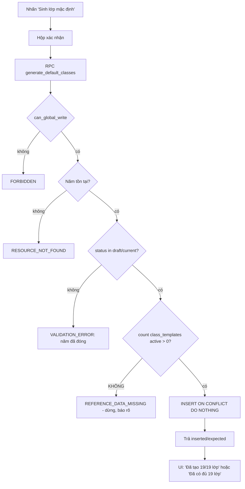
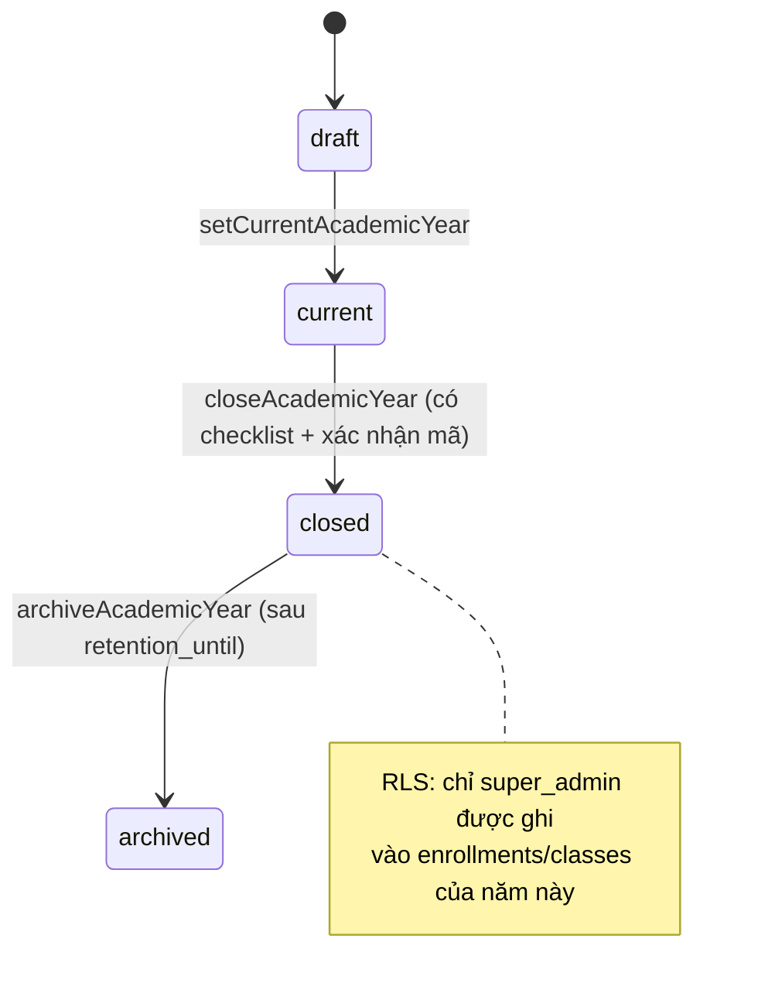

# M02 — ACADEMIC STRUCTURE · To-Be Flows

Chỉ viết To-Be cho luồng `CRITICAL` / `NEEDS_IMPROVEMENT`.
**F05, F06 (PASS_WITH_MINOR_UI_FIX) và F11 (NEEDS_CONFIRMATION) không có To-Be** — xem `06_UI_UX_RECOMMENDATIONS.md` và mục câu hỏi cuối `08_ACCEPTANCE_CRITERIA.md`.

---

## TB-F02 — Sinh 19 lớp mặc định (từ CRITICAL)

### Mục tiêu
Không bao giờ để người vận hành tin rằng cơ cấu lớp đã sẵn sàng trong khi thực tế là 0 lớp.

### Actor
`super_admin` (và các role global-write nếu quyết định mở route — xem TB-F12).

### Business rules mới
| Mã | Phát biểu |
|---|---|
| BR-M02-N01 | `generate_default_classes` **phải ném lỗi** nếu không có `class_templates` nào `is_active`. |
| BR-M02-N02 | Kết quả trả về phải phân biệt: `inserted` (số lớp mới) và `expected` (số template active). |
| BR-M02-N03 | Không được sinh lớp cho năm học có `status in ('closed','archived')`. |
| BR-M02-N04 | UI phải hiển thị `inserted/expected` và một trong ba trạng thái: *đã sinh đủ*, *đã sinh trước đó*, *thiếu danh mục*. |

### Hai phương án

#### Phương án A — Sửa RPC + trả về có cấu trúc (khuyến nghị)
1. `generate_default_classes` đổi kiểu trả về `integer` → `jsonb` (`{inserted, expected, already_present}`) hoặc thêm hàm mới `generate_default_classes_v2`.
2. Đầu hàm: `select count(*) into expected from class_templates where is_active;` → nếu `expected = 0` thì `raise exception 'CLASS_TEMPLATES_EMPTY' using errcode = 'P0002'`.
3. Thêm kiểm `status not in ('closed','archived')` → `raise ... errcode = '23514'`.
4. Action ánh xạ `CLASS_TEMPLATES_EMPTY` sang một `AppErrorCode` mới (`REFERENCE_DATA_MISSING`) với thông điệp tiếng Việt: *"Chưa có danh mục 19 lớp chuẩn. Hãy nạp dữ liệu tham chiếu trước khi sinh lớp."*
5. UI hiển thị kết quả (xem TB-F12 về kênh phản hồi).

- **Ưu:** sửa tận gốc, mọi caller (kể cả import/script) đều được bảo vệ.
- **Nhược:** đổi chữ ký hàm ⇒ phải cập nhật `types/database.ts` và pgTAP `008`.

#### Phương án B — Chỉ chặn ở tầng application
1. Server action đọc `count` của `class_templates` trước khi gọi RPC; `0` ⇒ ném `AppError` ngay.
2. RPC giữ nguyên.

- **Ưu:** không đụng migration, rủi ro thấp nhất.
- **Nhược:** RPC vẫn `grant execute to authenticated` (`20260715000200:275`) nên gọi thẳng qua Data API vẫn im lặng; không bảo vệ script/import.

**Khuyến nghị: A**, kèm B như lớp phòng thủ thứ hai.

### Bước To-Be (phương án A)
1. `/admin` → nhấn "Sinh lớp mặc định" cho một năm `draft`/`current`.
2. Xác nhận: *"Sinh cơ cấu 19 lớp chuẩn cho năm học 2026-2027?"*.
3. Server: `requireAcademicWrite` → Zod uuid → RPC.
4. RPC kiểm tuần tự: quyền → năm tồn tại → năm chưa đóng → `class_templates` active > 0 → insert on conflict do nothing.
5. Trả `{inserted, expected}`.
6. UI hiển thị 1 trong 4 thông điệp: đã tạo N/M lớp · đã đủ M lớp từ trước · năm học đã đóng · **thiếu danh mục lớp chuẩn**.

### Validation
- Server: uuid; DB: quyền, tồn tại, `status`, `expected > 0`.

### Permission
Không đổi: `app.can_global_write()`.

### Trạng thái dữ liệu
`classes` có đúng `expected` dòng; không có trạng thái trung gian (một transaction).

### Error handling
| Mã | Thông điệp tiếng Việt |
|---|---|
| `FORBIDDEN` | Bạn không có quyền thực hiện thao tác này. |
| `RESOURCE_NOT_FOUND` | Không tìm thấy năm học. |
| `VALIDATION_ERROR` | Năm học đã đóng, không thể sinh lớp. |
| `REFERENCE_DATA_MISSING` *(mới)* | Chưa có danh mục 19 lớp chuẩn. Hãy nạp dữ liệu tham chiếu trước. |

### Audit
Ghi `updated_by` trên từng `classes` (đã có, `20260716000300:109`). Đề xuất bổ sung log ở tầng ứng dụng khi `inserted <> expected`.

### So sánh số bước
| | As-Is | To-Be |
|---|---|---|
| Thao tác người dùng | 1 (nhấn) | 2 (nhấn + xác nhận) |
| Số lần phải tự kiểm tra kết quả ở trang khác | 1+ (mở `/classes`) | 0 |

### Ảnh hưởng module / API / DB
- **DB:** thay thế `public.generate_default_classes` (migration mới, `create or replace` + đổi kiểu trả về ⇒ cần `drop function` trước).
- **API:** `generateDefaultClasses` đổi kiểu `data` từ `{inserted}` → `{inserted, expected}`.
- **Module khác:** M12 Imports phụ thuộc lớp tồn tại — được lợi.

### Rủi ro migration
`drop function public.generate_default_classes(uuid)` rồi tạo lại: phải regenerate `src/types/database.ts`; pgTAP `008:26-48` so sánh `= 19` phải đổi sang đọc field JSON.

### Rollback
Migration nghịch đảo: drop hàm mới, `create` lại bản `20260716000300:89-117` nguyên văn. Không có thay đổi dữ liệu ⇒ rollback an toàn tuyệt đối.

---

## TB-F09 — Đóng và lưu trữ năm học (từ CRITICAL)

### Mục tiêu
Cài WF-16: có mốc chốt sổ rõ ràng và **chốt chặn ghi** sau khi năm học đóng.

### Actor
`super_admin` (đóng và lưu trữ). Role global-write chỉ xem trạng thái.

### Business rules mới
| Mã | Phát biểu |
|---|---|
| BR-M02-N05 | Năm học `current` chỉ được đóng khi không còn enrollment `active`/`paused` của năm đó, hoặc người dùng xác nhận đóng cưỡng bức (ghi lý do). |
| BR-M02-N06 | Sau khi `status='closed'`, **không role nào** ngoài `super_admin` được INSERT/UPDATE `enrollments`, `classes`, `attendance_*`, `assessment_*` thuộc năm đó. |
| BR-M02-N07 | `archived` chỉ đặt được từ `closed`, và chỉ sau `retention_until`. |
| BR-M02-N08 | Đóng năm học là thao tác có xác nhận nhập lại mã năm học. |

### Hai phương án cho BR-M02-N06

#### Phương án A — Hàm helper + sửa RLS của các bảng phụ thuộc
1. Thêm `app.year_is_writable(target_year_id uuid) returns boolean`: `true` nếu `status in ('draft','current')` **hoặc** `app.is_super_admin()`.
2. Thêm mệnh đề `and (select app.year_is_writable(academic_year_id))` vào WITH CHECK/USING của policy INSERT/UPDATE trên `enrollments`, `classes` (dùng `academic_year_id`), và các bảng M05/M07 có `academic_year_id`.

- **Ưu:** bất biến thật, không bypass được kể cả gọi thẳng Data API.
- **Nhược:** chạm nhiều policy ⇒ phải chạy lại toàn bộ pgTAP; cần cẩn thận để không làm chậm hot path (dùng `(select ...)` để InitPlan, đúng bài học `WORKLOG` về RLS).

#### Phương án B — Trigger BEFORE trên từng bảng
`raise exception 'ACADEMIC_YEAR_CLOSED'` nếu năm đóng và không phải super admin.

- **Ưu:** thông điệp lỗi rõ hơn RLS (RLS trả 0 dòng im lặng).
- **Nhược:** thêm 6–8 trigger, chi phí ghi tăng.

**Khuyến nghị: A cho `enrollments` + `classes` (phạm vi M02/M03) trước; mở rộng sang M05/M07 khi audit các module đó.**

### Bước To-Be
1. `/admin` → dòng năm học `current` → nút "Đóng năm học".
2. Hệ thống hiển thị **checklist tiền điều kiện** (WF-16 bước 1–3): số enrollment còn mở, số gradebook chưa khóa, số phiên điểm danh chưa hoàn tất.
3. Người dùng nhập lại `code` năm học để xác nhận.
4. Server action `closeAcademicYear(id, force?, reason?)` → RPC `close_academic_year`.
5. RPC: kiểm quyền `super_admin`; kiểm `status='current'`; đếm điều kiện; nếu còn tồn đọng và `force=false` → `raise ... 'YEAR_HAS_OPEN_WORK'`; ngược lại `update status='closed'`.
6. Từ đây mọi ghi vào năm đó bị RLS chặn với mọi role trừ `super_admin`.
7. Nút "Lưu trữ" chỉ hiện khi `status='closed'` **và** `current_date > retention_until`; đặt `status='archived'`.

### Validation
uuid; `status` hiện tại; xác nhận `code` khớp (client + server).

### Permission
`super_admin` only (khớp WF-16 bước 5 và `docs/05-permission-matrix.md:47` "Quản trị tài khoản ✅ SA"; **cần xác nhận** liệu XĐ trưởng có được đóng năm không — xem câu hỏi Q-M02-03).

### Trạng thái dữ liệu
`draft → current → closed → archived`, một chiều. Không xóa dữ liệu (WF-16 bước 6).

### Error handling
| Mã | Thông điệp |
|---|---|
| `FORBIDDEN` | Chỉ Quản trị viên hệ thống mới được đóng năm học. |
| `VALIDATION_ERROR` | Mã năm học xác nhận không khớp. |
| `CONFLICT` | Năm học còn N ghi danh đang mở / M bảng điểm chưa khóa. |

### Audit
Ghi `updated_by`, `updated_at` (trigger có sẵn `20260715000200:27-29`). Đề xuất thêm cột `closed_at`, `closed_by`, `close_reason`.

### So sánh số bước
| | As-Is | To-Be |
|---|---|---|
| Đóng năm học | Không làm được chủ động (chỉ là tác dụng phụ) | 3 (nút → xem checklist → nhập mã xác nhận) |
| Lưu trữ | Không có | 2 |

### Ảnh hưởng module / API / DB
- **DB:** cột `closed_at/closed_by/close_reason` trên `academic_years`; hàm `app.year_is_writable`; RPC `close_academic_year`, `archive_academic_year`; sửa policy `enrollments_insert_scope`, `enrollments_update_scope`, `classes_insert_global_write`, `classes_update_global_write`.
- **API:** thêm `closeAcademicYear`, `archiveAcademicYear` (docs/11 §3 nên bổ sung).
- **Module khác:** M03 (ghi danh), M05, M07, M08, M11 đều bị siết ghi theo năm — **phải audit trước khi bật**.

### Rủi ro migration
Cao. Nếu bật BR-M02-N06 khi vẫn còn năm cũ ở trạng thái `closed` có dữ liệu chưa xong, người dùng sẽ mất khả năng sửa. **Bắt buộc** triển khai theo hai bước: (1) thêm cột + RPC đóng/lưu trữ; (2) sau khi vận hành xác nhận, mới bật siết RLS.

### Rollback
Bước 2 rollback bằng cách khôi phục policy cũ (không mất dữ liệu). Bước 1 rollback bằng drop cột/RPC.

---

## TB-F12 — Kênh phản hồi cho form quản trị (gốc của F01/F03/F04, và điều kiện cần của TB-F02)

### Mục tiêu
Mọi server action trong module trả kết quả về được UI, dùng lại `APP_ERROR_MESSAGES_VI` (`src/lib/errors/index.ts:20-36`).

### Hai phương án

#### Phương án A — `useActionState` + component client mỏng
- Mỗi form bọc trong một Client Component nhận `action` và render `{state.message}`.
- **Ưu:** phản hồi tại chỗ, giữ giá trị đã nhập khi lỗi, chuẩn React 19/Next 15.
- **Nhược:** thêm JS phía client vào `/admin`; phải viết wrapper cho từng form (4 form ở M02).

#### Phương án B — Redirect kèm `searchParams` (giữ nguyên 100% server)
- `*FromForm` gọi `redirect('/admin?ok=year_created')` hoặc `?err=CONFLICT`.
- Trang đọc `searchParams` và render banner.
- **Ưu:** không thêm client JS, giữ progressive enhancement tuyệt đối, khớp phong cách hiện tại của repo.
- **Nhược:** mất dữ liệu đã nhập khi lỗi; URL bẩn.

**Khuyến nghị: B cho `/admin` (form quản trị, ít trường, người dùng là SA), A nếu sau này mở form cho nhiều role.**

### Bước To-Be
1. Submit form.
2. Action trả `AcademicActionResult`.
3. Adapter chuyển thành `redirect` có `?status=<code>` (thay vì `Promise<void>` im lặng).
4. `AdminPage` đọc `searchParams.status` → render `Alert` với `getErrorMessageVi(code)` hoặc thông điệp thành công.

### Ảnh hưởng
- **File:** `src/features/academic-years/server/actions.ts:135-164`, `src/app/(dashboard)/admin/page.tsx`.
- **Không đụng DB, không đụng RLS.** Rủi ro thấp nhất trong toàn bộ To-Be của module ⇒ **nên làm trước tiên**.

### Rollback
Xóa nhánh redirect, trở lại `void`. Không có tác động dữ liệu.

---

## TB-F07 — Chi tiết lớp phải neo vào năm học

### Mục tiêu
Trang chi tiết lớp phải nói rõ đang xem năm nào và **không cho ghi danh vào năm đã đóng**.

### Bước To-Be
1. `getClassDetail` bổ sung `academic_years(code, status)` vào select (đã có `code`, thêm `status`).
2. `canManage` = `canManageEnrollments(role)` **∧** `year.status in ('draft','current')`.
3. Nếu năm không phải `current`: hiển thị banner "Bạn đang xem dữ liệu năm học 2025-2026 (đã đóng) — chỉ đọc" và ẩn mọi form.
4. `enrollStudent` bổ sung kiểm server-side `academic_years.status in ('draft','current')` → `VALIDATION_ERROR`.

### Business rules
| Mã | Phát biểu |
|---|---|
| BR-M02-N09 | Chỉ ghi danh/kết thúc ghi danh được trong năm học `draft` hoặc `current`. |
| BR-M02-N10 | Màn hình chi tiết lớp phải hiển thị rõ năm học và trạng thái năm học. |

### Ảnh hưởng
- `src/features/classes/server/queries.ts:127-193`, `src/app/(dashboard)/classes/[classId]/page.tsx`, `src/features/enrollments/server/actions.ts:36-42`.
- Trùng lặp một phần với TB-F09 phương án A (RLS `year_is_writable`) — **nếu làm TB-F09/A thì TB-F07 chỉ còn phần hiển thị**.

### Rủi ro / Rollback
Thấp. Chỉ thêm điều kiện đọc/ẩn UI; rollback = revert commit.

---

## TB-F08 — Màn hình quản trị lớp (đưa `updateClass` vào sử dụng)

### Mục tiêu
Cho phép đóng lớp, ghi phòng sinh hoạt và ghi chú, đúng như `docs/11-api-and-server-actions.md:36`.

### Bước To-Be
1. Trên `/classes/[classId]`, với role global-write, thêm card "Cài đặt lớp": `status` (Đang hoạt động / Tạm ngưng / Đã đóng), `meetingLocation`, `notes`.
2. Submit → `updateClass` (đã có, `actions.ts:87-105`).
3. **Bắt buộc sửa kèm:** thêm `.select("id")` vào câu update để phân biệt "RLS chặn / không tồn tại" với "thành công" (`actions.ts:92-97`).
4. Khi đặt `status <> 'active'` mà lớp còn enrollment mở → cảnh báo và yêu cầu xác nhận (`enrollments_validate` `20260716000500:52-54` chỉ chặn ghi danh **mới**, không đụng enrollment đã có).

### Business rules
| Mã | Phát biểu |
|---|---|
| BR-M02-N11 | Đóng lớp không tự động kết thúc ghi danh đang mở; phải xử lý roster trước hoặc xác nhận rõ. |
| BR-M02-N12 | Danh sách lớp phải hiển thị badge trạng thái cho lớp không `active`. |

### Ảnh hưởng
- `src/app/(dashboard)/classes/[classId]/page.tsx`, `src/features/academic-years/server/actions.ts:87-105` (hoặc chuyển sang `src/features/classes/server/actions.ts` cho đúng ranh giới feature), `src/features/classes/server/queries.ts:42-54` (thêm `status` vào `ClassCard`).
- **DB/RLS: không đổi.**

### Rủi ro / Rollback
Thấp. Rollback = ẩn card.

---

## TB-F10 — Chỉ báo năm học ở header

### Mục tiêu
Header nói đúng sự thật; bỏ chuỗi hardcode.

### Hai phương án

#### Phương án A — Chỉ báo tĩnh, đọc từ DB (khuyến nghị cho v1)
- `AppHeader` (server) đọc năm `current` (dùng lại `getCurrentAttendanceSettings` hoặc một query nhẹ `select code, name where status='current'`) và render nhãn; **bỏ hẳn `ChevronDown` và trạng thái `disabled`** vì không có gì để chọn.
- Nếu chưa có năm `current`: hiển thị "Chưa có năm học hiện hành" với màu cảnh báo.
- Bỏ `hidden sm:flex` để mobile cũng thấy (hoặc rút gọn còn `2026-2027`).

#### Phương án B — Switcher thật (chọn năm để xem)
- Thêm khái niệm "năm đang xem" lưu ở cookie/`searchParams`; mọi query đọc từ đó thay vì `status='current'`.
- **Nhược:** đụng M03, M05, M06, M07, M11 và mở ra toàn bộ họ rủi ro rò phạm vi theo năm. **Không khuyến nghị ở giai đoạn này** — chỉ nên làm sau khi TB-F09 (đóng năm + siết ghi) đã ổn định.

**Khuyến nghị: A.**

### Ảnh hưởng
- `src/components/layout/academic-year-switcher.tsx`, `src/components/layout/app-header.tsx:18`.
- Đổi tên component thành `AcademicYearIndicator` để không hứa hẹn sai chức năng.
- **DB/API: không đổi.** Rủi ro thấp; rollback = revert.
