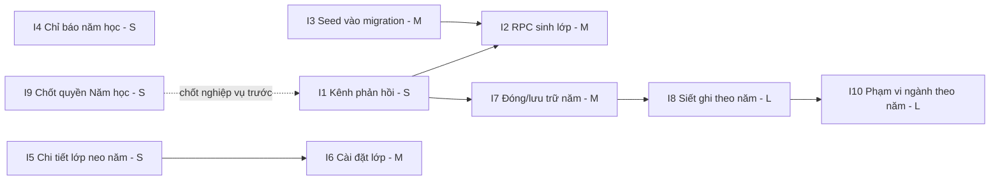

# M02 — ACADEMIC STRUCTURE · Implementation Impact

Ước lượng: **S** ≤ 0,5 ngày · **M** 0,5–2 ngày · **L** > 2 ngày (một người, đã quen repo).

## 1. Bảng tổng hợp theo hạng mục

| # | Hạng mục | To-Be | Ước lượng | Rủi ro |
|---|---|---|---|---|
| I1 | Kênh phản hồi cho form quản trị | TB-F12 | **S** | Thấp |
| I2 | `generate_default_classes` báo lỗi khi thiếu template + chặn năm đóng | TB-F02 | **M** | Trung bình (đổi chữ ký hàm) |
| I3 | Chuyển danh mục tham chiếu từ `seed.sql` vào migration | TB-F02 (phòng ngừa) | **M** | Trung bình (dữ liệu đã tồn tại) |
| I4 | Chỉ báo năm học ở header (bỏ hardcode) | TB-F10/A | **S** | Thấp |
| I5 | Chi tiết lớp neo vào năm học + chặn ghi danh năm đóng | TB-F07 | **S** | Thấp |
| I6 | Màn hình cài đặt lớp (dùng `updateClass`) + `.select()` để phát hiện no-op | TB-F08 | **M** | Thấp |
| I7 | Đóng / lưu trữ năm học (RPC + UI + cột audit) | TB-F09 giai đoạn 1 | **M** | Trung bình |
| I8 | Siết ghi theo trạng thái năm học (RLS) | TB-F09 giai đoạn 2 | **L** | **Cao** |
| I9 | Thống nhất quyền "Năm học" giữa matrix / route / RLS | BR-M02-15,16 | **S** (nếu chỉ sửa route) | Trung bình (cần chốt nghiệp vụ) |
| I10 | Giới hạn phạm vi ngành theo năm học | BR-M02-49 | **L** | **Cao** (đụng mọi module) |
| I11 | Nhãn tiếng Việt cho trạng thái + `formatDateVi` | UI P2 | **S** | Không |

## 2. File phải sửa

### I1 — Kênh phản hồi (S)
- `src/features/academic-years/server/actions.ts:135-164` — 4 adapter `*FromForm` chuyển từ `Promise<void>` sang `redirect()` kèm mã kết quả.
- `src/app/(dashboard)/admin/page.tsx` — nhận `searchParams`, render banner bằng `getErrorMessageVi` (`src/lib/errors/index.ts:49-51`).
- *Không đụng DB, không đụng RLS.*

### I2 — RPC sinh lớp (M)
- **Migration mới** `supabase/migrations/2026xxxx_generate_default_classes_guard.sql`: `drop function public.generate_default_classes(uuid)` + `create function` bản mới (dựa trên `20260716000300_canonical_19_classes.sql:89-117`).
- `src/features/academic-years/server/actions.ts:70-85` — đọc kết quả có cấu trúc, ánh xạ mã lỗi mới.
- `src/lib/errors/index.ts:3-36` — thêm `REFERENCE_DATA_MISSING` + thông điệp tiếng Việt.
- `src/types/database.ts` — regenerate.
- `src/app/(dashboard)/admin/page.tsx:52-55` — ẩn nút với năm `closed`/`archived`, hiển thị kết quả.

### I3 — Danh mục vào migration (M)
- **Migration mới**: `insert ... on conflict (id) do nothing` cho `sectors`, `grade_levels`, `class_templates` (sao chép nguyên văn `supabase/seed.sql:5-60`, giữ **đúng UUID cố định**).
- `supabase/seed.sql:5-60` — giữ lại (idempotent, `on conflict do nothing`) hoặc rút gọn; **không được đổi UUID**.
- `docs/12-deployment-runbook.md` §4a — cập nhật vì bước thủ công không còn bắt buộc.

### I4 — Chỉ báo năm học (S)
- `src/components/layout/academic-year-switcher.tsx:1-11` — viết lại thành server component đọc năm `current`.
- `src/components/layout/app-header.tsx:18` — có thể phải chuyển thành `async`.
- `src/features/academic-years/server/queries.ts` — thêm query nhẹ `getCurrentAcademicYearLabel()`.

### I5 — Chi tiết lớp neo năm (S)
- `src/features/classes/server/queries.ts:129-134` — thêm `academic_years(code, status)`; `:161` — `canManage` phụ thuộc trạng thái năm.
- `src/app/(dashboard)/classes/[classId]/page.tsx:25-33` — banner chỉ đọc.
- `src/features/enrollments/server/actions.ts:36-42` — kiểm trạng thái năm học phía server.

### I6 — Cài đặt lớp (M)
- **Mới:** `src/features/classes/server/actions.ts` (chuyển `updateClass` từ `academic-years/server/actions.ts:87-105` sang, hoặc re-export) + `src/features/classes/schemas.ts`.
- `src/features/academic-years/server/actions.ts:92-97` — thêm `.select("id").maybeSingle()` để phát hiện no-op.
- `src/app/(dashboard)/classes/[classId]/page.tsx` — card "Cài đặt lớp".
- `src/features/classes/server/queries.ts:14-22,42-54` — thêm `status` vào `ClassCard`; `src/app/(dashboard)/classes/page.tsx:14-21` — badge trạng thái.

### I7 — Đóng/lưu trữ năm học (M)
- **Migration mới:** cột `closed_at`, `closed_by`, `close_reason` trên `academic_years`; RPC `close_academic_year(uuid, boolean, text)`, `archive_academic_year(uuid)`.
- `src/features/academic-years/schemas.ts` — schema xác nhận (`code` nhập lại).
- `src/features/academic-years/server/actions.ts` — 2 action mới.
- `src/features/academic-years/server/permissions.ts:22-28` — dùng lại `requireSetCurrentYear` hoặc thêm `requireCloseYear`.
- `src/app/(dashboard)/admin/page.tsx:42-64` — nút + checklist.
- `docs/11-api-and-server-actions.md:31-37` — bổ sung tên action.

### I8 — Siết ghi theo trạng thái năm (L)
- **Migration mới:** `app.year_is_writable(uuid)`; sửa `enrollments_insert_scope`, `enrollments_update_scope` (`20260716000500_enrollments.sql:146-152`), `classes_insert_global_write`, `classes_update_global_write` (`20260715000200:307-313`).
- Cần rà thêm các bảng có `academic_year_id` ở M05/M07/M08 — **ngoài phạm vi audit này**.

### I9 — Thống nhất quyền (S nếu chỉ sửa route)
- `src/lib/permissions/route-map.ts:47` — hoặc mở `/admin` cho global-write, hoặc tách route `/admin/academic-years`.
- `src/features/academic-years/server/permissions.ts:7-12` — hoặc thu hẹp về `super_admin` cho khớp.
- `20260715000200:286,294` — mệnh đề `status <> 'current' or role in (...)` cần xem lại nếu mở quyền.
- **Phải chốt nghiệp vụ trước khi code** (xem câu hỏi Q-M02-01).

### I10 — Phạm vi ngành theo năm học (L)
- `supabase/migrations/20260721000200_scope_lookup_performance.sql:38-41` — thêm điều kiện `class.academic_year_id = <năm của role assignment>`.
- `supabase/migrations/20260715000200_academic_structure.sql:193-199` — helper cũ `can_access_class`.
- Ảnh hưởng **M03, M04, M05, M06, M07, M08, M11** — phải audit chéo trước.

## 3. API (server action) bị ảnh hưởng

| Action | Thay đổi |
|---|---|
| `createAcademicYear` | Trả kết quả tới UI (I1) |
| `setCurrentAcademicYear` | Trả kết quả tới UI (I1); cân nhắc tiền kiểm "đủ 19 lớp" |
| `generateDefaultClasses` | **Đổi kiểu `data`**: `{inserted}` → `{inserted, expected}` (I2) |
| `updateClass` | Thêm `.select()`; có call site thật (I6) |
| `updateAttendanceSettings` | Thêm `.select()`; trả kết quả (I1) |
| `closeAcademicYear` *(mới)* | I7 |
| `archiveAcademicYear` *(mới)* | I7 |

## 4. Schema / Migration

| Migration mới | Nội dung | Phụ thuộc |
|---|---|---|
| `M1` | Seed danh mục tham chiếu (5 ngành, 13 cấp, 19 template) idempotent | — |
| `M2` | `generate_default_classes` bản mới (drop + create) | M1 nên có trước |
| `M3` | `academic_years`: `closed_at`, `closed_by`, `close_reason`; RPC `close_academic_year`, `archive_academic_year` | — |
| `M4` | `app.year_is_writable` + sửa policy `enrollments`/`classes` | M3 |

**Không có migration nào cần đổi cấu trúc bảng hiện có** ngoài việc thêm cột nullable ⇒ không có downtime.

## 5. RLS

| Policy | Thay đổi | Rủi ro |
|---|---|---|
| `enrollments_insert_scope` / `enrollments_update_scope` | Thêm `and (select app.year_is_writable(academic_year_id))` | **Cao** — nếu năm hiện hành bị đánh dấu sai, toàn bộ ghi danh dừng |
| `classes_insert_global_write` / `classes_update_global_write` | Thêm điều kiện tương tự | Trung bình |
| `academic_years_update_global_write` | Xem lại mệnh đề `status <> 'current' or ...` (`20260715000200:294`) nếu mở quyền cho `secretary` | Trung bình |
| `academic_years_select_authenticated`, `sectors_select_*`, `classes_select_authenticated` | Cân nhắc thu hẹp cho `guardian`/`student` theo matrix | Trung bình — có thể làm vỡ M13 Portal |
| `app.scope_class_ids()` | Lọc theo `academic_year_id` | **Cao** — đụng mọi module |

**Nguyên tắc bắt buộc khi sửa RLS:** mọi lời gọi helper phải bọc `(select app.xxx())` để Postgres nâng thành InitPlan — bài học đã đo được ở `WORKLOG.md` (guardians 79,9 → 8,9 ms) và ở `20260721000200:9-15`.

## 6. Dữ liệu hiện có

| Thay đổi | Tác động dữ liệu |
|---|---|
| I2 (RPC) | Không đụng dữ liệu; chỉ đổi hành vi tương lai |
| I3 (seed vào migration) | `on conflict (id) do nothing` ⇒ môi trường đã có dữ liệu không bị ảnh hưởng. **Bắt buộc giữ nguyên UUID `10000000-…`, `20000000-…`** (`seed.sql:6-31`) |
| I7 (cột mới) | Cột nullable ⇒ dòng cũ = NULL, hợp lệ |
| I8 (RLS) | **Không đổi dữ liệu nhưng đổi khả năng ghi.** Năm đang `closed` mà còn việc dở sẽ bị khóa ngay ⇒ phải kiểm kê trước khi bật |
| I10 (phạm vi ngành) | **Thu hẹp quyền đọc.** Người đang dùng có thể mất quyền xem dữ liệu năm cũ ⇒ cần thông báo trước |

## 7. Test phải thêm

### pgTAP
| File | Test |
|---|---|
| `supabase/tests/002_academic_structure_test.sql` | Chèn hai năm `current` phải lỗi `23505`; `set_current_academic_year` đóng đúng năm cũ; role không đủ quyền → `42501` |
| `supabase/tests/008_canonical_classes_test.sql` | **`class_templates` rỗng ⇒ `generate_default_classes` phải throw** (test hiện chưa có); sinh lớp cho năm `closed` phải bị từ chối; kiểm `expected` trả về đúng |
| **File mới** `0xx_academic_year_lifecycle_test.sql` | `close_academic_year` với năm còn enrollment mở → lỗi; sau khi đóng, `secretary` INSERT enrollment vào năm đó → 0 dòng/lỗi; `super_admin` vẫn ghi được; `archive` chỉ từ `closed` |

### Unit (Vitest)
| File | Test |
|---|---|
| `tests/unit/academic-year-schemas.test.ts` | Regex `code` từ chối `26-27`, `2026_2027`; `attendanceSettingsSchema` biên 0/31, 0/61, 0/101; `warningRatePercent` → 0..1 |

### Integration
- Kiểm `generateDefaultClasses` trả `{inserted, expected}` đúng trên DB sạch và DB đã có lớp.

### E2E
| File | Test |
|---|---|
| **Mới** `tests/e2e/academic-year.spec.ts` | SA tạo năm → **thấy thông báo thành công** → sinh lớp → thấy `19/19` → `/classes` hiển thị 5 ngành + Dự trưởng → đặt hiện hành → header hiển thị đúng mã năm |
| `tests/e2e/security.spec.ts` | Role global-write không phải SA mở `/admin` → `/access-denied` (chốt lại quyết định của I9) |
| `tests/e2e/responsive.spec.ts:100-128` | Giữ nguyên; bổ sung màn hình cài đặt lớp nếu làm I6 |

## 8. Thứ tự phụ thuộc (đề xuất)

**Thứ tự khuyến nghị:** `I1 → I3 → I2 → I4 → I5 → I6 → I7 → (chốt nghiệp vụ) → I8 → I10`.

Lý do đặt **I1 trước tiên**: mọi hạng mục còn lại đều cần một kênh để nói cho người dùng biết chuyện gì đã xảy ra; làm I2 mà không có I1 thì lỗi mới vẫn bị nuốt y như cũ.

**I9 và I10 không được code trước khi có câu trả lời nghiệp vụ** (xem `08_ACCEPTANCE_CRITERIA.md` §4).
