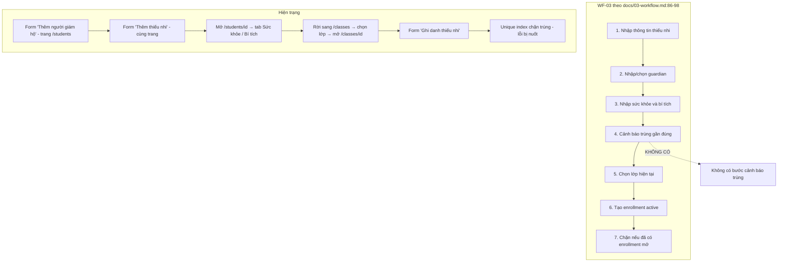
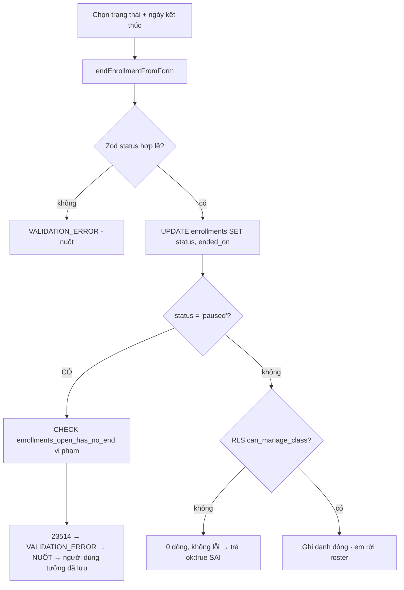

# M03 — STUDENTS & GUARDIANS · As-Is Flows

Tổng: **13 luồng** (`M03-STUDENTS-GUARDIANS-F01` … `F13`).

---

## Sơ đồ WF-03 As-Is so với đặc tả

Khác biệt cấu trúc: WF-03 mô tả **một luồng liền mạch**; hiện trạng là **4 màn hình rời** và **thiếu hẳn bước 4**.

---

## F01 — Tạo người giám hộ

- **Actor:** 4 role global-write (`students/server/permissions.ts:10-15`).
- **Precondition:** ở `/students` với `canWrite = true`.
- **Màn hình:** `/students` → card "Thêm người giám hộ" (`students/page.tsx:68-92`).

### Bước As-Is
1. `getStudentsPageData()` → `requireRouteAccess("/students")` (`students/server/queries.ts:25`); `canWrite = canWriteStudents(role)` (`:47`).
2. Nhập `fullName`, `phone`, `address` (`page.tsx:75-86`); `required` trên 2 trường đầu, `inputMode="tel"`.
3. `createGuardianFromForm` (`guardians/server/actions.ts:72-79`) — `status` gán cứng `"active"` (`:77`).
4. `createGuardian` → `requireStudentWrite()` (`:27`) → Zod `createGuardianSchema` (`guardians/schemas.ts:11-16`).
5. Insert `guardians` với `updated_by = actor.profileId` (`:32-38`).
6. RLS `guardians_insert_global_write` (`20260716000100_guardians_and_students.sql:189-191`).
7. `revalidatePath("/students")` (`:42`).

### Trạng thái cuối
1 dòng `guardians` `status='active'`, `profile_id = NULL` (chưa có tài khoản).

### Error path / Edge case
| Tình huống | Hành vi As-Is |
|---|---|
| **Trùng phụ huynh (cùng tên, cùng SĐT)** | **Tạo thêm bản ghi mới** — không có unique, không có cảnh báo. `guardians_phone_idx` (`:25`) chỉ để tra cứu | 
| `phone` sai định dạng | Chỉ kiểm `min 1, max 20` (`guardians/schemas.ts:13`) — chấp nhận `"abc"` |
| Lỗi bất kỳ | `AppError` → **bị nuốt** bởi `createGuardianFromForm` (`:72-79`) |
| Không đủ quyền | Card không render (`page.tsx:66`); nếu gọi thẳng action → `FORBIDDEN`, nuốt |

### Thông báo cho user
**Không có.** Guardian mới chỉ xuất hiện trong `<select>` của form bên dưới.

---

## F02 — Tạo hồ sơ thiếu nhi

- **Actor:** 4 role global-write.
- **Precondition:** đã có ít nhất 1 guardian `status='active'`.
- **Màn hình:** `/students` → card "Thêm thiếu nhi" (`students/page.tsx:94-161`).

### Bước As-Is
1. Nếu `guardians.length === 0` → "Vui lòng tạo người giám hộ trước." (`page.tsx:100-101`). ✔ Empty state.
2. Chọn guardian từ `<select>` liệt kê **toàn bộ** guardian `active` (`queries.ts:32`, `page.tsx:106-113`).
3. Nhập tên thánh, giới tính, họ tên, ngày sinh, bổn mạng, điện thoại, địa chỉ, cờ hoàn cảnh (`page.tsx:115-154`).
4. `createStudentFromForm` (`students/server/actions.ts:141-155`) — `status` gán cứng `"active"` (`:153`).
5. `requireStudentWrite()` (`:31`) → Zod `createStudentSchema` (`schemas.ts:28-42`).
6. Insert `students`; `student_code` do **DEFAULT sequence** cấp (`20260716000100:36-37`).
7. RLS `students_insert_global_write` (`:201-203`).
8. CHECK: `date_of_birth <= current_date` (`:54`), `student_code` khớp regex (`:53`).
9. `revalidatePath("/students")` (`:53`).

### Trạng thái cuối
1 dòng `students` `status='active'`, chưa có ghi danh, chưa có sức khỏe/bí tích.

### Sinh mã `CQxxxx` — có race condition không?
**KHÔNG.** Mã sinh bằng `nextval('public.student_code_seq')` trong DEFAULT của cột (`20260716000100:36-37`); sequence trong Postgres là atomic và không bị rollback trùng. Cột còn có `UNIQUE` (`:36`) làm chốt cuối. Không có đoạn code nào đọc `max(student_code)` rồi +1. **Đánh giá: PASS.**

Lưu ý phụ: sequence không cuộn lại khi transaction rollback ⇒ mã có thể **nhảy quãng** (CQ0001, CQ0003). Đây là hành vi đúng, không phải lỗi.

### Cảnh báo trùng gần đúng (WF-03 bước 4)
**KHÔNG TỒN TẠI** — xem F13.

### Error path / Edge case
| Tình huống | Hành vi As-Is |
|---|---|
| Hai em cùng tên, cùng ngày sinh | **Tạo được, không cảnh báo**. Index `students_dedup_idx` (`:59`) tồn tại nhưng **không có truy vấn nào dùng** |
| `guardianId` không tồn tại | FK `on delete restrict` → lỗi 23503 → `VALIDATION_ERROR` → nuốt |
| Ngày sinh tương lai | CHECK `:54` → lỗi → nuốt |
| Tên chỉ có khoảng trắng | Zod `.trim().min(1)` (`schemas.ts:30-31`) chặn ✔ |
| Không chọn guardian | `required` HTML + Zod uuid (`schemas.ts:29`) ✔ |
| Sau khi tạo | **Không tự chuyển sang bước ghi danh** — trái WF-03 bước 5–6 |

---

## F03 — Xem danh sách thiếu nhi

- **Actor:** 12 role staff (`route-map.ts:26`).
- **Màn hình:** `/students` (`students/page.tsx:22-167`).

### Bước As-Is
1. `getStudentsPageData()` (`queries.ts:24-64`): `select id, student_code, saint_name, full_name, status, hardship_flag, guardians(full_name, phone)` **không `limit`, không `range`, không filter** (`:28-31`), chỉ `order("full_name")`.
2. RLS `students_select_scope` (`20260721000200:120-126`) lọc theo phạm vi người đăng nhập.
3. Render card: tên thánh + họ tên, "Giám hộ: {tên} · {SĐT}", badge "Hoàn cảnh", badge trạng thái tiếng Việt (`page.tsx:38-61`).
4. Empty state: "Chưa có hồ sơ thiếu nhi trong phạm vi của bạn." (`page.tsx:36`). ✔ Câu chữ **đúng ngữ nghĩa** (nhắc tới "phạm vi").

### So với `docs/06-ui-ux-spec.md:195-224`
| Spec yêu cầu | Hiện trạng |
|---|---|
| Cột: Tên thánh, Họ tên, **Ngành**, **Lớp**, **GLV đại diện**, Trạng thái, **Cảnh báo**, Thao tác | Chỉ có Tên thánh, Họ tên, Guardian, Hoàn cảnh, Trạng thái |
| Filter: Năm học, Ngành, Lớp, Trạng thái, Cảnh báo | **Không có filter nào** |
| Search tên / SĐT guardian | **Không có** |
| Mã thiếu nhi không hiển thị mặc định | ✔ Đúng (`page.tsx:38-61` không in `studentCode`) |
| Mobile card: tên, **chip lớp**, nút gọi guardian, badge cảnh báo | Có tên + badge; **thiếu chip lớp và nút gọi** |

### Edge case
| Tình huống | Hành vi |
|---|---|
| 900 em | Render toàn bộ 900 card trong một HTML — không phân trang |
| `treasurer` | RLS trả 0 dòng → thấy "Chưa có hồ sơ thiếu nhi trong phạm vi của bạn." (đúng ngữ nghĩa ✔) |
| Lỗi query | `studentsResult.data ?? []` (`:35`) → giống hệt trạng thái rỗng |
| Guardian bị xóa | Không thể (`on delete restrict` `20260716000100:38`); hiển thị `"—"` nếu RLS che (`queries.ts:55-56`) |

---

## F04 — Xem chi tiết thiếu nhi

- **Actor:** 12 role staff; tab nhạy cảm cho 11 role (`students/server/permissions.ts:21-33`).
- **Màn hình:** `/students/[studentId]` (`[studentId]/page.tsx:52-356`).

### Bước As-Is
1. `getStudentDetail(studentId)` (`queries.ts:106-231`) → `requireRouteAccess` (`:112`).
2. Query hồ sơ + `guardians(...)` (`:115-121`); `data` rỗng (không tồn tại / RLS chặn / **UUID sai cú pháp**) → `student: null` → `notFound()` (`page.tsx:63`) ⇒ **404, không 500** ✔ (E2E `tests/e2e/security.spec.ts:48-49`).
3. Query lịch sử ghi danh (`:143-147`), sắp xếp `enrolled_on desc`.
4. `sensitive = canViewSensitive(role)` (`:164`); **chỉ khi `true` mới truy vấn** health/sacraments (`:168-199`) — tiết kiệm và fail-closed ✔.
5. Tab hiển thị theo `visible` (`page.tsx:68-73`), tab nhạy cảm ẩn hoàn toàn nếu không có quyền.
6. Nội dung tab `health`/`sacraments` còn kiểm lại `&& canViewSensitive` khi render (`page.tsx:243,315`) — **phòng thủ hai lớp** ✔.

### Kiểm tra rò rỉ dữ liệu nhạy cảm (yêu cầu điều tra)

| Role | Thấy tab Sức khỏe/Bí tích? | Dữ liệu thật đọc được? | Bằng chứng |
|---|---|---|---|
| `treasurer` | **Không** (không nằm trong `SENSITIVE_READ_ROLES` `permissions.ts:21-33`) | **Không** — RLS `student_health_select_staff` yêu cầu `can_global_read()` ∨ `class_scoped_student_ids()`, treasurer không thỏa cả hai | `20260721000200:128-142`; `20260715000100:164-167` |
| `trainee_assistant` (Dự trưởng) | **Có** (`permissions.ts:32`) | **Chỉ** em trong lớp mình — `staff_class_ids()` gồm role lớp (`20260721000200:56-62`) | Khớp matrix "👁📍" (`docs/05-permission-matrix.md:39-40`) |
| `guardian` | Không (bị chặn ở route `/students` từ trước) | **Không** — policy health/sacraments **không có nhánh `own_student_ids()`** | `20260721000200:128-142`; pgTAP `006:98-99`, `010:99` |
| `student` | Không | **Không** | pgTAP `006:109`, `010:110` |

**Kết luận: dữ liệu nhạy cảm KHÔNG bị lộ cho treasurer/guardian/student. Đây là điểm PASS mạnh của module.**

### Edge case
| Tình huống | Hành vi |
|---|---|
| `?tab=health` với role không có quyền | `activeTab` được đặt nhưng khối render có `&& canViewSensitive` (`page.tsx:315`) → **không render gì**; trang chỉ còn header (không có thông báo) |
| `?tab=linh-tinh` | Rơi về `overview` (`page.tsx:65-66`) ✔ |
| Em chưa có guardian | Không thể (`guardian_id NOT NULL`); UI vẫn có nhánh "Chưa gán" (`page.tsx:92`) |
| Em đã `archived` | Hiển thị bình thường với badge "Lưu trữ" (`page.tsx:97-99`); **form sửa vẫn hoạt động đầy đủ** |
| Top card thiếu **Lớp hiện tại** và **GLV** | Trái `docs/06-ui-ux-spec.md:230-235` |

---

## F05 — Sửa hồ sơ thiếu nhi

- **Actor:** 4 role global-write.
- **Màn hình:** tab "Tổng quan" → card "Cập nhật hồ sơ" (`[studentId]/page.tsx:143-210`).

### Bước As-Is
1. Form gửi **toàn bộ** trường mỗi lần (`page.tsx:150-207`), kèm `id` ẩn (`:151`).
2. `updateStudentFromForm` (`students/server/actions.ts:157-171`) — **không gửi `guardianId`**.
3. `updateStudentSchema` là `createStudentSchema.partial()` (`schemas.ts:44-46`) ⇒ trường vắng mặt bị bỏ qua; trường rỗng → `null` qua `nullableText`/`nullableIsoDate` (`schemas.ts:3-17`).
4. `payload` chỉ chứa key có `!== undefined` (`actions.ts:65-78`), luôn kèm `updated_by`.
5. `.update(payload).eq("id", id)` (`:80`) — **không `.select()`**.
6. RLS `students_update_global_write` (`20260716000100:204-207`).
7. `revalidatePath` cả list và detail (`:82-83`).

### Error path / Edge case — điểm nóng
| Tình huống | Hành vi As-Is |
|---|---|
| **RLS chặn / `id` không tồn tại** | PostgREST trả 204 với 0 dòng, `error === null` ⇒ action **trả `ok: true`** (`actions.ts:80-84`) — **báo thành công sai** |
| Sửa đồng thời hai tab | **Last-write-wins**, không có `updated_at` check, không cảnh báo |
| Bỏ trống "Ghi chú" | Ghi đè thành `NULL` (đúng ý người dùng, nhưng không có xác nhận) |
| **Đổi người giám hộ** | **Không làm được** — form không có trường guardian, adapter không gửi `guardianId` (`actions.ts:157-171`) |
| Đổi `status` sang `withdrawn`/`archived` | Xem F06 |
| Lỗi Zod | `fail()` (`:22-25`) gán `CONFLICT` → nuốt |

---

## F06 — Đổi trạng thái / lưu trữ hồ sơ thiếu nhi

- **Trạng thái:** không có luồng riêng; là một `<select>` lẫn trong form sửa (`[studentId]/page.tsx:186-192`).

### Bước As-Is
1. `<select name="status">` liệt kê 4 giá trị từ `statusLabels` (`page.tsx:21-26,188-190`): Đang sinh hoạt / Tạm nghỉ / Đã rút / Lưu trữ.
2. Đi chung `updateStudentFromForm` với mọi trường khác.
3. Zod enum `["active","temporarily_inactive","withdrawn","archived"]` (`schemas.ts:39-42`).
4. Update `students.status`.

### Không có hard delete ✔
Không có `grant delete` cho `authenticated` trên `students` (`20260716000100:176-179`) và không có action `delete` nào trong `src/`. **Xóa cứng là không thể — PASS.**

### Error path / Edge case — điểm nóng
| Tình huống | Hành vi As-Is |
|---|---|
| **Lưu trữ em đang có ghi danh mở** | Ghi danh **không bị đóng**; em vẫn nằm trong roster lớp (`classes/server/queries.ts:149` chỉ lọc theo `enrollments.status`) và vẫn được đếm vào sĩ số (`:50`) |
| Lưu trữ rồi ghi danh lại | `availableStudents` lọc `students.status='active'` (`classes/server/queries.ts:168`) ⇒ **UI ẩn**, nhưng `enrollStudent` **không kiểm** `students.status` (`enrollments/server/actions.ts:30-67`) và **không có ràng buộc DB nào** ⇒ gọi thẳng action vẫn ghi danh được em đã lưu trữ |
| Không có xác nhận | Đổi trạng thái là một thao tác nghiệp vụ lớn nhưng nằm chung nút "Lưu thay đổi" (`page.tsx:206`) |
| Không có lý do/ngày | Không lưu `archived_at`, không lưu lý do |
| `docs/11-api-and-server-actions.md:52` yêu cầu action riêng `archiveStudent` | Không tồn tại |

---

## F07 — Nhập / sửa hồ sơ sức khỏe

- **Actor:** ghi = 4 role global-write; đọc = 11 role.
- **Màn hình:** tab "Sức khỏe" (`[studentId]/page.tsx:315-353`).

### Bước As-Is
1. Tab chỉ hiện khi `canViewSensitive` (`page.tsx:72`).
2. Nếu `canWrite` → form 4 textarea; ngược lại → hiển thị chỉ đọc (`page.tsx:322-350`). ✔ Phân tách rõ.
3. `saveHealthProfileFromForm` (`students/server/actions.ts:173-181`) → `saveHealthProfile` (`:90-114`).
4. Zod `healthProfileSchema` (`schemas.ts:48-54`), 4 trường `nullableText(1000)`.
5. `upsert(..., { onConflict: "student_id" })` (`actions.ts:97-107`) — an toàn vì `student_id` là PK (`20260716000100:67`).
6. RLS insert/update `can_global_write()` ∧ `updated_by = auth.uid()` (`:213-219`).

### Error path / Edge case
| Tình huống | Hành vi |
|---|---|
| Chưa có hồ sơ | `upsert` tạo mới ✔ |
| Lưu hai lần liên tiếp | Idempotent ✔ |
| Cả 4 trường rỗng | Tạo dòng toàn `NULL` — không có kiểm "ít nhất một trường" |
| RLS chặn | Có `error` (upsert INSERT bị chặn trả 42501) → `VALIDATION_ERROR` → nuốt |
| Vượt 1000 ký tự | Zod chặn (`schemas.ts:50-53`); **không có `maxLength` trên textarea** ⇒ người dùng gõ thoải mái rồi mất dữ liệu im lặng |
| Không có lịch sử thay đổi | Chỉ có `updated_by`/`updated_at` (`20260716000100:72-73`) |

---

## F08 — Thêm bí tích

- **Màn hình:** tab "Bí tích" (`[studentId]/page.tsx:243-313`).

### Bước As-Is
1. Danh sách bí tích đã lãnh (`page.tsx:245-267`), empty state "Chưa có thông tin bí tích." ✔
2. Form thêm (chỉ khi `canWrite`): loại, tên (nếu Khác), ngày, nơi, người đỡ đầu, số sổ (`page.tsx:275-308`).
3. `createSacramentFromForm` (`students/server/actions.ts:183-194`) → `createSacrament` (`:116-138`).
4. Zod `createSacramentSchema` + refine: `other` bắt buộc `sacramentName` (`schemas.ts:67-70`).
5. Insert; unique index chặn trùng loại (trừ `other`) (`20260716000100:101-103`).
6. CHECK DB lặp lại luật `other` (`:94-97`) ✔ hai tầng.

### Error path / Edge case
| Tình huống | Hành vi |
|---|---|
| **Thêm lại bí tích đã có** (ví dụ Rửa tội lần 2) | Lỗi `23505` → `CONFLICT` → **nuốt**; người dùng không hiểu vì sao không có gì xảy ra |
| **Sửa bí tích đã nhập sai** | **Không làm được** — không có action update/delete; `docs/11-api-and-server-actions.md:51` yêu cầu `upsertStudentSacrament` |
| Chọn "Khác" nhưng bỏ trống tên | Zod refine chặn (`schemas.ts:67-70`) → nuốt; **không có kiểm client** |
| `<select>` liệt kê cả "Khác" ngay trong danh sách chuẩn | Người dùng dễ chọn nhầm (`page.tsx:280-282`) |
| Bí tích không có ngày | Cho phép (`sacrament_date` nullable) → hiển thị "Chưa rõ ngày" ✔ (`page.tsx:259`) |

---

## F09 — Ghi danh thiếu nhi vào lớp

- **Actor:** 6 role (`enrollments/permissions.ts:6-13`).
- **Màn hình:** `/classes/[classId]` → card "Ghi danh thiếu nhi" (`classes/[classId]/page.tsx:90-120`).

### Bước As-Is
1. `getClassDetail` tính `availableStudents` (`classes/server/queries.ts:161-174`): lấy mọi `enrollments` `active`/`paused` của năm học đó, lấy mọi `students` `status='active'`, loại trừ.
2. Empty state: "Không còn thiếu nhi nào chưa ghi danh trong năm học." (`page.tsx:98`). ✔
3. Form: `<select name="studentId">` + `<input name="enrolledOn" type="date">` mặc định hôm nay (`page.tsx:100-116`).
4. `enrollStudentFromForm` (`enrollments/server/actions.ts:86-93`) → `enrollStudent` (`:30-67`).
5. `requireEnrollmentWrite()` (`:32`) → Zod (`:33`).
6. Đọc lớp: không tồn tại → `RESOURCE_NOT_FOUND` (`:41`); `status <> 'active'` → `VALIDATION_ERROR` (`:42`).
7. Insert `enrollments` với `academic_year_id` **lấy từ lớp** (`:49`), `status` mặc định `active` (`20260716000500:10`).
8. Trigger `enrollments_validate` (`20260716000500:34-62`): lớp cùng năm ✔, lớp phải `active` ✔.
9. Unique partial index chặn ghi danh mở thứ hai trong năm (`:24-26`) → `23505` → `DUPLICATE_ENROLLMENT` (`actions.ts:57`).
10. RLS `enrollments_insert_scope`: `can_manage_class(class_id)` ∧ `updated_by = auth.uid()` (`:146-148`) — Trưởng ngành chỉ ghi danh vào lớp ngành mình (`:66-87`).

### Trạng thái cuối
1 dòng `enrollments` `status='active'`, `ended_on = NULL`.

### Error path / Edge case
| Tình huống | Hành vi As-Is |
|---|---|
| **Ghi danh trùng trong cùng năm** | **DB chặn đúng** (`:24-26`); mã lỗi `DUPLICATE_ENROLLMENT` với thông điệp tiếng Việt sẵn có (`src/lib/errors/index.ts:32-33`) — nhưng **bị nuốt** (`actions.ts:86-93`) |
| Hai người ghi danh cùng lúc | Unique index xử lý đúng; người thua nhận lỗi **im lặng** |
| Trưởng ngành ghi danh vào lớp ngành khác | RLS chặn → `42501` → `FORBIDDEN` → nuốt |
| **Ghi danh vào lớp của năm học đã đóng** | **Được phép** — không kiểm `academic_years.status` ở bất kỳ đâu |
| Ghi danh em `status='archived'` | UI ẩn, nhưng action **không kiểm** ⇒ gọi thẳng vẫn được |
| `enrolledOn` ngoài khoảng năm học | Không kiểm |
| `notes` | Form không có trường này; adapter luôn gửi `""` → `null` (`actions.ts:91`) |
| 900 em trong `<select>` | Không tìm kiếm được, không nhóm |

---

## F10 — Kết thúc ghi danh

- **Actor:** 6 role.
- **Màn hình:** `/classes/[classId]` → mỗi dòng roster có form inline (`classes/[classId]/page.tsx:51-61`).

### Bước As-Is
1. `<select name="status">` với 4 lựa chọn: **Rút** (`withdrawn`), **Hoàn thành** (`completed`), **Chuyển** (`transferred`), **Tạm nghỉ** (`paused`) (`page.tsx:53-58`).
2. `<input name="endedOn" type="date" required>` mặc định hôm nay (`:59`).
3. `endEnrollmentFromForm` (`enrollments/server/actions.ts:95-101`) → `endEnrollment` (`:69-84`).
4. Zod `endEnrollmentSchema` với `CLOSE_ENROLLMENT_STATUSES = ['completed','withdrawn','transferred','paused','repeating']` (`enrollments/schemas.ts:19-31`).
5. `.update({status, ended_on, updated_by}).eq("id", enrollmentId)` (`actions.ts:74-77`) — **không `.select()`**.
6. Trigger `enrollments_validate` chạy (trigger nghe `update of ... status` `20260716000500:60`).
7. CHECK `enrollments_open_has_no_end`: `status not in ('active','paused') or ended_on is null` (`:19-20`).

### 🔴 Lỗi chắc chắn: lựa chọn "Tạm nghỉ" **luôn thất bại**

- UI cho chọn `paused` (`page.tsx:57`);
- form **bắt buộc** `endedOn` (`page.tsx:59`) và action luôn ghi `ended_on = parsed.endedOn` (`actions.ts:76`);
- CHECK `enrollments_open_has_no_end` (`20260716000500:19-20`) từ chối `status='paused'` **kèm** `ended_on IS NOT NULL` → lỗi `23514`;
- `endEnrollment` ánh xạ thành `VALIDATION_ERROR` (`actions.ts:78`);
- `endEnrollmentFromForm` **nuốt lỗi** (`actions.ts:95-101`) ⇒ trang render lại y nguyên, người dùng tưởng đã lưu.

### Error path / Edge case
| Tình huống | Hành vi As-Is |
|---|---|
| Chọn "Tạm nghỉ" | **Luôn thất bại, im lặng** (trên) |
| **Khôi phục em đã tạm nghỉ / rút nhầm** | **Không có luồng nào** — `CLOSE_ENROLLMENT_STATUSES` không chứa `active` (`schemas.ts:19-25`); `docs/11-api-and-server-actions.md:59-64` yêu cầu `resumeEnrollment` |
| "Chuyển" (`transferred`) | Chỉ **đóng** ghi danh cũ; **không tạo** ghi danh mới, **không set** `previous_enrollment_id` (cột `20260716000500:13` chưa bao giờ được ghi) |
| RLS chặn / id sai | 0 dòng, không lỗi ⇒ **trả `ok:true` sai** (`actions.ts:78-80`) |
| `endedOn < enrolled_on` | CHECK `:18` chặn → nuốt |
| `repeating` | Có trong Zod nhưng **không có trong UI** (`schemas.ts:24`) |
| Không có xác nhận | Nút "Kết thúc" nằm ngay cạnh mỗi tên em (`page.tsx:60`) — dễ bấm nhầm |
| `revalidatePath` chỉ `/classes` | Không revalidate `/classes/{id}` (`actions.ts:79`) ⇒ trang chi tiết có thể hiển thị dữ liệu cũ |

---

## F11 — Xem lịch sử ghi danh của một em

- **Màn hình:** tab "Lịch sử lớp" (`[studentId]/page.tsx:214-241`).

1. `getStudentDetail` truy vấn `enrollments` kèm `classes(display_name)`, `academic_years(code)` (`queries.ts:143-147`), `order enrolled_on desc`.
2. RLS `enrollments_select_scope` (`20260721000200:145-152`) lọc theo phạm vi.
3. Render: tên lớp, "Năm học {code} · từ {ngày} đến {ngày}" bằng `formatDateVi` (`page.tsx:227-231`), badge trạng thái tiếng Việt (`page.tsx:39-46,233-235`).
4. Empty state: "Chưa có ghi danh nào." ✔ (`page.tsx:222`).

**Đánh giá:** luồng đọc sạch sẽ, nhãn tiếng Việt đầy đủ, ngày định dạng Việt, RLS đúng. **Không phát hiện vấn đề.**

---

## F12 — Quản lý người giám hộ (sửa / liên kết / đổi guardian của em)

- **Trạng thái: gần như KHÔNG TỒN TẠI.**

| Nhu cầu | Hiện trạng | Bằng chứng |
|---|---|---|
| Xem danh sách guardian | Không có trang; chỉ xuất hiện trong `<select>` | `students/page.tsx:106-113` |
| Sửa tên/SĐT/địa chỉ guardian | Action `updateGuardian` có, **không UI nào gọi** | `guardians/server/actions.ts:49-70` |
| Vô hiệu hóa guardian (`status='inactive'`) | Không có UI; `createGuardianFromForm` gán cứng `"active"` | `guardians/server/actions.ts:77` |
| Xem các con của một guardian | Không có màn hình | — |
| **Đổi guardian của một em** | **Không làm được** — form sửa không có trường này | `[studentId]/page.tsx:150-207`; `students/server/actions.ts:157-171` |
| Gộp hai guardian trùng | Không có | — |

### Liên kết guardian ↔ tài khoản (điều tra riêng)
- `guardians.profile_id` **bắt buộc** khi có role `guardian` active: trigger `app.validate_ownership_role_link` ném `GUARDIAN_PROFILE_REQUIRED` (`20260716000200_account_identity_links.sql:9-13`). ✔ **PASS**
- Việc gán link do M01 thực hiện khi cấp tài khoản (`src/features/auth/server/actions.ts:130-142`), có kiểm `guardian.profile_id` chưa bị chiếm (`:136`). ✔
- Một guardian nhiều con: mô hình đúng (`students.guardian_id` FK, không unique) — `20260716000100:38`, pgTAP `006:95` xác nhận guardian thấy 2 con.

---

## F13 — Cảnh báo trùng gần đúng khi tạo hồ sơ (WF-03 bước 4)

- **Trạng thái: KHÔNG TỒN TẠI trong luồng nhập tay.**

### Bằng chứng
1. `docs/03-workflow.md:92` yêu cầu: *"Hệ thống cảnh báo trùng gần đúng; người nhập vẫn được tiếp tục."*
2. Hạ tầng **đã có sẵn** nhưng không dùng ở luồng này:
   - cột sinh `normalized_full_name` (`20260716000100:49`);
   - index `students_dedup_idx (normalized_full_name, date_of_birth)` (`:59`);
   - module dedup hoàn chỉnh cho Import: `src/features/imports/dedup.ts`, `findDuplicate` (`src/features/imports/server/actions.ts:127-132`) với 3 mức cảnh báo (`docs/09-data-import-and-seed.md:121`).
3. `createStudent` (`students/server/actions.ts:27-58`) **không truy vấn gì trước khi insert**; grep `normalized_full_name` trong `src/` chỉ trả về `src/types/database.ts`.

### Hệ quả
Nhập tay tạo bản ghi trùng **không hạn chế**, trong khi Import (cùng dữ liệu, cùng bảng) lại cảnh báo đầy đủ — **hai cửa vào, hai tiêu chuẩn**.
