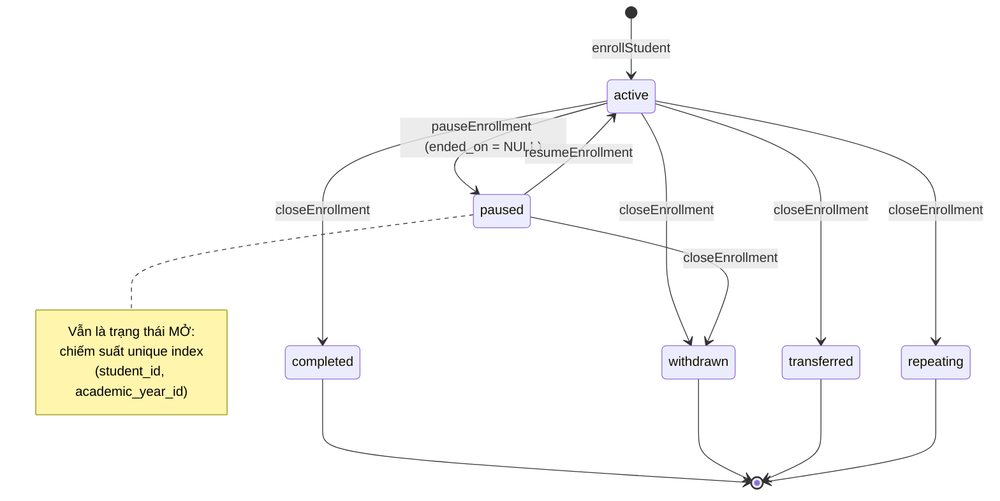
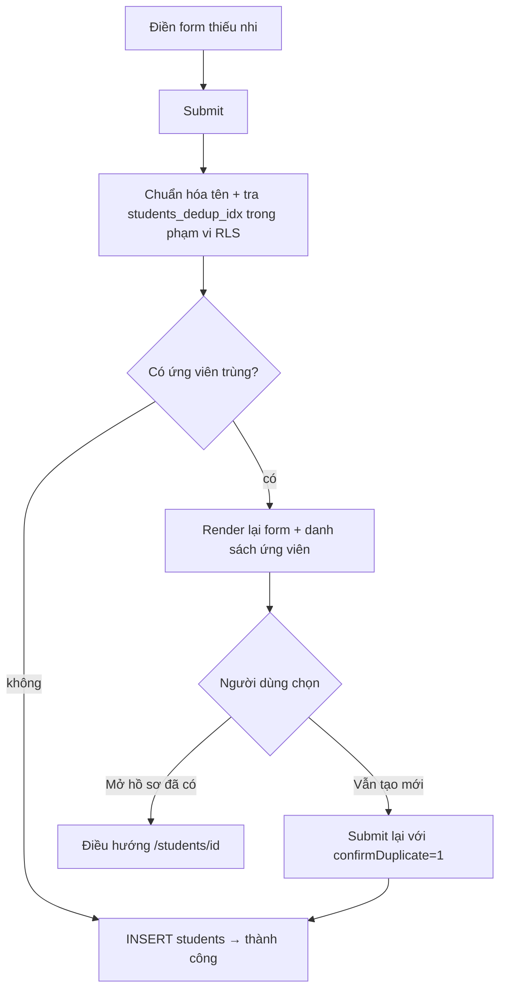

# M03 — STUDENTS & GUARDIANS · To-Be Flows

Chỉ viết To-Be cho luồng `CRITICAL` / `NEEDS_IMPROVEMENT`.
**F04, F07 (PASS_WITH_MINOR_UI_FIX) và F11 (PASS) không có To-Be** — F11 đã đúng, giữ nguyên; F04/F07 chỉ cần chỉnh trình bày, xem `06_UI_UX_RECOMMENDATIONS.md`.

---

## TB-F10 — Kết thúc / tạm nghỉ / khôi phục ghi danh (từ CRITICAL)

### Mục tiêu
Tách "tạm nghỉ" (giữ chỗ) khỏi "kết thúc" (rời lớp), và không bao giờ để một thao tác thất bại trông như thành công.

### Actor
6 role của `ENROLLMENT_WRITE_ROLES` (`enrollments/permissions.ts:6-13`).

### Business rules mới
| Mã | Phát biểu |
|---|---|
| BR-M03-N01 | `paused` là **trạng thái mở**: không được đặt `ended_on`; vẫn chiếm suất "một ghi danh mở/năm". |
| BR-M03-N02 | Trạng thái **đóng** chỉ gồm `completed`, `withdrawn`, `transferred`, `repeating` — bắt buộc có `ended_on`. |
| BR-M03-N03 | Ghi danh `paused` có thể **khôi phục** về `active` (không cần tạo bản ghi mới). |
| BR-M03-N04 | Đóng ghi danh là thao tác cần xác nhận, hiển thị tên em. |
| BR-M03-N05 | Mọi `UPDATE` phải xác nhận có dòng bị ảnh hưởng; 0 dòng ⇒ `FORBIDDEN` hoặc `RESOURCE_NOT_FOUND`, **không bao giờ** `ok:true`. |

### Hai phương án

#### Phương án A — Tách thành ba action (khuyến nghị)
1. `pauseEnrollment(enrollmentId)` → `status='paused'`, `ended_on = NULL`.
2. `resumeEnrollment(enrollmentId)` → `status='active'`, `ended_on = NULL`.
3. `closeEnrollment(enrollmentId, status, endedOn)` với enum **không chứa** `paused`.
- Sửa `CLOSE_ENROLLMENT_STATUSES` (`enrollments/schemas.ts:19-25`) bỏ `paused`; UI tách nút "Tạm nghỉ" khỏi form "Kết thúc".
- Khớp `docs/11-api-and-server-actions.md:59-64` (`pauseEnrollment`, `resumeEnrollment`, `withdrawEnrollment`, `transferEnrollment`).
- **Ưu:** ngữ nghĩa rõ, mỗi action một luật, dễ test, dễ phân quyền riêng sau này.
- **Nhược:** nhiều action hơn; UI phải sắp xếp lại.

#### Phương án B — Giữ một action, xử lý `ended_on` theo trạng thái
- `endEnrollment` tự đặt `ended_on = null` khi `status='paused'`.
- **Ưu:** sửa 2 dòng.
- **Nhược:** giữ nguyên sự nhập nhằng khái niệm (một nút tên "Kết thúc" lại dùng để "tạm nghỉ"); không giải quyết được việc thiếu `resume`.

**Khuyến nghị: A.**

### Bước To-Be (phương án A)
1. Trong roster, mỗi em có menu thao tác: **Tạm nghỉ** · **Kết thúc**.
2. "Tạm nghỉ": xác nhận → `pauseEnrollment` → em vẫn ở roster nhưng có badge "Tạm nghỉ" + nút "Khôi phục".
3. "Kết thúc": chọn lý do (Hoàn thành / Rút / Chuyển / Học lại) + ngày → xác nhận có tên em → `closeEnrollment`.
4. Server: `requireEnrollmentWrite` → Zod → `.update(...).select("id").maybeSingle()` → `null` ⇒ ném `FORBIDDEN`.
5. `revalidatePath('/classes')` **và** `revalidatePath('/classes/{id}')` **và** `revalidatePath('/students/{id}')`.
6. Hiển thị kết quả (xem TB-F14).

### Validation
- Client: chọn lý do bắt buộc; ngày bắt buộc chỉ với hành động "Kết thúc".
- Server: Zod enum không chứa `paused` cho `closeEnrollment`; `endedOn >= enrolled_on` (đã có CHECK `20260716000500:18`).
- DB: giữ nguyên `enrollments_open_has_no_end` (`:19-20`) làm chốt cuối.

### Permission
Không đổi. RLS `enrollments_update_scope` (`20260716000500:149-152`) giữ nguyên.

### Trạng thái dữ liệu

### Error handling
| Mã | Thông điệp |
|---|---|
| `FORBIDDEN` | Bạn không có quyền thực hiện thao tác này. |
| `RESOURCE_NOT_FOUND` | Không tìm thấy ghi danh. |
| `VALIDATION_ERROR` | Ngày kết thúc không được trước ngày ghi danh. |

### Audit
`updated_by`/`updated_at` đã có (`20260716000500:16-17,30-32`). Đề xuất thêm `previous_enrollment_id` khi "Chuyển" tạo ghi danh mới (cột đã tồn tại `:13`, chưa dùng).

### So sánh số bước
| | As-Is | To-Be |
|---|---|---|
| Tạm nghỉ một em | 3 thao tác nhưng **luôn thất bại** | 2 (nút + xác nhận), thành công |
| Khôi phục | **Không làm được** | 2 |
| Kết thúc | 3, không xác nhận | 3 + xác nhận |

### Ảnh hưởng module / API / DB
- **API:** thêm `pauseEnrollment`, `resumeEnrollment`; đổi `endEnrollment` → `closeEnrollment`.
- **DB:** **không cần migration** — CHECK hiện tại đã đúng.
- **Module khác:** M05 Attendance đọc enrollment mở (`active`/`paused`) — hành vi không đổi; M08 Promotions đọc trạng thái cuối năm.

### Rủi ro migration
Không có migration. Rủi ro nằm ở dữ liệu cũ: kiểm xem có dòng `paused` nào đang có `ended_on` không (không thể có, vì CHECK luôn chặn) ⇒ **rủi ro bằng 0**.

### Rollback
Revert commit ứng dụng. Không có tác động DB.

---

## TB-F13 — Cảnh báo trùng gần đúng khi nhập hồ sơ (từ CRITICAL)

### Mục tiêu
Thực hiện đúng WF-03 bước 4: **cảnh báo, không chặn**.

### Actor
Người nhập hồ sơ (4 role global-write, mở rộng nếu chốt Q-M03-01).

### Business rules mới
| Mã | Phát biểu |
|---|---|
| BR-M03-N06 | Trước khi tạo hồ sơ, hệ thống đối chiếu `(tên đã chuẩn hóa, ngày sinh)` với hồ sơ hiện có **trong phạm vi người dùng được đọc**. |
| BR-M03-N07 | Cảnh báo phân mức giống Import: High (khớp cả tên + ngày sinh + guardian), Medium, Low (`docs/09-data-import-and-seed.md:121`). |
| BR-M03-N08 | Người nhập **luôn được phép tiếp tục** sau khi xác nhận đã xem cảnh báo. |
| BR-M03-N09 | Guardian cũng được đối chiếu theo `(tên chuẩn hóa, số điện thoại)`. |

### Hai phương án

#### Phương án A — Kiểm tra hai bước trên server (giữ progressive enhancement)
1. Submit lần 1 → server tìm ứng viên trùng.
2. Nếu có → render lại trang với danh sách ứng viên + nút "Vẫn tạo mới" (mang theo token/`confirmDuplicate=1`) và link tới hồ sơ đã có.
3. Nếu không → tạo luôn.
- **Ưu:** không cần JS phía client, đúng phong cách hiện tại của repo.
- **Nhược:** mất một vòng round-trip; phải giữ lại dữ liệu form (giải quyết chung với TB-F14).

#### Phương án B — Kiểm tra trực tiếp khi gõ (client)
- Component client gọi server action tra cứu khi rời trường "Họ tên"/"Ngày sinh".
- **Ưu:** phản hồi tức thì, trải nghiệm tốt nhất.
- **Nhược:** thêm Client Component đầu tiên của module; cần chống spam truy vấn.

**Khuyến nghị: A cho v1** (rẻ, an toàn, đủ đáp ứng WF-03), cân nhắc B khi có ngân sách UX.

### Bước To-Be
1. Người dùng điền form "Thêm thiếu nhi".
2. `createStudent` chuẩn hóa tên bằng chính hàm của Import (`src/features/imports/normalize.ts:43`) và truy vấn `students` theo `normalized_full_name` + `date_of_birth` (index `students_dedup_idx` `20260716000100:59` đã sẵn).
3. Có ứng viên và chưa xác nhận ⇒ trả `{ok:false, code:'DUPLICATE_CANDIDATE', candidates:[...]}`.
4. UI hiển thị: "Có 1 hồ sơ tương tự: Maria Nguyễn Thị A · CQ0042 · 12/03/2015 · Ấu 1A" + hai nút: **Mở hồ sơ đã có** / **Vẫn tạo hồ sơ mới**.
5. Xác nhận ⇒ tạo bình thường.

### Validation
Không thêm ràng buộc cứng — đây là **cảnh báo mềm** theo đúng WF-03.

### Permission
Truy vấn dedup phải chạy **dưới RLS của người dùng** (không dùng service role) để không lộ hồ sơ ngoài phạm vi. Nếu ứng viên trùng nằm ngoài phạm vi, người dùng sẽ không thấy — chấp nhận được và an toàn.

### Trạng thái dữ liệu
Không đổi.

### Error handling
Thêm mã `DUPLICATE_CANDIDATE` (không phải lỗi — là trạng thái cần xác nhận). Cân nhắc tách khỏi `AppErrorCode` để không lẫn lỗi thật.

### Audit
Ghi nhận việc người dùng đã bỏ qua cảnh báo (ví dụ cột `general_notes` hoặc bảng log riêng) — **tùy chọn**, cần chốt (Q-M03-06).

### So sánh số bước
| | As-Is | To-Be (không trùng) | To-Be (có trùng) |
|---|---|---|---|
| Thao tác | 1 submit | 1 submit | 2 submit + 1 quyết định |

### Ảnh hưởng module / API / DB
- **File:** `src/features/students/server/actions.ts:27-58`, `src/app/(dashboard)/students/page.tsx`, dùng lại `src/features/imports/dedup.ts` + `src/features/imports/normalize.ts:43`.
- **DB:** **không cần migration** — cột và index đã có.
- **Cross-module:** nên **nâng `dedup.ts` lên `src/lib/` hoặc `src/features/students/`** để cả Import lẫn nhập tay dùng chung một định nghĩa "trùng".

### Rủi ro migration / Rollback
Không có migration. Rollback = revert.

---

## TB-F14 — Kênh phản hồi + phát hiện ghi 0 dòng (gốc của F01, F02, F05, F06, F08, F09, F10)

### Mục tiêu
Không thao tác ghi nào được phép im lặng, và không thao tác nào bị RLS chặn mà báo thành công.

### Business rules mới
| Mã | Phát biểu |
|---|---|
| BR-M03-N10 | Mọi server action ghi phải trả kết quả tới UI bằng thông điệp tiếng Việt. |
| BR-M03-N11 | Mọi `UPDATE`/`UPSERT` phải kèm `.select()` và coi "0 dòng" là thất bại. |

### Bước To-Be
1. Thay `.update(payload).eq("id", id)` bằng `.update(payload).eq("id", id).select("id").maybeSingle()`; `data === null` ⇒ `throw new AppError("FORBIDDEN")` (hoặc `RESOURCE_NOT_FOUND` nếu phân biệt được).
2. Adapter `*FromForm` chuyển từ `Promise<void>` sang `redirect()` kèm mã kết quả (hoặc `useActionState` — cùng lựa chọn với TB-F12 của M02, **phải thống nhất một cách làm cho cả hệ thống**).
3. Trang đọc mã, render banner bằng `getErrorMessageVi` (`src/lib/errors/index.ts:49-51`).

### File phải sửa
`students/server/actions.ts:80, 95-107, 141-194`; `guardians/server/actions.ts:62, 72-79`; `enrollments/server/actions.ts:74-77, 86-101`.

### Ảnh hưởng
**Không đụng DB, không đụng RLS.** Rủi ro thấp nhất, giá trị cao nhất ⇒ **làm trước tiên**.

### Rollback
Revert commit.

---

## TB-F06 — Lưu trữ hồ sơ thiếu nhi thành luồng riêng

### Mục tiêu
`archiveStudent` như `docs/11-api-and-server-actions.md:52` yêu cầu, và giữ hai trục trạng thái nhất quán.

### Business rules mới
| Mã | Phát biểu |
|---|---|
| BR-M03-N12 | Không được lưu trữ/rút một em còn ghi danh đang mở; phải đóng ghi danh trước hoặc xác nhận đóng cùng lúc. |
| BR-M03-N13 | Không được ghi danh một em có `status <> 'active'`. |
| BR-M03-N14 | Đổi trạng thái hồ sơ là thao tác riêng, có xác nhận và (tùy chọn) ghi lý do. |

### Hai phương án cho BR-M03-N12

#### Phương án A — Ràng buộc ở DB (trigger)
`before update on students`: nếu `status` chuyển sang `withdrawn`/`archived` mà còn `enrollments` `active`/`paused` ⇒ `raise exception`.
- **Ưu:** bất biến thật, không bypass được.
- **Nhược:** người dùng bị chặn cứng, cần luồng "đóng ghi danh trước".

#### Phương án B — Xử lý ở server action (giao dịch nghiệp vụ)
`archiveStudent(studentId, {closeEnrollment: true, endedOn})` đóng ghi danh mở rồi mới đổi trạng thái, trong cùng một RPC.
- **Ưu:** một thao tác, trải nghiệm mượt.
- **Nhược:** cần RPC để đảm bảo tính nguyên tử.

**Khuyến nghị: B (RPC) + A như lưới an toàn.**

### Bước To-Be
1. Trang chi tiết: tách khối "Trạng thái hồ sơ" khỏi form thông tin.
2. Chọn trạng thái mới → nếu là `withdrawn`/`archived` và còn ghi danh mở, hiển thị cảnh báo kèm tên lớp và ô chọn "Đồng thời kết thúc ghi danh (lý do: Rút)".
3. Xác nhận → RPC → đổi cả hai trục trong một transaction.
4. `enrollStudent` bổ sung kiểm `students.status = 'active'` → `VALIDATION_ERROR`.

### Ảnh hưởng
- **DB:** RPC `archive_student(uuid, boolean, date, text)`; tùy chọn trigger bảo vệ.
- **File:** `students/server/actions.ts`, `[studentId]/page.tsx:186-192`, `enrollments/server/actions.ts:30-67`.
- **Module khác:** M05/M07 đọc roster — được lợi vì sĩ số chính xác hơn.

### Rủi ro migration
Trung bình: nếu dữ liệu hiện có đã tồn tại em `archived` còn ghi danh mở, trigger (phương án A) sẽ chặn các thao tác sửa sau này ⇒ **phải dọn dữ liệu trước** hoặc chỉ kiểm khi `status` thực sự thay đổi.

### Rollback
Drop trigger/RPC; revert UI.

---

## TB-F12 — Màn hình quản lý người giám hộ

### Mục tiêu
Guardian trở thành thực thể có vòng đời riêng, sửa được, xem được các con.

### Hai phương án

#### Phương án A — Route riêng `/guardians` + `/guardians/[id]`
- Danh sách có tìm kiếm theo tên/SĐT, chi tiết hiển thị danh sách con, form sửa, nút vô hiệu hóa.
- **Ưu:** đúng mô hình nghiệp vụ; phục vụ luôn M13 Portal và M10 Thông báo.
- **Nhược:** thêm route, thêm mục navigation, thêm rule trong `route-map.ts`.

#### Phương án B — Nhúng vào trang chi tiết thiếu nhi
- Thêm nút "Sửa thông tin phụ huynh" ngay trên top card (`[studentId]/page.tsx:87-102`) + cho phép đổi guardian.
- **Ưu:** rẻ, không thêm IA.
- **Nhược:** không xem được "gia đình này có mấy em"; không vô hiệu hóa guardian được.

**Khuyến nghị: B trước (rẻ, gỡ ngay ngõ cụt), A khi làm M13 Portal.**

### Business rules mới
| Mã | Phát biểu |
|---|---|
| BR-M03-N15 | Sửa được tên/SĐT/địa chỉ/trạng thái guardian bằng UI. |
| BR-M03-N16 | Đổi được guardian của một em (có xác nhận, vì ảnh hưởng quyền đọc của phụ huynh). |
| BR-M03-N17 | Không được vô hiệu hóa guardian còn con đang sinh hoạt. |
| BR-M03-N18 | Cảnh báo trùng khi tạo guardian mới (xem TB-F13/BR-M03-N09). |

### Cảnh báo bảo mật khi làm BR-M03-N16
Đổi `students.guardian_id` **thay đổi ngay** quyền đọc: `own_student_ids()` (`20260721000200:101-106`) join theo `guardian.profile_id`. Phụ huynh cũ mất quyền, phụ huynh mới có quyền. Thao tác này **phải** có xác nhận rõ ràng và nên ghi log.

### Ảnh hưởng
- **File:** `guardians/server/actions.ts:49-70` (thêm `.select()`), `students/server/actions.ts:157-171` (gửi `guardianId`), `[studentId]/page.tsx`, `src/features/guardians/server/queries.ts` (mới).
- **DB/RLS:** không đổi (`guardians_update_global_write` đã có `20260716000100:193-195`).

### Rủi ro / Rollback
Thấp cho phương án B. Rollback = ẩn UI.

---

## TB-F03 — Danh sách thiếu nhi có tìm kiếm, lọc, phân trang

### Mục tiêu
Dùng được ở quy mô ~900 em trên màn hình 360px, và tiệm cận `docs/06-ui-ux-spec.md:195-224`.

### Bước To-Be
1. `getStudentsPageData(params)` nhận `q`, `sectorId`, `classId`, `status`, `page`.
2. Truy vấn dùng `ilike` trên `full_name` (và `guardians.phone`), `range(from, to)`, giữ `order full_name`.
3. UI: thanh tìm kiếm + 4 select filter (dạng `<form method="get">` để giữ progressive enhancement) + phân trang.
4. Bổ sung cột **Lớp hiện tại** (join `enrollments` mở của năm `current`) và **Ngành**.

### Cân nhắc hiệu năng
Join `enrollments`+`classes` cho danh sách 900 em phải đo lại. Bài học `20260721000200:1-15`: **nút thắt là cách đánh giá RLS chứ không phải index**; mọi policy liên quan đã ở dạng set-based nên rủi ro thấp, nhưng vẫn phải chạy perf smoke sau khi thêm join.

### Ảnh hưởng
- **File:** `students/server/queries.ts:24-64`, `students/page.tsx:22-64`.
- **DB:** cân nhắc index `students (normalized_full_name)` đã có (`20260716000100:59`); có thể cần index cho `ilike` (`pg_trgm`) nếu tìm kiếm chậm — **đo trước khi thêm**.

### Rủi ro / Rollback
Thấp. Rollback = revert.

---

## TB-F02 / TB-F09 — Gộp luồng "tạo hồ sơ → ghi danh" theo WF-03

### Mục tiêu
Đưa 4 màn hình rời về một luồng liền mạch như WF-03 mô tả.

### Hai phương án

#### Phương án A — Thêm bước ghi danh ngay sau khi tạo hồ sơ
- Sau khi tạo thành công, chuyển tới `/students/{id}` với khối "Ghi danh vào lớp" (chọn lớp trong năm `current`).
- **Ưu:** ít thay đổi, giữ nguyên các màn hình hiện có.
- **Nhược:** vẫn là hai bước.

#### Phương án B — Một biểu mẫu nhiều bước
- Bước 1 thông tin em → bước 2 guardian (chọn hoặc tạo mới, có cảnh báo trùng) → bước 3 lớp → xem lại → tạo tất cả trong một RPC.
- **Ưu:** đúng WF-03 nhất, ít cơ hội bỏ dở giữa chừng.
- **Nhược:** cần Client Component; cần RPC giao dịch.

**Khuyến nghị: A cho v1.**

### Business rules mới
| Mã | Phát biểu |
|---|---|
| BR-M03-N19 | Sau khi tạo hồ sơ, hệ thống chủ động mời ghi danh vào lớp của năm học hiện hành. |
| BR-M03-N20 | Chọn lớp ở form ghi danh phải tìm kiếm được (theo tên em ở phía lớp, theo tên lớp ở phía em). |
| BR-M03-N21 | Không ghi danh vào lớp thuộc năm học không phải `draft`/`current` (trùng với BR-M02-N09). |

### Ảnh hưởng
- **File:** `students/server/actions.ts:141-155` (redirect sau khi tạo), `[studentId]/page.tsx` (khối ghi danh), `classes/server/queries.ts:161-174` (đổi cách lấy `availableStudents` sang truy vấn có tìm kiếm thay vì kéo cả bảng).
- **DB:** không đổi.

### Rủi ro / Rollback
Thấp. Rollback = revert.

---

## TB-F08 — Sửa / xóa bản ghi bí tích

### Mục tiêu
Cài `upsertStudentSacrament` như `docs/11-api-and-server-actions.md:51`.

### Bước To-Be
1. Mỗi dòng bí tích có nút "Sửa" (chỉ khi `canWrite`).
2. `upsertStudentSacrament(input)` với `id` tùy chọn: có `id` ⇒ update, không ⇒ insert.
3. Xóa: cân nhắc **không** cho xóa (dữ liệu bí tích là hồ sơ), chỉ cho sửa — **cần chốt** (Q-M03-05).
4. `.select()` để phát hiện 0 dòng.

### Ảnh hưởng
- **File:** `students/schemas.ts:56-70` (thêm `id` tùy chọn), `students/server/actions.ts:116-138`, `[studentId]/page.tsx:243-313`.
- **DB:** đã có `grant update` (`20260716000100:176-179`) và policy update (`:228-231`) ⇒ **không cần migration**.

### Rủi ro / Rollback
Thấp.

---

## TB-F01 — Cảnh báo trùng khi tạo guardian

Gộp vào **TB-F13** (BR-M03-N09): cùng cơ chế, cùng file, làm một lần.
Bổ sung: `createGuardianFromForm` (`guardians/server/actions.ts:72-79`) nên cho phép chọn `status` thay vì gán cứng `"active"`.
