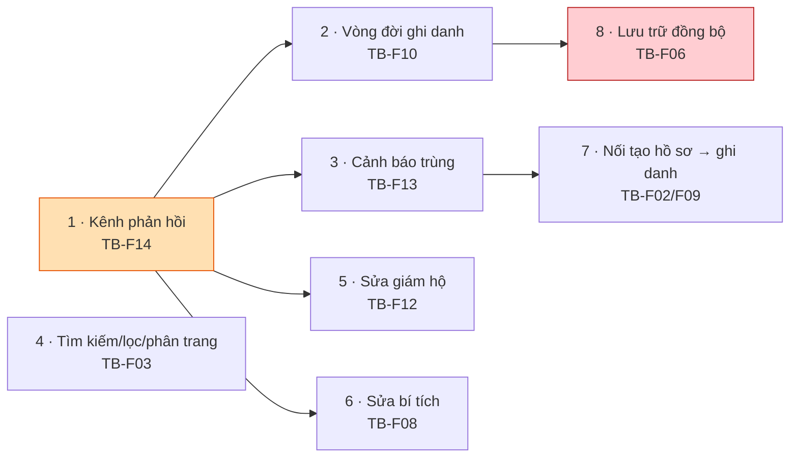

# M03 — STUDENTS & GUARDIANS · Ảnh hưởng triển khai

> Ước lượng: **S** ≤ nửa ngày · **M** 1–2 ngày · **L** 3–5 ngày (một agent, gồm cả test).

---

## 1. Bảng tổng hợp

| # | Hạng mục | To-Be | Cỡ | Migration | Đụng RLS | Rủi ro |
|---|---|---|---|---|---|---|
| 1 | Kênh phản hồi + phát hiện ghi 0 dòng | TB-F14 | **M** | ❌ | ❌ | **Thấp** |
| 2 | Sửa vòng đời ghi danh (tạm nghỉ/khôi phục/đóng) | TB-F10 | **M** | ❌ | ❌ | Thấp |
| 3 | Cảnh báo trùng khi nhập tay | TB-F13 | **M** | ❌ | ❌ | Thấp |
| 4 | Danh sách có tìm kiếm/lọc/phân trang | TB-F03 | **M** | ⚠️ có thể cần index | ❌ | Trung bình (hiệu năng) |
| 5 | Sửa/xem người giám hộ (phương án B) | TB-F12 | **S–M** | ❌ | ❌ | Thấp |
| 6 | Sửa bản ghi bí tích | TB-F08 | **S** | ❌ | ❌ | Thấp |
| 7 | Nối tạo hồ sơ → ghi danh | TB-F02/F09 | **M** | ❌ | ❌ | Thấp |
| 8 | Lưu trữ hồ sơ đồng bộ ghi danh | TB-F06 | **L** | ✅ RPC (+trigger) | ❌ | **Cao** (dữ liệu cũ) |

**Tổng ước lượng module: 12–16 ngày-người** nếu làm toàn bộ; **4–6 ngày** cho nhóm bắt buộc (1, 2, 3).

---

## 2. File phải sửa

### Nhóm 1 — Kênh phản hồi (TB-F14) · *nền tảng cho mọi hạng mục khác*
| File | Thay đổi |
|---|---|
| `src/features/students/server/actions.ts` | `:80` thêm `.select().maybeSingle()`; `:95-107` như trên; `:141-194` đổi `Promise<void>` → trả kết quả |
| `src/features/guardians/server/actions.ts` | `:62` thêm `.select()`; `:72-79` đổi kiểu trả về |
| `src/features/enrollments/server/actions.ts` | `:74-77` thêm `.select()`; `:86-101` đổi kiểu trả về |
| `src/app/(dashboard)/students/page.tsx` | Nhận và hiển thị kết quả |
| `src/app/(dashboard)/students/[studentId]/page.tsx` | Như trên |
| `src/app/(dashboard)/classes/[classId]/page.tsx` | Như trên (form ghi danh) |

> ⚠️ **Quyết định kiến trúc bắt buộc trước khi code:** chọn `redirect()` kèm mã kết quả **hay** `useActionState`.
> Lựa chọn này phải **thống nhất cho toàn hệ thống** (M02 có cùng vấn đề ở TB-F12, M04 cũng vậy).
> Không được để hai module dùng hai cách.

### Nhóm 2 — Vòng đời ghi danh (TB-F10)
| File | Thay đổi |
|---|---|
| `src/features/enrollments/schemas.ts:19-25` | Bỏ `paused` khỏi `CLOSE_ENROLLMENT_STATUSES` |
| `src/features/enrollments/server/actions.ts` | Thêm `pauseEnrollment`, `resumeEnrollment`; đổi `endEnrollment` → `closeEnrollment` |
| `src/app/(dashboard)/classes/[classId]/page.tsx:57` | Tách nút "Tạm nghỉ" khỏi form "Kết thúc"; thêm xác nhận |
| `docs/11-api-and-server-actions.md` | Cập nhật danh sách action cho khớp |

### Nhóm 3 — Cảnh báo trùng (TB-F13)
| File | Thay đổi |
|---|---|
| `src/features/imports/dedup.ts` | **Nâng lên dùng chung** — đề xuất chuyển sang `src/lib/` hoặc `src/features/students/` |
| `src/features/imports/normalize.ts:43` | Tái sử dụng hàm chuẩn hóa tên (không viết lại) |
| `src/features/students/server/actions.ts:27-58` | Truy vấn dò trùng trước khi INSERT |
| `src/features/guardians/server/actions.ts:23-47` | Như trên cho giám hộ |
| `src/app/(dashboard)/students/page.tsx` | Hiển thị danh sách ứng viên trùng + 2 nút chọn |

> ⚠️ Truy vấn dò trùng **phải chạy dưới quyền của người dùng**, tuyệt đối không dùng service role —
> nếu không sẽ lộ hồ sơ ngoài phạm vi qua chính màn hình cảnh báo.

### Nhóm 8 — Lưu trữ hồ sơ (TB-F06) · *rủi ro cao nhất*
| File | Thay đổi |
|---|---|
| Migration mới | RPC `archive_student(uuid, boolean, date, text)`; tùy chọn trigger bảo vệ |
| `src/features/students/server/actions.ts` | Thêm `archiveStudent` |
| `src/features/enrollments/server/actions.ts:30-67` | Chặn ghi danh em `status <> 'active'` |
| `src/app/(dashboard)/students/[studentId]/page.tsx:186-192` | Tách khối trạng thái |

---

## 3. Ảnh hưởng cơ sở dữ liệu

| Hạng mục | Migration | Nội dung |
|---|---|---|
| TB-F14, F10, F13, F12, F08, F02/F09 | **Không cần** | Toàn bộ ràng buộc, cột, index, policy đã có sẵn và **đã đúng** |
| TB-F03 | Có thể | Chỉ thêm index cho tìm kiếm `ilike` (`pg_trgm`) **nếu đo thấy chậm** — không thêm trước khi đo |
| TB-F06 | **Bắt buộc** | RPC `archive_student` + (tùy chọn) trigger đồng bộ hai trục trạng thái |

**Ghi chú quan trọng:** 6/8 hạng mục **không cần đụng vào cơ sở dữ liệu**. Tầng DB của module này đã đúng;
lỗi nằm ở tầng ứng dụng. Đây là lý do các hạng mục 1–3 có rủi ro thấp và nên làm trước.

## 4. Ảnh hưởng RLS

**Không hạng mục nào cần sửa RLS.** Toàn bộ policy đọc/ghi hiện tại đã đúng và có pgTAP bảo vệ.

Ngoại lệ cần lưu ý: TB-F12/BR-M03-N16 (đổi người giám hộ của một em) **thay đổi ngay quyền đọc** của
phụ huynh cũ và mới thông qua `own_student_ids()` (`20260721000200:101-106`). Đây không phải sửa RLS,
nhưng là thao tác có hệ quả phân quyền tức thì ⇒ bắt buộc có bước xác nhận và nên ghi lại vết.

## 5. Ảnh hưởng dữ liệu hiện có

| Hạng mục | Dữ liệu hiện có | Xử lý |
|---|---|---|
| TB-F10 | Không thể tồn tại dòng `paused` kèm `ended_on` (CHECK luôn chặn) | **Rủi ro bằng 0** |
| TB-F13 | Hồ sơ trùng **đã tồn tại** từ trước sẽ không tự biến mất | Cần rà soát thủ công; **chưa có chức năng gộp** |
| TB-F06 | Có thể đã có em `archived` còn ghi danh mở | **Phải dọn trước khi thêm trigger**, nếu không trigger sẽ chặn mọi thao tác sửa sau này |
| TB-F03 | Không ảnh hưởng | — |

## 6. Test phải thêm

| Loại | Nội dung | Vì sao bắt buộc |
|---|---|---|
| **Unit** | `students/schemas.ts`, `guardians/schemas.ts`, `enrollments/schemas.ts` | Hiện **không có test nào** cho cả 3 schema |
| **Unit** | Hàm dò trùng dùng chung | Tránh lệch định nghĩa "trùng" giữa Import và nhập tay |
| **pgTAP** | `status='paused'` kèm `ended_on` bị từ chối | Bắt được đúng lỗi CRITICAL F10 |
| **pgTAP** | Ghi danh trùng trả mã `23505` | `009` hiện chưa kiểm tường minh |
| **pgTAP** | `treasurer` đọc `students` trả 0 dòng | Chưa có vai này trong bộ test |
| **Integration** | Thao tác ghi bị RLS chặn phải trả lỗi, không trả `ok:true` | Bảo vệ TB-F14 khỏi tái phát |
| **E2E** | Tạo hồ sơ → cảnh báo trùng → vẫn tạo mới | Hiện **không có E2E nào cho luồng ghi** |
| **E2E** | Tạm nghỉ → khôi phục | Bảo vệ TB-F10 |
| **Perf** | Đo lại danh sách sau khi thêm join `enrollments`+`classes` | Bài học `20260721000200`: nút thắt là cách đánh giá RLS, không phải index |

## 7. Thứ tự phụ thuộc bắt buộc

**Luật thứ tự:**
1. **TB-F14 phải làm trước tiên.** Không có kênh phản hồi thì mọi hạng mục sau đều không kiểm chứng
   được bằng tay, và chính TB-F13 (cảnh báo trùng) *cần* kênh này để hiển thị cảnh báo.
2. **TB-F13 trước TB-F02/F09** — nối luồng tạo hồ sơ mà chưa có dò trùng là nhân rộng lỗi nhanh hơn.
3. **TB-F10 trước TB-F06** — phải có khái niệm `paused`/đóng đúng rồi mới đồng bộ được hai trục trạng thái.
4. **TB-F03 độc lập**, làm lúc nào cũng được.
5. **TB-F06 làm cuối cùng** — cần migration, cần dọn dữ liệu, rủi ro cao nhất.

## 8. Ảnh hưởng sang module khác

| Module | Ảnh hưởng | Mức |
|---|---|---|
| M05 Điểm danh | Sĩ số/roster chính xác hơn sau TB-F06; hành vi `active`/`paused` **không đổi** | Có lợi |
| M07 Bảng điểm | Roster điểm theo enrollment — hưởng lợi tương tự | Có lợi |
| M08 Chuyển lớp | `previous_enrollment_id` bắt đầu có giá trị ⇒ truy vết chuyển lớp tốt hơn | Có lợi |
| M11 Báo cáo | Sĩ số báo cáo thay đổi sau khi dọn dữ liệu TB-F06 — **số liệu quá khứ có thể lệch** | ⚠️ cần thông báo |
| M12 Nhập Excel | `dedup.ts` bị di chuyển vị trí ⇒ phải cập nhật import | Cần phối hợp |
| M13 Cổng phụ huynh | TB-F12 đổi giám hộ ⇒ đổi ngay danh sách con phụ huynh nhìn thấy | ⚠️ nhạy cảm |
| M02 Cấu trúc học vụ | Dùng chung quyết định kiến trúc về kênh phản hồi | Bắt buộc thống nhất |
