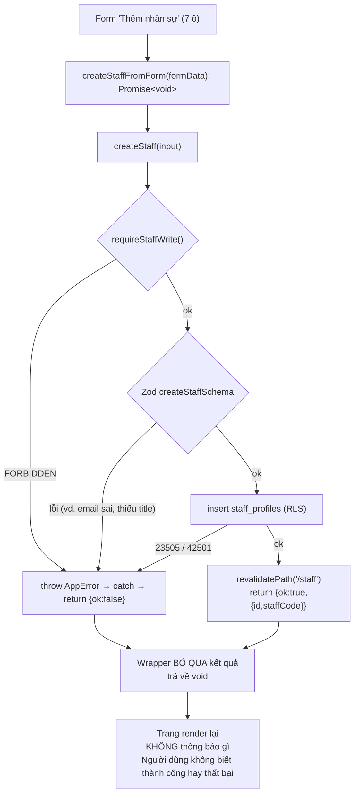
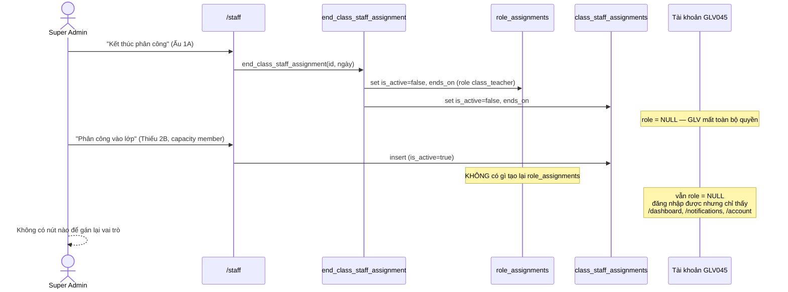

# M04-STAFF — Luồng As-Is

Ký hiệu: `M04-F01` … `M04-F09`.

---

## M04-F01 — Xem danh sách nhân sự

**Actor:** mọi `STAFF_ROLES`. **Precondition:** đăng nhập, role active.

| # | Bước | Bằng chứng |
|---|---|---|
| 1 | `/staff` → `getStaffPageData()` → `requireRouteAccess("/staff")` | `src/features/staff/server/queries.ts:18`, `route-map.ts:28` |
| 2 | 2 query song song: toàn bộ `staff_profiles` (kèm nested `class_staff_assignments` + `classes.display_name`) và toàn bộ `classes` `status='active'` | `queries.ts:20-23` |
| 3 | RLS lọc theo `app.can_access_staff(id)` / `app.can_access_class(class_id)` | `20260715000400:270-272,281-283` |
| 4 | Map: lấy **phân công active đầu tiên**; các phân công đã kết thúc bị **bỏ hoàn toàn** | `queries.ts:31,35` |
| 5 | Render card cho từng người: danh xưng + tên thánh + họ tên, `staff_code · phone · Huấn luyện <LEVEL>`, badge lớp hoặc “Chưa phân lớp” | `staff/page.tsx:34-35` |

**Edge case / thiếu sót**

- Query **không select** `service_status` và **không select** `profile_id` (`queries.ts:21`) → UI không thể hiện “còn phục vụ / đã nghỉ” cũng như “đã có tài khoản chưa”.
- **Không hiển thị lịch sử phân công** dù `docs/03:111` yêu cầu “Lưu lịch sử ngày bắt đầu/kết thúc” — dữ liệu có trong DB, chỉ bị vứt đi ở tầng map.
- Không tìm kiếm, không lọc theo lớp/ngành/trạng thái, không phân trang.
- `formation_level` hiển thị `toUpperCase()` của giá trị enum thô: `NONE`, `I`, `II`, `III`, `SPECIAL` — “Huấn luyện NONE” là vô nghĩa với người dùng (`staff/page.tsx:34`).
- Empty state có (`:31`) nhưng chỉ một dòng chữ, không có nút hành động.
- `classes` được lấy với `status='active'` **không lọc theo năm học hiện hành** (`queries.ts:22`) → dropdown phân công gộp lớp của mọi năm học.

---

## M04-F02 — Tạo hồ sơ Giáo lý viên

**Actor:** `super_admin`, `group_leader`, `deputy_group_leader`, `secretary`. **Precondition:** không.

| # | Bước | Bằng chứng |
|---|---|---|
| 1 | Card “Thêm nhân sự” chỉ render nếu `canWrite` (role hardcode lần 2) | `staff/page.tsx:49,16,22` |
| 2 | Form 7 ô: danh xưng (select), trình độ (select), tên thánh, họ tên (required), điện thoại (required), ngày sinh, email, địa chỉ | `:53-59` |
| 3 | **Không có validation client nào ngoài `required` của HTML** — không dùng react-hook-form/zodResolver | `:52` (`<form action={createStaffFromForm}>`) |
| 4 | Submit → Server Action `createStaffFromForm(formData)` | `src/features/staff/server/actions.ts:115-127` |
| 5 | Wrapper ép kiểu thô: `String(formData.get("title"))`, `serviceStatus` **hardcode `"active"`**, rồi `as CreateStaffInput` | `:116-126` |
| 6 | `createStaff` → `requireStaffWrite()` → Zod `createStaffSchema` | `:34-35`, `src/features/staff/schemas.ts:5-15` |
| 7 | `insert into staff_profiles` bằng **client session (chịu RLS)** với `updated_by: actor.profileId` | `:37-48` |
| 8 | RLS `staff_profiles_insert_global_write` kiểm `can_global_write() and updated_by = auth.uid()` | `20260715000400:273-275` |
| 9 | DB sinh `staff_code` = `GLV` + số thứ tự 3 chữ số | `20260715000400:15` |
| 10 | `revalidatePath("/staff")`; `createStaff` trả `{id, staffCode}` | `:50-51` |
| 11 | **Wrapper vứt bỏ kết quả và trả `void`** | `:115` (`Promise<void>`) |

**Error path / edge case — đây là điểm hỏng nặng nhất của module**

| Tình huống | Hành vi thực tế | Bằng chứng |
|---|---|---|
| Thiếu quyền (ví dụ `sector_leader` gọi thẳng action) | `AppError("FORBIDDEN")` → `fail()` → `{ok:false}` → **wrapper vứt đi** → trang render lại như không có gì | `actions.ts:23,27-30,115` |
| Email sai định dạng | Zod `.email()` từ chối → **im lặng** | `schemas.ts:12` |
| Ngày sinh sai định dạng | Zod regex từ chối → **im lặng** | `schemas.ts:9` |
| Bỏ trống select `title` (JS tắt / form bị sửa) | `String(null)` = `"null"` → Zod enum từ chối → **im lặng** | `actions.ts:118` |
| Tạo thành công | **Không toast, không redirect, không hiện mã `GLVxxx` vừa sinh** — người dùng phải tự tìm trong danh sách dài | `actions.ts:115`, `staff/page.tsx:52` |
| Tạo trùng người (cùng SĐT, cùng họ tên + ngày sinh) | **Thành công**, sinh thêm một `GLVxxx` — không cảnh báo, không constraint | không có unique nào trên `phone`/`email`/`full_name` (`20260715000400:12-30`) |
| Bấm đúp nút “Tạo hồ sơ” | Không có `disabled`/`isSubmitting` → tạo **2 hồ sơ** | `staff/page.tsx:60` |
| `serviceStatus` | Luôn `"active"` — người dùng không chọn được | `actions.ts:125` |
| Phiên hết hạn | `requireAuthContext` gọi `redirect()`; `NEXT_REDIRECT` bị `catch (error) { return fail(error) }` nuốt | `actions.ts:52`, `guards.ts:9` |

---

## M04-F03 — Sửa hồ sơ Giáo lý viên (KHÔNG CÓ UI)

`updateStaff` tồn tại đầy đủ (`actions.ts:55-78`) với whitelist field đúng chuẩn và `updateStaffSchema` partial (`schemas.ts:17-19`). Grep toàn `src/`: **không file nào import `updateStaff`**. Không có `/staff/[staffId]`, không có nút “Sửa” trên card.

**Hệ quả:** sai một ký tự trong họ tên hoặc số điện thoại là **không sửa được qua giao diện**, phải vào DB. Không thể cập nhật trình độ huấn luyện sau khi học xong khóa. Không thể đánh dấu một GLV đã nghỉ phục vụ.

**Ghi chú kỹ thuật:** `updateStaff` luôn set `updated_by: actor.profileId` (`actions.ts:70`) — đúng yêu cầu `with check` của RLS UPDATE (`20260715000400:279`). Nếu bật UI thì action đã sẵn sàng.

---

## M04-F04 — Phân công nhân sự vào lớp

**Actor:** `STAFF_WRITE_ROLES`. **Precondition:** hồ sơ tồn tại, lớp `status='active'`.

| # | Bước | Bằng chứng |
|---|---|---|
| 1 | Card “Phân công vào lớp”, 4 ô: nhân sự (select), lớp (select), vai trò trong lớp (select capacity), ngày bắt đầu | `staff/page.tsx:66-71` |
| 2 | Option nhân sự đã có phân công bị `disabled` và hiện tên lớp trong ngoặc | `:67` |
| 3 | Submit → `assignStaffFromForm` → `assignStaffToClass` | `actions.ts:129-136,80-97` |
| 4 | `requireStaffWrite()` + Zod `assignStaffSchema` | `:82-83`, `schemas.ts:21-26` |
| 5 | `insert into class_staff_assignments` với `updated_by` | `:85-91` |
| 6 | RLS insert = `can_global_write() and updated_by = auth.uid()` | `20260715000400:284-286` |
| 7 | Trigger `validate_class_staff_assignment`: lớp phải active; nếu hồ sơ đang có role lớp active thì `class_id`/`capacity` phải khớp | `20260715000400:75-99` |
| 8 | Unique index: một lớp active/nhân sự; một đại diện active/lớp | `:52-55` |
| 9 | `revalidatePath("/staff")` + `revalidatePath("/classes")` | `:93-94` |

**Error path / edge case**

| Tình huống | Hành vi | Bằng chứng |
|---|---|---|
| Nhân sự đã có lớp active | Option bị `disabled` ở UI; nếu vượt qua → unique index `23505` → `CONFLICT` → **im lặng** (wrapper void) | `staff/page.tsx:67`, `20260715000400:52-53`, `actions.ts:92,129` |
| Lớp đã có đại diện active | Unique index `23505` → **im lặng**. UI **không** báo trước lớp nào đã có đại diện | `20260715000400:54-55` |
| Lớp `status <> 'active'` | Trigger `CLASS_NOT_ACTIVE` (23514) → `VALIDATION_ERROR` → **im lặng** | `20260715000400:75-79` |
| Người đã có tài khoản với role lớp, phân công sai lớp/capacity | Trigger `ROLE_CAPACITY_MISMATCH` → **im lặng** | `20260715000400:96-98` |
| Dropdown lớp | Gộp lớp của **mọi năm học** vì query không lọc `academic_year_id` | `queries.ts:22` |
| Ngày bắt đầu | Không kiểm nằm trong khoảng năm học; không kiểm ngược quá khứ; không prefill | `schemas.ts:25`, `staff/page.tsx:70` |
| Capacity mặc định | `representative` là option đầu tiên → **mặc định chọn “Giáo lý viên đại diện”** dù đây là vai trò hiếm và bị giới hạn 1/lớp | `staff/page.tsx:69` |

---

## M04-F05 — Kết thúc phân công

| # | Bước | Bằng chứng |
|---|---|---|
| 1 | Form inline trong card từng người (chỉ khi `canWrite` và có phân công active): 1 ô ngày + nút | `staff/page.tsx:37-43` |
| 2 | `endStaffAssignmentFromForm` → `endClassStaffAssignment` | `actions.ts:138-140,99-113` |
| 3 | `requireStaffWrite()` + Zod | `:101-102` |
| 4 | RPC `end_class_staff_assignment(assignmentId, endsOn)` | `:104-107` |
| 5 | RPC tự kiểm `app.can_global_write()` → `42501` nếu không | `20260715000400:117-119` |
| 6 | `select ... for update` chống race | `:121-124` |
| 7 | Kiểm `ends_on >= starts_on` → `23514` | `:128-130` |
| 8 | **Deactivate `role_assignments`** của tài khoản liên kết (role lớp, cùng `class_id`) | `:132-141` |
| 9 | Deactivate `class_staff_assignments` (trigger đã pass vì role vừa bị tắt) | `:143-147` |

**Error path / edge case**

- `P0002 ASSIGNMENT_NOT_FOUND` → `RESOURCE_NOT_FOUND`; mọi lỗi khác → `VALIDATION_ERROR` (`actions.ts:108`). Cả hai đều **im lặng** vì wrapper void.
- **Tác dụng phụ ẩn, không được cảnh báo ở UI:** thao tác “Kết thúc phân công” **đồng thời vô hiệu hóa vai trò đăng nhập** của người đó (`20260715000400:136-141`). Người dùng nghĩ mình chỉ “gỡ khỏi lớp”, thực tế đã **khóa quyền truy cập** của một GLV. Nhãn nút chỉ ghi “Kết thúc phân công” (`staff/page.tsx:41`).
- Ô ngày kết thúc không có giá trị mặc định, không giới hạn `min = starts_on` → dễ nhập ngày trước ngày bắt đầu và bị từ chối im lặng.
- Không confirm cho một thao tác có hệ quả về quyền.

---

## M04-F06 — Đổi lớp cho một Giáo lý viên (luồng ghép — CRITICAL)

**Actor:** `STAFF_WRITE_ROLES` + `super_admin`. Đây là luồng vận hành thường gặp nhất giữa năm học nhưng **không hoàn thành được**.

| # | Bước As-Is | Kết quả |
|---|---|---|
| 1 | `/staff` → “Kết thúc phân công” | `class_staff_assignments.is_active=false` **và** `role_assignments.is_active=false` (`20260715000400:136-147`) |
| 2 | `/staff` → “Phân công vào lớp” lớp mới | `class_staff_assignments` mới active. `role_assignments` **không được tạo lại** — `src/` chỉ ghi bảng này đúng một chỗ, trong `adminProvisionAccount` (`src/features/auth/server/actions.ts:241`) |
| 3 | Tìm cách gán lại vai trò | **Không có action nào.** `assignPrimaryRole` chỉ tồn tại trong `docs/11-api-and-server-actions.md:25` |
| 4 | Cách duy nhất còn lại | `/admin` → xóa tài khoản (`actions.ts:347-357`, làm `staff_profiles.profile_id → null` và **xóa lịch sử role** do cascade `20260715000100:64`) → tạo lại tài khoản (`:103-270`) → username giữ nguyên `GLV045` nhưng **mật khẩu tạm mới**, `profile_id` **mới** |

**Hậu quả dữ liệu của cách khắc phục:** `profiles.id` mới ⇒ mọi FK trỏ `profiles(id)` của người đó bị đứt: `staff_profiles.updated_by`, `class_staff_assignments.updated_by`, và mọi bảng nghiệp vụ dùng `profile_id` làm người thực hiện (điểm danh, giáo án, bảng điểm). Các FK khai báo `on delete set null` sẽ **âm thầm mất người thực hiện**.

**Trạng thái trung gian nguy hiểm:** giữa bước 1 và bước khắc phục, tài khoản ở trạng thái “zombie”: đăng nhập được, `account_status='active'`, nhưng `role = null`. `isItemVisible` (`src/config/navigation.ts`) chỉ hiện `/dashboard`, `/notifications`, `/account`; `requireRouteAccess` đẩy mọi route khác về `/access-denied`. **Không màn hình nào cảnh báo tình trạng này** — kể cả `/admin`, nơi thẻ tài khoản chỉ hiện “Chưa gán role” (`account-admin-panel.tsx:174`) mà không có nút xử lý.

---

## M04-F07 — Xóa hồ sơ Giáo lý viên (KHÔNG TỒN TẠI — và đúng)

Không có UI, không có action, **và RLS không có policy DELETE** cho `staff_profiles` (`20260715000400:262-290`). Thêm nữa 8 bảng khác tham chiếu bằng `on delete restrict`. Đây là **thiết kế đúng** (dữ liệu mục vụ phải giữ lịch sử) nhưng hệ quả là: **hồ sơ tạo nhầm không thể gỡ bỏ, và cũng không thể đánh dấu “không dùng”** vì `service_status` không sửa được (M04-F03).

---

## M04-F08 — Đổi trạng thái phục vụ (KHÔNG CÓ UI)

`service_status` (`active|paused|inactive`) tồn tại ở DB (`20260715000400:5,25`), có trong `updateStaffSchema` (`schemas.ts:14`), nhưng:
- bị hardcode `"active"` khi tạo (`actions.ts:125`),
- không được select khi đọc (`queries.ts:21`),
- không hiển thị ở đâu (`staff/page.tsx:34-35`),
- `updateStaff` không có UI (M04-F03).

→ Trạng thái “còn phục vụ / tạm nghỉ / đã nghỉ” **không tồn tại trên thực tế**.

---

## M04-F09 — Xem đội ngũ của một lớp

| # | Bước | Bằng chứng |
|---|---|---|
| 1 | `/classes/[classId]` → `getClassDetail` | `src/features/classes/server/queries.ts:118-193` |
| 2 | Select nested `class_staff_assignments(id, capacity, starts_on, is_active, staff_profiles(full_name, saint_name))` | `:130` |
| 3 | Lọc `is_active`, map thành `team` với nhãn ghép tên thánh + họ tên | `:186-188`, `staffLabel` `:9-12` |
| 4 | `/classes` (danh sách) hiển thị đại diện + số lượng nhân sự active | `:42-54` |

**Đánh giá:** đúng nghiệp vụ, read-only, có fallback `"—"`/`"Chưa có"` cho dữ liệu trống (`:10,51`). **Không có edge case xấu.** Điểm trừ nhỏ: không link sang hồ sơ GLV (vì `/staff/[staffId]` chưa tồn tại).
