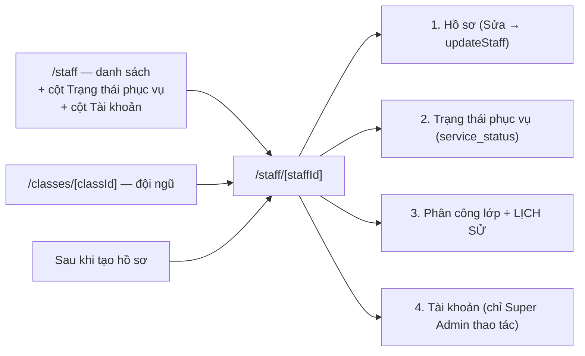
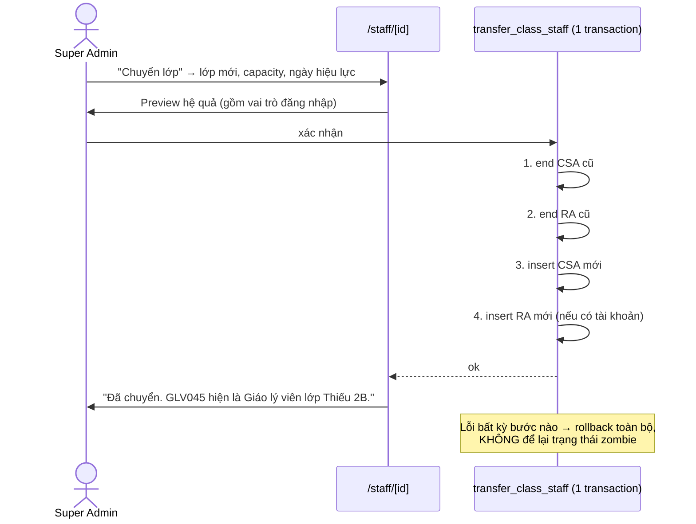

# M04-STAFF — Thiết kế To-Be

Chỉ viết cho luồng **NEEDS_IMPROVEMENT / CRITICAL**.
**M04-F09 (xem đội ngũ lớp) là PASS — giữ nguyên, không thiết kế lại.**

Ghi chú: TB-M04-01 và TB-M01-01 (`../M01-AUTH-ACCOUNT/04_TO_BE_FLOWS.md`) là **cùng một trang** `/staff/[staffId]`. Hai module phải triển khai chung, không tách được.

---

## TB-M04-00 — Điều kiện tiên quyết: mọi thao tác ghi phải có phản hồi (đóng 5W-05) — P0, S

**Mục tiêu người dùng:** “Tôi bấm lưu thì phải biết đã lưu hay chưa.”

**Bước mới:** chuyển 3 khối form của `/staff` thành Client Component (hoặc dùng `useActionState`), để `createStaff`/`assignStaffToClass`/`endClassStaffAssignment` trả `{ok, code, message}` **tới người dùng**.

- Thành công tạo hồ sơ → toast `"Đã tạo hồ sơ GLV045."` + điều hướng tới `/staff/GLV045`.
- Thành công phân công → toast `"Đã phân công GLV045 vào lớp Ấu 1A (Giáo lý viên lớp), từ 01/09/2026."`
- Thất bại → thông báo lỗi **theo field** khi là lỗi Zod, thông báo chung khi là lỗi RLS/trigger.

**Mapping mã lỗi → thông báo (mới, hiện đang gộp hết):**

| Mã | Nguồn | Thông báo tiếng Việt |
|---|---|---|
| `42501` | RLS / RPC | `"Bạn không có quyền thực hiện thao tác này."` |
| `23505` trên `class_staff_one_active_class_per_staff_idx` | DB | `"<Tên> đang phục vụ tại lớp <X>. Hãy kết thúc phân công cũ trước."` |
| `23505` trên `class_staff_one_active_representative_idx` | DB | `"Lớp <X> đã có Giáo lý viên đại diện. Hãy kết thúc phân công của người hiện tại trước."` |
| `CLASS_NOT_ACTIVE` (23514) | trigger | `"Lớp <X> không còn hoạt động."` |
| `ROLE_CAPACITY_MISMATCH` (23514) | trigger | `"<Tên> đang giữ vai trò <Y> ở lớp <Z>; phân công phải khớp vai trò đó."` |
| `ACTIVE_CLASS_ROLE_EXISTS` (23514) | trigger | `"Không thể kết thúc phân công khi vai trò lớp còn hiệu lực."` |
| `INVALID_END_DATE` (23514) | RPC | `"Ngày kết thúc không được trước ngày bắt đầu (<starts_on>)."` |
| `P0002` | RPC | `"Phân công không còn tồn tại hoặc đã được kết thúc."` |

**Permission:** không đổi. **Trạng thái dữ liệu:** không đổi. **Audit:** không đổi ở bước này.
**Rủi ro migration:** không có (thuần UI/action). **Rollback:** revert commit.

**So sánh số bước:** không đổi số bước, nhưng số lần **lặp lại thao tác do không biết kết quả** giảm về 0.

---

## TB-M04-01 — Trang chi tiết hồ sơ `/staff/[staffId]` (đóng M04-F03, F08, và là nền của F02/F06) — P0, M

**Mục tiêu người dùng:** “Mở hồ sơ một Huynh trưởng là thấy đủ: thông tin, đang phục vụ lớp nào, lịch sử, còn phục vụ hay đã nghỉ, có tài khoản chưa.”

**Actor:** đọc = `STAFF_ROLES` (phạm vi do `app.can_access_staff` quyết định); ghi hồ sơ/phân công = `STAFF_WRITE_ROLES`; thao tác tài khoản = `super_admin`.

**Điểm bắt đầu:** click vào một dòng ở `/staff`, hoặc redirect sau khi tạo hồ sơ, hoặc từ đội ngũ lớp ở `/classes/[classId]`.

**Bước mới — 4 khối:**

1. **Hồ sơ** — hiển thị + nút “Sửa” mở form dùng lại `updateStaff` (`src/features/staff/server/actions.ts:55-78`, hiện là dead code).
2. **Trạng thái phục vụ** — badge `Đang phục vụ` / `Tạm nghỉ` / `Đã nghỉ` + nút đổi (`service_status`). **Độc lập hoàn toàn** với khối Tài khoản.
3. **Phân công lớp** — phân công hiện tại + **toàn bộ lịch sử** (dữ liệu đã có trong DB, hiện bị vứt ở `src/features/staff/server/queries.ts:31`); nút “Phân công vào lớp” / “Kết thúc phân công”.
4. **Tài khoản đăng nhập** — xem `../M01-AUTH-ACCOUNT/04_TO_BE_FLOWS.md` §TB-01.

**Business rules**

| Mã | Phát biểu | Nơi enforce (To-Be) |
|---|---|---|
| BR-TB-M04-01 | `service_status` và `account_status` độc lập; đổi cái này không tự đổi cái kia | UI hai khối riêng + không có code liên kết (giữ nguyên schema đã tách) |
| BR-TB-M04-02 | `service_status = 'inactive'` **không** tự kết thúc phân công lớp; nhưng UI cảnh báo nếu người “Đã nghỉ” vẫn còn phân công active | UI (cảnh báo mềm), không thêm trigger |
| BR-TB-M04-03 | Field nhạy cảm (`date_of_birth`, `address`, `email`, trạng thái tài khoản) chỉ hiển thị cho `can_global_read()`; class staff cùng lớp chỉ thấy tên/danh xưng/mã/phân công | Query + render có điều kiện; **cần kiểm bằng E2E** |
| BR-TB-M04-04 | Lịch sử phân công luôn hiển thị đầy đủ, không xóa | Query (bỏ `.find(is_active)` ở `queries.ts:31`) |

**Validation:** `updateStaffSchema` đã sẵn (`src/features/staff/schemas.ts:17-19`); bổ sung ràng buộc `email` định dạng và `phone` chuẩn hóa qua `normalizeVietnamesePhone` (`src/features/auth/aliases.ts:9-14`) để hiển thị nhất quán.

**Error handling:** dùng mapping ở TB-M04-00. `staffId` không phải UUID hoặc không tồn tại → trang “không tìm thấy”, **không 500** (yêu cầu `AGENTS §5`, đã có test tương tự ở `tests/e2e/security.spec.ts:47-66`).

**Audit/history:** `updated_by` + `updated_at` đã có sẵn trên cả hai bảng (`20260715000400:27-28,46-47`) và trigger `set_updated_at` (`:33-35,61-63`). Trang chi tiết nên **hiển thị** “Cập nhật lần cuối bởi X lúc Y” — dữ liệu đã có, chỉ chưa dùng.

**So sánh số bước**

| Nghiệp vụ | As-Is | To-Be |
|---|---|---|
| Sửa số điện thoại một GLV | **Không làm được** (phải vào DB) | 3 chạm |
| Đánh dấu GLV tạm nghỉ | **Không làm được** | 2 chạm |
| Xem lịch sử phân công | **Không làm được** | 1 chạm |
| Xem GLV nào chưa có tài khoản | **Không làm được** | hiển thị sẵn ở danh sách |

**Ảnh hưởng:** M01 (đặt khối Tài khoản), M02 (lọc lớp theo năm học), M09 (có thể hiển thị membership Ban). **API/DB:** không migration. **Rollback:** xóa route + revert.

---

## TB-M04-02 — Đổi lớp giữ nguyên tài khoản (đóng M04-F06) — P0, M

**Mục tiêu người dùng:** “Chuyển anh A từ Ấu 1A sang Thiếu 2B mà anh ấy vẫn đăng nhập và điểm danh được ở lớp mới.”

Có **2 phương án**, vì đây là thay đổi ảnh hưởng lớn.

### Phương án A — “Thao tác Chuyển lớp” một bước (khuyến nghị)

Một RPC mới `transfer_class_staff(assignment_id, new_class_id, new_capacity, effective_on)` chạy trong **một transaction**:

1. deactivate `class_staff_assignments` cũ (`ends_on = effective_on - 1`)
2. deactivate `role_assignments` cũ (nếu có tài khoản liên kết)
3. insert `class_staff_assignments` mới (`starts_on = effective_on`)
4. nếu trước đó có role lớp active: insert `role_assignments` mới với role tương ứng capacity mới, cùng `academic_year_id` của lớp mới

Thứ tự này bắt buộc để vượt trigger `validate_class_staff_assignment` (`20260715000400:87-99`) và `validate_role_assignment_scope` (`:179-196`).

UI: nút **“Chuyển lớp”** trên `/staff/[staffId]` → dialog chọn lớp mới + vai trò trong lớp + ngày hiệu lực; preview: “Anh A sẽ kết thúc ở Ấu 1A ngày 31/10 và bắt đầu ở Thiếu 2B ngày 01/11. Vai trò đăng nhập chuyển từ *Giáo lý viên lớp (Ấu 1A)* sang *Giáo lý viên lớp (Thiếu 2B)*.”

**Ưu:** atomic thật; không bao giờ có trạng thái “zombie”; một thao tác duy nhất khớp cách người dùng nghĩ.
**Nhược:** cần migration RPC mới; quyền của RPC phải xử lý **hai mức quyền khác nhau** (phân công = global-write, gán role = super_admin) — xem §Rủi ro.

### Phương án B — Giữ 3 thao tác rời + bổ sung `assignPrimaryRole`

Không thêm RPC ghép; chỉ implement `assignPrimaryRole` (TB-M01-05) và **cảnh báo bắt buộc** ở bước “Kết thúc phân công”: “Thao tác này cũng sẽ vô hiệu hóa vai trò đăng nhập của <Tên>. Sau khi phân công lớp mới, hãy bấm *Cập nhật vai trò*.” Trang chi tiết hiển thị banner đỏ khi hồ sơ có phân công active nhưng tài khoản `role = null`.

**Ưu:** ít rủi ro DB hơn; tôn trọng ranh giới quyền hiện có (Super Admin vẫn là người duy nhất chạm `role_assignments`).
**Nhược:** vẫn 3 thao tác; vẫn có cửa sổ thời gian tồn tại trạng thái zombie; phụ thuộc người dùng làm đúng thứ tự.

### So sánh

| | PA A | PA B |
|---|---|---|
| Số thao tác đổi lớp | **1** | 3 |
| Cửa sổ trạng thái zombie | không có | có (giữa các thao tác) |
| Migration | +1 RPC | +1 RPC (`assign_primary_role`) |
| Ranh giới quyền | phải quyết định ai được gọi | giữ nguyên hiện trạng |
| Rủi ro | trung bình | thấp |
| Công sức | M | M |

**Khuyến nghị:** làm **PA B trước** (an toàn, đóng ngay lỗ hổng zombie bằng cảnh báo + nút khôi phục), rồi cân nhắc PA A ở phase sau nếu vận hành thật cho thấy 3 thao tác vẫn quá nặng. Lý do: PA A gộp hai mức quyền vào một RPC, và quyết định “ai được gọi” là câu hỏi nghiệp vụ chưa có câu trả lời (xem Q6).

**Rủi ro bảo mật của PA A (phản biện):** nếu RPC cho phép `can_global_write()` gọi, thì `secretary` gián tiếp sửa được `role_assignments` — điều mà `docs/05:187-190` dành riêng cho Super Admin. Nếu chỉ cho Super Admin gọi, thì việc chuyển lớp (nghiệp vụ thường ngày của Xứ đoàn trưởng) bị dồn hết về một người. **Không có lựa chọn nào hoàn hảo** → cần user chốt (Q6).

**Rủi ro migration & rollback (cả hai PA):** RPC mới không đổi cấu trúc bảng; rollback = `revoke execute` + `drop function`. Dữ liệu đã tạo bởi RPC là `role_assignments`/`class_staff_assignments` hợp lệ, không cần hoàn tác. **Bắt buộc chạy lại toàn bộ pgTAP RLS** vì `role_assignments` là nền của `app.current_role()`.

---

## TB-M04-03 — Chống trùng hồ sơ (đóng phần C4/C5 của M04-F02) — P1, S

**Nguyên tắc: cảnh báo mềm, không chặn cứng** — theo tinh thần `docs/03-workflow.md:87` (“hệ thống cảnh báo trùng gần đúng; người nhập vẫn được tiếp tục”).

- Khi submit form tạo hồ sơ, server truy vấn hồ sơ có `phone` trùng **hoặc** (`full_name` gần đúng **và** `date_of_birth` trùng).
- Nếu có → **không tạo ngay**, trả về danh sách nghi ngờ + yêu cầu xác nhận “Vẫn tạo hồ sơ mới”.
- **Không** thêm unique constraint trên `phone`/`email` (gia đình dùng chung số; hai GLV trùng họ tên là bình thường).
- Nút submit `disabled` khi đang chạy để chặn bấm đúp.

---

## TB-M04-04 — Danh sách nhân sự dùng được (đóng M04-F01) — P1, S/M

- Thêm cột/nhãn: **Trạng thái phục vụ**, **Tài khoản** (`Đã có GLV045` / `Chưa có` / `⚠ Chưa gán vai trò`).
- Query bổ sung `service_status`, `profile_id` (`src/features/staff/server/queries.ts:21`).
- Thêm tìm kiếm theo tên/mã, lọc theo lớp và trạng thái phục vụ, phân trang.
- Việt hóa `formation_level`: `none → "Chưa qua huấn luyện"`, `i/ii/iii → "Cấp I/II/III"`, `special → "Đặc biệt"` (thay `toUpperCase()` ở `staff/page.tsx:34`).
- Lọc dropdown lớp theo **năm học hiện hành** (`queries.ts:22`).
- Mỗi dòng link tới `/staff/[staffId]`.

---

## TB-M04-05 — Nhãn và cảnh báo cho “Kết thúc phân công” (đóng M04-F05) — P0, S

- Đổi nhãn/mô tả để nói đúng hệ quả; thêm dialog xác nhận nêu rõ: *“Sẽ kết thúc phân công tại lớp X **và** vô hiệu hóa vai trò đăng nhập hiện tại của <Tên>.”*
- Ô ngày kết thúc: prefill hôm nay, `min = starts_on` của phân công.
- Sau khi thành công: hiển thị gợi ý hành động tiếp theo (“Phân công lớp mới” / “Cập nhật vai trò”).

---

## TB-M04-06 — Feature flag `sector_leader_can_manage_class_staff` — P3, NEEDS_CONFIRMATION

`docs/05-permission-matrix.md:184,294,303` mô tả flag này (mặc định `false`) nhưng **không tồn tại ở bất kỳ đâu trong code hay DB**. Hiện tại sector leader **luôn** bị chặn — trùng khớp với mặc định an toàn, nên **không phải lỗi**. Chỉ cần chốt: có làm flag này trong v1 không (Q7)? Nếu không → **cập nhật docs/05 để bỏ mô tả flag**, tránh hiểu nhầm là tính năng đã có.

---

## Tổng hợp so sánh As-Is vs To-Be

| Nghiệp vụ | As-Is | To-Be |
|---|---|---|
| Tạo hồ sơ GLV | 1 form, **không phản hồi**, không biết mã sinh ra | 1 form → toast + mở thẳng hồ sơ mới |
| Sửa hồ sơ | **không làm được** | 3 chạm |
| Đánh dấu tạm nghỉ | **không làm được** | 2 chạm |
| Phân công lớp | 1 form, không phản hồi, dropdown gộp mọi năm học | 1 form có phản hồi, lọc đúng năm học, cảnh báo lớp đã có đại diện |
| Kết thúc phân công | 1 form, tác dụng phụ ẩn, không phản hồi | 1 form + confirm nêu rõ hệ quả + gợi ý bước tiếp |
| Đổi lớp giữ tài khoản | **không làm được** | PA B: 3 thao tác có hướng dẫn · PA A: 1 thao tác atomic |
| Xem lịch sử phân công | **không làm được** | có sẵn ở trang chi tiết |
