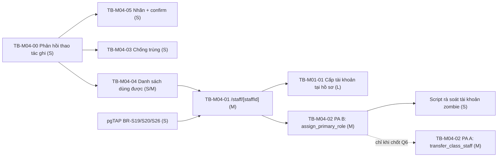

# M04-STAFF — Ảnh hưởng triển khai To-Be

Ước lượng: **S** ≤ 0,5 ngày · **M** 1–2 ngày · **L** > 2 ngày.

## 1. Bảng tổng hợp theo To-Be

| To-Be | File phải sửa/thêm | Server Action / RPC | Schema / Migration | RLS | Dữ liệu hiện có | Test phải thêm | Công sức |
|---|---|---|---|---|---|---|---|
| **TB-M04-00** Phản hồi cho mọi thao tác ghi | `src/features/staff/server/actions.ts:115-140`; `src/app/(dashboard)/staff/page.tsx:38-72`; **mới** `src/features/staff/components/staff-workspace.tsx` (Client) | sửa 3 wrapper (bỏ `Promise<void>`), thêm map mã lỗi | Không | Không | Không đổi | unit: map mã lỗi; E2E: tạo hồ sơ thấy toast, thiếu quyền thấy lỗi | **S** |
| **TB-M04-04** Danh sách dùng được | `src/features/staff/server/queries.ts:17-40`; `staff/page.tsx:31-45` | Không | Không | Không | Không đổi | E2E: tìm kiếm/lọc; unit: nhãn `formation_level` | **S/M** |
| **TB-M04-05** Nhãn + confirm “Kết thúc phân công” | `staff/page.tsx:38-42` (→ component client) | Không | Không | Không | Không đổi | E2E: hủy confirm thì không gọi action | **S** |
| **TB-M04-03** Chống trùng hồ sơ (cảnh báo mềm) | `src/features/staff/server/actions.ts:32-53`; component form | sửa `createStaff` (2 pha: kiểm tra → xác nhận) | Cân nhắc index hỗ trợ tìm kiếm `phone` | Không | Không đổi | unit: phát hiện trùng; E2E: xác nhận vẫn tạo được | **S** |
| **TB-M04-01** `/staff/[staffId]` | **mới** `src/app/(dashboard)/staff/[staffId]/page.tsx`; `src/features/staff/server/queries.ts` (+`getStaffDetail`); component chi tiết | kích hoạt `updateStaff` (đã có, `actions.ts:55-78`) | Không | **Cần rà** hiển thị field nhạy cảm theo `can_global_read()` | Không đổi | E2E: sửa hồ sơ; đổi `service_status`; **E2E rò rỉ dữ liệu (bắt buộc)**; E2E UUID rác không 5xx | **M** |
| **TB-M04-02 PA B** `assignPrimaryRole` + cảnh báo zombie | `src/features/auth/**` (xem M01 §TB-05); `staff/[staffId]` (banner + nút) | **+1 RPC `assign_primary_role`** + 1 action | **Có** — RPC mới | `grant execute to authenticated`; RPC tự kiểm `app.is_super_admin()` | Có thể tồn tại tài khoản zombie sẵn → cần script rà soát | **pgTAP (bắt buộc)**: atomic, 1 active, non-SA bị `42501`, role ceiling; **E2E (bắt buộc)**: đổi lớp giữ tài khoản | **M** |
| **TB-M04-02 PA A** `transfer_class_staff` | như PA B + RPC ghép | **+1 RPC** | **Có** | Quyết định ai được gọi (Q6) | Không đổi | pgTAP: rollback toàn phần khi bước 4 lỗi | **M** (chỉ làm sau khi chốt Q6) |
| **TB-M04-06** Feature flag sector leader | — | — | phụ thuộc Q7 | phụ thuộc Q7 | — | RLS negative cho `sector_leader` | **S** (nếu chỉ sửa docs) |

## 2. Chi tiết file phải sửa

| File | Việc | Ghi chú |
|---|---|---|
| `src/features/staff/server/actions.ts:115-127` | `createStaffFromForm` → trả `StaffActionResult`; bỏ hardcode `serviceStatus: "active"` (`:125`) | Chữ ký form action Next 15 buộc chuyển sang `useActionState` hoặc Client Component gọi trực tiếp |
| `src/features/staff/server/actions.ts:129-140` | 2 wrapper còn lại, tương tự | |
| `src/features/staff/server/actions.ts:27-30` | `fail()` hiện nuốt cả `NEXT_REDIRECT` → cần re-throw khi lỗi là redirect của Next | Cùng vấn đề với `src/features/auth/server/actions.ts:32-35` |
| `src/features/staff/server/queries.ts:21` | Thêm `service_status`, `profile_id`, join `profiles(username, account_status)` và `role_assignments(role, is_active)` | Cẩn thận: RLS `profiles_select_self_or_global` chỉ cho global-read thấy profile người khác → với class staff, join sẽ trả `null`, phải xử lý |
| `src/features/staff/server/queries.ts:22` | Lọc `academic_year_id` = năm hiện hành | Cần query `academic_years` `status='current'` như `classes/server/queries.ts:60-64` |
| `src/features/staff/server/queries.ts:31` | Giữ **toàn bộ** `class_staff_assignments` thay vì chỉ `.find(is_active)` | Cho trang chi tiết |
| `src/app/(dashboard)/staff/page.tsx:16` | Bỏ `writeRoles` hardcode, import từ `actions.ts:19` (export nó ra) | Xóa nguồn lệch |
| `src/app/(dashboard)/staff/page.tsx:34` | Bảng nhãn `formationLevelLabels` như `titleLabels`/`capacityLabels` đã có (`:17-18`) | Pattern đã tồn tại trong chính file |
| `src/features/staff/schemas.ts` | Thêm `serviceStatus` vào form tạo (bỏ default cứng); ràng buộc `endsOn >= startsOn` ở tầng Zod nếu biết `startsOn` | |
| **mới** `src/features/staff/components/staff-workspace.tsx` | Client Component chứa 3 form + state thông báo, theo đúng pattern `src/features/auth/components/account-admin-panel.tsx:26,55` | Không phát minh pattern mới |
| **mới** `src/app/(dashboard)/staff/[staffId]/page.tsx` | Trang chi tiết | Guard `requireRouteAccess("/staff")` — `getRouteRule` đã match prefix (`route-map.ts:53`), không cần sửa route-map |

## 3. Ảnh hưởng module khác

| Module | Ảnh hưởng | Mức |
|---|---|---|
| **M01-AUTH-ACCOUNT** | Trang chi tiết là nơi đặt khối “Tài khoản”; `assign_primary_role` dùng chung. **Phải làm cùng lúc** | Cao |
| **M02-ACADEMIC-STRUCTURE** | Query lớp phải lọc theo năm hiện hành; `/classes/[classId]` thêm link sang hồ sơ GLV | Trung bình |
| **M05-ATTENDANCE** | `attendance_sessions` FK tới `class_staff_assignments`/`staff_profiles` (`20260721000300:110-112`). Nếu TB-M04-02 PA A tạo/kết thúc phân công thì **phiên điểm danh đang mở của phân công cũ phải được xử lý** — hiện RPC `end_class_staff_assignment` **không** kiểm điều này | **Cao — rủi ro chưa được audit ở module này** |
| **M06-TEACHING-PLANS** | `teacher_staff_id` `on delete restrict` (`20260722000100:32`) — không ảnh hưởng vì không xóa hồ sơ | Thấp |
| **M09-COMMITTEES** | Trang chi tiết có thể hiển thị membership Ban (`20260723000100:36`) | Thấp (tùy chọn) |
| **M11-REPORTS** | Khi `service_status` sống lại, báo cáo “Tổng Giáo lý viên” (`docs/01:491`) phải quyết định đếm ai | Trung bình |
| **M14-NAVIGATION-SHELL** | Không đổi | Thấp |

## 4. Test phải thêm

**pgTAP (`supabase/tests/005_staff_assignments_test.sql` + file mới)**

1. `service_status` mặc định `active`; update sang `paused`/`inactive` được bởi global-write, bị chặn với class teacher.
2. Trigger `CLASS_NOT_ACTIVE` — phân công active vào lớp `status <> 'active'` phải raise `23514` (BR-S19, **hiện không có test**).
3. Trigger `ROLE_CAPACITY_MISMATCH` — hồ sơ có role `class_teacher` mà phân công `capacity='representative'` phải raise `23514` (BR-S20, **hiện không có test**).
4. `end_class_staff_assignment` với `ends_on < starts_on` → `23514 INVALID_END_DATE`.
5. `end_class_staff_assignment` gọi bởi `class_teacher`/`sector_leader` → `42501 FORBIDDEN` (**hiện chỉ test nhánh thành công**, `005:56-60`).
6. `validate_role_assignment_scope` nhánh lớp: thiếu phân công → `ACTIVE_CLASS_ASSIGNMENT_REQUIRED`; sai capacity → `23514`; đúng → `lives_ok` (BR-S26, **hiện không có test** — dùng chung với M01 §S7).
7. File mới: `assign_primary_role` (xem `../M01-AUTH-ACCOUNT/07_IMPLEMENTATION_IMPACT.md` §4).
8. RLS UPDATE `staff_profiles` với `updated_by <> auth.uid()` → `42501`.

**Unit (`tests/unit/staff-schemas.test.ts`)**

9. `updateStaffSchema` partial: chỉ gửi `phone` là hợp lệ; `id` sai UUID bị chặn.
10. `serviceStatus` các giá trị hợp lệ/không hợp lệ.
11. Map mã lỗi Postgres → thông báo tiếng Việt (hàm thuần, dễ test).

**E2E (`tests/e2e/`)**

12. File mới `staff.spec.ts`: tạo hồ sơ → thấy toast + mã GLV; phân công → thấy toast; phân công người đã có lớp → thấy lỗi cụ thể; kết thúc phân công → confirm nêu đúng hệ quả.
13. `security.spec.ts`: `/staff/<uuid-không-tồn-tại>` và `/staff/khong-phai-uuid` không trả 5xx.
14. **Rò rỉ dữ liệu (bắt buộc):** `class_teacher` mở `/staff/<id-đồng-nghiệp>` không thấy ngày sinh/địa chỉ/email/trạng thái tài khoản.
15. **Đổi lớp giữ tài khoản (bắt buộc):** GLV chuyển lớp rồi đăng nhập vẫn vào được lớp mới.
16. `authenticated-shell.spec.ts`: thêm `/staff/[id]` vào vòng kiểm 3 viewport.

## 5. Rủi ro dữ liệu hiện có

| Rủi ro | Mô tả | Xử lý đề xuất |
|---|---|---|
| Tài khoản “zombie” đang tồn tại | Có thể đã có GLV bị kết thúc phân công mà chưa gán lại role (`role_assignments` không active nào) | Script rà soát: `profiles` có `account_status='active'` nhưng không có `role_assignments` active → liệt kê cho Super Admin xử lý sau khi có `assign_primary_role` |
| Hồ sơ trùng đã tạo | Do 5W-05 (thao tác im lặng → bấm lại) | Script rà soát trùng `phone` / `full_name + date_of_birth`; **không tự động gộp** |
| Hồ sơ mồ côi không tài khoản | Là **hợp lệ** (BR-S09), không phải rác | Chỉ cần hiển thị trong danh sách, không xử lý dữ liệu |
| `service_status` toàn bộ = `active` | Do hardcode (`actions.ts:125`) | Không cần migration; người dùng tự cập nhật sau khi có UI |

## 6. Thứ tự phụ thuộc

**Giải thích**

1. **TB-M04-00 là chốt chặn của mọi việc khác.** Không có phản hồi thì không viết được E2E, không xác minh được bất kỳ thay đổi nào sau đó.
2. **Bổ sung pgTAP cho BR-S19/S20/S26 trước khi mở trang chi tiết** — ba trigger này là lưới an toàn duy nhất cho luồng phân công và sẽ bị chạm nhiều khi thêm UI.
3. **Trang chi tiết trước, tài khoản sau** — cần “nơi” trước khi đặt nút.
4. **`assign_primary_role` trước script rà soát zombie** — có công cụ mới đi dọn dữ liệu.
5. **PA A chờ Q6.**
