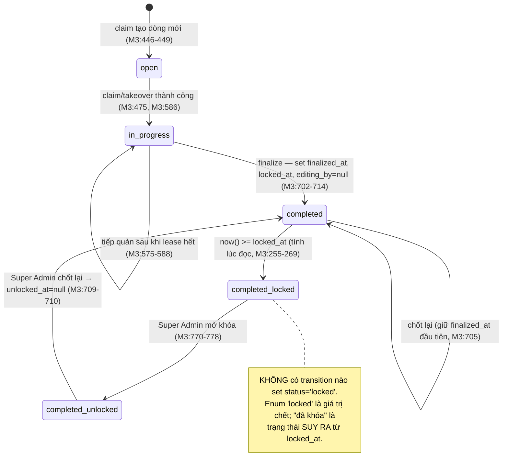
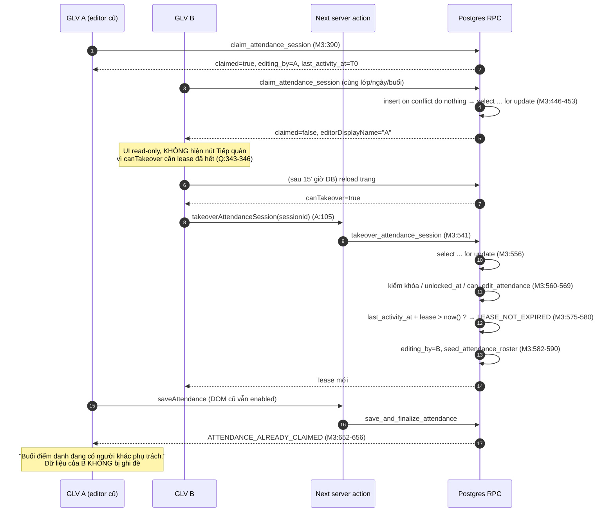

# M05-ATTENDANCE — Luồng AS-IS

> Đường dẫn viết tắt: `A` = `src/features/attendance/server/actions.ts`,
> `Q` = `src/features/attendance/server/queries.ts`,
> `E` = `src/features/attendance/components/attendance-editor.tsx`,
> `M3` = `supabase/migrations/20260721000300_attendance_sessions.sql`,
> `M4` = `supabase/migrations/20260721000400_absence_requests.sql`,
> `M5` = `supabase/migrations/20260721000500_attendance_alerts_and_score.sql`.

## 0. Vòng đời buổi điểm danh (thực tế trong code)

**Sai lệch với WF-05** (`docs/03-workflow.md:115-124`): sơ đồ tài liệu có state `Locked` là trạng thái
lưu trong DB; code chỉ suy ra từ `locked_at` và không bao giờ ghi `status='locked'`
(grep toàn repo: không có `status = 'locked'` ở vế gán). Hệ quả xem F07.

---

## M05-ATTENDANCE-F01 — Mở/tạo buổi điểm danh + claim

**Actor:** GLV lớp / GLV đại diện / Dự trưởng phụ tá / Super Admin.

| Bước | Chi tiết | Bằng chứng |
|---|---|---|
| 1 | Vào `/attendance`; hệ thống nạp năm học `status='current'` và danh sách lớp được điểm danh | `Q:119-147`, `Q:75-117` |
| 2 | Form mặc định: lớp đầu tiên, ngày = thứ Năm/Chúa nhật gần nhất, buổi suy ra từ ngày | `src/app/(dashboard)/attendance/page.tsx:56-57,81-102` |
| 3 | Submit → server action `openAttendanceSessionFromForm` | `A:206-217` |
| 4 | Zod: `classId` uuid, `date` `^\d{4}-\d{2}-\d{2}$`, `meetingType` enum | `src/features/attendance/schemas.ts:20-24` |
| 5 | RPC `claim_attendance_session`: kiểm auth → `can_edit_attendance` → isodow → lớp `active` → đọc `lease_minutes`/`lock_days` | `M3:417-444` |
| 6 | `insert … on conflict do nothing` rồi `select … for update` — **row lock trước khi quyết định editor** | `M3:446-453` |
| 7 | Chặn nếu đã khóa (trừ SA) hoặc `unlocked_at` khác null (trừ SA) | `M3:455-463` |
| 8 | `lease_free` = chưa có editor **hoặc** chính mình **hoặc** `last_activity_at + lease <= now()` — **giờ DB** | `M3:465-468` |
| 9 | Nếu free: set `editing_by`, `editing_started_at`, `last_activity_at`, `status='in_progress'`, rồi `seed_attendance_roster` | `M3:470-481` |
| 10 | Seed roster: `insert … select … on conflict do nothing`, `mass_status='present'`, `catechism_status='present'` | `M3:364-374` |
| 11 | Redirect `/attendance/{sessionId}` **bất kể `claimed` true hay false** | `A:213-216` |

**Trạng thái cuối:** session `in_progress`, roster đầy đủ mặc định có mặt, editor = người claim
(hoặc giữ nguyên editor cũ nếu lease còn).

### Error path / edge case F01

| Tình huống | Kết quả thực tế | Đánh giá |
|---|---|---|
| Ngày không phải thứ Năm/CN | `ATTENDANCE_INVALID_MEETING_DAY` → "Chỉ điểm danh vào thứ Năm hoặc Chúa nhật." (`A:37`) | ✔ |
| Lớp không phải của mình | `FORBIDDEN` (`M3:421-423`); pgTAP `012:80-97` | ✔ |
| Lớp đã `archived` | `CLASS_NOT_ACTIVE` (`M3:438-440`) | ✔ |
| Hai GLV bấm cùng lúc | `on conflict do nothing` chờ speculative lock, sau đó `for update` thấy dòng đã commit → người thứ hai nhận `claimed=false` và tên editor | ✔ ATOMIC |
| Người thứ hai vào trang | Vẫn redirect vào trang buổi, **không có thông báo "X đang giữ"** ở tầng hub, chỉ thấy dòng chữ trong editor | ⚠ F01-I3 |
| **Sáng Chúa nhật trước 07:00 ICT** | `mostRecentMeetingDate()` dùng `new Date()`/`getDay()`/`toISOString()` theo giờ **server (UTC trên Vercel)** → thấy là thứ Bảy → lùi về **thứ Năm trước đó**, `defaultMeeting='thursday'` → GLV mở nhầm buổi thứ Năm | ✖ **F01-I1 (HIGH)** `src/app/(dashboard)/attendance/page.tsx:22-31`; đối chiếu `src/lib/dates/index.ts:4` có `APP_TIME_ZONE` nhưng không dùng ở đây |
| Chưa có năm học `current` | Trang hướng dẫn sang `/admin`, không hiện số 0 giả | ✔ `page.tsx:41-54` |
| Không được phân công lớp nào | Empty state giải thích rõ vai trò trưởng ngành | ✔ `page.tsx:75-79` |
| UUID lớp không hợp lệ | Zod chặn → redirect kèm `?error=` | ✔ |
| Buổi đã khóa | `ATTENDANCE_LOCKED` (`M3:457-459`) | ✔ |

---

## M05-ATTENDANCE-F02 — Mở trang buổi (read-only hoặc editor)

| Bước | Chi tiết | Bằng chứng |
|---|---|---|
| 1 | `requireRouteAccess('/attendance/{id}')` → khớp prefix `/attendance` | `Q:196`, `src/lib/permissions/route-map.ts:50-54` |
| 2 | Đọc session + roster + nhân sự + đơn xin nghỉ + phân công của chính mình (5 query song song) | `Q:233-260` |
| 3 | Tính `isLocked`, `isEditor`, `canTakeover`, `canEdit`, `canUnlock` **ở tầng app**, dựa `leaseMinutes` từ `academic_years` | `Q:305-317,342-348` |
| 4 | Editor render read-only nếu `!isEditor` | `E:154,352-361` |
| 5 | Tên editor lấy qua `staff_profiles` (RLS theo lớp) vì `profiles` chỉ mở cho self/global (D-32) | `Q:225-231,336-338` |

### Edge case F02

- Session không tồn tại / ngoài RLS → `notFound()` (`[sessionId]/page.tsx:25`). Không phân biệt
  "không có" và "không được xem" — đúng hướng bảo mật.
- `isEditor` tính bằng `Date.now()` **trên server Next**, không phải giờ DB (`Q:306,342`). Đây chỉ là
  gợi ý UI; RPC vẫn chặn thật (`M3:652-656`). Chấp nhận được nhưng có thể lệch vài giây.
- Buổi đã khóa: hiện thẻ giải thích + toàn bộ select `disabled` (`[sessionId]/page.tsx:66-74`, `E:223`).

---

## M05-ATTENDANCE-F03 — Sửa nháp và Lưu nháp

| Bước | Chi tiết | Bằng chứng |
|---|---|---|
| 1 | Draft khởi tạo 1 lần từ props (`useState(() => buildStudentDraft(roster))`) | `E:76-77,50-63` |
| 2 | Đổi select Thánh lễ / Giáo lý — hai `setStudents` **riêng biệt**, không cái nào ghi đè cái kia | `E:225-233` vs `E:247-255` |
| 3 | Ô ghi chú chỉ hiện khi có ngoại lệ hoặc note đã có | `E:208,263-281` |
| 4 | Bấm "Lưu nháp" → `saveAttendance({... finalize:false})` gửi **toàn bộ** roster | `E:107-139` |
| 5 | Zod: mảng ≤300 học sinh, ≤50 nhân sự, note trim→null, `finalize` bắt buộc boolean | `schemas.ts:26-44` |
| 6 | RPC: lock dòng session → `can_edit_attendance` → chặn khóa → chặn `unlocked_at` → **kiểm editor + lease** → `seed_attendance_roster` → 2 câu UPDATE bằng `jsonb_to_recordset` | `M3:632-684` |
| 7 | Nhánh nháp: `last_activity_at = now()` (gia hạn lease bằng chính thao tác lưu) | `M3:725-728` |
| 8 | `revalidatePath` + `router.refresh()` + thông báo "Đã lưu nháp." | `A:54-57,159`, `E:130-135` |

### Error path / edge case F03

| Tình huống | Kết quả | Đánh giá |
|---|---|---|
| Editor cũ lưu sau khi bị tiếp quản | `ATTENDANCE_ALREADY_CLAIMED` → "Buổi điểm danh đang có người khác phụ trách."; **không ghi đè** | ✔ `M3:652-656`; E2E `tests/e2e/attendance.spec.ts` bài 2 |
| Buổi vừa qua mốc khóa khi trang còn mở | `ATTENDANCE_LOCKED` → "Buổi điểm danh đã bị khóa." | ✔ `M3:639-642`; E2E bài 3 |
| Trạng thái không có trong enum | Zod chặn ở server action | ✔ unit test |
| Em đã rời lớp với `ended_on` **lùi trước** ngày buổi | Trigger `sync_student_attendance_keys` raise `ATTENDANCE_ENROLLMENT_NOT_OPEN`; mã này **không có** trong `RPC_ERROR_CODES` → người dùng chỉ thấy "Thao tác bị xung đột. Vui lòng thử lại." và **không bao giờ lưu/chốt được buổi đó** | ✖ **F03-I1 (MED)** `M3:178-180` vs `A:24-34` |
| Em mới ghi danh sau khi mở buổi | `seed_attendance_roster` chạy lại trong chính RPC save (`M3:658`) → có dòng, mặc định present. Nhưng roster trên màn hình vẫn cũ tới khi `router.refresh()` | ⚠ F03-I2 (LOW) |
| Bấm Lưu nháp 2 lần liên tiếp | `disabled={pending}` (`E:354`); lần sau ghi cùng giá trị → idempotent | ✔ |
| Mất mạng giữa chừng | `fail()` trả `CONFLICT` chung chung "Không lưu được điểm danh." | ⚠ thông điệp mờ |

---

## M05-ATTENDANCE-F04 — Heartbeat gia hạn lease

| Bước | Chi tiết | Bằng chứng |
|---|---|---|
| 1 | `setInterval` chạy khi `isEditor`, nhịp `max(30s, lease/2)` | `E:84-96` |
| 2 | RPC lock dòng, kiểm `can_edit_attendance`, kiểm `editing_by = actor` **và** lease chưa hết | `M3:513-529` |
| 3 | Thành công: `last_activity_at = now()`; trả `now() + lease` (giá trị này **không được UI dùng**) | `M3:531-535`, `A:95-99` |
| 4 | Thất bại: hiện lỗi + `router.refresh()` → trang chuyển read-only | `E:88-93` |

### Edge case F04

- **Mất bản nháp âm thầm:** khi heartbeat báo lỗi, `router.refresh()` render lại với `isEditor=false`;
  state draft vẫn nằm trong bộ nhớ nhưng mọi control `disabled` và nút Lưu biến mất → công sức đã gõ
  không còn đường lưu và **không có cảnh báo rõ ràng**. ✖ **F04-I1 (MED)** `E:88-93,154,352`.
- Đóng tab: lease tự hết sau 15 phút; không có `beforeunload` để nhả sớm → GLV khác phải chờ đủ 15 phút.
  ⚠ F04-I2 (LOW).
- **Không hiển thị thời gian còn lại của lease**; `leaseMinutes` chỉ dùng để đặt interval (`E:86`).
  ⚠ F04-I3 (MED, xem 06_UI_UX).

---

## M05-ATTENDANCE-F05 — Tiếp quản (takeover)

**Xác nhận bằng test thật:** `tests/e2e/attendance.spec.ts` bài 2 dùng hai browser context độc lập,
đẩy `last_activity_at` về quá khứ bằng service role (chỉ để chỉnh đồng hồ), rồi kiểm B ghi được và
A bị từ chối; sau đó reload B xác nhận giá trị của B còn nguyên. pgTAP `012:151-199` phủ cùng luật ở
tầng DB.

### Edge case F05

- Tiếp quản khi lease còn hạn → `LEASE_NOT_EXPIRED` (`M3:579`) → "Chưa thể tiếp quản vì phiên chỉnh
  sửa chưa hết hạn." ✔
- Tiếp quản buổi đã khóa → `ATTENDANCE_LOCKED` ✔ (`M3:563-566`).
- Sau tiếp quản, `seed_attendance_roster` chạy lại (`M3:590`) nên em mới ghi danh vẫn được thêm,
  `on conflict do nothing` giữ nguyên ngoại lệ A đã sửa ✔.
- Nút "Tiếp quản" chỉ hiện khi `canTakeover` — tính bằng giờ **server Next**, có thể lệch vài giây so
  với DB; bấm sớm sẽ nhận `LEASE_NOT_EXPIRED` với thông điệp rõ ràng ✔.

---

## M05-ATTENDANCE-F06 — Hoàn tất (finalize)

| Bước | Chi tiết | Bằng chứng |
|---|---|---|
| 1 | Bấm "Hoàn tất điểm danh" (hoặc "Chốt lại" nếu đã chốt) — **không có hộp xác nhận** | `E:357-359` |
| 2 | Cùng RPC với lưu nháp, `p_finalize=true` | `A:141-155` |
| 3 | Đủ điều kiện editor/lease/khóa như F03 | `M3:632-656` |
| 4 | `seed_attendance_roster` + 2 câu UPDATE | `M3:658-684` |
| 5 | Kiểm roster đủ: đếm `enrollments` mở tại ngày buổi vs số dòng record; thiếu → `ATTENDANCE_ROSTER_INCOMPLETE` | `M3:686-700` |
| 6 | `status='completed'`, `finalized_at = coalesce(finalized_at, now())`, `finalized_by = coalesce(...)`, `locked_at = finalized_at + lock_days`, `unlocked_at=null`, **`editing_by=null`** | `M3:702-714` |
| 7 | Đẩy `session_finalized_at` xuống mọi dòng student/staff → mở cổng đọc cho phụ huynh | `M3:716-723` |
| 8 | Trả về tổng kết (sĩ số, đủ hai buổi, có vắng, GLV có mặt) → hiện thẻ "Tổng kết buổi" | `M3:731-748`, `E:179-191` |

**Tính nguyên tử:** toàn bộ nằm trong một hàm plpgsql = một transaction; dòng session bị `for update`
từ đầu (`M3:632`). ✔ khớp WF-05 "Upsert toàn bộ records nguyên tử".

**Tính idempotent về dữ liệu:** chốt lại giữ `finalized_at` đầu tiên nên **không đẩy lùi mốc khóa
3 ngày** (`M3:705`); pgTAP `012:266-278` kiểm đúng điều này. ✔

### Error path / edge case F06

| Tình huống | Kết quả | Đánh giá |
|---|---|---|
| Bấm chốt lần 2 ngay sau khi chốt | `editing_by` đã bị xóa (`M3:710`) → RPC ném `ATTENDANCE_ALREADY_CLAIMED` → **"Buổi điểm danh đang có người khác phụ trách."** dù không ai giữ | ✖ **F06-I1 (MED)** thông điệp sai ngữ nghĩa |
| Muốn sửa lại sau khi chốt | Phải bấm "Tiếp quản" trước, dù mình vừa là người chốt | ⚠ F06-I2 — thêm 1 bước không hiển nhiên |
| Không có hộp xác nhận trước khi chốt | `docs/06-ui-ux-spec.md:322-331` yêu cầu bảng phân bố trạng thái trước finalize; hiện tổng kết chỉ hiện **sau** | ✖ **F06-I3 (MED)** |
| Em rời lớp với `ended_on` lùi quá khứ | Bước 7 update mọi dòng → trigger raise → **không chốt được vĩnh viễn** | ✖ F03-I1 lặp lại ở finalize (`M3:716-723`) |
| Roster thiếu (dữ liệu lạ) | `ATTENDANCE_ROSTER_INCOMPLETE` → "Danh sách chưa đủ. Vui lòng tải lại trang rồi chốt lại." | ✔ `A:38` |
| Lớp trống (0 em) | `roster_size=0`, `record_size=0` → chốt được, tổng kết toàn 0 | ✔ hợp lý |

---

## M05-ATTENDANCE-F07 — Khóa sau 3 ngày

- Mốc khóa đặt lúc finalize: `locked_at = finalized_at + make_interval(days => lock_days)` (`M3:707`),
  `lock_days` đọc từ `academic_years.attendance_lock_days` — **không hardcode** (`M3:647-649`).
- Enforce ở **DB**, trong cả 3 RPC ghi: claim (`M3:455-459`), takeover (`M3:563-566`), save/finalize
  (`M3:639-642`). `authenticated` không có `insert/update` trên bảng (`M3:283-285`) ⇒ **không có
  đường vòng bằng PostgREST trực tiếp**; pgTAP `012:134-149` chứng minh.
- Hàm `app.attendance_is_locked` tồn tại (`M3:255-269`) nhưng **không RPC nào gọi**; mỗi RPC tự lặp
  lại biểu thức. ⚠ F07-I2 (LOW, dễ trôi luật khi sửa).

### Edge case F07

- **Trạng thái hiển thị lệch giữa hai màn hình:** hub `/attendance` in `SESSION_STATUS_LABELS[session.status]`
  → "Đã chốt" cho buổi đã quá hạn khóa (`src/app/(dashboard)/attendance/page.tsx:133-135`), trong khi
  trang chi tiết in `detail.isLocked ? "locked" : status` → "Đã khóa"
  (`[sessionId]/page.tsx:44-46`). ✖ **F07-I1 (MED)**.
- Enum `attendance_session_status` có giá trị `'locked'` **không bao giờ được ghi** → chết. ⚠ F07-I3.
- Trang đang mở khi mốc khóa trôi qua: thao tác lưu bị DB từ chối đúng, E2E bài 3 chứng minh ✔.

---

## M05-ATTENDANCE-F08 — Super Admin mở khóa

| Bước | Chi tiết | Bằng chứng |
|---|---|---|
| 1 | Nút "Mở khóa" chỉ hiện khi `canUnlock = isSuperAdmin && (isLocked || locked_at !== null)` | `Q:348`, `[sessionId]/page.tsx:57-62` |
| 2 | Server action **kiểm lại role ở server** trước khi gọi RPC | `A:180-183` |
| 3 | RPC kiểm `app.is_super_admin()` lần nữa | `M3:766-768` |
| 4 | `status='completed'`, `locked_at=null`, `unlocked_at=now()`, `unlocked_by=actor`, `editing_by=null` | `M3:770-778` |
| 5 | Lỗi → redirect kèm `?error=` (không redirect khi thành công, có chú thích lý do) | `A:196-204` |

### Edge case F08

- Không phải SA gọi thẳng action → `FORBIDDEN` ở cả 2 tầng ✔ pgTAP `012:331-342`.
- Session không tồn tại → `RESOURCE_NOT_FOUND` (`M3:779-781`) ✔.
- Gọi RPC trên buổi **chưa từng chốt**: `status='completed'` vi phạm
  `attendance_sessions_completed_needs_finalize` (`M3:65-67`) → lỗi generic "Thao tác bị xung đột".
  Không tới được từ UI (vì `canUnlock` cần `locked_at`), nhưng RPC được grant cho `authenticated`
  (`M3:785-791`). ⚠ F08-I1 (LOW).
- Không ghi audit log before/after — **đúng theo** WF-05 "Không lưu before/after log"
  (`docs/03-workflow.md:162`). `unlocked_by`/`unlocked_at` là dấu vết duy nhất ✔.

---

## M05-ATTENDANCE-F09 — Sửa sau khi mở khóa

- Sau unlock, `editing_by=null` nên SA phải bấm **"Tiếp quản"** rồi mới sửa được (`Q:343-346`).
- Người không phải SA: `canEdit` ở UI đã false (`Q:317`), và cả 3 RPC ghi đều chặn bằng
  `unlocked_at is not null and not is_super_admin()` (`M3:461-463`, `:567-569`, `:643-645`).
  pgTAP `012:343-359` chứng minh GLV bị chặn còn SA sửa được.
- Chốt lại xóa cờ: `unlocked_at=null, unlocked_by=null` và đặt mốc khóa mới từ `finalized_at` **cũ**
  (`M3:705-710`) → buổi mở khóa rồi chốt lại sẽ **khóa lại ngay lập tức** nếu `finalized_at` đã cách
  hơn `lock_days`. ⚠ **F09-I1 (MED)** — đúng ý "không đẩy lùi mốc khóa" nhưng khiến SA chỉ sửa được
  đúng một lần cho mỗi lần unlock; không có thông báo giải thích.

---

## M05-ATTENDANCE-F10 — Điểm danh nhân sự (GLV)

- Roster nhân sự seed cùng lúc với thiếu nhi, lọc theo `is_active` và khoảng `starts_on`/`ends_on`
  (`M3:376-384`).
- 3 trạng thái (`present`/`excused_absence`/`unexcused_absence`) — enum riêng, Zod riêng
  (`constants.ts:43-47`, `schemas.ts:16-18`); unit test chặn dùng nhầm enum thiếu nhi.
- Hiển thị vai trò qua badge (`E:305`, nhãn `E:44-48`).
- RLS: phụ huynh/thiếu nhi **không** đọc được `staff_attendance_records` (`M3:333-342`) ✔.
- ⚠ F10-I1 (LOW): không có ô "vắng cả buổi" hay ghi chú bắt buộc khi vắng không phép.

---

## M05-ATTENDANCE-F11 — Phụ huynh gửi đơn xin nghỉ

| Bước | Chi tiết | Bằng chứng |
|---|---|---|
| 1 | `/parent/absence-requests`, chọn con + ngày + lý do | `absence-request-panel.tsx:89-131` |
| 2 | Zod: uuid, ngày hợp lệ, lý do 1–500 ký tự, **ngày phải là thứ Năm/CN** (suy ra `meetingType`, không bắt chọn) | `src/features/absence-requests/schemas.ts:10-20` |
| 3 | Server action đọc `enrollments` (RLS) để lấy `class_id`/`academic_year_id` | `actions.ts:41-47` |
| 4 | INSERT — policy `created_by = auth.uid() and app.is_guardian_of_student(student_id)` | `M4:151-156` |
| 5 | Trigger ghi đè `class_id`/`academic_year_id`/`status='pending'`, xóa `reviewed_*` | `M4:74-89` |
| 6 | Unique partial index: 1 đơn còn hiệu lực / (em, ngày, buổi) | `M4:47-49` |

### Edge case F11

| Tình huống | Kết quả | Đánh giá |
|---|---|---|
| Gửi cho con người khác | RLS `is_guardian_of_student` chặn; bước đọc enrollments cũng trả rỗng | ✔ pgTAP `012:376-392` |
| Thiếu nhi tự gửi | Không có policy insert cho `is_self_student` | ✔ `M4:149-150` |
| GLV gửi hộ | Cũng bị chặn — họ ghi thẳng vào điểm danh | ✔ |
| Gửi trùng buổi | `23505` → "Đã có đơn xin nghỉ cho buổi này." | ✔ `actions.ts:63-65` |
| Hủy rồi gửi lại | Index partial `where status <> 'cancelled'` cho phép | ✔ |
| Ngày thứ Ba | Zod + constraint DB cùng chặn | ✔ |
| **Gửi cho ngày quá khứ / buổi đã chốt/khóa** | **Không có kiểm tra nào** — đơn vẫn tạo được | ⚠ **F11-I1 (LOW-MED)** `schemas.ts:10-20`, `M4:37-40` |
| Em có >1 ghi danh active/paused (dữ liệu lỗi) | `.maybeSingle()` trả lỗi → "Không tìm thấy dữ liệu." | ⚠ F11-I2 (LOW) `actions.ts:41-47` |

---

## M05-ATTENDANCE-F12 — Phụ huynh hủy đơn

- Nút "Hủy đơn" chỉ hiện khi `status === 'pending'` (`absence-request-panel.tsx:169-179`).
- UPDATE qua RLS `absence_requests_update_scope` (`M4:158-169`) + trigger: chủ đơn **chỉ** được đổi
  sang `cancelled` từ `pending`, **không** sửa lý do, **không** tự duyệt (`M4:112-119`).
- Staff **không** được hủy đơn của phụ huynh (`M4:105-107`) ✔ pgTAP `012:415-420`.
- E2E bài 4 bấm gửi → hủy thật.
- ⚠ F12-I1 (LOW): `cancelAbsenceRequest` không kiểm quyền ở tầng app, chỉ `.eq("id", …)` và dựa hoàn
  toàn vào RLS + trigger (`actions.ts:82-86`). An toàn nhưng lệch pattern với `unlockAttendanceSession`.

---

## M05-ATTENDANCE-F13 — Staff xem / ghi nhận đơn xin nghỉ

**Trạng thái thực tế: gần như chưa có.**

- Nơi duy nhất staff thấy đơn là **badge trong trang buổi điểm danh**, sau khi đã mở buổi:
  `Q:246-252` truy vấn `absence_requests` theo (lớp, ngày, buổi) với `status <> 'cancelled'`,
  hiển thị ở `E:213-215`.
- WF-10 bước 5 nói "Staff lớp **thấy đơn trước khi điểm danh**" (`docs/03-workflow.md:236`) — **không có
  màn hình/danh sách nào** cho việc này. ✖ **F13-I1 (HIGH nghiệp vụ)**.
- `acknowledgeAbsenceRequest` (`src/features/absence-requests/server/actions.ts:94-112`) **không được
  bất kỳ component nào gọi** (grep toàn `src/`: chỉ xuất hiện trong chính file định nghĩa và schema).
  Trạng thái `acknowledged` và `staff_note` do đó **không bao giờ đạt tới được từ UI**; phụ huynh luôn
  thấy "Đang chờ". ✖ **F13-I2 (MED)**.
- Đơn **không** tự sửa điểm danh: không có trigger nào đụng `student_attendance_records`
  (`M4:1-12` ghi rõ là cố ý); pgTAP `012:427-434` kiểm ✔.

---

## M05-ATTENDANCE-F14 — Portal xem lịch sử điểm danh

- `getPortalAttendance` đọc `v_student_attendance_summary` + 60 dòng gần nhất, lọc
  `.not("session_finalized_at","is",null)` (`src/features/portal/server/queries.ts:56-113`).
- Tầng thật là RLS: `student_attendance_records_select_scope` (`M3:320-330`) — chỉ dòng của mình và
  chỉ khi `session_finalized_at is not null`; `attendance_sessions_select_scope` (`M3:306-316`) cùng
  luật cho metadata buổi.
- pgTAP `012:239-245` (chưa chốt → 0 dòng), `012:279-309` (chốt rồi → đúng 1 dòng, đúng con mình).
- ⚠ F14-I1 (LOW): `own_student_class_ids()` gộp **mọi** ghi danh kể cả đã đóng (`M3:292-302`) → phụ
  huynh thấy được metadata buổi đã chốt của lớp cũ. Không lộ bản ghi của em khác vì policy record vẫn
  lọc theo `student_id`.

---

## M05-ATTENDANCE-F15 — Cảnh báo chuyên cần (WF-06)

- Tính **qua view, không materialize** — đúng WF-06 `docs/03-workflow.md:175`.
- `scored` chỉ lấy buổi `finalized_at is not null` (`M5:130`) → buổi đang dở (toàn `present` do seed)
  không thổi phồng tỷ lệ ✔.
- Chuỗi vắng: `coalesce(min(position) filter (where not absent) - 1, max(position))` (`M5:149-158`).
- 4 cờ: `warn_consecutive_absence`, `warn_consecutive_sunday`, `warn_low_rate`,
  `warn_mass_catechism_mismatch` (`M5:199-207`), ngưỡng cấu hình theo năm (`M5:18-24`).
- `attendance_weight_settings` auto-seed cho mọi năm học mới bằng trigger (`M5:60-80`) — nếu thiếu
  dòng thì `join` sẽ **mất sạch** thống kê của năm đó; pgTAP `012:70-78` canh đúng rủi ro này ✔.
- Tiêu thụ: dashboard staff `riskReasons` (`src/features/dashboard/server/queries.ts:61-72`), portal
  phụ huynh/thiếu nhi (`portal/server/queries.ts:63-72`).
- ⚠ F15-I1 (MED): **không có màn hình cảnh báo riêng cho GLV lớp** trong module điểm danh; roster
  không có badge "đang cảnh báo" dù `docs/06-ui-ux-spec.md:314` liệt kê quick filter "Cảnh báo".
- ⚠ F15-I2 (LOW): em chưa có buổi chốt nào **không xuất hiện** trong view (inner join) → summary null.
  Trang portal xử lý null đúng (`portal/server/queries.ts:110`), dashboard cũng vậy. Không sai, nhưng
  "chưa có dữ liệu" và "chuyên cần tốt" nhìn giống nhau.

---

## M05-ATTENDANCE-F16 — Điểm chuyên cần đề xuất (cross-module M07)

- `refresh_attendance_assessment_scores` ghi `system_suggested_score` và **chỉ** ghi đè `score` khi
  `is_manual_override = false`:
  `score = case when assessment_scores.is_manual_override then assessment_scores.score else excluded.system_suggested_score end`
  (`supabase/migrations/20260722000500_attendance_scores_comments.sql:135-140`).
- `reset_attendance_score_override` là đường quay lại chủ động (`:149-183`).
- Em chưa có buổi chốt → `summary` null → `proposed` null → điểm để **trống**, không thành 0
  (`:114-124`) ✔ khớp `CLAUDE.md` §6.
- Hai điểm riêng Thánh lễ / Giáo lý theo `attendance_component` (D-59) (`:119-123`).
