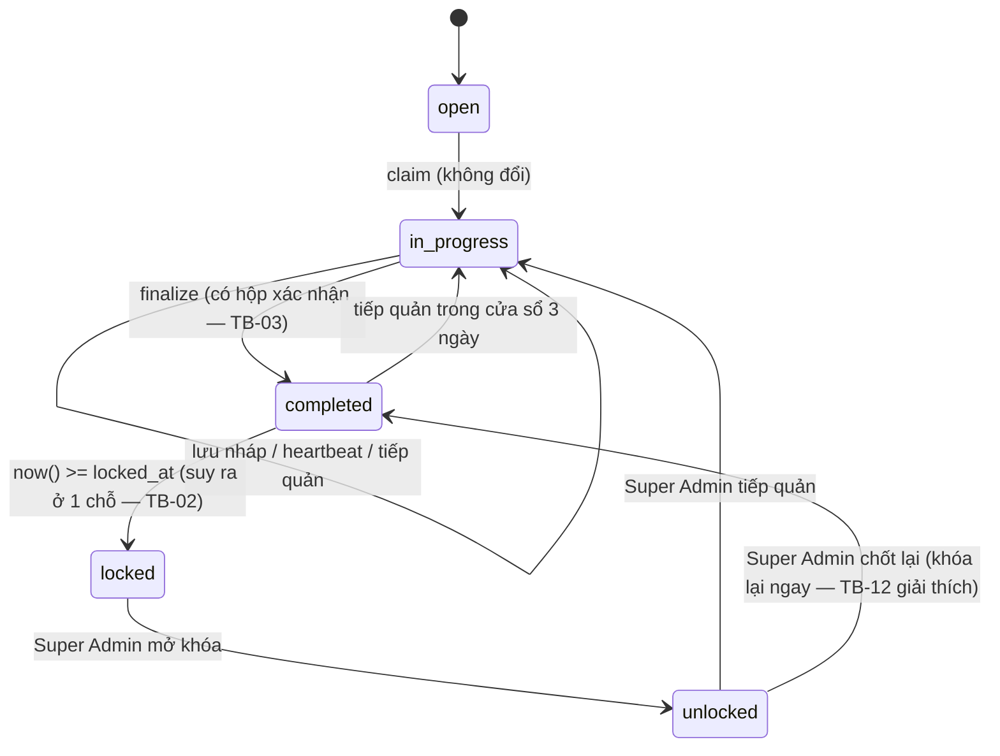
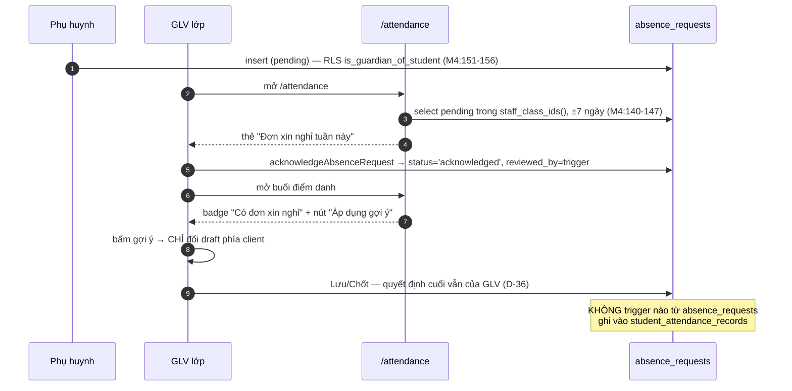

# M05-ATTENDANCE — Luồng TO-BE

> **Nguyên tắc ràng buộc:** giữ nguyên toàn bộ tầng RPC/RLS đang PASS. Không luồng nào ở đây được
> làm tăng rủi ro ghi đè hoặc mất dấu ai điểm danh. Không giảm bước bằng cách bỏ claim/lease.
> Mọi thay đổi DB đều là **thêm**, không sửa ngữ nghĩa cột đã có.

## 0. Bảng tổng hợp thay đổi

| Mã | Luồng | Loại | Ảnh hưởng DB? | Ước lượng |
|---|---|---|---|---|
| TB-01 | F01 — ngày mặc định theo giờ xứ đoàn | Sửa lỗi | Không | S |
| TB-02 | F07 — trạng thái khóa nhất quán mọi màn hình | Sửa lỗi | Không | S |
| TB-03 | F06 — xác nhận trước khi chốt | Thêm UI | Không | S |
| TB-04 | F06 — mã lỗi riêng cho "phiên đã kết thúc" | Sửa lỗi | Có (RPC) | S |
| TB-05 | F04 — hiển thị lease + cảnh báo mất nháp | Thêm UI | Không | M |
| TB-06 | F13 — màn hình staff cho đơn xin nghỉ | Thêm nghiệp vụ | Không (đã đủ RLS) | M |
| TB-07 | F03/F06 — nới ràng buộc enrollment khi UPDATE + map lỗi | Sửa lỗi | Có (trigger) | S |
| TB-08 | F01 — báo rõ khi buổi đang có người giữ | Thêm UI | Không | S |
| TB-09 | F15 — badge cảnh báo + bộ lọc roster | Thêm UI | Không | M |
| TB-10 | NAV-I1 — thống nhất nav và route-map | Sửa lỗi | Không | S |
| TB-11 | F11 — chặn đơn cho buổi đã chốt/quá khứ | Thêm validation | Không (app) hoặc Có (constraint) | S |
| TB-12 | F09 — giải thích cửa sổ sửa sau unlock | Thêm UI | Không | S |

---

## TB-01 — Ngày mặc định theo giờ Asia/Ho_Chi_Minh (F01)

**Mục tiêu:** GLV mở đúng buổi ngay cả khi điểm danh lúc 05:30 sáng Chúa nhật.

**Actor:** mọi GLV có quyền điểm danh.

**Bước mới:** không đổi số bước. Chỉ đổi giá trị đổ sẵn.

**Business rule:** BR-M05-01 (xem `05_BUSINESS_RULES.md`).

**Thiết kế:**
1. Thêm vào `src/lib/dates/index.ts` một hàm thuần: `todayInAppZone(): string` trả `yyyy-MM-dd` theo
   `APP_TIME_ZONE` (đã có sẵn `formatInTimeZone` từ `date-fns-tz`).
2. `mostRecentMeetingDate()` (`src/app/(dashboard)/attendance/page.tsx:22-31`) dùng chuỗi ngày đó và
   `meetingTypeForDate` (vốn parse local-time chuẩn, `constants.ts:55-60`) để lùi tối đa 6 ngày —
   thao tác trên chuỗi `yyyy-MM-dd`, **không** đi qua `toISOString()`.

**Validation / permission / trạng thái / error:** không đổi. Nếu người dùng vẫn chọn ngày không hợp lệ,
`ATTENDANCE_INVALID_MEETING_DAY` giữ nguyên.

**Audit:** không phát sinh.

**So sánh số bước:** 3 → 3. Giảm **1 lần sửa tay** ngày trong mọi ca sáng Chúa nhật.

**Rủi ro migration / rollback:** không có migration; rollback = revert commit.

**Test bắt buộc:** unit test cho `mostRecentMeetingDate` với `TZ=UTC` và một mốc thời gian giả
tương ứng 06:00 Chúa nhật ICT → phải trả về đúng ngày Chúa nhật đó.

---

## TB-02 — Trạng thái khóa nhất quán (F07)

**Mục tiêu:** một buổi đã khóa trông giống nhau ở mọi màn hình.

**Thiết kế (2 phương án — ảnh hưởng lớn nên nêu cả hai):**

### Phương án A (khuyến nghị) — suy ra ở một chỗ, không đụng DB
- Thêm hàm thuần `deriveSessionState({status, lockedAt, unlockedAt, now})` trong
  `src/features/attendance/constants.ts`, trả `'open' | 'in_progress' | 'completed' | 'locked' | 'unlocked'`.
- `toSessionCard` (`queries.ts:52-68`) và `getAttendanceSessionDetail` (`:310-312`) cùng gọi hàm này.
- Hub và trang chi tiết in cùng một nhãn; thêm nhãn `unlocked` = "Đã mở khóa".

*Ưu:* không migration, không dữ liệu cũ phải sửa, unit test hóa được.
*Nhược:* enum `'locked'` vẫn là giá trị chết trong DB.

### Phương án B — chuẩn hóa bằng generated column / view
- Thêm view `v_attendance_session_state` tính `effective_status` theo `now()`.
- Query đọc từ view thay vì bảng.

*Ưu:* một nguồn sự thật cho cả report và API sau này.
*Nhược:* thêm view mới phải gắn RLS `security_invoker`, tăng bề mặt kiểm thử; `now()` trong view làm
mọi truy vấn thành `volatile`, ảnh hưởng plan cache. **Không khuyến nghị cho phạm vi hiện tại.**

**So sánh số bước:** không đổi. Giảm nhầm lẫn "buổi này còn sửa được không?".

**Rollback:** revert commit (phương án A).

---

## TB-03 — Xác nhận trước khi chốt (F06)

**Mục tiêu:** không ai chốt nhầm khi còn thiếu; khớp `docs/06-ui-ux-spec.md:322-331`.

**Bước mới:**
1. Bấm "Hoàn tất điểm danh".
2. **(mới)** Hộp xác nhận hiện bảng phân bố tính **từ draft phía client** (không gọi server):
   Có mặt / Đi trễ / Về sớm / Vắng có phép / Vắng không phép, cho cả Thánh lễ và Giáo lý; kèm dòng
   "GLV có mặt x/y" và cảnh báo nếu có em đang có đơn xin nghỉ mà vẫn để `present`.
3. Xác nhận → gọi `saveAttendance({finalize:true})` như cũ.

**Business rule:** BR-M05-11.

**Validation:** thuần client, không thay hợp đồng server. Server vẫn là chỗ chặn thật.

**Trạng thái:** thêm state `confirming` trong `AttendanceEditor`.

**Error handling:** hủy hộp thoại = không gọi gì; lỗi server vẫn hiện qua `FormMessage`.

**Accessibility:** dialog có `role="dialog"` + `aria-modal`, focus trap, ESC đóng, nút xác nhận là
điểm focus đầu.

**So sánh số bước:** 1 → 2 bước bấm. **Cố ý tăng 1 bước** — chốt là hành động một chiều (đặt mốc khóa
3 ngày), rủi ro nhầm lớn hơn chi phí một cú bấm.

---

## TB-04 — Mã lỗi riêng cho "phiên chỉnh sửa đã kết thúc" (F06)

**Mục tiêu:** người vừa chốt xong bấm lại không bị báo "đang có người khác phụ trách".

**Thiết kế:**
- Trong `save_and_finalize_attendance` (`M3:652-656`) và `heartbeat_attendance_session` (`M3:525-529`),
  tách điều kiện gộp thành ba nhánh:
  - `editing_by is null` → raise `ATTENDANCE_SESSION_NOT_CLAIMED`;
  - `editing_by <> actor` → raise `ATTENDANCE_ALREADY_CLAIMED` (giữ nguyên);
  - lease hết hạn → raise `ATTENDANCE_LEASE_EXPIRED`.
- Thêm 2 mã vào `RPC_ERROR_CODES`/`EXTRA_MESSAGES_VI` (`actions.ts:24-40`):
  - `ATTENDANCE_SESSION_NOT_CLAIMED` → "Phiên chỉnh sửa đã kết thúc. Bấm *Tiếp quản* để sửa tiếp."
  - `ATTENDANCE_LEASE_EXPIRED` → "Phiên chỉnh sửa đã hết hạn. Bấm *Tiếp quản* để sửa tiếp."
- Bổ sung 2 mã vào `APP_ERROR_CODES` (`src/lib/errors/index.ts:3-16`).

**Quan trọng:** **không** nới lỏng điều kiện ghi. Vẫn chỉ editor hiện tại với lease còn hạn mới ghi
được — chỉ đổi *thông điệp*, không đổi *quyết định*.

**Ảnh hưởng DB:** migration mới `create or replace function` cho 2 RPC. Không đụng bảng/dữ liệu.

**Rủi ro migration:** pgTAP `012:162-199,192-199` đang assert message `ATTENDANCE_ALREADY_CLAIMED` cho
ca "editor cũ sau tiếp quản" — ca đó vẫn giữ nguyên mã, nên test cũ **không đỏ**. Phải thêm assertion
mới cho hai mã mới.

**Rollback:** `create or replace` về bản cũ; không mất dữ liệu.

---

## TB-05 — Hiển thị lease và bảo vệ bản nháp (F04)

**Mục tiêu:** GLV luôn biết mình còn bao lâu và không mất công sức khi bị tiếp quản.

**Bước mới:**
1. `heartbeatAttendanceSession` trả về `leaseExpiresAt` mà RPC vốn đã tính (`M3:535`) thay vì vứt đi
   (`actions.ts:95-99`); `claim_attendance_session` cũng đã trả `out_lease_expires_at` (`M3:488`)
   nhưng action bỏ qua (`actions.ts:77-84`) — đưa lên UI.
2. Header trang buổi hiện: "Bạn đang giữ quyền sửa · còn ~12 phút" với `aria-live="polite"`.
3. Khi còn < 3 phút: đổi màu + gợi ý "Lưu nháp ngay".
4. Khi heartbeat thất bại: **không** chuyển read-only im lặng. Hiện banner
   *"{Tên} đã tiếp quản buổi này. Phần bạn vừa sửa chưa được lưu."* kèm nút **"Sao chép thay đổi của
   tôi"** (đưa danh sách em + trạng thái ra clipboard/text) trước khi `router.refresh()`.

**Business rule:** BR-M05-06, BR-M05-07.

**Permission:** không đổi.

**Error handling:** banner giữ nguyên trên màn hình cho tới khi người dùng đóng.

**Không làm:** *không* tự động lưu nháp khi phát hiện mất lease — làm vậy sẽ ghi đè dữ liệu của editor
mới, đúng thứ mà toàn bộ thiết kế lease đang chống.

**So sánh số bước:** không đổi.

---

## TB-06 — Màn hình staff cho đơn xin nghỉ (F13)

**Mục tiêu:** hoàn thành WF-10 bước 5–6.

**Actor:** GLV đại diện / GLV lớp / Dự trưởng (staff của lớp), global-write.

**Thiết kế (2 phương án):**

### Phương án A (khuyến nghị) — panel trong trang buổi + thẻ trên hub
1. Trên `/attendance`, thêm thẻ **"Đơn xin nghỉ tuần này"**: truy vấn `absence_requests` với
   `status='pending'` cho các lớp trong `staff_class_ids()` (RLS đã cho phép, `M4:140-147`), trong cửa
   sổ ±7 ngày. Mỗi dòng: tên em, buổi/ngày, lý do, nút **"Ghi nhận"**.
2. Trong trang buổi, nhóm các em có đơn lên đầu roster (hoặc badge như hiện tại) và thêm nút
   **"Áp dụng gợi ý: Vắng có phép"** — chỉ đặt giá trị vào **draft phía client**, người điểm danh vẫn
   phải bấm Lưu/Chốt. **Không** ghi tự động (D-36, `M4:1-7`).
3. Nút "Ghi nhận" gọi `acknowledgeAbsenceRequest` đã có (`absence-requests/server/actions.ts:94-112`).

*Ưu:* dùng lại toàn bộ RLS + trigger + action đã có; không migration.
*Nhược:* thêm 1 truy vấn cho hub.

### Phương án B — route riêng `/attendance/absence-requests`
Danh sách đầy đủ có bộ lọc theo lớp/tuần/trạng thái.

*Ưu:* hợp cho GLV đại diện quản nhiều đơn; dễ mở rộng thống kê.
*Nhược:* thêm route + rule trong `route-map.ts`; tăng số bước cho ca phổ biến nhất (xem trước khi điểm
danh) vì phải rời màn hình điểm danh.

**Khuyến nghị:** A cho Phase hiện tại; B khi số đơn/tuần vượt ~20.

**Business rule:** BR-M05-16, BR-M05-17, BR-M05-18.

**Permission:** không cần policy mới — `absence_requests_update_scope` (`M4:158-169`) đã cho staff của
lớp; trigger `validate_absence_request` (`M4:104-111`) tự đặt `reviewed_by`/`reviewed_at` từ phiên
đăng nhập, client không đặt được.

**Trạng thái:** `pending` → `acknowledged`. Staff **không** được chuyển sang `cancelled`
(`M4:105-107`) — giữ nguyên.

**Audit:** `reviewed_by`, `reviewed_at`, `staff_note` (đã có cột).

**So sánh số bước:** hiện tại **không thể** ghi nhận (∞) → 2 bước bấm.

**Rủi ro:** không có migration ⇒ rủi ro dữ liệu bằng 0.

---

## TB-07 — Nới ràng buộc enrollment khi UPDATE (F03-I1)

**Mục tiêu:** một em rời lớp không được khóa cứng cả buổi điểm danh.

**Thiết kế:**
1. Trong `app.sync_student_attendance_keys` (`M3:136-191`), chỉ áp `enrollment_ok` khi
   `tg_op = 'INSERT'`. Với UPDATE vẫn giữ nguyên hai kiểm tra còn lại: khóa bất biến
   (`M3:150-153`) và `enrollment_class = session_class` (`M3:175-177`).
   *Lý do:* dòng đã tồn tại nghĩa là tại thời điểm seed em **đang** thuộc lớp; việc ghi danh đóng lại
   **sau đó** là sự kiện của tương lai, không được phép viết lại lịch sử của buổi đã diễn ra.
2. Bổ sung vào `RPC_ERROR_CODES` (`actions.ts:24-34`): `ATTENDANCE_ENROLLMENT_NOT_OPEN`,
   `ATTENDANCE_ENROLLMENT_CLASS_MISMATCH`, `ATTENDANCE_RECORD_IMMUTABLE_KEY` → `VALIDATION_ERROR`
   với câu tiếng Việt cụ thể.
3. Cân nhắc (tùy chọn): loại các dòng có enrollment đã đóng ra khỏi `roster_size` khi kiểm
   `ATTENDANCE_ROSTER_INCOMPLETE` — hiện `record_size >= roster_size` nên **không** phát sinh lỗi,
   giữ nguyên.

**Ảnh hưởng dữ liệu hiện có:** không. Chỉ nới điều kiện raise.

**Rủi ro:** nới ràng buộc luôn cần kiểm lại đường tấn công — nhưng đường ghi duy nhất là RPC, và RPC
chỉ UPDATE các dòng `where attendance_session_id = p_session_id` (`M3:671-672`), không cho phép trỏ
sang enrollment khác vì `enrollment_id` bất biến (`M3:150-153`). An toàn.

**Rollback:** `create or replace` về bản cũ.

---

## TB-08 — Báo rõ khi buổi đang có người giữ (F01-I3)

**Thiết kế:** `openAttendanceSessionFromForm` (`actions.ts:206-217`) đọc `result.data.claimed` và
`editorName`; nếu `claimed === false`, redirect kèm `?notice=` để trang buổi hiện banner
*"{Tên} đang phụ trách buổi này. Bạn đang xem ở chế độ chỉ đọc."* ngay khi vào.

**So sánh số bước:** không đổi; loại bỏ khoảnh khắc bối rối "sao mình không sửa được?".

---

## TB-09 — Badge cảnh báo và bộ lọc roster (F15-I1)

**Mục tiêu:** `docs/06-ui-ux-spec.md:311-317`.

**Thiết kế:**
1. `getAttendanceSessionDetail` (`queries.ts:233-260`) thêm một truy vấn
   `v_student_attendance_summary` lọc theo `student_id in roster` để lấy 4 cờ cảnh báo. View là
   `security_invoker` (`M5:99`) nên staff của lớp đọc được đúng phạm vi.
2. Roster hiện badge "Cảnh báo chuyên cần" cho em có cờ.
3. Thanh lọc client-side (không gọi server): **Tất cả · Đang vắng · Có đơn · Cảnh báo** + ô tìm theo
   tên (bỏ dấu).

**Business rule:** BR-M05-20.

**Rủi ro hiệu năng:** thêm 1 truy vấn view cho mỗi lần mở trang buổi. View chạy trên buổi đã chốt của
cả năm; nếu chậm, giới hạn bằng `academic_year_id` và cân nhắc materialize — đúng lối thoát WF-06 đã
dự trù (`docs/03-workflow.md:175`).

---

## TB-10 — Thống nhất navigation và route-map (NAV-I1)

**Hai phương án, cần user chốt (xem `NEEDS_CONFIRMATION` trong báo cáo):**

- **A — Giấu menu:** thêm `roles: OPERATIONAL_STAFF_ROLES` cho mục `/attendance` trong
  `src/config/navigation.ts:45`. Cha sở/Cha phó/Thủ quỹ không thấy mục nào. *Nhược:* mâu thuẫn
  `docs/05-permission-matrix.md:39` cho họ quyền 👁.
- **B — Mở quyền xem:** cho 3 role này vào `ROUTE_RULES` của `/attendance`, và ở tầng UI:
  `getEditableClasses` (`queries.ts:75-117`) vốn đã trả rỗng cho họ ⇒ form "Mở buổi" tự ẩn
  (`attendance/page.tsx:75-79`), `can_edit_attendance` vốn đã chặn mọi RPC ghi (`M3:243-251`).
  **Không cần đụng DB.** Họ xem được danh sách buổi và chi tiết ở chế độ đọc.

**Khuyến nghị: B** — khớp `docs/05-permission-matrix.md:39` và không cần policy mới. Cần user xác nhận
vì brief hiện mô tả `OPERATIONAL_STAFF_ROLES` như một quyết định có chủ ý.

---

## TB-11 — Chặn đơn xin nghỉ cho buổi đã chốt / quá khứ (F11-I1)

**Thiết kế:**
1. Zod (`absence-requests/schemas.ts:10-20`): thêm `.refine(absenceDate >= todayInAppZone())` với
   thông điệp *"Chỉ xin nghỉ cho buổi sắp tới."*.
2. Tầng DB (tùy chọn, chắc hơn): trigger `validate_absence_request` (`M4:74-89`) khi INSERT kiểm
   `not exists (select 1 from attendance_sessions where class_id = open_class and attendance_date =
   new.absence_date and meeting_type = new.meeting_type and finalized_at is not null)` → raise
   `ABSENCE_SESSION_ALREADY_FINALIZED`.

**Lý do làm cả hai tầng:** đơn cho buổi đã chốt là rác thuần túy — nó không thể ảnh hưởng điểm danh
(D-36) nhưng làm nhiễu danh sách staff ở TB-06.

**Rủi ro dữ liệu hiện có:** đơn cũ vi phạm luật mới vẫn tồn tại; trigger chỉ áp cho INSERT nên không
làm hỏng bản ghi cũ.

---

## TB-12 — Giải thích cửa sổ sửa sau khi mở khóa (F09-I1)

**Thiết kế:** khi `unlockedAt !== null`, trang buổi hiện dòng phụ dưới badge hiện có
(`[sessionId]/page.tsx:53-55`):
*"Buổi này đang mở khóa cho Quản trị viên. Sau khi chốt lại, buổi sẽ khóa lại ngay vì mốc khóa tính
từ lần chốt đầu tiên ({ngày})."*

**Không đổi luật DB.** `finalized_at` giữ nguyên là đúng — nó là dấu vết "buổi này đã chốt lần đầu khi
nào", và không được phép bị đẩy lùi để kéo dài cửa sổ sửa.

---

## 1. Sơ đồ TO-BE — vòng đời buổi (sau TB-02/TB-04)

## 2. Sơ đồ TO-BE — đơn xin nghỉ (sau TB-06)

## 3. Ảnh hưởng module / API / DB

| Hạng mục | Thay đổi |
|---|---|
| M07 Assessments | Không. `refresh_attendance_assessment_scores` không đụng tới. |
| M11 Dashboard | Không. `riskReasons` dùng cùng cờ view. |
| M13 Portal | TB-06 làm `acknowledged` xuất hiện thật → `ABSENCE_REQUEST_STATUS_LABELS` đã có nhãn (`absence-requests/schemas.ts:4-8`), không cần sửa. |
| M14 Navigation | TB-10 sửa 1 dòng metadata. |
| API/Server action | Thêm 2 mã lỗi (TB-04); `heartbeatAttendanceSession`/`claimAttendanceSession` trả thêm `leaseExpiresAt` (TB-05). Hợp đồng RPC **không đổi tên/tham số**. |
| DB | 1 migration `create or replace` cho `save_and_finalize_attendance`, `heartbeat_attendance_session`, `app.sync_student_attendance_keys`, và (tùy chọn) `app.validate_absence_request`. **Không `alter table`, không backfill.** |

## 4. Rủi ro migration và rollback

| Rủi ro | Mức | Giảm thiểu |
|---|---|---|
| `create or replace function` làm lệch chữ ký | Thấp | Giữ nguyên signature; migration chỉ thay thân hàm |
| pgTAP cũ đỏ do đổi mã lỗi | Trung bình | TB-04 giữ nguyên `ATTENDANCE_ALREADY_CLAIMED` cho đúng ca test cũ assert; chạy `012` trước khi merge |
| Nới `enrollment_ok` mở đường ghi sai | Thấp | Đường ghi duy nhất là RPC; `enrollment_id` bất biến; giữ kiểm `class mismatch` |
| Regenerate types sau đổi RPC | Thấp | RPC không đổi kiểu trả về ⇒ `src/types/database.ts` không đổi |

**Rollback toàn phần:** mọi thay đổi DB đều là `create or replace` ⇒ chạy migration ngược đưa thân hàm
về bản `20260721000300`/`20260721000400`; không có dữ liệu nào bị biến đổi để phải khôi phục.
