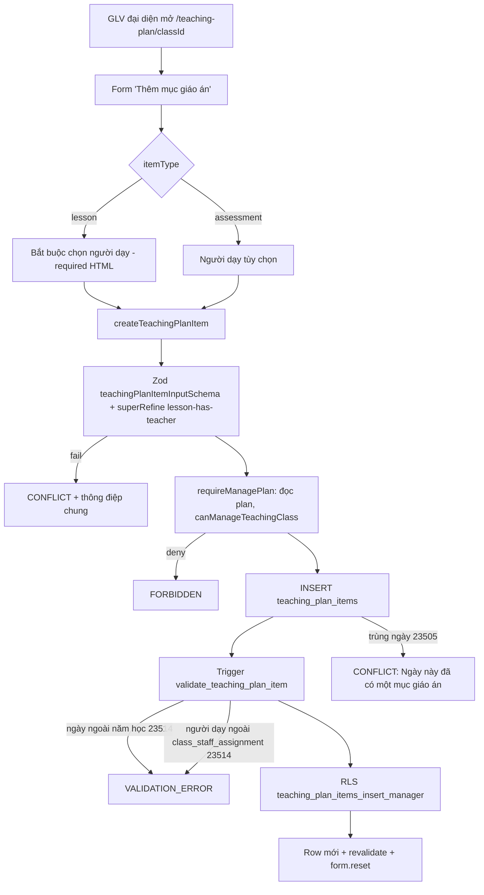

# M06-TEACHING-PLANS — 02. Luồng AS-IS

Ký hiệu: `AC` = actor, `UI` = màn hình/thao tác, `CV` = validation client, `SV` = validation server (Zod),
`SA` = server action, `DB` = RLS/constraint/trigger, `ST` = trạng thái cuối, `MSG` = thông báo.

---

## M06-F01 — Tạo kế hoạch giáo án cho lớp

- **AC**: GLV đại diện lớp hoặc nhóm global-write.
- **UI**: `/teaching-plan/{classId}` → card "Chưa có giáo án" → form "Tên giáo án" (`teaching-plan-editor.tsx:322-336`), giá trị mặc định `Kế hoạch giảng dạy {lớp} {mã năm}` (`:329`).
- **CV**: `required`, `maxLength=150` (`:329`).
- **SA**: `ensureTeachingPlan({classId, title})` (`server/actions.ts:87`).
- **SV**: `ensureTeachingPlanSchema` — `classId` uuid, `title` trim 1..150 (`schemas.ts:10`).
- **Quyền**: `requireManageClass` → `requireAuthContext` + `canManageTeachingClass` (`actions.ts:48-53`).
- **Idempotent**: nếu đã có plan cho lớp thì trả về `id` cũ, không tạo mới (`actions.ts:93-98`).
- **DB**: `teaching_plans_insert_manager` (`migration 000100:171`) + trigger `teaching_plans_prepare` suy `academic_year_id` từ lớp và gán `created_by_staff_id` (`:93`); `unique(class_id)`.
- **ST**: 1 row `teaching_plans`; `revalidatePath('/teaching-plan')` + `/teaching-plan/{classId}` (`actions.ts:43`).
- **MSG**: thành công → `router.refresh()`; lỗi → `FormMessage` (`:331`).

**Error path / edge case**

| Tình huống | Kết quả hiện tại | Đánh giá |
|---|---|---|
| Không có quyền | `AppError('FORBIDDEN')` → "Bạn không có quyền thực hiện thao tác này." | Đúng |
| `classId` không tồn tại | `classRow` null → `RESOURCE_NOT_FOUND` (`actions.ts:105`) | Đúng |
| 2 người bấm cùng lúc | Race giữa `select` (93) và `insert` (107) → `23505` → `mapDatabaseError` trả **"Ngày này đã có một mục giáo án."** (`actions.ts:38`) | **Sai ngữ cảnh** — thông điệp của mục giáo án bị dùng cho xung đột plan |
| Title rỗng | ZodError → `failure()` trả `CONFLICT` + "Không thể lưu giáo án. Vui lòng thử lại." (`actions.ts:33`) | Thông điệp Zod bị nuốt |

---

## M06-F02 — Đổi tên kế hoạch

- **AC**: đại diện / global-write.
- **UI**: form "Tên giáo án" + nút "Lưu tên" (`teaching-plan-editor.tsx:344-347`).
- **SA**: `updateTeachingPlanTitle` (`actions.ts:125`) → `requireManagePlan` đọc plan rồi kiểm quyền theo `class_id` (`actions.ts:55-66`).
- **DB**: `teaching_plans_update_manager` (`000100:175`), trigger `prepare` giữ nguyên `created_by_staff_id` (`:86`).
- **ST**: `title` mới, `updated_by = auth.uid()`.
- **MSG**: "Đã đổi tên giáo án." (`:317`).
- **Edge**: `planId` không tồn tại → `RESOURCE_NOT_FOUND`; ghi đè mù nếu 2 người cùng đổi (không có version check).

---

## M06-F03 — Thêm mục giáo án



- **UI**: `ItemFields` (`teaching-plan-editor.tsx:45-91`) — 12 trường: loại mục, ngày, tên bài, người dạy, mục tiêu, nội dung giáo lý, Lời Chúa, trò chơi, bài hát, bài tập về nhà, chuẩn bị, ghi chú nội bộ.
- **CV**: `min/max` ngày = `yearStart`/`yearEnd` (`:68`); `required` cho ngày, tên; `required` cho người dạy khi `itemType==='lesson'` (`:76`); `maxLength` từng textarea.
- **SV**: `teachingPlanItemInputSchema` (`schemas.ts:20`) — `plannedDate` `z.string().date()`, các trường text `optionalText(max)` chuyển `""` → `null` (`schemas.ts:4`), `superRefine` bắt buộc người dạy cho `lesson` (`:36`).
- **DB**: constraint độ dài từng cột (`000100:24-34`), `teaching_plan_lesson_has_teacher` (`:39`), `one_per_date` (`:38`), trigger validate (`:97`).
- **ST**: row mới; danh sách sắp theo `planned_date` (`queries.ts:235`).
- **MSG**: "Đã thêm mục giáo án." + `form.reset()` (`:139-140`).

**Edge case**

| Tình huống | Hiện tại |
|---|---|
| Ngày ngoài năm học | Client chặn bằng `min/max`; DB trả `TEACHING_PLAN_DATE_OUTSIDE_YEAR` (23514) → `mapDatabaseError` rơi vào nhánh mặc định `VALIDATION_ERROR` → "Dữ liệu không hợp lệ." (không nói rõ lý do) |
| Người dạy hết hiệu lực trước ngày dạy | Dropdown **vẫn liệt kê** (`queries.ts:203-207` chỉ lọc `is_active`, không lọc theo `planned_date`) → DB chặn `TEACHING_PLAN_TEACHER_OUT_OF_CLASS` → thông điệp chung |
| Trùng ngày | `23505` → "Ngày này đã có một mục giáo án." (đúng ngữ cảnh) |
| Lớp chưa có nhân sự | Dropdown chỉ có option rỗng → không thêm được `lesson`; không có empty state giải thích |

---

## M06-F04 — Sửa mục giáo án / đổi người dạy

- **AC**: đại diện / global-write. WF-07 §6: "Có thể đổi người dạy mà không cần lý do".
- **UI**: nút "Sửa" trên `ItemCard` (`:238`) mở lại `ItemForm` với `defaultValue` (`:247`).
- **SA**: `updateTeachingPlanItem` (`actions.ts:181`) → `requireManageItem` đọc item → plan → kiểm quyền (`actions.ts:68-85`); chặn `planId !== parsed.teachingPlanId` (`:187`).
- **SV**: `updateTeachingPlanItemSchema` = input schema `.and({itemId})` (`schemas.ts:46`).
- **DB**: trigger chặn đổi `teaching_plan_id` (`000100:108`), kiểm lại người dạy theo `planned_date` mới (`:125`).
- **ST**: row cập nhật, `updated_by` mới; **không có bản ghi lịch sử/audit**.
- **Edge — concurrent**: 2 người (đại diện + global-write) mở cùng item, người sau `UPDATE` toàn bộ payload từ form cũ → **ghi đè mù**, không phát hiện xung đột (không có `updated_at` check / optimistic lock).

---

## M06-F05 — Xóa mục giáo án

- **UI**: nút "Xóa" + `window.confirm` (`:170`).
- **SA**: `deleteTeachingPlanItem(itemId)` (`actions.ts:216`) → nếu còn `material_path` thì **xóa object Storage trước**, lỗi thì dừng (`:225-230`) → `DELETE` row.
- **DB**: policy `teaching_plan_items_delete_manager` (`000100:221`); policy Storage delete (`000300:151`).
- **ST**: row + object đều biến mất (E2E khẳng định không còn orphan — `tests/e2e/teaching-plan.spec.ts`).
- **Edge**: nếu `DELETE` row thất bại sau khi đã xóa file → mất tài liệu nhưng còn metadata → constraint `teaching_plan_material_complete` vẫn thỏa (metadata còn nguyên) → **orphan metadata trỏ tới object không tồn tại**. Xác suất thấp, chưa có bù trừ.

---

## M06-F06 — Tải tài liệu lên / thay tài liệu

- **UI**: `<input type="file" accept={TEACHING_MATERIAL_ACCEPT}>` + nút "Lưu tài liệu" (`:272-278`); ghi chú "tối đa 5 MB" (`:280`).
- **CV**: chỉ `accept` MIME; **không kiểm dung lượng phía client**.
- **SA**: `uploadTeachingMaterial(FormData)` (`actions.ts:250`):
  1. `teachingPlanItemIdSchema.parse(formData.get('itemId'))` (`:252`);
  2. kiểm `file.size` trong `[1, 5 MB]` (`:254`);
  3. kiểm `file.type` thuộc allowlist (`:257`);
  4. `requireManageItem` (`:263`);
  5. path `{classId}/{itemId}/{uuid}-{safeStorageName}` (`:269`, hàm `safeStorageName` `:240`);
  6. `upload(..., upsert:false)`;
  7. `UPDATE` metadata; nếu lỗi → **rollback object** (`:286`);
  8. xóa object cũ nếu khác path (`:289`).
- **DB**: policy `teaching_materials_insert_manager` (`000300:133`), bucket `file_size_limit` (`:39`), constraint `teaching_plan_material_size_limit` + `mime_allowed` + `complete` (`:8-33`), unique `material_path` (`:35`).
- **ST**: 1 tài liệu/mục; thay tệp = xóa tệp cũ.
- **MSG**: "Đã lưu tài liệu vào kho riêng tư." (`:193`).
- **Edge**: tệp > 5 MB được upload hết lên server rồi mới báo lỗi (lãng phí băng thông trên 3G); `file.type` do trình duyệt khai báo (không sniff magic bytes) nhưng bucket `allowed_mime_types` chặn lần hai.

---

## M06-F07 — Gỡ tài liệu

- **UI**: nút "Gỡ tệp" + confirm (`:212`).
- **SA**: `removeTeachingMaterial` (`actions.ts:299`) — xóa metadata **trước**, xóa object **sau** (`:309-320`); idempotent khi không có tệp (`:308`).
- **DB**: chính vì thứ tự này mà `app.can_read_teaching_material` phải cho manager thấy object "mồ côi" để Storage API dọn được (`000300:118-120`).
- **Edge**: nếu `storage.remove` lỗi sau khi metadata đã null → object rác trong bucket, không ai thấy; không có job dọn.

---

## M06-F08 — Tải tài liệu xuống (signed URL 60 s)

- **AC**: mọi staff trong phạm vi lớp (kể cả GLV chỉ-xem) — E2E khẳng định GLV910 tải được.
- **UI**: nút "Tải xuống" (`:267`) → `window.location.assign(url)` (`:207`).
- **SA**: `createTeachingMaterialUrl(itemId)` (`actions.ts:328`):
  - chỉ `requireAuthContext('/teaching-plan')` (`:333`) — **không kiểm quyền lớp tường minh**;
  - `SELECT material_path, material_name` → **RLS `teaching_plan_items_select_staff_scope` là hàng rào duy nhất ở tầng app**;
  - `createSignedUrl(path, 60, {download: name})` (`:343`) — Storage RLS `teaching_materials_select_staff_scope` là hàng rào thứ hai.
- **Kết quả cho guardian/student**: `SELECT` trả 0 row → `RESOURCE_NOT_FOUND` (không lộ sự tồn tại của tệp). pgTAP 015 + E2E xác nhận.
- **Rủi ro còn lại**: mâu thuẫn với `docs/11 §7` ("Action kiểm quyền tường minh trước khi dựa vào RLS"); nếu policy `teaching_plan_items_select_*` bị nới trong tương lai thì action này mất lớp bảo vệ.

---

## M06-F09 — Xem hub giáo án theo lớp

- **SA/query**: `getTeachingPlanPageData` (`queries.ts:121`).
- Lấy `academic_years` `status='current'`; nếu không có → empty state "Chưa có năm học hiện hành." (`page.tsx:16`).
- **Guardian/student**: trả `classes: []` **tường minh** trước khi truy vấn (`queries.ts:138`) vì `classes` là danh mục đọc rộng (`classes_select_authenticated` — `20260715000200:305`).
- Với staff: lấy lớp `status='active'`, join `teaching_plans(id, title, teaching_plan_items(id))` để đếm mục, và `getManageableTeachingClassIds` để gắn nhãn "Bạn có quyền chỉnh sửa" / "Chỉ xem" (`queries.ts:158-181`).
- **Empty state**: khi `data.classes.length === 0` component render `null` (`page.tsx:18`) → staff không có lớp nào **không thấy thông báo gì**.

---

## M06-F10 — Xem chi tiết giáo án (list / theo tháng)

- **UI**: 2 link `?view=list` / `?view=calendar` (`[classId]/page.tsx:29-32`); nhóm theo `YYYY-MM` (`teaching-plan-editor.tsx:291-299`); badge "Tuần N" tính từ `yearStart` (`:39-43`, `:231`).
- **SA/query**: `getTeachingPlanDetail` (`queries.ts:186`) → `requireRouteAccess` → đọc lớp + năm học; `null` → `notFound()`.
- **Quyền hiển thị**: `canManage` quyết định hiện form thêm/sửa/xóa/upload (`:236`, `:271`, `:343`, `:353`).
- **Edge**:
  - `classId` không phải UUID → PostgREST `22P02` → `classRow` null → `notFound()`. Đúng.
  - Guardian/student mở thẳng `/teaching-plan/{classId}`: `route-map` không chặn role → `classes` đọc được → trang render "Giáo án {lớp}" với "Chưa có giáo án" và danh sách nhân sự rỗng (RLS chặn `class_staff_assignments`). **Không rò dữ liệu nhưng IA sai** (portal lẽ ra không có đường vào).

---

## M06-F11 — Xem lịch 7 ngày sắp tới (projection an toàn)

```mermaid
sequenceDiagram
  participant U as Guardian/Student/Staff
  participant P as /teaching-plan (server)
  participant Q as getWeekAheadTeachingData
  participant R as RPC get_week_ahead_teaching_items
  U->>P: GET /teaching-plan
  P->>Q: requireRouteAccess('/teaching-plan')
  Q->>Q: today = now @ Asia/Ho_Chi_Minh
  Q->>Q: startDate = max(today, year.start_date); endDate = +6d
  alt startDate > year.end_date
    Q-->>P: items = []
  else
    Q->>R: p_from=startDate, p_days=7
    R->>R: auth.uid() & app.current_role() bắt buộc, else 42501
    R->>R: p_days phải 1..31, else 22023
    R-->>Q: item_id, class_id, class_name, planned_date, title, preparation, item_type, teacher_name
  end
  Q-->>P: WeekAheadTeachingData
  P-->>U: WeekAheadSchedule (server component)
```

- **Phạm vi dữ liệu**: `app.can_access_class(plan.class_id)` **hoặc** lớp có enrollment `active`/`paused` của `app.own_student_ids()` (`000200:52-60`).
- **Trường trả về**: chỉ 8 cột nêu trên — **không** có `objectives`, `catechism_content`, `scripture_content`, `game`, `song`, `homework`, `note`, `material_*`.
- **UI**: `WeekAheadSchedule` hiển thị ngày, badge `Kiểm tra`/`Bài học`, tiêu đề (với `assessment` thì hiển thị chữ "Kiểm tra" thay tên bài — `week-ahead-schedule.tsx:24`), tên lớp, người phụ trách, phần chuẩn bị.
- **Empty state**: "Chưa có bài học hoặc bài kiểm tra trong khoảng này." (`:15`).
- **Edge**:
  - Không có `academic_years` current → `startDate = today`, RPC vẫn chạy (trả rỗng nếu không có mục).
  - RPC lỗi → nuốt lỗi, trả `items: []` (`queries.ts:104`) → người dùng không phân biệt được "không có bài" và "lỗi hệ thống".
  - `endDate` tính bằng `addDays(..., 6)` trong khi RPC lọc `< p_from + 7` → nhất quán (7 ngày).
