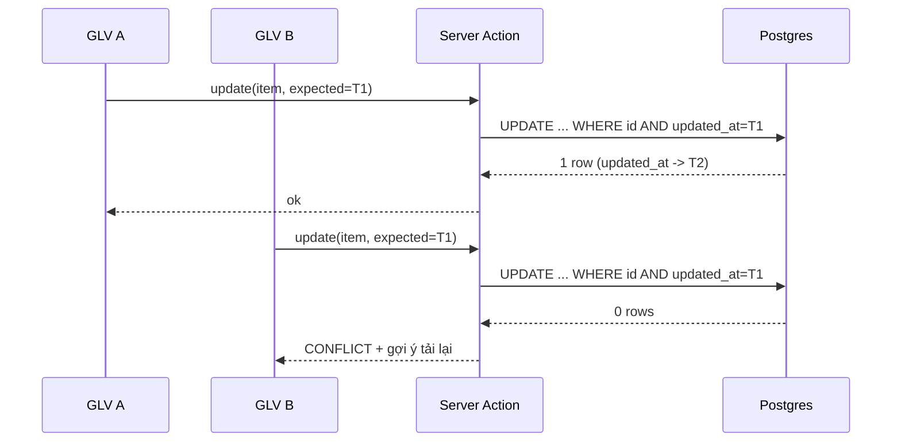

# M06-TEACHING-PLANS — 04. Luồng TO-BE

Chỉ đề xuất cho các luồng **không** đạt `PASS`. Các luồng `PASS`
(F02, F05, F07, F11) **giữ nguyên, không có To-Be**.

---

## TB-M06-01 — Sửa mục giáo án có phát hiện xung đột (thay cho F04)

### Mục tiêu
Không để thay đổi của một người bị ghi đè âm thầm bởi người khác, mà không thêm workflow duyệt.

### Actor
GLV đại diện lớp; nhóm global-write.

### Bước mới

1. `getTeachingPlanDetail` trả thêm `updatedAt` cho mỗi mục.
2. `ItemForm` giữ `updatedAt` trong hidden input.
3. Bấm "Lưu thay đổi" → `updateTeachingPlanItem({...payload, itemId, expectedUpdatedAt})`.
4. Server `UPDATE ... WHERE id = ? AND updated_at = ?` và đọc số dòng ảnh hưởng.
5. `0` dòng → trả `AppError('CONFLICT', 'Mục này vừa được người khác cập nhật. Hãy tải lại để xem bản mới nhất.')`.
6. UI hiện thông điệp + nút "Tải lại mục này" (chỉ `router.refresh()`, không mất dữ liệu đang gõ ở các mục khác).

### Business rule
- **BR-M06-13 (mới)**: một mục giáo án chỉ được ghi đè khi client đang giữ đúng phiên bản `updated_at`.

### Validation
Giữ nguyên toàn bộ Zod hiện có; thêm `expectedUpdatedAt: z.string().datetime()`.

### Permission
Không đổi (`canManageTeachingClass` + RLS `teaching_plan_items_update_manager`).

### Trạng thái dữ liệu
Không thêm cột (dùng `updated_at` sẵn có, đã có trigger `app.set_updated_at`).

### Error handling
| Mã | Khi nào | Thông điệp |
|---|---|---|
| `CONFLICT` | `expectedUpdatedAt` lệch | "Mục này vừa được người khác cập nhật…" |
| `RESOURCE_NOT_FOUND` | Mục đã bị xóa | "Không tìm thấy dữ liệu." |

### Audit
Không thêm bảng lịch sử ở bước này; ghi `updated_by` như hiện tại. (Nếu sau này cần lịch sử đầy đủ,
xem phương án B bên dưới.)

### Mermaid

### So sánh số bước
| | AS-IS | TO-BE |
|---|--:|--:|
| Happy path | 3 (mở → sửa → lưu) | 3 (không đổi) |
| Khi có xung đột | 3 (âm thầm mất dữ liệu) | 5 (lưu → báo → tải lại → sửa → lưu) |

### Ảnh hưởng
- **Module**: chỉ M06. Cùng mẫu có thể tái dùng cho M07-F06.
- **API**: `updateTeachingPlanItem` đổi input (thêm 1 field bắt buộc) — breaking với caller nội bộ duy nhất là `ItemForm`.
- **DB**: không migration.
- **Rủi ro migration**: không.
- **Rollback**: xóa field khỏi schema + bỏ điều kiện `WHERE updated_at`.

### Phương án B (nếu cần audit đầy đủ)
Thêm bảng `teaching_plan_item_revisions` ghi snapshot trước mỗi `UPDATE` bằng trigger `after update`.
Ưu: có lịch sử đối chiếu, phục hồi được. Nhược: +1 bảng, +RLS, tăng dung lượng; chỉ nên làm nếu
người dùng thực sự yêu cầu truy vết. **Khuyến nghị: phương án A trước.**

---

## TB-M06-02 — Chuẩn hóa thông điệp lỗi (ảnh hưởng F01, F03, F04, F06)

### Mục tiêu
Người dùng biết **trường nào sai và vì sao**, thay vì "Không thể lưu giáo án. Vui lòng thử lại."

### Bước mới
1. Bổ sung vào `src/lib/errors/index.ts` kiểu `AppErrorDetail = { field?: string; message: string }[]`
   và cho `AppError` nhận `details`.
2. Trong mọi action: `const parsed = schema.safeParse(input); if (!parsed.success) throw new AppError('VALIDATION_ERROR', ..., issuesToDetails(parsed.error))`.
3. `mapDatabaseError` thêm nhánh cho `23514` và phân biệt `23505` theo `constraint`:
   - `teaching_plan_items_one_per_date` → "Ngày này đã có một mục giáo án.";
   - `teaching_plans_class_id_key` → "Lớp này đã có kế hoạch giảng dạy.";
   - `TEACHING_PLAN_DATE_OUTSIDE_YEAR` → "Ngày dự kiến phải nằm trong năm học.";
   - `TEACHING_PLAN_TEACHER_OUT_OF_CLASS` → "Người dạy không thuộc đội ngũ lớp vào ngày này."
4. `FormMessage` render danh sách `details`.

### Business rule
- **BR-M06-14 (mới)**: mọi lỗi validation phải trả về mã ổn định + thông điệp tiếng Việt gắn với trường bị sai.

### Ảnh hưởng
- **Module**: cross-module (mọi feature dùng cùng mẫu `failure()`), nên nên làm ở tầng `src/lib/errors`.
- **API**: kiểu trả về của action thêm field tùy chọn `details` → không breaking.
- **DB**: không.
- **Rollback**: bỏ qua `details` ở UI.

---

## TB-M06-03 — Lọc dropdown người dạy theo ngày dự kiến (F03/F04)

### Mục tiêu
UI chỉ cho chọn nhân sự mà DB sẽ chấp nhận → loại hẳn lỗi `TEACHING_PLAN_TEACHER_OUT_OF_CLASS`.

### Bước mới
1. `TeachingPlanStaffOption` đã có `startsOn`/`endsOn` (`server/queries.ts:25-31`) nhưng chưa dùng.
2. `ItemFields` nâng `plannedDate` thành state; lọc `staff.filter(s => s.startsOn <= date && (!s.endsOn || s.endsOn >= date))`.
3. Nếu danh sách rỗng → hiện dòng "Chưa có nhân sự phụ trách lớp vào ngày này" + link `/staff`.

### Business rule
- **BR-M06-05** (đã có ở DB) được phản chiếu lên UI, không đổi ngữ nghĩa.

### Ảnh hưởng
Chỉ `teaching-plan-editor.tsx`. Không API, không DB. Rollback: trả về danh sách đầy đủ.

---

## TB-M06-04 — Kiểm quyền tường minh cho signed URL (F08)

### Mục tiêu
Đưa `createTeachingMaterialUrl` về đúng chuẩn `docs/11 §7` ("Action kiểm quyền tường minh trước khi dựa vào RLS").

### Bước mới
1. Đọc `teaching_plan_items → teaching_plans.class_id` (đã có sẵn quan hệ).
2. Gọi hàm mới `canReadTeachingClass(context, supabase, classId)` = `can_global_read` ∪ `current_class_id` ∪ sector ∪ `class_staff_assignments`.
3. Chỉ tạo signed URL khi hàm trả `true`; ngược lại `FORBIDDEN`.

### Permission
Không nới quyền — chỉ thêm lớp kiểm ở app, giữ nguyên 2 lớp RLS.

### Ảnh hưởng
`server/permissions.ts` + `server/actions.ts`. Không DB. Rollback: xóa lời gọi.

---

## TB-M06-05 — IA cho guardian/student và empty state (F09/F10)

### Mục tiêu
Portal không có đường vào trang quản trị giáo án; staff không có lớp vẫn hiểu vì sao trống.

### Bước mới
1. `getTeachingPlanDetail`: nếu `context.audience !== 'staff'` → trả `null` ngay (dẫn tới `notFound()`),
   thay vì render khung rỗng.
2. `/teaching-plan/page.tsx`: khi `audience` là guardian/student → chỉ render `WeekAheadSchedule`
   và đổi `PageHeader.description` thành "Lịch học 7 ngày tới của con/của em".
3. Khi staff có `classes.length === 0` → render card "Bạn chưa được phân công lớp nào có giáo án."

### Ảnh hưởng
Chỉ tầng page/query. Không DB, không API. Rollback: bỏ nhánh audience.

---

## TB-M06-06 — Thống nhất định nghĩa "thuộc lớp" (rủi ro dữ liệu nhất quán)

### Mục tiêu
Xóa khả năng "ghi được nhưng không đọc được" cho nhân sự được phân công qua `class_staff_assignments`.

### Hai phương án

**Phương án A (khuyến nghị) — nới policy select của M06 cho khớp M07.**
Thêm `or app.is_class_staff(class_id)` vào `teaching_plans_select_staff_scope`
(`20260722000100:167`) và `teaching_plan_items_select_staff_scope` (`:184`).
- Ưu: thay đổi cục bộ trong M06, khớp đúng mẫu đã dùng ở `assessments_select_scope`
  (`20260722000400:519`), không đụng hàm dùng chung.
- Nhược: mở rộng phạm vi đọc giáo án cho nhân sự được phân công chéo lớp — **đúng theo `docs/05 §6`**
  ("Class staff xem đầy đủ giáo án") nên không phải nới quyền ngoài spec.
- Migration: 1 file `drop policy` + `create policy`, không đụng dữ liệu.
- Rollback: khôi phục policy cũ.

**Phương án B — sửa `app.can_access_class` để bao gồm `class_staff_assignments`.**
- Ưu: một định nghĩa duy nhất cho toàn hệ thống.
- Nhược: **ảnh hưởng rộng** — hàm này được dùng ở M02/M04/M05/M07/M09/M10; mọi policy đang dựa vào nó
  sẽ nới phạm vi cùng lúc. Cần chạy lại toàn bộ pgTAP 001–023.
- Rủi ro migration: cao (thay đổi ngữ nghĩa quyền toàn cục).
- Rollback: `create or replace` bản cũ.

**Khuyến nghị: A trước; B chỉ khi có quyết định kiến trúc riêng.**

### Test bắt buộc kèm theo
pgTAP mới trong `013_*`: fixture có `role_assignments.class_id = X` nhưng
`class_staff_assignments(capacity='representative').class_id = Y`; khẳng định đọc **và** ghi được lớp Y.
