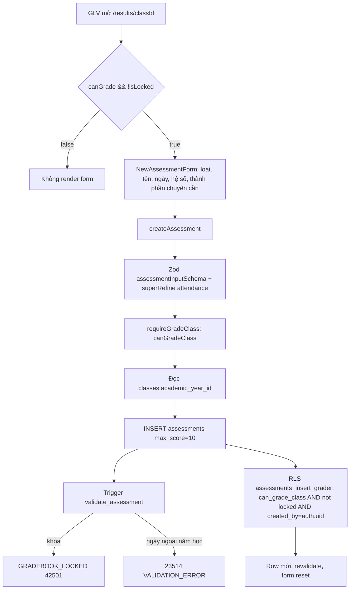
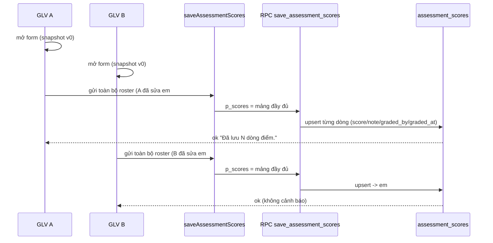

# M07-ASSESSMENTS — 02. Luồng AS-IS

Đường dẫn rút gọn: `actions.ts` = `src/features/assessments/server/actions.ts`,
`queries.ts` = `.../server/queries.ts`, `permissions.ts` = `.../server/permissions.ts`,
`editor.tsx` = `.../components/gradebook-editor.tsx`,
`M400/M500/M600` = `supabase/migrations/20260722000400|000500|000600_*.sql`.

---

## M07-F01 — Xem hub kết quả `/results`

- **AC**: mọi vai trò đăng nhập.
- **Query**: `getResultsPageData` (`queries.ts:224`).
  1. `requireRouteAccess('/results')`;
  2. năm học `status='current'`; nếu không có → card "Chưa có năm học hiện hành." (`page.tsx:15`);
  3. **luôn** tính `portal = getPublishedPortalResults(profileId, year.id)` (`:240`) — kể cả staff, để GLV đồng thời là phụ huynh vẫn thấy con mình (D-25);
  4. guardian/student → trả `classes: []` (`:241-243`);
  5. staff → `getVisibleResultClassIds` (`permissions.ts:24`) rồi đếm cột điểm + trạng thái khóa (`:260-266`) + `canGradeClass` cho từng lớp (`:267`).
- **UI**: `page.tsx:16-36` — guardian/student render `PublishedResultsPortal`; staff render "Kết quả của con" (nếu có) + "Bảng điểm phụ trách".
- **Empty state**: "Bạn chưa có lớp nào trong phạm vi kết quả." (`page.tsx:23`) — ✔ có, khác M06.
- **Edge**: `getVisibleResultClassIds` gọi `Promise.all` `canGradeClass` cho **từng lớp** (`:267`), mỗi lần là 2–3 round-trip Supabase → N lớp ⇒ ~3N truy vấn (19 lớp ⇒ ~57 query).

---

## M07-F02 — Tạo cột điểm

- **CV**: `required` tên/hệ số; `min=0.01 max=100 step=0.01` cho hệ số (`editor.tsx:116`); `min/max` ngày theo năm học (`:112`); mặc định hệ số lấy từ hằng **hardcode** `DEFAULT_WEIGHTS` (`editor.tsx:46-52`).
- **SV**: `assessmentInputSchema` (`schemas.ts:8`) — `weight` `z.coerce.number().positive().max(100)`; `attendanceComponent` bắt buộc/cấm theo `kind`.
- **DB**: `weight > 0 and <= 100` (`M400:166`), `assessments_attendance_component` (`:174`), `max_score` 0<x≤10 (`:165`).
- **ST**: cột mới `is_published=false`, `is_active=true`.
- **Edge**:
  - Trùng tên cột → **cho phép** (đúng WF-08, cột lặp là hợp lệ) nhưng UI không cảnh báo, dễ tạo trùng do double-click.
  - `weight` bỏ trống → `Number("")=0` → Zod `.positive()` fail → thông điệp **chung** "Không thể lưu bảng điểm. Vui lòng thử lại." (`actions.ts:38`), thông điệp "Hệ số phải lớn hơn 0." (`schemas.ts:13`) không hiển thị.
  - Nhánh DB tự điền `default_weight` (`M400:222-232`) là **code chết** vì action luôn gửi `weight`.

---

## M07-F03 — Sửa cột điểm / đổi hệ số

- **UI**: `AssessmentSettings` (`editor.tsx:137`) — sửa tên, ngày, hệ số; mọi input `disabled={detail.isLocked}` (`:181-183`).
- **SA**: `updateAssessment` (`actions.ts:117`) → `requireGradeAssessment` (đọc cột → `canGradeClass`) → chặn `assessment.class_id !== parsed.classId` (`:121`) → `UPDATE`.
- **Không cho đổi `kind`**: UI gửi lại `kind: assessment.kind` (`editor.tsx:149`) — hợp lý vì `kind` gắn với `attendance_component`.
- **DB**: `assessments_update_grader` (`M400:542`) + trigger `validate_assessment` (`:187`) đều chặn khi khóa.
- **Tác động ngay lên trung bình**: `v_student_weighted_average` tính khi đọc (`M400:565-581`) ⇒ đổi hệ số → trang refresh là số mới. ✔ đúng WF-08.
- **Edge**: hai người cùng sửa → ghi đè mù, không version check.

---

## M07-F04 — Xóa cột điểm ❗

- **UI**: nút "Xóa" + confirm "Chỉ cột chưa có điểm mới xóa được." (`editor.tsx:169`).
- **SA**: `deleteAssessment` (`actions.ts:142`) → `DELETE` → bắt `23503` với thông điệp "Cột đã có điểm nên không thể xóa. Hãy giữ lại để bảo toàn lịch sử." (`:148`).
- **DB**: `assessment_scores.assessment_id ... on delete restrict` (`M400:261`) + trigger chặn khi khóa (`:241`).
- **Vấn đề**: `ScoreColumnForm` submit **toàn bộ** roster kể cả ô trống (`editor.tsx:212-216`), và
  `save_assessment_scores` `INSERT ... ON CONFLICT` cho **mọi** phần tử (`M400:403-422`) ⇒ chỉ cần bấm
  "Lưu điểm" một lần là mỗi thiếu nhi có 1 dòng `assessment_scores` (score có thể là `null`).
  Từ đó cột **vĩnh viễn không xóa được**, kể cả khi chưa có điểm thật nào.
- **Hệ quả nghiệp vụ**: WF-08 nói "Thêm, **xóa** hoặc đổi hệ số một assessment phải cập nhật ngay cấu trúc
  cột và điểm trung bình" — nhánh "xóa" thực tế bị chặn. Cột tạo nhầm nằm lại vĩnh viễn trong bảng điểm
  và trong file export. Cột `is_active` tồn tại (`M400:169`) nhưng **không action nào set `false`**
  (`grep is_active` trong `src/features/assessments/` chỉ ra các nơi *đọc*).

---

## M07-F05 — Công bố / ẩn một cột điểm ❗

- **UI**: nút "Công bố"/"Ẩn" (`editor.tsx:186`), `disabled` khi khóa.
- **SA**: `setAssessmentPublished` (`actions.ts:178`) → `UPDATE assessments SET is_published`.
- **DB**: trigger `sync_assessment_publication` (`M400:327`) đồng bộ cờ phi chuẩn hóa
  `assessment_scores.assessment_published` → portal RLS đọc theo cờ này (`:554-563`).
- **Vấn đề**: `assessments_update_grader` và `validate_assessment` đều chặn **mọi** UPDATE khi khóa
  ⇒ **sau khi khóa bảng điểm thì không thể công bố kết quả nữa**. Quy trình WF-08 kết thúc bằng
  "khóa bảng điểm", nên nếu GLV khóa trước rồi mới nhớ công bố thì phải nhờ Super Admin mở khóa.
  Cột `gradebook_locks.results_published_at/results_published_by` được thiết kế cho "mốc công bố tổng thể"
  (`docs/02 §9.6`) nhưng **chưa có code nào ghi vào**.

---

## M07-F06 — Nhập điểm cho một cột ❗

- **UI**: một `<table>` **cho mỗi cột điểm** (`editor.tsx:201-286`); cột trái sticky (`:257`, `:263`);
  mobile có `<select id="mobile-assessment">` chọn 1 cột (`:529-534`).
- **CV**: `type="number" min=0 max={maxScore} step=0.01` (`:265`); `disabled` khi khóa hoặc không có quyền.
- **Chuyển ô trống → null**: `scoreFrom` trả `null` khi chuỗi rỗng (`editor.tsx:54-57`); hiển thị lại dùng
  `score?.score ?? ""` (`:265`) nên **điểm 0 vẫn hiện "0"**. ✔
- **SV**: `saveAssessmentScoresSchema` — `score: z.number().min(0).max(10).nullable()`, tối đa 150 dòng (`schemas.ts:36-45`).
- **SA**: `requireGradeAssessment` (`actions.ts:62`) rồi gọi RPC.
- **RPC `save_assessment_scores`** (`M400:347`):
  `select ... for update` trên cột điểm (`:366`) → `can_grade_class` (`:370`) → `is_gradebook_locked` (`:373`)
  → duyệt từng phần tử: kiểm khóa `enrollmentId`/`score` tồn tại (`:382`), enrollment phải cùng lớp+năm (`:388`),
  `0 <= score <= max_score` (`:398`) → `INSERT ... ON CONFLICT (assessment_id, enrollment_id) DO UPDATE` (`:403`).
- **Vấn đề 1 — ghi đè đồng thời**: `for update` chỉ tuần tự hóa hai RPC, **không** phát hiện dữ liệu đã đổi.
  Người lưu sau ghi đè bằng snapshot cũ, kể cả biến điểm đã nhập thành `null`. Không cảnh báo, không audit.
- **Vấn đề 2 — cột chuyên cần bị đánh dấu "chỉnh tay" hàng loạt**: khi `kind='attendance'`, RPC set
  `is_manual_override = true` cho **mọi** dòng được gửi (`M400:410`, `:416-419`). Vì UI luôn gửi cả roster,
  một lần bấm "Lưu điểm" biến **toàn bộ lớp** thành override ⇒ "Lấy đề xuất mới" sau đó không còn cập nhật
  ai (`M500:137-140` giữ nguyên khi `is_manual_override`).
- **Vấn đề 3 — tạo dòng rác**: mọi ô trống cũng sinh row (xem F04).
- **Edge khác**: nhập "abc" → `Number("abc")=NaN` → Zod fail → thông điệp chung; enrollment lớp khác → `23514`
  → `VALIDATION_ERROR`.

---

## M07-F07 — Lấy đề xuất điểm chuyên cần

- **UI**: nút "Lấy đề xuất mới" chỉ hiện với cột `attendance`, khi `canGrade && !isLocked` (`editor.tsx:247`).
- **SA**: `refreshAttendanceScores` (`actions.ts:194`) → RPC `refresh_attendance_assessment_scores` (`M500:81`).
- **RPC**: khóa cột (`for update`) → kiểm `kind='attendance'`, `can_grade_class`, `is_gradebook_locked`
  → duyệt enrollment `active`/`paused` → lấy `mass_attendance_score` hoặc `catechism_attendance_score` từ
  `v_student_attendance_summary` (`:115-123`) → upsert: `system_suggested_score` luôn cập nhật, `score` chỉ
  cập nhật khi **chưa** override (`:135-140`).
- **UI hiển thị**: dòng "Đề xuất: x.xx" + nút "Đang chỉnh tay · dùng lại đề xuất" (`editor.tsx:266-271`).
- **MSG**: "Đã cập nhật N đề xuất từ các buổi đã chốt." (`:227`).
- **Edge**: nếu chưa có buổi điểm danh nào chốt → `summary` null → `proposed = null` → điểm về `null` cho các
  dòng chưa override (**không** thành 0 ✔). Bị vô hiệu hóa bởi Vấn đề 2 của F06.

---

## M07-F08 — Trả một ô chuyên cần về đề xuất hệ thống

- **SA**: `resetAttendanceScoreOverride` (`actions.ts:207`) → RPC `reset_attendance_score_override` (`M500:149`):
  kiểm `kind`, `can_grade_class`, khóa → `UPDATE score = system_suggested_score, is_manual_override = false`;
  không tìm thấy → `ASSESSMENT_SCORE_NOT_FOUND` (`:179`).
- **ST**: ô trở lại đề xuất, cờ override tắt.
- **Edge**: nếu `system_suggested_score` là `null` thì ô về trống — đúng ngữ nghĩa "chưa có dữ liệu".

---

## M07-F09 — Thêm nhận xét (công khai / nội bộ)

- **UI**: mỗi thiếu nhi một card; form có `<select name="visibility">` **mặc định `student_visible`**
  (`editor.tsx:345`) và textarea `maxLength=2000`.
- **SA**: `createStudentComment` (`actions.ts:223`) → đọc `enrollments` → `canCommentClass` → `INSERT`.
- **DB**: trigger `sync_student_comment_keys` (`M500:26`) suy `class_id/academic_year_id/student_id` từ
  enrollment, **ép `author_profile_id = auth.uid()`** (`:50`), chặn khi khóa (`:40`);
  policy `student_comments_insert_grader` (`M500:203`).
- **Phân tách hiển thị**: `student_comments_select_scope` (`M500:193`) — staff phạm vi lớp thấy cả hai loại;
  guardian/student **chỉ** `student_visible` của con/mình. Portal còn lọc tường minh
  `.eq("visibility","student_visible")` (`queries.ts:143`) ⇒ hai lớp bảo vệ.
- **Edge — dễ thao tác nhầm**: mặc định là "Công khai cho phụ huynh/thiếu nhi"; GLV định ghi chú nội bộ mà
  quên đổi select sẽ đẩy nội dung ra portal. Không có bước xác nhận, **không có chức năng sửa** — chỉ xóa rồi ghi lại.

---

## M07-F10 — Xóa nhận xét

- **UI**: nút "Xóa" + `window.confirm` (`editor.tsx:312`), chỉ hiện khi `canComment && !isLocked` (`:335`).
- **SA**: `deleteStudentComment` (`actions.ts:257`) → đọc `class_id` → `canCommentClass` → `DELETE`.
- **DB**: policy `student_comments_delete_grader` + trigger `block_locked_comment_delete` (`M500:63`, `:219`).
- **Edge**: bất kỳ staff có quyền nhận xét trong lớp đều xóa được nhận xét của **người khác**; không lưu vết ai xóa.

---

## M07-F11 — Khóa bảng điểm

- **UI**: nút "Khóa bảng điểm" + confirm "Sau khi khóa, chỉ Super Admin có thể mở lại." (`editor.tsx:485`, `:509`);
  hiển thị khi `canLock` = `class_representative | super_admin | group_leader | deputy_group_leader | secretary`
  (`queries.ts:384`).
- **SA**: `lockGradebook` (`actions.ts:278`) — **chỉ** `requireAuthContext`, **không** kiểm quyền ở tầng app;
  ủy quyền hoàn toàn cho RPC.
- **RPC `lock_gradebook`** (`M400:429`): `is_class_representative(class) OR can_global_write()` (`:438`)
  → `select ... for update` lớp → upsert `gradebook_locks` với `is_locked=true, locked_at=now(), locked_by=auth.uid()`.
- **Hiệu lực khóa** (đã kiểm chéo toàn bộ đường ghi):
  | Đối tượng | Chặn tại |
  |---|---|
  | Thêm/sửa cột | policy `assessments_insert/update_grader` + trigger `validate_assessment` (`M400:534,542,218`) |
  | Xóa cột | policy `assessments_delete_grader` + trigger `block_locked_assessment_delete` (`:550`, `:241`) |
  | Đổi hệ số | cùng đường với "sửa cột" — test `016_*` khẳng định "RLS khóa giữ nguyên hệ số" |
  | Nhập điểm | RPC (`:373`) + trigger `sync_assessment_score_keys` (`:308`); `authenticated` không có DML trực tiếp (`:488`) |
  | Chuyên cần | RPC `refresh` (`M500:104`) và `reset` (`:169`) |
  | Nhận xét | policy insert/update/delete + 2 trigger (`M500:40`, `:70`) |
  | Công bố cột | (hệ quả) cũng bị chặn — xem F05 |
  | Top 5 | **không** bị chặn (có chủ đích: `final_average` yêu cầu đã khóa — `M600:200-203`) |
- **ST**: `gradebook_locks.is_locked=true`; UI ẩn form thêm cột (`editor.tsx:516`) và `disable` toàn bộ input.
- **Edge**: `docs/02 §9.6` ghi "Chỉ class representative khóa" nhưng DB cho cả nhóm global-write. Khóa
  **idempotent** (upsert) — bấm 2 lần không lỗi nhưng `locked_at` bị ghi đè.

---

## M07-F12 — Mở khóa bảng điểm

- **UI**: nút "Mở khóa" chỉ hiện khi `canUnlock = role === 'super_admin'` (`queries.ts:385`, `editor.tsx:510`).
- **SA**: `unlockGradebook` (`actions.ts:292`) — kiểm `context.role !== 'super_admin'` → `FORBIDDEN` (`:296`), **rồi** gọi RPC.
- **RPC `unlock_gradebook`** (`M400:460`): `app.is_super_admin()`; `UPDATE ... WHERE class_id AND is_locked`;
  không tìm thấy → `GRADEBOOK_NOT_LOCKED` (`:474`).
- **ST**: `is_locked=false`, ghi `unlocked_at/unlocked_by`. ✔ có dấu vết.
- **Test**: `016_*` khẳng định GLV không mở khóa được và SA mở được. E2E cũng chạy đường này.

---

## M07-F13 — Tạo bảng Top 5

- **Điều kiện**: `academic_years.top5_enabled` bật (`M600:57-62`); UI hiện card giải thích khi tắt (`editor.tsx:467`).
- **UI**: `NewLeaderboardForm` (`editor.tsx:358`) — tiêu đề, nguồn (4 loại), chọn cột điểm nếu nguồn = `assessment`.
- **SA**: `createLeaderboard` (`actions.ts:320`) → `canManageLeaderboard` (đại diện qua `class_staff_assignments` hoặc global-write) → `INSERT`.
- **DB**: `validate_leaderboard` (`M600:43`) suy `academic_year_id` từ lớp, kiểm cờ Top 5, kiểm cột nguồn cùng lớp và `is_active`; constraint `leaderboard_source_assessment` (`:18`), `top_n = 5` (`:10`).
- **Edge**: **không có action xóa** bảng Top 5 dù policy `leaderboards_delete_manager` tồn tại (`M600:344`)
  ⇒ bản nháp tạo nhầm nằm lại vĩnh viễn trong danh sách.

---

## M07-F14 — Xem trước Top 5

- **UI**: nút "Xem trước"; nguồn `custom_competition` render ô nhập điểm cho từng thiếu nhi (`editor.tsx:452`).
- **SA**: `previewLeaderboard` (`actions.ts:357`) → `requireManageLeaderboard` → RPC `preview_leaderboard` (`M600:157`).
- **RPC theo nguồn**:
  | Nguồn | Cách tính |
  |---|---|
  | `assessment` | `assessment_scores` của cột nguồn, bỏ `score is null`, `row_number() over (order by score desc, full_name, enrollment.id)` (`:191`) |
  | `temporary_weighted_average` | `v_student_weighted_average` của lớp, bỏ `null` (`:211-215`) |
  | `final_average` | như trên **nhưng** yêu cầu đã khóa bảng điểm, nếu chưa → `GRADEBOOK_NOT_LOCKED` (`:200-203`) |
  | `custom_competition` | validate từng phần tử thuộc lớp và `-1e6 ≤ score ≤ 1e6` (`:222-234`) rồi xếp hạng |
- **ST**: chỉ trả dữ liệu, **không ghi** gì.
- **Edge**:
  - Hòa điểm → `row_number()` vẫn cho hạng khác nhau (tie-break bằng `full_name` rồi `enrollment.id`); không có
    khái niệm đồng hạng; UI không giải thích.
  - Nguồn `assessment` **không** lọc `enrollments.status` ⇒ em đã `withdrawn` nhưng còn điểm vẫn có thể lọt Top 5.
  - Nguồn `assessment` không yêu cầu cột đã `is_published` ⇒ có thể công khai điểm của cột còn nội bộ (đúng WF-09 nhưng cần biết).

---

## M07-F15 — Công bố Top 5

- **UI**: nút "Công bố snapshot" + confirm (`editor.tsx:427`).
- **SA**: `publishLeaderboard` (`actions.ts:378`) → RPC `publish_leaderboard` (`M600:252`):
  `for update` → `can_manage_leaderboard` → chặn nếu **đang** published (`:273`) → kiểm cờ `top5_enabled`
  → `DELETE` entries cũ → `INSERT ... SELECT * FROM preview_leaderboard(...)` (`:283-292`) → nếu 0 dòng thì
  `LEADERBOARD_NO_DATA` → `UPDATE leaderboards SET is_published, published_at, published_by`.
- **Snapshot**: `leaderboard_entries` lưu `saint_name_snapshot`/`full_name_snapshot` (trigger `sync_leaderboard_entry_keys` — `M600:105`), `authenticated` **không có** quyền ghi bảng này (`:311`).
- **Bảo vệ khi đã publish**: `validate_leaderboard` chặn đổi `title`/`source_type`/`source_assessment_id`/`class_id`
  (`M600:69-76`); `leaderboards_delete_manager` chặn xóa khi đang publish (`:346`).
- **Edge**: nếu `custom_competition` mà form chưa nhập đủ ⇒ `Number(undefined)=NaN` → Zod `customLeaderboardScoreSchema` fail → thông điệp chung.

---

## M07-F16 — Ẩn Top 5 khỏi portal (unpublish) ❗

- **UI**: nút "Ẩn khỏi portal" (`editor.tsx:449`).
- **SA**: `unpublishLeaderboard` (`actions.ts:394`) → `UPDATE leaderboards SET is_published=false`.
- **DB**: policy `leaderboards_update_manager` (`M600:340`); trigger `sync_leaderboard_publication` (`:137`)
  đặt `leaderboard_entries.leaderboard_published=false` ⇒ portal ẩn ngay (test `018_*`).
- **Vấn đề**: `validate_leaderboard` chỉ chặn khi `old.is_published` **và** có đổi title/source; **không**
  chặn chính việc bật/tắt `is_published`. Sau khi unpublish, `publish_leaderboard` chạy lại được và
  **xóa toàn bộ entries cũ rồi tính lại** (`M600:283`). Nếu điểm nguồn đã đổi trong lúc đó, snapshot "đã từng
  công bố" bị thay bằng snapshot mới với cùng `leaderboard.id` và cùng tiêu đề.
  ⇒ Yêu cầu `docs/11 §9` "do not recompute silently afterward" chỉ đúng **khi đang published**.
  Không có bản ghi lịch sử `published_at` cũ (bị ghi đè ở `:300`).
- **Edge**: sau unpublish, entries cũ vẫn tồn tại với `leaderboard_published=false` ⇒ FK `on delete restrict`
  (`M600:87`) khiến bảng Top 5 đó **không xóa được** nữa dù policy cho phép.

---

## M07-F17 — Portal xem kết quả (phụ huynh / thiếu nhi)

- **Query**: `getPublishedPortalResults` (`queries.ts:108`):
  1. `getOwnedStudentIds` — con của guardian (`guardians.profile_id`) ∪ chính mình (`students.profile_id`) (`:93-106`);
  2. `enrollments` theo năm hiện hành + `student_id in (...)`;
  3. 4 truy vấn song song: `assessments` (`is_active` **và** `is_published`), `assessment_scores`
     (`assessment_published = true`), `student_comments` (`visibility = 'student_visible'`),
     `leaderboards` (`is_published`) + entries (`:128-150`);
  4. Tính **trung bình có trọng số riêng cho portal** trong TypeScript, chỉ trên các cột **đã công bố** (`:192-216`).
- **RLS bảo chứng lần hai**: `assessment_scores_select_scope` (`M400:554`), `student_comments_select_scope`
  (`M500:193`), `leaderboards/entries_select_scope` (`M600:319`, `:348`).
- **UI**: `PublishedResultsPortal` (server component) — bảng cột điểm, nhận xét, Top 5 (`published-results-portal.tsx:22-34`).
- **Edge quan trọng**:
  - **Hai con số "Trung bình" khác nhau**: portal tính trên cột đã công bố (`queries.ts:216`), bảng điểm nội bộ
    dùng `v_student_weighted_average` trên **mọi** cột active (`M400:565`). Phụ huynh và GLV nhìn hai số khác nhau,
    không có chú thích nào giải thích.
  - Portal không lọc `enrollments.status` ⇒ hiển thị cả lớp đã `withdrawn` trong năm.
  - Top 5 hiển thị đầy đủ 5 tên của lớp — đúng thiết kế (`docs/05 §4.x`), phụ huynh thấy tên em khác.

---

## M07-F18 — Export bảng điểm (Excel / PDF) ❗

- **UI**: 2 link `<a href="/results/{classId}/export?format=xlsx|pdf">` (`editor.tsx:507-508`).
- **Route**: `export/route.ts:84` — `format` khác `xlsx|pdf` → 400 (`:89`).
- **Quyền**: dùng lại `getGradebookDetail` ⇒ `requireRouteAccess` + `getVisibleResultClassIds` ⇒ ngoài phạm vi
  trả `null` → 404 (`:15`, `:50`). Guardian/student luôn có `visible` là tập rỗng ⇒ **không export được**. ✔
- **Nội dung**: `buildGradebookExportData` (`export-data.ts:11`) — cột "Tên thánh", "Họ tên",
  từng cột điểm dạng `"{title} (HS {weight})"`, cột "Trung bình"; hàng theo `detail.students`.
- **Giữ đúng filter**: dữ liệu lấy từ **cùng** `getGradebookDetail` mà UI đang xem — cùng lớp, cùng tập cột
  `is_active`, cùng roster `status in ('active','paused')`. E2E kiểm `rowCount = 9` (2 tiêu đề + 1 header + 6 em)
  và không lẫn tên em lớp khác. ✔ Không xuất nhận xét ⇒ không rò `staff_only`. ✔
- **Chống Excel formula injection**:
  - Giá trị `saintName`/`fullName` **có** đi qua `safeSpreadsheetText` (`export-data.ts:19-20`);
  - **Header cột điểm KHÔNG đi qua** (`export-data.ts:15`) ⇒ tiêu đề cột do GLV tự đặt bắt đầu bằng
    `=`, `+`, `-`, `@` sẽ vào thẳng ô header của cả XLSX (`export/route.ts:26`) lẫn PDF (`:58`).
  - `tests/unit/gradebook-export.test.ts` chỉ khẳng định `data.headers` **có 5 phần tử**, không kiểm nội dung.
- **Edge**: file PDF không phân trang cột khi lớp có nhiều cột điểm (`widths` cố định `:69`); tên file dùng
  `asciiFilename` cục bộ (`:9`) trùng lặp với `src/lib/exports/http.ts:4` — hai bản sao logic.
