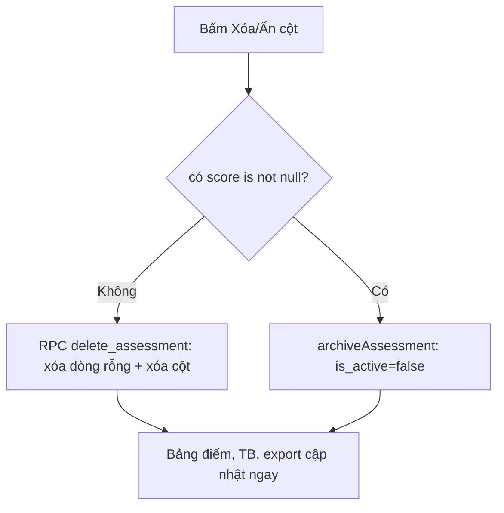
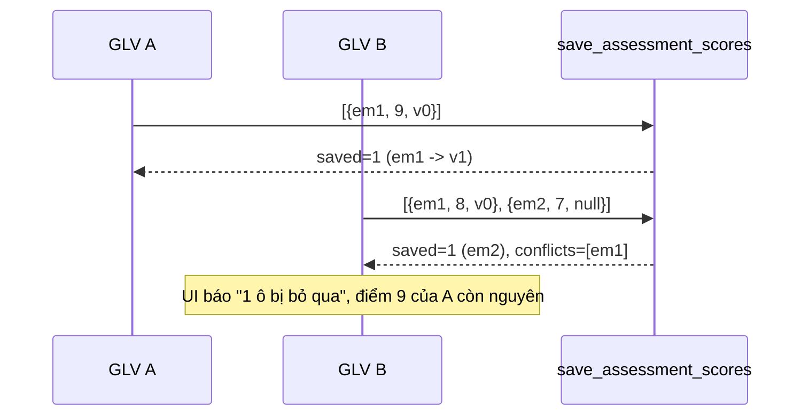

# M07-ASSESSMENTS — 04. Luồng TO-BE

Chỉ đề xuất cho luồng không đạt `PASS`. Các luồng **PASS giữ nguyên, không có To-Be**:
F01, F08, F12, F15.

---

## TB-M07-01 — Xóa / ẩn cột điểm (thay cho F04)

### Mục tiêu
Cho phép loại bỏ cột tạo nhầm theo đúng WF-08, đồng thời bảo toàn lịch sử khi cột đã có điểm thật.

### Actor
GLV lớp/đại diện (`can_grade_class`), khi bảng điểm **chưa khóa**.

### Bước mới

1. UI phân biệt hai nút theo dữ liệu thực tế:
   - Nếu cột **không có dòng nào `score is not null`** → nút **"Xóa cột"** (xóa cứng).
   - Nếu đã có điểm thật → nút **"Ẩn cột khỏi bảng điểm"** (xóa mềm).
2. Thêm RPC `delete_assessment(p_assessment_id)` (`security definer`):
   - kiểm `can_grade_class` + `not is_gradebook_locked`;
   - `select count(*) from assessment_scores where assessment_id = ? and score is not null`;
   - nếu `0` → `delete from assessment_scores where assessment_id = ?` rồi `delete from assessments`;
   - nếu `> 0` → ném `ASSESSMENT_HAS_SCORES`.
3. Thêm action `archiveAssessment(assessmentId)` đặt `is_active = false` (cột đã có sẵn — `M400:169`).
4. Query đã lọc `is_active = true` ở mọi nơi (`queries.ts:132`, `:261`, `:305`) nên cột ẩn biến mất khỏi
   bảng điểm, export và cả `v_student_weighted_average` (`M400:580` đã join `and assessment.is_active`).
5. Song song: `ScoreColumnForm` **chỉ gửi ô đã thay đổi** (so với `defaultValue`) để không sinh dòng rác nữa.

### Business rule
- **BR-M07-26 (mới)**: cột điểm chưa có điểm thật (mọi `score is null`) được xóa cứng cùng các dòng rỗng của nó.
- **BR-M07-27 (mới)**: cột đã có ít nhất một điểm thật chỉ được **ẩn mềm** (`is_active = false`), không xóa cứng.
- **BR-M07-28 (mới)**: cột ẩn không tham gia bảng điểm, trung bình có trọng số, export, portal và Top 5.

### Validation
`assessmentIdSchema` như hiện tại; RPC tự kiểm.

### Permission
Không nới quyền: cùng `can_grade_class` + điều kiện chưa khóa.

### Trạng thái dữ liệu
Không thêm cột. `assessments.is_active` chuyển từ "cột chết" thành cột nghiệp vụ.

### Error handling
| Mã | Khi nào | Thông điệp |
|---|---|---|
| `GRADEBOOK_LOCKED` | Bảng điểm đã khóa | "Bảng điểm đã bị khóa." |
| `CONFLICT` (`ASSESSMENT_HAS_SCORES`) | Xóa cứng cột đã có điểm | "Cột này đã có điểm. Bạn có thể ẩn cột thay vì xóa." |

### Audit
Ghi `updated_by` khi ẩn. Không cần bảng lịch sử vì dữ liệu điểm vẫn còn nguyên.

### Mermaid

### So sánh số bước
| | AS-IS | TO-BE |
|---|--:|--:|
| Xóa cột chưa có điểm | Không làm được (2 bước rồi lỗi) | 2 (bấm → xác nhận) |
| Loại cột đã có điểm | Không làm được | 2 (bấm Ẩn → xác nhận) |

### Ảnh hưởng
- **Module**: chỉ M07. Export và Top 5 hưởng lợi tự động vì đã lọc `is_active`.
- **API**: thêm 1 action, đổi hành vi `deleteAssessment` (giữ tên, đổi ruột sang RPC).
- **DB**: migration thêm RPC + grant. Không đổi bảng.
- **Rủi ro migration**: thấp; không đụng dữ liệu hiện có.
- **Rollback**: `drop function delete_assessment`, khôi phục action cũ.

### Phương án B (nếu chỉ muốn thay đổi tối thiểu)
Chỉ sửa `ScoreColumnForm` để gửi ô đã đổi. Ưu: 1 file, cỡ S. Nhược: **không xử lý được** các cột đã lỡ sinh
dòng rác trong dữ liệu hiện tại và vẫn không có đường ẩn cột đã có điểm. → **Khuyến nghị phương án A**,
lấy phần "chỉ gửi ô đã đổi" của B làm bước 5.

---

## TB-M07-02 — Tách "công bố kết quả" khỏi "khóa bảng điểm" (thay cho F05)

### Mục tiêu
Cho phép công bố/ẩn kết quả cho phụ huynh **sau khi** đã khóa, mà không nới lỏng khóa cấu trúc/điểm.

### Hai phương án

**Phương án A (khuyến nghị) — RPC `set_assessment_published` riêng.**
- Thêm RPC `security definer` chỉ đổi `assessments.is_published`, tự kiểm `can_grade_class` (không kiểm khóa).
- Trigger `validate_assessment` bổ sung điều kiện: bỏ qua kiểm khóa nếu **chỉ** `is_published` thay đổi
  (`new.* is not distinct from old.*` cho mọi cột khác).
- `authenticated` vẫn không được UPDATE trực tiếp khi khóa (policy giữ nguyên).
- Ưu: đổi tối thiểu, giữ nguyên toàn bộ đảm bảo "lock chặn mọi thay đổi **cấu trúc và điểm**".
- Nhược: thêm một ngoại lệ phải mô tả rõ trong BR và test.

**Phương án B — mốc công bố tổng thể qua `gradebook_locks.results_published_at`.**
- Thêm RPC `publish_class_results(p_class_id)` ghi `results_published_at/by`.
- Portal RLS đổi sang: `assessment_published OR class có results_published_at is not null`.
- Ưu: đúng ý đồ schema gốc (`docs/02 §9.6`), một thao tác công bố cả lớp.
- Nhược: **đổi ngữ nghĩa RLS portal** (`M400:554`) — rủi ro cao, phải viết lại pgTAP 016; và mất khả năng
  công bố từng cột.

### Business rule
- **BR-M07-29 (mới)**: khóa bảng điểm chặn thay đổi **cấu trúc cột, hệ số, điểm và nhận xét**; **không** chặn
  bật/tắt công bố kết quả.

### Error handling
Giữ `GRADEBOOK_LOCKED` cho mọi đường khác; đường công bố trả `FORBIDDEN` nếu không đủ quyền.

### Ảnh hưởng
- **API**: `setAssessmentPublished` chuyển sang gọi RPC.
- **DB**: 1 RPC + sửa 1 trigger (A) hoặc sửa policy portal (B).
- **Test bắt buộc**: pgTAP mới — "đã khóa vẫn công bố được cột" **và** "đã khóa vẫn không đổi được hệ số/điểm/nhận xét".
- **Rollback**: bỏ RPC, trigger trở lại bản cũ.

---

## TB-M07-03 — Nhập điểm an toàn khi nhiều người cùng làm (thay cho F06)

### Mục tiêu
Không mất điểm khi hai GLV cùng nhập một cột; không biến cả lớp thành "chỉnh tay" ngoài ý muốn.

### Bước mới

1. `getGradebookDetail` trả thêm `updatedAt` cho từng ô điểm (`assessment_scores.updated_at` đã có).
2. `ScoreColumnForm` chỉ gửi **các ô có giá trị khác `defaultValue`**, kèm `expectedUpdatedAt` của từng ô
   (rỗng nếu ô chưa từng có dòng).
3. `save_assessment_scores` với mỗi phần tử:
   - nếu dòng đã tồn tại và `updated_at <> expectedUpdatedAt` → **bỏ qua** và thu vào danh sách `conflicts`;
   - còn lại upsert như hiện tại.
4. RPC trả `{ saved, conflicts[] }` thay vì chỉ `integer`.
5. UI: "Đã lưu N ô. **M ô bị bỏ qua vì người khác vừa sửa** — tải lại để xem giá trị mới nhất."
   và tô nền các ô xung đột.
6. Sửa quy tắc override chuyên cần: chỉ đặt `is_manual_override = true` khi
   `excluded.score is distinct from public.assessment_scores.system_suggested_score`
   (thay cho `selected_assessment.kind = 'attendance'` vô điều kiện — `M400:410`, `:416-419`).

### Business rule
- **BR-M07-30 (mới)**: một ô điểm chỉ bị ghi đè khi client giữ đúng phiên bản của ô đó.
- **BR-M07-31 (sửa BR hiện hành)**: ô chuyên cần chỉ được đánh dấu "chỉnh tay" khi giá trị lưu **khác** đề xuất hệ thống.

### Permission / trạng thái dữ liệu
Không đổi quyền, không thêm cột (dùng `assessment_scores.updated_at`, đã có trigger `set_updated_at` — `M400:282`).

### Mermaid

### So sánh số bước
| | AS-IS | TO-BE |
|---|--:|--:|
| Một người nhập | 2 (nhập → lưu) | 2 |
| Hai người trùng ô | 2 (mất dữ liệu âm thầm) | 4 (lưu → báo → tải lại → lưu lại ô xung đột) |

### Ảnh hưởng
- **API**: `saveAssessmentScores` đổi kiểu trả về (**breaking** với 1 caller nội bộ).
- **DB**: sửa RPC `save_assessment_scores` (`M400:347`) — thay đổi chữ ký trả về ⇒ cần `drop`/`create`.
- **Rủi ro migration**: trung bình — RPC đang được E2E dùng; phải cập nhật `src/types/database.ts`.
- **Rollback**: khôi phục bản RPC cũ + action cũ.

### Phương án B (nhẹ hơn)
Chỉ làm bước 2 + 6 (gửi ô đã đổi, sửa quy tắc override). Ưu: cỡ S–M, không đụng chữ ký RPC, đã loại bỏ
phần lớn khả năng ghi đè (hai người sửa **hai ô khác nhau** không còn đụng nhau). Nhược: vẫn mất dữ liệu khi
đúng **cùng một ô**. → Có thể làm B trước, A sau.

---

## TB-M07-04 — Chỉ báo dòng bị bỏ qua khi lấy đề xuất chuyên cần (F07)

### Bước mới
`refresh_attendance_assessment_scores` trả `{ refreshed, skipped_manual }` thay vì một số; UI hiển thị
"Đã cập nhật N đề xuất · M ô đang chỉnh tay được giữ nguyên" + link tới `reset` hàng loạt.

### Ảnh hưởng
Sửa RPC (`M500:81`) + `actions.ts:194` + `editor.tsx:223-230`. Không đổi bảng. Cỡ **S–M**.
Sau khi TB-M07-03 bước 6 được làm, con số `skipped_manual` mới phản ánh đúng thực tế.

---

## TB-M07-05 — Nhận xét an toàn mặc định (F09/F10)

### Bước mới
1. Đổi mặc định `visibility` sang **`staff_only`** và hiển thị cảnh báo khi chọn "Công khai":
   "Nội dung này sẽ hiện trên cổng phụ huynh/thiếu nhi."
2. Thêm action `updateStudentComment` (policy `student_comments_update_grader` đã tồn tại — `M500:211`)
   để sửa thay vì xóa-viết-lại.
3. Chỉ tác giả hoặc `can_global_write` được xóa: thêm điều kiện `author_profile_id = auth.uid() or app.can_global_write()`
   vào `student_comments_delete_grader` (`M500:219`) và vào `deleteStudentComment`.

### Business rule
- **BR-M07-32 (mới)**: nhận xét mặc định là nội bộ; chuyển sang công khai phải là hành động có ý thức.
- **BR-M07-33 (mới)**: chỉ tác giả hoặc nhóm global-write được xóa nhận xét.

### Ảnh hưởng
`editor.tsx:345`, `actions.ts:257`, 1 migration đổi policy. Cỡ **M**.
**Rủi ro**: BR-M07-33 siết quyền — cần xác nhận nghiệp vụ (đại diện lớp có được xóa nhận xét của GLV khác không?).
**Rollback**: khôi phục policy cũ.

---

## TB-M07-06 — Vòng đời Top 5 rõ ràng (thay cho F16, kèm F13)

### Mục tiêu
Snapshot đã công bố là bất biến kể cả sau khi ẩn; bản nháp xóa được.

### Hai phương án

**Phương án A (khuyến nghị) — "ẩn" không đưa về nháp.**
1. Thêm cột `unpublished_at`/`unpublished_by` vào `leaderboards`.
2. `publish_leaderboard` bổ sung chốt: `if exists (select 1 from leaderboard_entries where leaderboard_id = ?)
   then raise 'LEADERBOARD_ALREADY_SNAPSHOTTED'` → một bảng Top 5 chỉ tính snapshot **một lần duy nhất**.
3. "Ẩn khỏi portal" chỉ đổi `is_published`; muốn công bố lại thì bật lại cờ, **không** tính lại.
4. Thêm action `deleteLeaderboard` chỉ cho bản **chưa từng publish** (không có entries) — khớp policy
   `leaderboards_delete_manager` sẵn có (`M600:344`).
- Ưu: giữ đúng "do not recompute silently afterward"; dữ liệu quá khứ không đổi.
- Nhược: muốn xếp hạng lại phải tạo bảng Top 5 mới (chấp nhận được, tiêu đề khác nhau).

**Phương án B — cho tính lại nhưng lưu lịch sử.**
Thêm bảng `leaderboard_snapshots` giữ mọi lần publish. Ưu: linh hoạt. Nhược: +1 bảng, +RLS, +portal phải chọn
snapshot nào để hiện; phức tạp hơn nhu cầu WF-09.

### Business rule
- **BR-M07-34 (mới)**: mỗi bảng Top 5 chỉ sinh snapshot một lần; "ẩn/hiện" chỉ đổi khả năng nhìn thấy.
- **BR-M07-35 (mới)**: chỉ bảng Top 5 chưa có snapshot mới được xóa.

### Ảnh hưởng
- **DB**: migration thêm 2 cột + sửa `publish_leaderboard` (`M600:252`).
- **API**: thêm `deleteLeaderboard`, thêm `republishLeaderboard` (bật lại cờ).
- **Test**: pgTAP 018 thêm case "unpublish → publish lại không đổi entries" và "xóa được bản nháp, không xóa được bản đã snapshot".
- **Rollback**: bỏ chốt trong RPC, cột mới để trống.

---

## TB-M07-07 — Thống nhất "Trung bình" giữa portal và bảng điểm (F17)

### Mục tiêu
Phụ huynh và GLV nói cùng một con số, hoặc hiểu rõ vì sao khác.

### Hai phương án

**Phương án A (khuyến nghị) — giữ cách tính, thêm chú thích và số cột.**
Portal hiển thị "TB 8.40 · tính trên 3/5 cột đã công bố"; tooltip giải thích. Không đổi logic.
- Ưu: 1 file UI, cỡ S; đúng nguyên tắc "chỉ hiển thị điều đã công bố".
- Nhược: hai số vẫn khác nhau.

**Phương án B — dùng chung `v_student_weighted_average`, chỉ hiện khi đã công bố toàn bộ cột.**
- Ưu: một nguồn sự thật, bỏ phép tính trùng lặp trong TypeScript (`queries.ts:192-216`).
- Nhược: khi lớp còn cột nội bộ, phụ huynh **không thấy** trung bình nào; thay đổi kỳ vọng người dùng.

### Ảnh hưởng
A: `published-results-portal.tsx:18` + `queries.ts` thêm `publishedCount/totalCount`. Cỡ **S**.
B: đổi query + RLS view (view đang `security_invoker` nên portal vẫn an toàn). Cỡ **M**.

---

## TB-M07-08 — Làm sạch toàn bộ ô xuất ra bảng tính (thay cho F18)

### Mục tiêu
Áp dụng `safeSpreadsheetText` cho **mọi** ô văn bản do người dùng nhập, không chỉ tên thiếu nhi.

### Bước mới
1. `buildGradebookExportData` bọc header cột điểm: `safeSpreadsheetText(\`${item.title} (HS ${item.weight})\`)`
   (`export-data.ts:15`).
2. Bọc luôn `detail.className` khi ghép tiêu đề trang (`export/route.ts:21`, `:67`).
3. Route export dùng `excelResponse`/`pdfResponse`/`asciiFilename` từ `src/lib/exports/http.ts` thay vì bản sao cục bộ.
4. Unit test thêm case: cột tên `=1+1` ⇒ header xuất ra bắt đầu bằng `'`.

### Business rule
- **BR-M07-36 (mới)**: mọi ô bảng tính chứa văn bản do người dùng nhập phải đi qua `safeSpreadsheetText`,
  bất kể là header hay giá trị.

### Ảnh hưởng
`src/features/assessments/export-data.ts`, `src/app/(dashboard)/results/[classId]/export/route.ts`,
`tests/unit/gradebook-export.test.ts`. Không DB, không API. Cỡ **S**.
**Rollback**: bỏ lời gọi (không khuyến khích).

---

## TB-M07-09 — Đồng bộ hệ số mặc định với `assessment_type_settings` (F02)

### Bước mới
`getGradebookDetail` trả thêm `defaultWeights` đọc từ `assessment_type_settings` của năm học;
`NewAssessmentForm` dùng giá trị đó thay `DEFAULT_WEIGHTS` hardcode (`editor.tsx:46-52`).

### Ảnh hưởng
`queries.ts:283` + `editor.tsx`. Không DB (bảng và policy đã có — `M400:499`). Cỡ **S**.

---

## TB-M07-10 — Siết và làm rõ quyền khóa bảng điểm (F11)

### Bước mới
1. `lockGradebook` kiểm quyền tường minh ở app trước khi gọi RPC (giống `unlockGradebook`).
2. Chốt nghiệp vụ: **hoặc** giữ `can_global_write` được khóa (khi đó cập nhật `docs/02 §9.6`),
   **hoặc** siết RPC về đúng `is_class_representative` (khi đó sửa `canLock` ở `queries.ts:384`).
   → Cần xác nhận (xem `08_ACCEPTANCE_CRITERIA.md §5`).
3. `lock_gradebook` không ghi đè `locked_at` nếu đang khóa (idempotent thật).

### Ảnh hưởng
`actions.ts:278`, `queries.ts:384`, RPC `M400:429`. Cỡ **S–M**. Rollback dễ.
