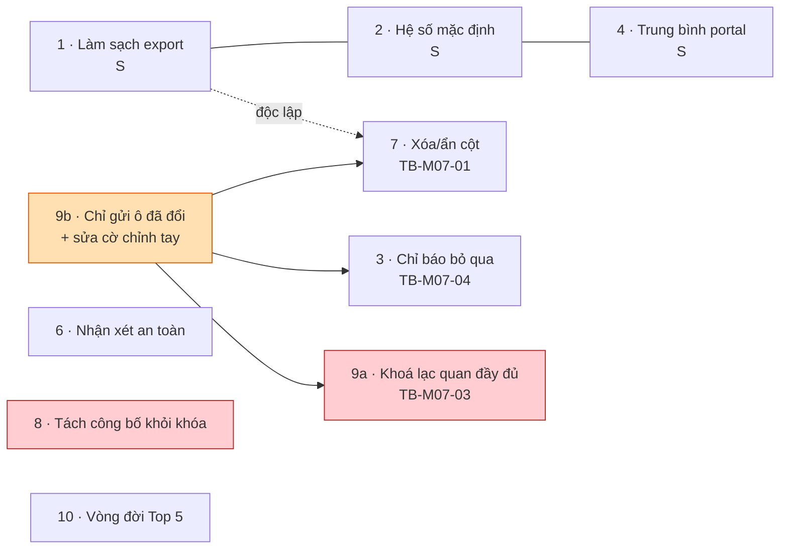

# M07 — ASSESSMENTS · Ảnh hưởng triển khai

> Ước lượng: **S** ≤ nửa ngày · **M** 1–2 ngày · **L** 3–5 ngày (một agent, gồm cả test).

---

## 1. Bảng tổng hợp

| # | Hạng mục | To-Be | Cỡ | Migration | Đổi RPC | Rủi ro |
|---|---|---|---|---|---|---|
| 1 | Làm sạch mọi ô xuất bảng tính | TB-M07-08 | **S** | ❌ | ❌ | **Rất thấp** |
| 2 | Đồng bộ hệ số mặc định với cấu hình năm học | TB-M07-09 | **S** | ❌ | ❌ | Rất thấp |
| 3 | Chỉ báo dòng bị bỏ qua khi lấy đề xuất chuyên cần | TB-M07-04 | **S–M** | ✅ sửa RPC | ✅ | Thấp |
| 4 | Thống nhất "Trung bình" portal ↔ bảng điểm (phương án A) | TB-M07-07 | **S** | ❌ | ❌ | Thấp |
| 5 | Siết và làm rõ quyền khóa bảng điểm | TB-M07-10 | **S–M** | ✅ sửa RPC | ✅ | Thấp |
| 6 | Nhận xét an toàn mặc định | TB-M07-05 | **M** | ✅ đổi policy | ❌ | **Trung bình** (siết quyền) |
| 7 | Xóa / ẩn cột điểm | TB-M07-01 | **M** | ✅ RPC mới | ✅ | Thấp |
| 8 | Tách "công bố kết quả" khỏi "khóa bảng điểm" | TB-M07-02 | **M–L** | ✅ RPC + trigger | ✅ | **Cao** (đụng ngữ nghĩa khóa) |
| 9 | Nhập điểm an toàn khi nhiều người cùng làm | TB-M07-03 | **L** | ✅ đổi chữ ký RPC | ✅ **breaking** | **Cao** |
| 10 | Vòng đời Top 5 rõ ràng | TB-M07-06 | **M–L** | ✅ +2 cột, sửa RPC | ✅ | Trung bình |

**Tổng ước lượng module: 14–20 ngày-người** nếu làm toàn bộ; **2–3 ngày** cho nhóm rủi ro rất thấp (1, 2, 4).

---

## 2. File phải sửa theo hạng mục

### Nhóm rủi ro rất thấp — làm ngay được
| Hạng mục | File |
|---|---|
| TB-M07-08 | `src/features/assessments/export-data.ts:15`; `src/app/(dashboard)/results/[classId]/export/route.ts:21,67`; dùng `src/lib/exports/http.ts` thay bản sao cục bộ (`:9-11`); `tests/unit/gradebook-export.test.ts` |
| TB-M07-09 | `src/features/assessments/server/queries.ts:283`; `src/features/assessments/components/gradebook-editor.tsx:46-52` |
| TB-M07-07 (A) | `src/features/assessments/components/published-results-portal.tsx:18`; `queries.ts` (thêm `publishedCount`/`totalCount`) |

### Nhóm cần migration
| Hạng mục | Migration | File ứng dụng |
|---|---|---|
| TB-M07-04 | Sửa `refresh_attendance_assessment_scores` (`20260722000500:81`) trả `{refreshed, skipped_manual}` | `actions.ts:194`; `gradebook-editor.tsx:223-230` |
| TB-M07-10 | Sửa `lock_gradebook` (`20260722000400:429`) idempotent thật | `actions.ts:278`; `queries.ts:384` |
| TB-M07-01 | RPC mới `delete_assessment` + grant | `actions.ts`; `gradebook-editor.tsx` |
| TB-M07-05 | Đổi policy `student_comments_delete_grader` (`20260722000500:219`) | `gradebook-editor.tsx:345`; `actions.ts:257` |
| TB-M07-02 | RPC `set_assessment_published` + sửa trigger `validate_assessment` (`20260722000400:187`) | `actions.ts` |
| TB-M07-03 | `drop`/`create` `save_assessment_scores` (`20260722000400:347`) — **đổi kiểu trả về** | `actions.ts`; `gradebook-editor.tsx`; `src/types/database.ts` (sinh lại) |
| TB-M07-06 | +2 cột `leaderboards`; sửa `publish_leaderboard` (`20260722000600:252`) | `actions.ts`; `queries.ts` |

---

## 3. Ảnh hưởng cơ sở dữ liệu — cảnh báo trọng yếu

### 3.1 TB-M07-03 là thay đổi **phá vỡ tương thích**
`save_assessment_scores` hiện trả `integer`; To-Be trả `{saved, conflicts[]}`. PostgreSQL **không cho phép
đổi kiểu trả về bằng `create or replace`** ⇒ bắt buộc `drop function` rồi `create`. Hệ quả dây chuyền:
- `src/types/database.ts` phải sinh lại (`npm run db:types`).
- E2E đang dùng RPC này sẽ đỏ cho tới khi cập nhật.
- Nếu triển khai lên môi trường thật, có **khoảng thời gian giữa `drop` và `create`** mà hàm không tồn tại —
  phải chạy trong cùng một transaction của migration.

### 3.2 TB-M07-02 đụng vào ngữ nghĩa "khóa"
Đây là hạng mục rủi ro cao nhất về mặt nghiệp vụ. Hiện tại quy tắc rất đơn giản và dễ giải thích:
**"khóa rồi thì không đổi được gì nữa"** — được giữ ở cả RLS (`20260722000400:542-552`) lẫn trigger.
To-Be tạo ra một ngoại lệ (công bố vẫn đổi được sau khi khóa). Ngoại lệ này phải:
- được mô tả rõ trong `docs/02-database-design.md` và `docs/03-workflow.md` WF-08;
- có pgTAP **cả hai chiều**: "đã khóa vẫn công bố được" **và** "đã khóa vẫn không đổi được hệ số/điểm/nhận xét";
- không được cài bằng cách nới policy — phải qua RPC riêng, giữ nguyên policy hiện tại.

**Khuyến nghị mạnh: chọn phương án A.** Phương án B đổi ngữ nghĩa RLS của cổng phụ huynh
(`20260722000400:554`), là nơi nhạy cảm nhất của module.

### 3.3 TB-M07-05 siết quyền xóa nhận xét
Đây là thay đổi **giảm quyền** của người đang dùng. Trước khi triển khai phải chốt nghiệp vụ:
Giáo lý viên đại diện có được xóa nhận xét do Giáo lý viên khác viết không? Nếu siết mà nghiệp vụ
thực tế cần, sẽ tạo ra tình huống "không ai sửa được nhận xét sai của người đã nghỉ".

## 4. Ảnh hưởng RLS

| Hạng mục | Đụng RLS? | Chi tiết |
|---|---|---|
| TB-M07-05 | ✅ | Thêm điều kiện `author_profile_id = auth.uid() or app.can_global_write()` vào policy xóa |
| TB-M07-02 (A) | ❌ | Giữ nguyên policy; đi đường RPC |
| TB-M07-02 (B) | ✅ **rủi ro cao** | Đổi policy `assessment_scores_select_scope` — nơi quyết định phụ huynh thấy gì |
| Còn lại | ❌ | — |

**Nguyên tắc bắt buộc:** không hạng mục nào được nới policy đọc của cổng phụ huynh/thiếu nhi.
Mọi thay đổi phải giữ nguyên bất biến: *phụ huynh chỉ thấy điểm của con mình và chỉ khi đã công bố.*

## 5. Ảnh hưởng dữ liệu hiện có

| Hạng mục | Dữ liệu hiện có | Xử lý |
|---|---|---|
| TB-M07-01 | Có thể đã tồn tại **dòng điểm rỗng rác** do lỗi gửi toàn bộ ô | RPC xóa cứng sẽ dọn luôn; cần rà soát số lượng trước |
| TB-M07-03 bước 6 | Có thể đã có ô chuyên cần bị đánh dấu "chỉnh tay" **sai** (do đánh dấu vô điều kiện) | Cần script rà: ô có `is_manual_override=true` nhưng `score = system_suggested_score` ⇒ đặt lại `false` |
| TB-M07-06 | Bảng Top 5 đã publish | Cột mới để trống; chốt "chỉ snapshot một lần" chỉ áp dụng từ nay |
| Còn lại | Không ảnh hưởng | — |

## 6. Test phải thêm

| Loại | Nội dung | Gắn với |
|---|---|---|
| pgTAP | Đã khóa **vẫn công bố được** cột | TB-M07-02 |
| pgTAP | Đã khóa **vẫn không đổi được** hệ số / điểm / nhận xét | TB-M07-02 |
| pgTAP | Xóa được cột chưa có điểm; **không** xóa được cột đã có điểm | TB-M07-01 |
| pgTAP | Hai phiên cùng ghi một ô: phiên sau nhận `conflicts`, điểm phiên trước **còn nguyên** | TB-M07-03 |
| pgTAP | Ô chuyên cần chỉ đánh dấu "chỉnh tay" khi giá trị **khác** đề xuất | TB-M07-03 b6 |
| pgTAP | Ẩn rồi công bố lại Top 5 **không đổi** danh sách; xóa được bản nháp, không xóa được bản đã chốt | TB-M07-06 |
| pgTAP | Chỉ tác giả hoặc global-write xóa được nhận xét | TB-M07-05 |
| Unit | Tên cột `=1+1` ⇒ ô xuất ra bắt đầu bằng `'` | TB-M07-08 |
| Unit | Trung bình portal hiển thị đúng số cột đã công bố | TB-M07-07 |
| E2E | Phụ huynh **không** thấy cột chưa công bố và **không** thấy nhận xét nội bộ | hồi quy bắt buộc |

## 7. Thứ tự phụ thuộc

**Luật thứ tự:**
1. **Hạng mục 1, 2, 4 làm được ngay** — không migration, không phụ thuộc, giá trị tức thì.
   Hạng mục 1 (chống công thức lạ trong file Excel) là **vấn đề an toàn dữ liệu**, nên làm trước nhất.
2. **"Chỉ gửi ô đã đổi" (9b) là điều kiện tiên quyết** cho hạng mục 3, 7 và 9a. Riêng bước này đã loại bỏ
   phần lớn khả năng ghi đè (hai người sửa hai ô khác nhau không còn đụng nhau) với chi phí rất thấp.
3. **Hạng mục 9a (khóa lạc quan đầy đủ) chỉ làm nếu 9b chưa đủ** — đo bằng thực tế sử dụng, đừng làm trước.
4. **Hạng mục 8 làm cuối** — cần chốt nghiệp vụ trước (xem `08_ACCEPTANCE_CRITERIA.md`).

## 8. Ảnh hưởng sang module khác

| Module | Ảnh hưởng | Mức |
|---|---|---|
| M05 Điểm danh | M07 **đọc một chiều** từ `v_student_attendance_summary`; không hạng mục nào sửa view này | ✅ an toàn |
| M13 Cổng phụ huynh | TB-M07-07 đổi cách hiển thị trung bình; TB-M07-02 đổi thời điểm phụ huynh thấy điểm | ⚠️ **phải kiểm cùng nhau** |
| M08 Chuyển lớp | Đọc trung bình có trọng số để tham chiếu; TB-M07-01 (ẩn cột) làm đổi trung bình | ⚠️ kiểm lại số liệu |
| M11 Báo cáo | `report_results_rows()` đọc điểm; ẩn cột làm đổi kết quả báo cáo | ⚠️ kiểm lại |
| M14 Vỏ ứng dụng | Dùng chung quyết định về kênh phản hồi thao tác | Bắt buộc thống nhất |

**Cảnh báo:** ba module M08, M11, M13 đều tiêu thụ số trung bình của M07. Bất kỳ thay đổi nào làm đổi
cách tính trung bình (đặc biệt TB-M07-01 ẩn cột) **phải được kiểm chéo ở cả ba nơi** trước khi đóng.
