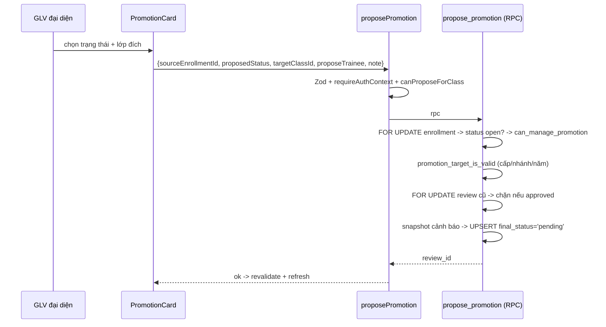
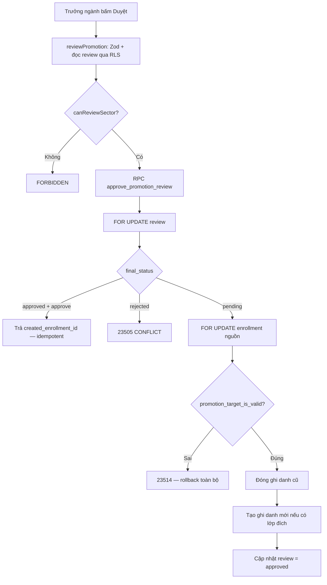

# M08-PROMOTIONS — 02. Luồng AS-IS

Ký hiệu: `M08-F01` … `M08-F10`. Mọi bước đều trích `file:line` thật.

---

## M08-F01 — Xem bảng chuyển lớp

**Actor:** mọi staff trừ `treasurer`.

| # | Bước | Bằng chứng |
|---|---|---|
| 1 | Người dùng mở `/promotions` | `src/config/navigation.ts:51` |
| 2 | Server Component gọi `getPromotionsPageData()` | `src/app/(dashboard)/promotions/page.tsx:7` |
| 3 | Guard route (`requireRouteAccess`) → sai role thì `redirect("/access-denied")` | `src/features/promotions/server/queries.ts:81`, `src/lib/auth/guards.ts:18-22` |
| 4 | Chạy 3 query song song: **toàn bộ** `enrollments` (không lọc năm học, không phân trang), **toàn bộ** `promotion_reviews`, **toàn bộ** `classes` đang active | `queries.ts:83-93` |
| 5 | Lọc còn `active`/`paused` hoặc đã có review | `queries.ts:96-97` |
| 6 | **Với TỪNG dòng** gọi `canProposeForClass` → 2 query DB/dòng nếu không phải global-write | `queries.ts:98-101`, `permissions.ts:14-28` |
| 7 | Ghép review vào từng ghi danh, sắp xếp theo `lớp + tên` (`localeCompare` vi) | `queries.ts:103-134` |
| 8 | Render lưới card 1 cột (mobile) / 2 cột (`xl`) | `promotion-board.tsx:168` |

**Empty state:** "Không có ghi danh đang mở trong phạm vi của bạn." (`promotion-board.tsx:167`).

**Vấn đề:**
- **N+1 nghiêm trọng** ở bước 6: mỗi ghi danh 2 round-trip; một ngành ~200 em → ~400 query nối tiếp.
- Không có **bộ lọc theo ngành/lớp**, không tìm kiếm, không phân trang, không nhóm.
- Không hiển thị **ai đã đề xuất** (`proposed_by` không được map ra `PromotionReviewItem`, `queries.ts:120-132`).

---

## M08-F02 — GLV đại diện tạo đề xuất (lên lớp / học lại)

**Actor:** GLV đại diện lớp, hoặc global-write.

| # | Bước | Bằng chứng |
|---|---|---|
| 1 | Card hiện form khi `item.canPropose && review?.finalStatus !== "approved"` | `promotion-board.tsx:116` |
| 2 | Chọn "Đề xuất": mặc định `recommended_promote` | `promotion-board.tsx:42, 120-122` |
| 3 | Danh sách lớp đích lọc client: `yearStart > yearStart nguồn`, `classKind='catechism'`, `gradeLevelId` = cấp tiếp theo (hoặc cùng cấp nếu học lại) | `promotion-board.tsx:45-50` |
| 4 | `defaultTarget` = lớp đã đề xuất trước đó **hoặc lớp đầu danh sách** | `promotion-board.tsx:52` |
| 5 | Submit → `proposePromotion(...)` | `promotion-board.tsx:60-66` |
| 6 | Zod: uuid, enum, note ≤1000; superRefine kiểm hình dạng target | `schemas.ts:7-22` |
| 7 | `requireAuthContext("/promotions")` | `actions.ts:32` |
| 8 | Đọc `enrollments.class_id` qua RLS; không thấy → `RESOURCE_NOT_FOUND` | `actions.ts:34-39` |
| 9 | `canProposeForClass` → sai thì `FORBIDDEN` | `actions.ts:40` |
| 10 | RPC `propose_promotion` | `actions.ts:41-47` |
| 11 | RPC: `select … for update` khóa hàng ghi danh; không có → `P0002` | `…promotions.sql:145-149` |
| 12 | Ghi danh phải `active`/`paused`, nếu không → `23514` | `…promotions.sql:150-152` |
| 13 | `app.can_manage_promotion(class_id)` → `42501` | `…promotions.sql:153-155` |
| 14 | `app.promotion_target_is_valid` kiểm cấp/nhánh/năm/`status='active'` | `…promotions.sql:171-172`, `74-125` |
| 15 | Khóa review cũ `for update`; đã `approved` → `23505` | `…promotions.sql:175-179` |
| 16 | Dựng `warning_snapshot` từ 2 view (điểm TB, điểm lễ, điểm giáo lý, 3 cờ) | `…promotions.sql:181-194` |
| 17 | `insert … on conflict (source_enrollment_id) do update` → reset về `pending`, xóa `reviewed_*` | `…promotions.sql:196-221` |
| 18 | `revalidatePath("/promotions")`, trả `{id}` | `actions.ts:49-50` |
| 19 | UI hiện "Đã lưu đề xuất chuyển lớp." + `router.refresh()` | `promotion-board.tsx:67-70` |

**Trạng thái cuối:** `promotion_reviews.final_status='pending'`; `enrollments` **không đổi**.

**Error path:**
| Tình huống | Kết quả |
|---|---|
| UUID sai | Zod ném → `CONFLICT` "Không thể xử lý chuyển lớp…" (`actions.ts:16`) — **mất thông điệp Zod** |
| Ghi danh đã bị xóa/không đọc được | `RESOURCE_NOT_FOUND` |
| GLV thường (không đại diện) | `FORBIDDEN` (test `019:72`) |
| Nhảy sai cấp | `23514` → "Lớp đích hoặc trạng thái chuyển lớp không hợp lệ." (test `019:75`) |
| Đề xuất đã duyệt | `23505` → "Đề xuất này đã được xử lý." |
| Ghi danh đã `completed` do luồng thủ công ở `/classes` | `23514` → thông điệp **sai lệch** (nói lớp đích không hợp lệ) |

---

## M08-F03 — Sửa / gửi lại đề xuất

Không có action riêng: dùng lại `proposePromotion`. `on conflict do update` (`…promotions.sql:207-221`)
ghi đè và đặt `final_status='pending'`, `reviewed_by=null`, `reviewed_at=null`, `review_note=null`.

- Đề xuất **bị từ chối** → form vẫn hiện (`promotion-board.tsx:116`) → gửi lại được. **ĐÚNG WF-11.**
- Đề xuất **đã duyệt** → form ẩn ở UI và RPC chặn `23505`. **ĐÚNG.**
- **Mất lịch sử:** lần từ chối trước (ai từ chối, khi nào, lý do gì) bị ghi đè, không lưu ở đâu.

---

## M08-F04 — Đề xuất Dự trưởng (Hiệp 2)

| # | Bước | Bằng chứng |
|---|---|---|
| 1 | Checkbox chỉ hiện khi `status='recommended_promote'` **và** `canProposeTrainee` (từ `grade_levels.can_propose_trainee`) | `promotion-board.tsx:133-137` |
| 2 | Tick → form ẩn ô lớp đích, gửi `targetClassId=null, proposeTrainee=true` | `promotion-board.tsx:63-64` |
| 3 | RPC: bắt buộc `p_target_class_id is null` và status `recommended_promote`, và cấp nguồn phải `can_propose_trainee` | `…promotions.sql:160-170` |
| 4 | Khi duyệt, hệ thống **tự tìm** lớp `class_kind='trainee'`, `status='active'`, năm bắt đầu > năm nguồn, lấy lớp sớm nhất | `…promotions.sql:279-287` |
| 5 | Tạo ghi danh vào lớp Dự trưởng; **không** tạo `role_assignments`, **không** tạo tài khoản | `…promotions.sql:322-329`; test `019:112` |

**ĐÚNG WF-11** ("Hiệp 2: tạo đề xuất Dự trưởng, không tạo role tự động").

---

## M08-F05 — Trưởng/Phó ngành duyệt (approve)

| # | Bước | Bằng chứng |
|---|---|---|
| 1 | Form duyệt chỉ hiện khi `item.canReview && review.finalStatus==='pending'` | `promotion-board.tsx:143` |
| 2 | Chọn lớp đích khi duyệt (được đổi nhánh A/B) | `promotion-board.tsx:145-152`, danh sách `reviewTargets` `94-96` |
| 3 | Submit → `reviewPromotion({reviewId, decision:'approve', targetClassId, note})` | `promotion-board.tsx:79-86` |
| 4 | Zod `promotionReviewSchema` | `schemas.ts:24-29` |
| 5 | Action đọc review + `sector_id` của lớp nguồn qua RLS | `actions.ts:61-67` |
| 6 | `canReviewSector` → sai ngành thì `FORBIDDEN` | `actions.ts:68`, `permissions.ts:31-39` |
| 7 | RPC `approve_promotion_review` | `actions.ts:69-74` |
| 8 | `select … for update` khóa review | `…promotions.sql:246-247` |
| 9 | `app.can_review_promotion` (ngành khớp `app.current_sector_id()`) | `…promotions.sql:251-253`, `53-72` |
| 10 | Nếu đã `approved` + decision `approve` → **return luôn `created_enrollment_id`** (idempotent) | `…promotions.sql:257-259` |
| 11 | Nếu `final_status <> 'pending'` → `23505` | `…promotions.sql:260-262` |
| 12 | `select … for update` khóa ghi danh nguồn; phải `active`/`paused` | `…promotions.sql:272-276` |
| 13 | Xác định lớp đích: Dự trưởng → tự tìm; promote/repeat → `coalesce(p_target_class_id, proposed_target_class_id)` | `…promotions.sql:279-292` |
| 14 | **Kiểm hợp lệ TRƯỚC khi ghi**; sai → `23514`, cả giao dịch rollback | `…promotions.sql:294-298`; test `019:105-106` |
| 15 | Đóng nguồn: `paused` (tạm nghỉ) hoặc `repeating`/`withdrawn`/`completed` + `ended_on = năm học end_date` | `…promotions.sql:300-314` |
| 16 | Tạo ghi danh mới `active`, `enrolled_on = start_date năm đích`, `previous_enrollment_id = nguồn` | `…promotions.sql:316-329` |
| 17 | Cập nhật review: `approved`, `reviewed_by`, `reviewed_at`, `approved_target_class_id`, `created_enrollment_id` | `…promotions.sql:331-336` |
| 18 | `revalidatePath("/promotions")` + `"/students"` | `actions.ts:76-77` |

**Nguyên tử: ĐẠT.** Toàn bộ 8→17 nằm trong một hàm plpgsql (một giao dịch) với row lock trên
cả review lẫn ghi danh nguồn.

---

## M08-F06 — Từ chối (reject)

| # | Bước | Bằng chứng |
|---|---|---|
| 1 | Nút "Từ chối" là `type="button"` gọi `runReview(form,'reject')` → **bỏ qua HTML validation** của select `required` (đúng ý đồ) | `promotion-board.tsx:156` |
| 2 | Gửi `targetClassId=null` | `promotion-board.tsx:82-84` |
| 3 | RPC: update `final_status='rejected'`, `reviewed_by`, `reviewed_at`, `review_note`; **return null** | `…promotions.sql:264-270` |
| 4 | Ghi danh nguồn **không đổi** | — |
| 5 | UI: "Đã từ chối đề xuất." | `promotion-board.tsx:88` |

Đại diện thấy lại form đề xuất và gửi lại được (M08-F03). **ĐÚNG WF-11.**

**Thiếu:** không bắt buộc nhập lý do khi từ chối (`review_note` nullable, UI không `required`).

---

## M08-F07 — Duyệt lại đề xuất đã approved (idempotent)

`…promotions.sql:257-259` trả về `created_enrollment_id` cũ, **không tạo ghi danh thứ hai**,
kể cả khi truyền `p_target_class_id` khác. Test `019:90-91` khẳng định. **ĐẠT.**

Trên UI, form duyệt đã bị ẩn khi `finalStatus !== 'pending'` (`promotion-board.tsx:143`) nên
đường này chỉ chạm tới qua gọi action trực tiếp / double-submit.

---

## M08-F08 — Thu hồi đề xuất — **KHÔNG TỒN TẠI**

Không có action, không có RPC, không có policy DELETE trên `promotion_reviews`
(`…promotions.sql:342` chỉ `grant select`). Đại diện gửi nhầm chỉ có thể **sửa đè**, không xóa.
Với ghi danh đã đề xuất "rút học" mà muốn quay lại "chưa đề xuất" → không có đường.

---

## M08-F09 — Lọc theo ngành / lớp — **KHÔNG TỒN TẠI**

`PromotionBoard` render thẳng toàn bộ mảng (`promotion-board.tsx:168`). Không có `searchParams`,
không có select ngành/lớp, không có ô tìm tên, không phân trang.

---

## M08-F10 — Chuyển lớp giữa năm (luồng khác, ngoài M08)

Có tồn tại nhưng **không đi qua WF-11**:

| # | Bước | Bằng chứng |
|---|---|---|
| 1 | Vào `/classes/[classId]`, mỗi em có form "Kết thúc" với select trạng thái gồm `transferred` | `src/app/(dashboard)/classes/[classId]/page.tsx:52-64` |
| 2 | `endEnrollmentFromForm` → `endEnrollment` | `src/features/enrollments/server/actions.ts:69, 95` |
| 3 | Quyền: `app.can_manage_class` = global-write hoặc trưởng/phó ngành | `enrollments.sql:66-87, 149-152` |
| 4 | Sau đó tự ghi danh vào lớp mới qua form "Ghi danh thiếu nhi" | `classes/[classId]/page.tsx:100-112` |

**Hệ quả:** hai ghi danh **không** được nối bằng `previous_enrollment_id`, không có đề xuất,
không có người duyệt, không có ghi chú lý do → lịch sử lớp bị đứt. Đây là câu trả lời cho câu hỏi
"chuyển lớp giữa năm có luồng riêng không": **có, nhưng là luồng thủ công không kiểm soát.**

---

## Edge case đã kiểm

| Tình huống | Kết quả | Bằng chứng |
|---|---|---|
| Empty state | Có thông điệp riêng | `promotion-board.tsx:167` |
| Trùng đề xuất cùng ghi danh | Unique + upsert → không sinh bản thứ hai | `…promotions.sql:5, 207` |
| 2 trưởng ngành duyệt song song | `for update` serialize; người thứ hai rơi vào nhánh idempotent | `…promotions.sql:246-259` |
| 2 đại diện đề xuất song song | `for update` trên enrollment ngay bước đầu | `…promotions.sql:145-146` |
| Trưởng ngành khác ngành | Không đọc được review → `P0002` | test `019:83` |
| GLV lớp (không đại diện) | `42501` | test `019:72` |
| UUID không hợp lệ | Zod chặn nhưng **thông điệp bị nuốt** thành "Không thể xử lý chuyển lớp…" | `actions.ts:14-17` |
| Duyệt với lớp đích sai | Rollback toàn bộ, ghi danh nguồn giữ `active` | test `019:105-106` |
| Cảnh báo bí tích/chuyên cần | Không chặn ở bất kỳ đâu trong RPC | `…promotions.sql:294-337` |
| Lớp cuối ngành xét bí tích | **Không được kiểm ở đâu cả** | không có tham chiếu `requires_sacrament_review` trong `src/` |
