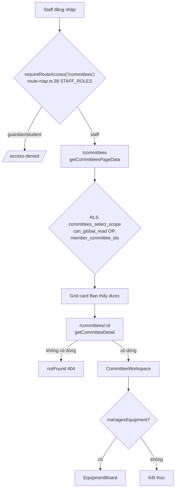
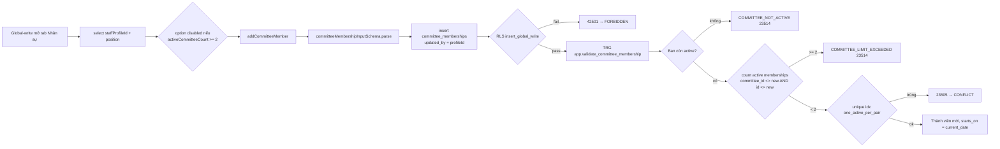
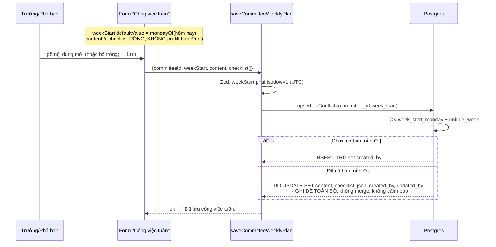
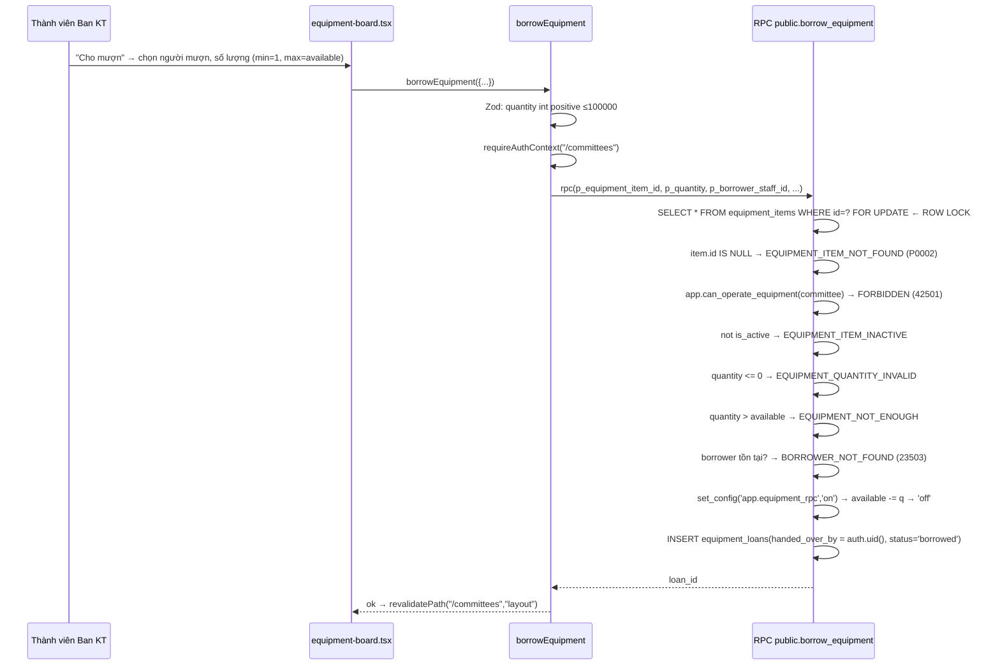

# M09 — BAN & THIẾT BỊ · 02. AS-IS FLOWS

Mỗi luồng theo trục: **Actor → màn hình → action UI → validation client → server action/RPC →
validation server (Zod) → query/service → RLS/constraint/trigger → trạng thái cuối → thông báo.**

Ký hiệu: `RLS✓` = có policy chặn ở DB; `TRG` = trigger; `CK` = check constraint.

---

## Sơ đồ tổng thể



---

## M09-F01 — Xem danh sách Ban

| Bước | Chi tiết | Bằng chứng |
|---|---|---|
| Actor | Mọi role trong `STAFF_ROLES` | `src/lib/permissions/route-map.ts:38` |
| Màn hình | `/committees` | `src/app/(dashboard)/committees/page.tsx:6-16` |
| Server query | `getCommitteesPageData()` | `src/features/committees/server/queries.ts:85-116` |
| Guard | `requireRouteAccess("/committees")` → redirect `/access-denied` | `queries.ts:89`, `src/lib/auth/guards.ts:17-21` |
| Truy vấn | `committees` (order `sort_order`,`name`) + `committee_memberships where is_active` chạy song song | `queries.ts:93-99` |
| RLS✓ | `committees_select_scope`: `can_global_read()` **hoặc** `id = any(member_committee_ids())` | `20260723000100_committees.sql:178-183` |
| Suy dẫn | `memberCount`, `myPosition` tính bằng JS trên mảng membership đã lọc RLS | `queries.ts:109-112` |
| Trạng thái cuối | Grid card; card hiện badge chức vụ nếu là thành viên, ngược lại badge trạng thái Ban | `committee-list.tsx:19-51` |
| Empty state | "Bạn chưa thuộc Ban nào. Xin liên hệ Ban điều hành xứ đoàn…" | `committee-list.tsx:123-128` |

**Lệch UI-spec**: `docs/06 §13` yêu cầu card hiện *Trưởng/Phó*, *lịch họp tiếp theo*, *công việc tuần*.
Card hiện tại chỉ có tên + số thành viên + mô tả.

**Cạnh**: `memberCount` của một Ban mà người dùng **không** thuộc về (trường hợp global-read) là chính xác;
nhưng với người chỉ thuộc 1 Ban thì mọi card khác không hiện ra nên không có rò rỉ.

---

## M09-F02 — Tạo Ban mới

```mermaid
sequenceDiagram
  participant U as Global-write user
  participant C as committee-list.tsx
  participant A as createCommittee
  participant D as Postgres
  U->>C: bấm "Thêm Ban mới" → điền code/name/description
  C->>C: HTML required + maxLength; toUpperCase(code)
  C->>A: createCommittee({code,name,description})
  A->>A: committeeInputSchema.parse  (regex ^[A-Z0-9_]{2,32}$)
  A->>A: requireAuthContext("/committees")
  A->>D: insert committees(...,updated_by=profileId)
  D->>D: RLS committees_insert_global_write<br/>can_global_write() AND updated_by=auth.uid()
  D->>D: CK committees_code_format
  D-->>A: id | 42501 | 23505
  A-->>C: {ok:true} | mapDatabaseError
  C->>C: setMessage + form.reset + router.refresh
```

| Điểm | Bằng chứng |
|---|---|
| Ẩn nút khi không có quyền | `committee-list.tsx:89`, `permissions.ts:14-16` |
| Zod | `schemas.ts:6-10` |
| Action | `actions.ts:56-77` |
| RLS✓ | `20260723000100_committees.sql:184-186` |
| Trùng mã | `code citext unique` → `23505` → "Dữ liệu này đã tồn tại." | `committees.sql:14`, `actions.ts:42-44` |

**Thiếu**: không có action `updateCommittee` / `deactivateCommittee`. Policy
`committees_update_global_write` (`committees.sql:187-190`) tồn tại nhưng **không có luồng người dùng nào
gọi tới** — không sửa được tên/mô tả Ban, không ngưng hoạt động Ban, không bật/tắt `manages_equipment`.

---

## M09-F03 — Mở chi tiết Ban (gồm đường tấn công URL trực tiếp)

| Bước | Chi tiết | Bằng chứng |
|---|---|---|
| Actor | Staff bất kỳ, kể cả người **không** thuộc Ban | — |
| Input | `params.committeeId` | `[committeeId]/page.tsx:17` |
| Validation client | Regex UUID → `notFound()` nếu sai định dạng (tránh 500 do cast uuid lỗi) | `[committeeId]/page.tsx:10,19` |
| Server query | `getCommitteeDetail(committeeId)` | `queries.ts:118-228` |
| RLS✓ tầng 1 | `select committees … maybeSingle()`; không thuộc Ban và không global-read → `null` → `notFound()` | `queries.ts:123-128`, `page.tsx:22` |
| RLS✓ tầng 2 | 4 truy vấn con (`memberships`, `announcements`, `meetings`, `weekly_plans`) đều có policy select riêng | `committee_content.sql:122-127,139-144,156-161` |
| Kho thiết bị | Chỉ nạp khi `managesEquipment` | `page.tsx:25` |
| Trạng thái cuối | `CommitteeWorkspace` + (tùy) `EquipmentBoard` | `page.tsx:39-49` |

**Kết luận đường tấn công**: **ĐẠT**. Kể cả nếu bỏ qua `notFound()`, cả 4 truy vấn nội dung đều
trả rỗng vì `committee_id` không nằm trong `app.member_committee_ids()`. E2E khẳng định:
`tests/e2e/committees.spec.ts:200-204`. pgTAP khẳng định: `020_committees_test.sql:129-137`.

**Cạnh**: UUID hợp lệ nhưng không tồn tại → cùng 404 như "không có quyền" → không phân biệt được
tồn tại/không tồn tại (đúng chuẩn, không rò).

---

## M09-F04 — Thêm nhân sự vào Ban



| Điểm | Bằng chứng |
|---|---|
| Danh sách nhân sự chỉ nạp cho người có quyền, đã loại người đã ở trong Ban | `queries.ts:171-187` |
| Cảnh báo trước giới hạn 2 Ban (option `disabled` + hậu tố "— đã đủ hai Ban") | `committee-workspace.tsx:206-214` |
| Zod | `schemas.ts:12-16` |
| Action | `actions.ts:79-102` |
| RLS✓ | `committees.sql:198-200` |
| TRG SECURITY DEFINER | `committees.sql:68-102` — đếm trên toàn bộ bảng, không qua RLS |
| Map lỗi tiếng Việt | `actions.ts:36-41` |
| Test | `020_committees_test.sql:56-87` |

**Phân tích trigger đếm 2 Ban**: điều kiện `committee_id <> new.committee_id and id <> new.id`
là đúng cho cả INSERT và UPDATE:
- INSERT vào Ban C khi đã có A+B → `active_count = 2` → chặn. ✔
- INSERT vào Ban B khi đã có A → `active_count = 1` → cho qua, tổng = 2. ✔
- UPDATE dòng cũ (đổi `is_active` false→true) → tự loại chính nó bằng `id <> new.id`. ✔
- Không đếm nhầm 2 dòng cùng Ban vì unique partial index chặn từ trước.
`SECURITY DEFINER` là bắt buộc: nếu là INVOKER, một người chỉ nhìn thấy 1 Ban qua RLS sẽ đếm ra 0
và lách được giới hạn. **ĐẠT**.

---

## M09-F05 — Đổi chức vụ thành viên

| Bước | Chi tiết | Bằng chứng |
|---|---|---|
| UI | `<select>` **tự lưu ngay khi `onChange`**, không có nút xác nhận | `committee-workspace.tsx:166-182` |
| Zod | `committeeMembershipPositionSchema` | `schemas.ts:22-25` |
| Action | update `position` + `updated_by`; `.maybeSingle()` rỗng → `FORBIDDEN` | `actions.ts:104-124` |
| RLS✓ | `committee_memberships_update_global_write` | `committees.sql:201-204` |
| TRG | **Không chạy lại** — trigger chỉ bind `of committee_id, staff_profile_id, is_active` | `committees.sql:100` |
| Trạng thái cuối | `router.refresh()` |

**Vấn đề**: `defaultValue` là uncontrolled. Khi server trả lỗi (`FORBIDDEN`, mất mạng), `<select>` vẫn
hiển thị giá trị mới trong khi DB giữ giá trị cũ → UI nói dối cho tới khi người dùng tự F5.

**Cạnh chưa chặn**: có thể đặt **hai Trưởng ban** trong cùng một Ban — không có ràng buộc
"tối đa 1 leader / 1 deputy" ở DB lẫn UI.

---

## M09-F06 — Kết thúc nhiệm kỳ thành viên

| Bước | Chi tiết | Bằng chứng |
|---|---|---|
| UI | Nút "Kết thúc", **không có hộp xác nhận** | `committee-workspace.tsx:183-189` |
| Action | `is_active=false`, `ends_on = today (UTC slice)` | `actions.ts:127-151` |
| CK | `committee_membership_active_end`, `committee_membership_date_order` | `committees.sql:45-46` |
| TRG | Return sớm vì `not new.is_active` | `committees.sql:77-79` |
| Trạng thái cuối | Dòng lịch sử vẫn còn, giải phóng 1 slot trong giới hạn 2 Ban | `020_committees_test.sql:76-87` |

**Cạnh**: `new Date().toISOString().slice(0,10)` lấy **ngày UTC**. Ở UTC+7, thao tác trước 07:00 sáng
sẽ ghi `ends_on` là **hôm qua**. Nếu `starts_on = current_date` (giờ DB) là hôm nay thì
CK `ends_on >= starts_on` sẽ ném `23514` → người dùng nhận thông điệp "Dữ liệu không hợp lệ" khó hiểu.
Kịch bản: thêm người vào Ban rồi gỡ ra ngay trong buổi sáng cùng ngày.

---

## M09-F07 — Đăng thông báo Ban

| Bước | Chi tiết | Bằng chứng |
|---|---|---|
| Actor | Trưởng/Phó Ban đó, hoặc global-write | `permissions.ts:22-27`, `committees.sql:158-169` |
| Ẩn form | `detail.canWriteContent` | `committee-workspace.tsx:233` |
| Zod | title ≤200, content ≤5000, đều `min(1)` sau `trim` | `schemas.ts:27-31` |
| Action | insert kèm `created_by` (chỉ để thỏa policy) | `actions.ts:153-177` |
| TRG | `app.set_committee_content_author` **ghi đè** `created_by := auth.uid()` và `author_staff_id` từ phiên | `committee_content.sql:78-97` |
| RLS✓ | `committee_announcements_insert_leaders` | `committee_content.sql:128-130` |
| CK | `btrim(title) <> ''`, `char_length ≤ 200/5000` | `committee_content.sql:17-18` |
| Trạng thái cuối | Feed 20 bản mới nhất, `published_at desc` | `queries.ts:138-143` |
| Test | `020_committees_test.sql:91-104,117-120` |

**ĐẠT** — client không đặt được tác giả; Trưởng Ban A không đăng được sang Ban B (test `:117-120`).

**Thiếu**: không có action **sửa** thông báo, dù `docs/03 WF-12` ghi "tạo/sửa/xóa" và policy
`committee_announcements_update_leaders` đã có (`committee_content.sql:131-134`).

---

## M09-F08 · F10 · F12 — Xóa nội dung Ban (thông báo / lịch họp / công việc tuần)

Ba luồng dùng chung hàm `deleteCommitteeContent` (`actions.ts:254-275`).

| Bước | Chi tiết |
|---|---|
| UI | Nút "Xóa" size sm, **không hộp xác nhận** (`committee-workspace.tsx:255-264, 318-327, 361-370`) |
| Zod | `committeeContentIdSchema` — chỉ kiểm UUID (`schemas.ts:60`) |
| Server | `delete().eq("id").select("committee_id").maybeSingle()`; rỗng → `FORBIDDEN` |
| RLS✓ | `*_delete_leaders using (app.can_write_committee_content(committee_id))` (`committee_content.sql:135-137, 152-154, 169-171`) |
| Trạng thái cuối | Hard delete, không có bản lưu, không audit trail |

**Ai xóa được**: Trưởng ban **hoặc Phó ban** của chính Ban đó, **hoặc** bất kỳ ai global-write.
Phó ban xóa được bài của Trưởng ban. Khớp `docs/03 WF-12` ("Chỉ Trưởng/Phó Ban tạo/sửa/xóa").
Không rò sang Ban khác vì `can_write_committee_content` bind theo `committee_id` của chính dòng bị xóa.

**Rủi ro**: xóa vĩnh viễn, một cú bấm, không undo, không log ai xóa.

---

## M09-F09 — Tạo lịch họp Ban

| Bước | Chi tiết | Bằng chứng |
|---|---|---|
| UI | 2 input `datetime-local`, chặn thiếu giờ bắt đầu ở client | `committee-workspace.tsx:106-127` |
| Chuyển đổi | `new Date(local).toISOString()` — theo timezone trình duyệt | `:119-120` |
| Zod | `startsAt` datetime có offset; `endsAt >= startsAt` (superRefine) | `schemas.ts:33-44` |
| Action | insert, `created_by` bị TRG ghi đè | `actions.ts:185-211` |
| CK | `committee_meeting_time_order` | `committee_content.sql:42` |
| Trạng thái cuối | 20 buổi gần nhất, `starts_at desc` | `queries.ts:144-149` |

**Cạnh chưa xử lý**: đặt lịch trong **quá khứ** không cảnh báo; danh sách sắp xếp giảm dần nên
"buổi sắp tới" nằm lẫn giữa các buổi đã qua — trái tinh thần `docs/06 §13` ("Lịch họp tiếp theo").
Tên action là `saveCommitteeMeeting` nhưng thân hàm chỉ `insert` — không sửa được buổi họp đã tạo.

---

## M09-F11 — Lưu công việc tuần (upsert) ⚠️



| Điểm | Bằng chứng |
|---|---|
| Form không nạp bản đã có | `committee-workspace.tsx:336-350` — `content`/`checklist` không có `defaultValue` |
| `mondayOf` client dùng local date | `committee-workspace.tsx:37-42` |
| Zod tính thứ Hai bằng `Date.UTC` | `schemas.ts:51-58` |
| Upsert | `actions.ts:217-246` |
| CK/unique | `committee_content.sql:60,62` |
| Danh sách hiển thị | 8 tuần gần nhất | `queries.ts:150-155` |

**Vấn đề dữ liệu (mất dữ liệu ngoài ý muốn — CÓ)**: người thứ hai mở trang, form mặc định là
**tuần hiện tại** với ô nội dung **trống**; bấm "Lưu công việc tuần" sẽ ghi đè bản của người thứ nhất
thành rỗng. Không có cảnh báo "tuần này đã có bản", không có so sánh, không có lịch sử phiên bản
(bảng không có cột version/`previous_content`). `updated_at` bị TRG cập nhật nhưng nội dung cũ mất hẳn.

**Vấn đề phụ**: upsert gửi cả `created_by` trong payload → trên nhánh DO UPDATE, `created_by` bị thay
bằng người sửa sau cùng, mất dấu tác giả gốc (`actions.ts:233`).

---

## M09-F13 — Tạo thiết bị vào kho

| Bước | Chi tiết | Bằng chứng |
|---|---|---|
| Actor | Trưởng/Phó Ban KT hoặc global-write (`canManageCatalog = detail.canWriteContent`) | `[committeeId]/page.tsx:45` |
| Zod | `assetCode ≤50`, `totalQuantity` int 0..100000 | `schemas.ts:4-12` |
| Action | `available_quantity = totalQuantity` do server đặt | `equipment/server/actions.ts:55-83` |
| RLS✓ | `equipment_items_insert_leaders` (`can_write_committee_content` + `updated_by=auth.uid()`) | `equipment.sql:254-256` |
| TRG | `app.validate_equipment_item` — Ban phải `manages_equipment AND is_active` | `equipment.sql:74-98` |
| CK | `total ≥ 0`, `available ≥ 0`, `available ≤ total`, `asset_code` unique citext | `equipment.sql:21-30` |
| Test | `021_equipment_test.sql:36-53` |

**Cạnh**: `totalQuantity` cho phép `0` → tạo được thiết bị "0 cái", card hiện "Khả dụng 0/0" và
không có nút "Cho mượn" (`equipment-board.tsx:96`) — vô hại nhưng gây nhiễu danh mục.
Nhánh INSERT của trigger **không** kiểm `available_quantity` (chỉ nhánh UPDATE làm) — insert thẳng
qua PostgREST với `available=0, total=100` vẫn qua được.

---

## M09-F14 — Sửa danh mục thiết bị ⚠️

| Bước | Chi tiết | Bằng chứng |
|---|---|---|
| UI | Form sửa: name, category, condition, storageLocation, note, isActive | `equipment-board.tsx:132-163` |
| Không có ô | `assetCode`, `totalQuantity`, `availableQuantity` | — |
| Action | update 6 cột + `updated_by` | `equipment/actions.ts:85-113` |
| RLS✓ | `equipment_items_update_leaders` | `equipment.sql:257-260` |
| TRG | Chặn đổi `available_quantity` khi `current_setting('app.equipment_rpc') <> 'on'` | `equipment.sql:88-91` |
| Test | `021_equipment_test.sql:56-63` |

**Lỗ hổng nhất quán**: `grant select, insert, update on public.equipment_items to authenticated`
(`equipment.sql:243`) là quyền UPDATE **toàn bộ cột**. Trigger chỉ khoá `available_quantity`,
**không khoá `total_quantity`**. Một Trưởng/Phó Ban KT (hoặc bất kỳ ai global-write) gọi thẳng
PostgREST `PATCH /equipment_items?id=eq.…` với `{"total_quantity": 9999}` sẽ đi qua policy, qua trigger,
qua CK (`available ≤ total` vẫn đúng khi tăng) → tổng kho bị bơm tùy ý ngoài sổ mượn/trả.
Chiều ngược lại (giảm total dưới available) bị CK chặn.

**Ảnh hưởng nghiệp vụ khác**: `condition` là thuộc tính của **cả dòng thiết bị**, không phải của
từng cái. Trả 1/5 cái hỏng sẽ đánh dấu **cả 4 cái còn lại** là `damaged` (xem F16).

---

## M09-F15 — Cho mượn thiết bị



| Điểm | Bằng chứng |
|---|---|
| Ẩn nút khi `available = 0` hoặc thiết bị ngưng dùng | `equipment-board.tsx:96` |
| `canOperate = myPosition !== null \|\| canManageMembers` | `[committeeId]/page.tsx:26` |
| Quyền thật ở RPC | `equipment.sql:150-152`, `app.can_operate_equipment` `:111-127` |
| `handed_over_by` lấy từ phiên, không nhận từ client | `equipment.sql:177` |
| Không INSERT thẳng vào `equipment_loans` (chỉ grant `select`) | `equipment.sql:244`; test `021:66-69` |
| Test | `021_equipment_test.sql:74-99` |

**Concurrent — hai người cùng mượn cái cuối cùng**: `SELECT … FOR UPDATE` (`equipment.sql:145-146`)
đặt row lock **trước** khi đọc `available_quantity`. Ở READ COMMITTED, giao dịch thứ hai bị chặn tại
`FOR UPDATE`, khi được thả sẽ **đọc lại phiên bản mới nhất** của dòng → thấy `available = 0` →
ném `EQUIPMENT_NOT_ENOUGH`. Không có over-borrow. **ĐẠT.**

**Cạnh chưa xử lý**:
- Danh sách "Người mượn" chỉ gồm **thành viên của chính Ban KT** (`equipment/queries.ts:60-64,95-98`),
  trong khi RPC chấp nhận bất kỳ `staff_profiles.id` nào (`equipment.sql:162-164`). GLV ngoài Ban KT
  muốn mượn thì thủ kho phải ghi tên **mình**, làm sai sổ "ai mượn".
- Không có khoá idempotency: hai lần submit liên tiếp tạo hai phiếu (`docs/11 §18` liệt kê
  borrow/return là luồng **cần** idempotency).
- `expectedReturnAt` không kiểm phải ở tương lai.
- `submitBorrow` gọi `setShowBorrow(false)` **ngay sau** khi khởi động transition
  (`equipment-board.tsx:58`), nên khi lỗi form đã đóng, dữ liệu vừa nhập mất — trái
  `docs/06 §15` "Không xóa dữ liệu form khi server error".

---

## M09-F16 — Ghi nhận trả (đủ / thiếu = hỏng-mất) ⚠️

| Bước | Chi tiết | Bằng chứng |
|---|---|---|
| UI | Form theo từng phiếu: `restoredQuantity` (min 0, max quantity, default = quantity), `condition` ("Không đổi"), ghi chú | `equipment-board.tsx:320-339` |
| Zod | `restoredQuantity` int ≥0; `condition` nullable | `equipment/schemas.ts:32-37` |
| RPC | Lock **phiếu** rồi lock **thiết bị**, kiểm quyền, kiểm `restored` trong `[0, quantity]` | `equipment.sql:200-216` |
| Ghi kho | `available += restored`; `total -= (quantity - restored)`; `condition = coalesce(p_condition, condition)` | `equipment.sql:218-226` |
| Ghi phiếu | `status='returned'`, `returned_at=now()`, `received_by=auth.uid()` | `equipment.sql:228-235` |
| CK | `equipment_loan_return_shape`, `restored ≤ quantity` | `equipment.sql:53-59` |
| Test | `021_equipment_test.sql:102-150` |

**Ngữ nghĩa "trả một phần" hiện tại = XOÁ SỔ VĨNH VIỄN.** Không có khái niệm "còn nợ 2 cái":
phiếu đóng ngay (`status='returned'`), phần chênh lệch bị trừ khỏi `total_quantity`. Người dùng bấm
"Ghi nhận trả" với số 3/5 vì "hôm nay mới mang về 3 cái" sẽ **âm thầm giảm tổng kho 2 cái** và đóng phiếu,
không cách nào mở lại. UI chỉ ghi nhãn "Số lượng trả được" — không có bất kỳ dòng cảnh báo nào rằng
phần chênh sẽ bị xoá khỏi tổng.

**Vấn đề `condition`**: `condition` áp lên cả dòng thiết bị. Trả 2/3 micro kèm `damaged` → cả 3 micro
(gồm 3 cái đang còn trong kho) đều mang nhãn "Hư hỏng" — đúng như test `021:148-150` đang khẳng định.
Đây là hành vi đã được test hoá, nhưng sai về nghiệp vụ.

**Cạnh**: `p_condition = 'retired'`/`'lost'` không tự đặt `is_active=false`, cũng không kiểm chéo với
`total_quantity` còn lại.

---

## M09-F17 — Trả lại một phiếu đã trả (idempotent)

| Bước | Chi tiết | Bằng chứng |
|---|---|---|
| Điều kiện | `loan.status = 'returned'` → `return loan.id` ngay, **trước** mọi thao tác ghi | `equipment.sql:208-211` |
| Vị trí kiểm quyền | Đặt **trước** kiểm idempotent — người ngoài Ban vẫn nhận `FORBIDDEN` chứ không nhận "ok" giả | `equipment.sql:205-207` |
| Kết quả | `available_quantity` không đổi; `restored_quantity`, `received_by`, `returned_at` giữ nguyên lần đầu | test `021_equipment_test.sql:119-126` |
| UI | Form trả chỉ render cho `openLoans` (`status='borrowed'`) nên đường này chỉ đạt được qua race/replay | `equipment-board.tsx:237,319` |

**ĐẠT** — không cộng kho hai lần.

---

## M09-F18 — (Thiếu) Sửa Ban / ngưng hoạt động Ban

Không tồn tại action, không tồn tại UI. Policy `committees_update_global_write` bị bỏ không.
Hệ quả: đặt sai tên/mã Ban lúc tạo thì không sửa được qua giao diện; Ban lập nhầm không ngưng được
(và không xoá được vì `on delete restrict` từ mọi bảng con). → NEEDS_CONFIRMATION.

## M09-F19 — (Thiếu) Nhập thêm / điều chỉnh tổng số thiết bị

Không có luồng tăng `total_quantity` (mua bổ sung) hoặc sửa lại sau khi ghi nhầm mất. Sau vài lần
"trả thiếu", `total_quantity` chỉ có thể giảm — con đường duy nhất là tạo asset_code mới, làm phân mảnh
danh mục. Đồng thời đây chính là cột đang **không được trigger bảo vệ** (xem F14).
