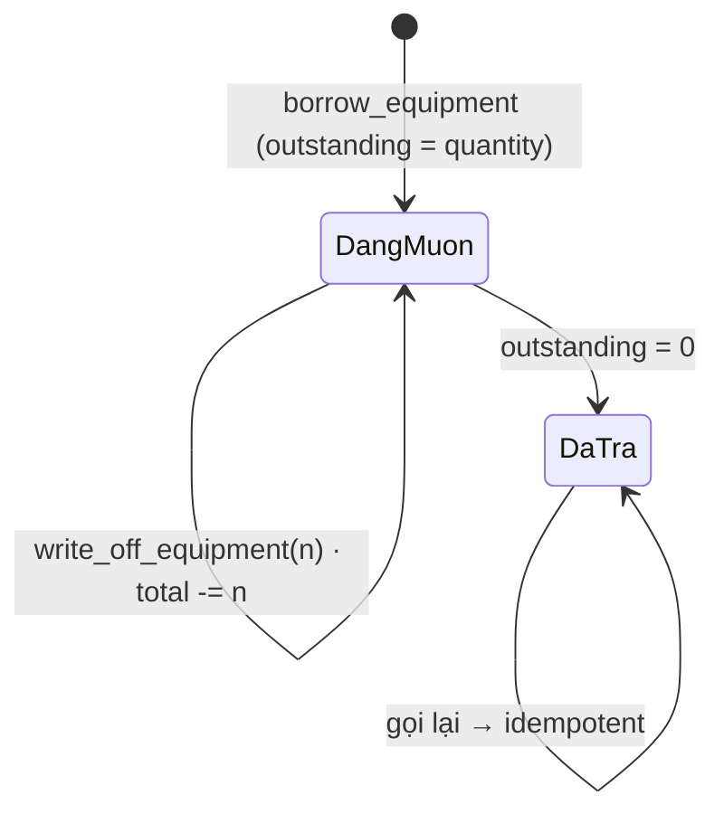

# M09 — BAN & THIẾT BỊ · 04. TO-BE FLOWS

> Module **không** PASS toàn bộ. Dưới đây là 6 đề xuất To-Be, xếp theo mức ưu tiên.
> Các luồng F01, F03, F04, F07, F17 đã PASS — **giữ nguyên, không đề xuất thay đổi**.

---

## TB-M09-01 — Công việc tuần: sửa có ngữ cảnh thay vì ghi đè mù (từ F11, CRITICAL)

### Mục tiêu
Không bao giờ mất nội dung công việc tuần vì một lần bấm "Lưu" trên form trống.

### Actor
Trưởng ban, Phó ban, global-write.

### Phương án A — Prefill + xác nhận ghi đè (khuyến nghị, chi phí thấp)

**Bước mới**
1. Trang chi tiết Ban nạp sẵn `weeklyPlans` (đã có, `queries.ts:150-155`).
2. Form "Công việc tuần" trở thành form **có trạng thái**: khi người dùng đổi ô "Tuần bắt đầu",
   client tra trong `detail.weeklyPlans` xem tuần đó đã có bản chưa.
   - Chưa có → nhãn nút "**Tạo công việc tuần**", form trống.
   - Đã có → nhãn nút "**Cập nhật công việc tuần**", `content`/`checklist` **prefill** bản hiện tại,
     kèm dòng phụ "Bản hiện tại do {tác giả} lưu lúc {updated_at}".
3. Mỗi bản trong danh sách có nút "**Sửa**" cuộn lên và nạp form (thay vì chỉ có "Xóa").
4. Server nhận thêm `expectedUpdatedAt` (optimistic lock). Nếu `updated_at` ở DB khác giá trị client
   gửi lên → trả `CONFLICT` với thông điệp "Bản tuần này vừa được người khác cập nhật. Tải lại để xem
   bản mới nhất." Không ghi đè.

**Business rules mới**: BR-M09-31, BR-M09-32 (xem `05_BUSINESS_RULES.md`).

**Validation**
- Client: `weekStart` phải là thứ Hai (giữ nguyên), `content` **hoặc** `checklist` phải có ít nhất
  một cái khác rỗng — hiện tại cả hai đều được phép rỗng, tạo ra bản trắng.
- Server (Zod): thêm `expectedUpdatedAt: z.string().datetime().nullable()`.
- DB: giữ nguyên CHECK thứ Hai + unique tuần; **thêm** CHECK `content is not null or jsonb_array_length(checklist_json) > 0`.

**Permission**: không đổi (`app.can_write_committee_content`).

**Trạng thái**: `chưa có` → `đang soạn` → `đã lưu`; thêm nhánh `xung đột`.

**Error handling**
| Tình huống | Mã | Thông điệp |
|---|---|---|
| Bản đã đổi từ lúc mở form | `CONFLICT` | "Bản tuần này vừa được người khác cập nhật…" |
| Cả nội dung lẫn checklist rỗng | `VALIDATION_ERROR` | "Vui lòng nhập nội dung hoặc ít nhất một việc trong checklist." |
| Tuần không phải thứ Hai | `VALIDATION_ERROR` | Giữ nguyên |

**Audit**: `created_by` **không** được ghi đè khi upsert (bỏ `created_by` khỏi payload upsert,
`actions.ts:233`); `updated_by` mang người sửa cuối.

```mermaid
flowchart TD
  A[Chọn tuần] --> B{Tuần đã có bản?}
  B -->|Chưa| C[Form trống · nút "Tạo công việc tuần"]
  B -->|Rồi| D[Form prefill · nút "Cập nhật" · hiện tác giả và thời điểm]
  C --> E[Submit]
  D --> E
  E --> F{expectedUpdatedAt khớp DB?}
  F -->|Không| G[CONFLICT · giữ nguyên dữ liệu form · mời tải lại]
  F -->|Có| H[Upsert · giữ created_by gốc · set updated_by]
  H --> I[Đã lưu]
```

### Phương án B — Bản ghi lịch sử (chi phí cao hơn, an toàn hơn)
Thêm bảng `committee_weekly_plan_revisions (plan_id, content, checklist_json, saved_by, saved_at)`,
trigger `after update` chép bản cũ vào đó. UI có nút "Xem các bản trước".
Chọn B nếu Ban dùng công việc tuần làm biên bản đối chiếu; chọn A nếu chỉ dùng để phối hợp trong tuần.

**So sánh số bước**
| | Hiện tại | PA A | PA B |
|---|---|---|---|
| Sửa bản tuần đang có | 4 bước, **mất dữ liệu cũ** | 4 bước, an toàn | 4 bước, an toàn + xem lại được |
| Khôi phục sau khi ghi nhầm | Không thể | Không thể (nhưng khó ghi nhầm) | 2 bước |

**Ảnh hưởng**: module M09; API thêm 1 field vào `saveCommitteeWeeklyPlan`; DB thêm 1 CHECK (PA A)
hoặc 1 bảng + 1 trigger (PA B).
**Rủi ro migration**: PA A — CHECK mới có thể xung đột dữ liệu cũ (bản trắng đã tồn tại); phải chạy
`update … set content = coalesce(content,'—')` cho bản trắng trước khi thêm CHECK.
**Rollback**: PA A `drop constraint`; PA B `drop table` (bảng chỉ chứa dữ liệu phái sinh).

---

## TB-M09-02 — Trả thiết bị: tách "trả dần" khỏi "báo hỏng/mất" (từ F16)

### Mục tiêu
Không để một con số duy nhất vừa nghĩa là "hôm nay mang về bấy nhiêu" vừa nghĩa là "phần còn lại mất vĩnh viễn".

### Actor
Thành viên Ban Kỹ thuật, global-write.

### Phương án A — Hai nút riêng biệt trên cùng phiếu (khuyến nghị)

**Bước mới**
1. Phiếu đang mượn hiển thị "Đã mượn 5 · **còn nợ 5**".
2. Hai hành động:
   - **"Nhận lại hàng"** — nhập số cái nhận về, `available += n`, `outstanding -= n`.
     Phiếu chỉ đóng khi `outstanding = 0`. **Không** đụng `total_quantity`.
   - **"Báo hỏng/mất"** — nhập số cái + tình trạng + ghi chú bắt buộc, `total -= n`,
     `outstanding -= n`. Hiện hộp xác nhận đỏ: "Sẽ trừ {n} cái khỏi tổng kho ({total} → {total-n}).
     Thao tác này không hoàn tác được."
3. Phiếu tự đóng (`status='returned'`, `returned_at=now()`) khi `outstanding` về 0.

**BR mới**: BR-M09-33..BR-M09-36.

**DB**: `equipment_loans` thêm `outstanding_quantity integer not null` (khởi tạo = `quantity`),
CHECK `outstanding_quantity between 0 and quantity`, và CHECK trạng thái:
`(status='borrowed' and outstanding_quantity > 0) or (status='returned' and outstanding_quantity = 0)`.
Thêm RPC `public.receive_equipment(p_loan_id, p_quantity, p_note)` và
`public.write_off_equipment(p_loan_id, p_quantity, p_condition, p_note)`; giữ
`public.return_equipment` như wrapper để không vỡ code/test cũ.

**Permission**: `app.can_operate_equipment` cho cả hai RPC — **nhưng** khuyến nghị nâng
`write_off_equipment` lên Trưởng/Phó Ban (`app.can_write_committee_content`) vì nó thay đổi tổng tài sản.

**Trạng thái**: `borrowed(outstanding>0)` → `borrowed(outstanding giảm)` → `returned(outstanding=0)`.

**Error handling**: `n > outstanding` → `EQUIPMENT_RESTORED_INVALID`; phiếu đã đóng → idempotent
trả về `loan_id` như hiện tại.

**Audit**: mỗi lần nhận/báo mất là một dòng trong bảng con `equipment_loan_events`
(`loan_id, kind ∈ {receive, write_off}, quantity, condition, note, actor, at`) — nếu không thêm bảng
thì tối thiểu phải nối vào `return_note`.



### Phương án B — Giữ một RPC, thêm rào UI
Không đổi DB. Chỉ đổi UI: đổi nhãn thành "Số cái nhận lại được", thêm ô "Số cái hỏng/mất" tính tự động,
và bắt buộc hộp xác nhận khi hai số không khớp. Rẻ, triển khai trong ngày, nhưng vẫn không hỗ trợ trả dần.

**So sánh số bước**
| | Hiện tại | PA A | PA B |
|---|---|---|---|
| Trả đủ | 2 bước | 2 bước | 2 bước |
| Trả dần (3 rồi 2) | **Không làm được** | 2 + 2 bước | Không làm được |
| Báo mất 2 cái | 2 bước, im lặng | 3 bước, có xác nhận | 3 bước, có xác nhận |

**Ảnh hưởng**: DB (cột + 2 RPC), `src/features/equipment/**`, `supabase/tests/021`.
**Rủi ro migration**: `outstanding_quantity` phải backfill = `case when status='returned' then 0 else quantity end`.
**Rollback**: giữ `return_equipment` nguyên vẹn nên có thể tắt UI mới mà không mất dữ liệu.

---

## TB-M09-03 — Khoá cột kho bằng column privilege thay vì biến phiên (từ F14)

### Mục tiêu
Đưa hàng rào về đúng cơ chế của Postgres, và bịt lỗ `total_quantity`.

### Phương án A — Column-level GRANT (khuyến nghị)

```sql
revoke update on public.equipment_items from authenticated;
grant update (name, category, condition, storage_location, note, is_active, updated_by)
  on public.equipment_items to authenticated;
```
- RPC là `SECURITY DEFINER` chạy dưới quyền owner nên vẫn cập nhật được `available_quantity`/`total_quantity`.
- Trigger `app.validate_equipment_item` giữ lại **chỉ** phần kiểm `manages_equipment`, bỏ toàn bộ
  nhánh GUC; xoá `set_config('app.equipment_rpc', …)` khỏi hai RPC.
- Bổ sung nhánh INSERT: `if tg_op='INSERT' and new.available_quantity <> new.total_quantity then raise`.

**Ưu**: cơ chế chuẩn, không phụ thuộc trạng thái phiên; lỗi trả về là `42501` rõ nghĩa.
**Nhược**: PostgREST trả 403 chung, mất thông điệp `EQUIPMENT_AVAILABLE_READONLY` → phải map ở
`equipment/actions.ts:45-47` sang thông điệp mới.

### Phương án B — Giữ GUC, mở rộng phạm vi khoá
Chỉ sửa trigger để chặn thêm `total_quantity` (và kiểm `available = total` khi INSERT).
Rẻ nhất, một migration nhỏ, nhưng giữ nguyên rủi ro R3/R4 trong `03_AUDIT_RESULTS.md §3.3`.

**Khuyến nghị**: làm **B ngay** (bịt lỗ), lên lịch **A** cho lần refactor DB kế tiếp.

**BR liên quan**: BR-M09-24, BR-M09-25.
**Ảnh hưởng**: DB; `supabase/tests/021_equipment_test.sql` cần thêm 2 assert.
**Rủi ro migration**: PA A thay đổi quyền — nếu bỏ sót một cột trong `grant update (...)`,
luồng sửa danh mục hỏng ngay. Phải chạy `021` trước khi merge.
**Rollback**: `grant update on public.equipment_items to authenticated;` khôi phục nguyên trạng.

---

## TB-M09-04 — Nhập thêm / điều chỉnh tồn kho (từ F19)

### Mục tiêu
Có đường hợp lệ để tăng `total_quantity` (mua bổ sung, tìm lại đồ tưởng mất).

### Bước mới
1. Trưởng/Phó Ban KT bấm "**Nhập thêm**" trên dòng thiết bị.
2. Nhập số lượng (>0), lý do (bắt buộc, chọn: mua mới / tìm lại / kiểm kê).
3. RPC `public.adjust_equipment_stock(p_item_id, p_delta, p_reason, p_note)`:
   - `for update` dòng thiết bị;
   - `app.can_write_committee_content(committee_id)` — chặt hơn mượn/trả;
   - `total += delta`, `available += delta` (delta > 0); với delta < 0 chỉ cho tới mức `available` còn lại;
   - ghi một dòng vào `equipment_stock_adjustments` (audit bắt buộc).

**BR mới**: BR-M09-37, BR-M09-38.
**Permission**: Trưởng/Phó Ban KT hoặc global-write.
**Error handling**: `delta = 0` → VALIDATION_ERROR; `available + delta < 0` → `EQUIPMENT_NOT_ENOUGH`.
**So sánh số bước**: hiện tại **không có đường nào** (phải tạo asset_code mới) → 3 bước.
**Ảnh hưởng**: DB (1 bảng, 1 RPC), `src/features/equipment/**`.
**Rollback**: bảng audit thuần append, drop được an toàn.

---

## TB-M09-05 — Ma sát tương xứng cho thao tác phá huỷ và thao tác đổi quyền (từ F05, F06, F08, F10, F12)

### Mục tiêu
Thao tác không hoàn tác được hoặc thay đổi quyền phải có xác nhận và phải phản ánh đúng kết quả thật.

### Bước mới
| Thao tác | Ma sát thêm |
|---|---|
| Xoá thông báo / lịch họp / công việc tuần | Dialog xác nhận nêu tiêu đề bị xoá; nút xác nhận dùng `variant="danger"` |
| Đổi chức vụ | Bỏ auto-save `onChange`; dùng select **controlled** + nút "Lưu chức vụ"; khi lỗi, khôi phục giá trị cũ |
| Kết thúc nhiệm kỳ | Dialog: "Kết thúc nhiệm kỳ của {tên} tại {Ban}? Lịch sử vẫn được giữ." |
| Kết thúc nhiệm kỳ | `ends_on` do **DB** đặt (`default current_date`), action không gửi ngày |

**BR liên quan**: BR-M09-11, BR-M09-12, BR-M09-19.
**Validation**: không đổi ở Zod; sửa `endCommitteeMembership` bỏ trường `ends_on` khỏi payload
(`actions.ts:138`) để `current_date` của DB làm chủ.
**Trạng thái**: select chức vụ trở thành controlled — nguồn sự thật là props từ server sau `router.refresh()`.
**Ảnh hưởng**: chỉ `src/features/committees/**`, không đụng DB (trừ việc bỏ `ends_on` khỏi payload).
**Rủi ro migration**: không có.
**Rollback**: revert component.

---

## TB-M09-06 — Bổ khuyết luồng còn thiếu và UI theo `docs/06 §13` (từ F02, F09, F18)

### Mục tiêu
Khớp UI-spec và dùng hết các policy đã viết.

### Bước mới
1. **Sửa Ban**: action `updateCommittee(id, {name, description, isActive, sortOrder})` dùng policy
   `committees_update_global_write` đang bỏ không (`committees.sql:187-190`). Không cho sửa `code`
   (là khoá nghiệp vụ) và không cho tắt `manages_equipment` khi kho còn thiết bị active.
2. **Sửa thông báo / lịch họp**: dùng policy `*_update_leaders` đang bỏ không.
   `saveCommitteeMeeting` nhận `id?` để chuyển từ insert-only sang upsert theo id.
3. **Card Ban** bổ sung: tên Trưởng/Phó ban, buổi họp **sắp tới gần nhất**, tuần công việc hiện tại.
4. **Lịch họp** tách hai nhóm "Sắp diễn ra" (asc) và "Đã qua" (desc); cảnh báo mềm khi đặt lịch quá khứ.
5. **Trang chi tiết** chuyển từ 4 card xếp dọc sang **tabs** (Tổng quan / Thành viên / Thông báo /
   Lịch họp / Công việc tuần / Thiết bị) đúng `docs/06 §13`. Trên 360px tabs cuộn ngang trong
   container riêng, thân trang không tràn.

**BR liên quan**: BR-M09-04, BR-M09-16, BR-M09-17.
**Ảnh hưởng**: `src/features/committees/**`; API thêm 2 action; DB không đổi.
**Rủi ro migration**: không có (chỉ dùng policy sẵn có).
**Rollback**: revert component + action.

---

## Thứ tự triển khai đề xuất

| Thứ tự | To-Be | Lý do |
|---|---|---|
| 1 | TB-M09-03 **PA B** | Một migration nhỏ, bịt ngay lỗ `total_quantity` |
| 2 | TB-M09-01 **PA A** | Chặn mất dữ liệu đang xảy ra hằng tuần |
| 3 | TB-M09-05 | Chỉ sửa UI, rủi ro thấp, giảm ngay tỉ lệ thao tác nhầm |
| 4 | TB-M09-02 **PA A** | Đúng nghiệp vụ kho, cần migration |
| 5 | TB-M09-04 | Hoàn thiện vòng đời tồn kho |
| 6 | TB-M09-06 | Khớp UI-spec |
| — | TB-M09-03 **PA A** | Refactor DB kế tiếp |
