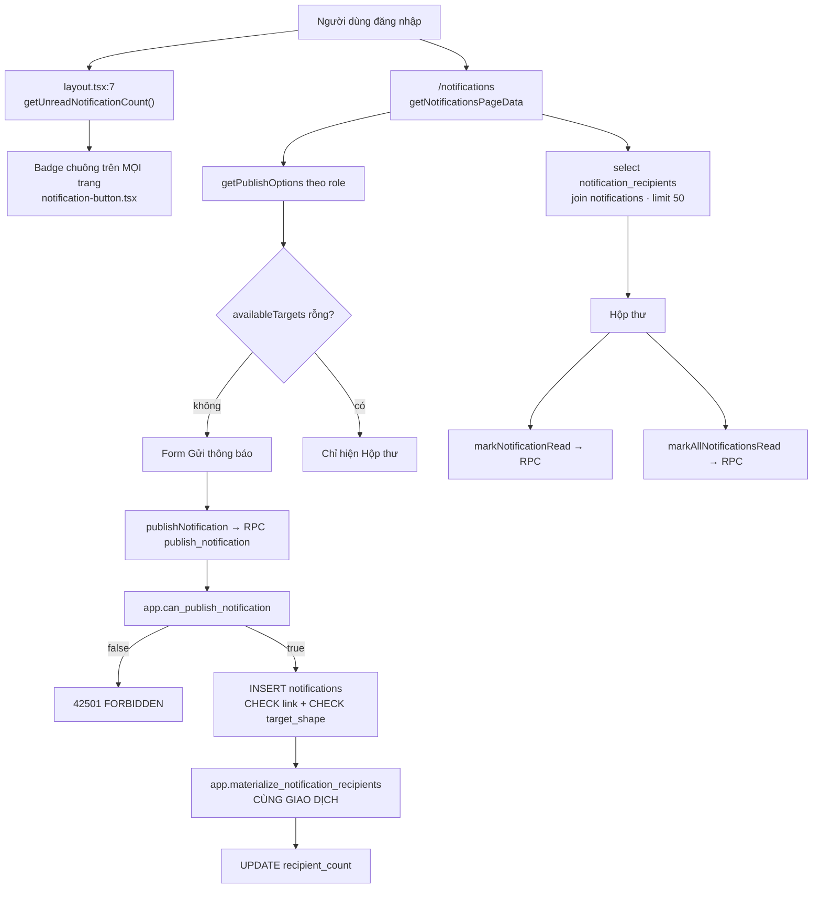
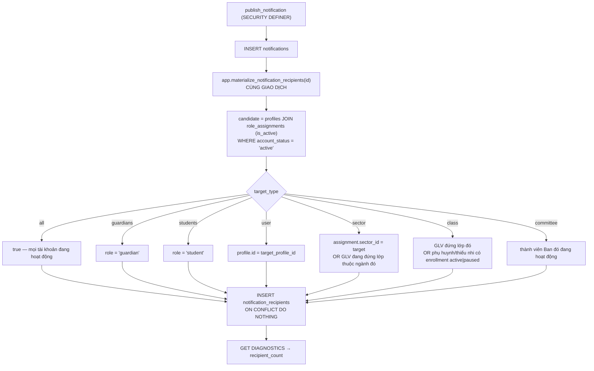
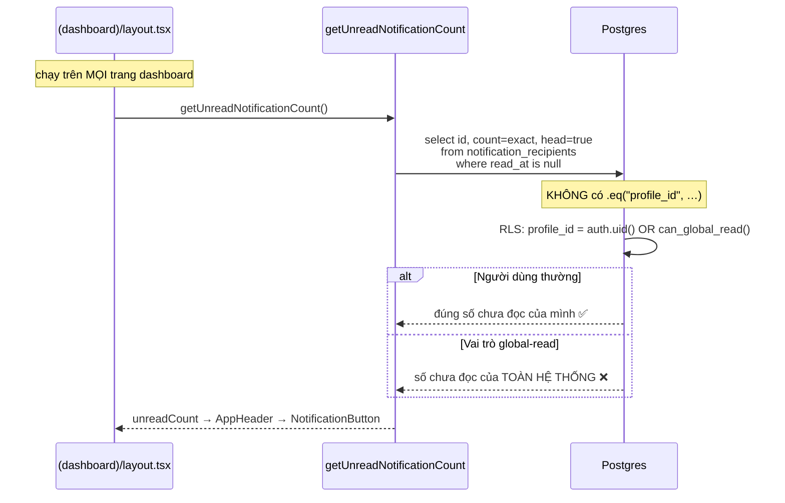

# M10 — THÔNG BÁO · 02. AS-IS FLOWS

Trục theo dõi: **Actor → màn hình → action UI → validation client → server action/RPC →
validation server (Zod) → query/service → RLS/constraint/trigger → trạng thái cuối → thông báo.**

---

## Sơ đồ tổng thể

---

## M10-F01 — Soạn và publish thông báo

| Bước | Chi tiết | Bằng chứng |
|---|---|---|
| Actor | Bất kỳ ai có ít nhất một phạm vi được phép | `queries.ts:51-105` |
| Màn hình | `/notifications` | `src/app/(dashboard)/notifications/page.tsx:6-16` |
| Ẩn form | `availableTargets.length === 0` → không render card "Gửi thông báo" | `notification-center.tsx:33-40,99` |
| Chọn phạm vi | `<select>` controlled theo `targetType` state, mặc định `"class"` | `:30,111-119` |
| Chọn đối tượng | Chỉ hiện với `sector`/`class`/`committee`/`user`; option lấy từ `publishOptions` | `:121-131` |
| Deep-link | `<select>` liệt kê **17 route cứng** trong `NOTIFICATION_LINK_ROUTES` — người dùng không gõ tay được | `:140-148`; `constants.ts:35-53` |
| Validation client | HTML `required` cho title/content/targetId | `:124,134,138` |
| Server action | `publishNotification` | `actions.ts:41-61` |
| Zod | title 1..200, content 1..5000, `targetId` bắt buộc/cấm theo target, `linkPath` phải nằm trong allowlist | `schemas.ts:8-24` |
| Guard | `requireAuthContext("/notifications")` — **chỉ kiểm đăng nhập**, không kiểm role | `actions.ts:46` |
| RPC | `public.publish_notification` (SECURITY DEFINER) | `notifications.sql:186-227` |
| Kiểm quyền | `app.can_publish_notification(target_type, target_id)` → `42501` | `:201-203, :74-104` |
| Kiểm nội dung | title/content rỗng → `NOTIFICATION_CONTENT_REQUIRED` | `:204-206` |
| Kiểm đối tượng | 4 target cần id mà thiếu → `NOTIFICATION_TARGET_REQUIRED` | `:207-209` |
| INSERT | `author_profile_id = auth.uid()`, `published_at = now()`, gán `target_*_id` bằng `case` theo target | `:211-222` |
| CHECK | `notifications_target_shape` (chỉ đúng 1 cột target khác null), `notifications_link_known_route` | `:47-56` |
| Materialize | `perform app.materialize_notification_recipients(...)` **trong cùng giao dịch** | `:224` |
| Trạng thái cuối | "Đã gửi thông báo.", form reset, `router.refresh()` | `notification-center.tsx:65-72` |

### Ma trận quyền publish thực tế (đối chiếu `docs/05 §6`)

| Phạm vi | `docs/05 §6` yêu cầu | DB `app.can_publish_notification` | UI `getPublishOptions` | Khớp? |
|---|---|---|---|---|
| `all` | global-write | `else → can_global_write()` (`:102`) | `canPublishGlobal` (`queries.ts:53`) | ✅ |
| `guardians` | global-write | `else → can_global_write()` | `canPublishGlobal` | ✅ |
| `students` | global-write | `else → can_global_write()` | `canPublishGlobal` | ✅ |
| `user` | global-write | `else → can_global_write()` | **Không có trong `availableTargets`** (`notification-center.tsx:33-40`) | ⚠️ DB đúng, **UI thiếu hoàn toàn** |
| `sector` | Trưởng/Phó chính ngành đó, hoặc global-write | `can_global_write() or (role in (sector_leader, sector_deputy) and current_sector_id() = target)` (`:85-88`) | lọc `sector.id === context.sectorId` (`queries.ts:64-69`) | ✅ |
| `class` | Đại diện lớp đó, Trưởng/Phó ngành của lớp đó, hoặc global-write | `can_global_write() or is_class_representative(target) or (lớp thuộc ngành mình và role in (sector_leader, sector_deputy))` (`:89-99`) | lọc theo `context.classId` / `sectorId` (`queries.ts:71-83`) | ✅ |
| `committee` | Trưởng/Phó chính Ban đó, hoặc global-write | `can_global_write() or is_committee_leader_or_deputy(target)` (`:100-101`) | lọc membership `leader`/`deputy` của chính mình (`queries.ts:88-97`) | ✅ |

**Kết luận**: **KHÔNG có role nào publish vượt phạm vi.** Quyền được kiểm ở RPC (SECURITY DEFINER,
không dựa vào RLS), UI chỉ lọc option để không mời người dùng bấm vào thứ chắc chắn bị từ chối.
pgTAP xác nhận 6 hướng chối: `022_notifications_test.sql:81-98,133-135,153-156`.

### Cạnh chưa xử lý

| # | Tình huống | Hiện trạng |
|---|---|---|
| 1 | Bấm "Gửi thông báo" hai lần (mạng chậm, retry) | Tạo **hai** thông báo giống hệt. `docs/11 §18` liệt kê publish notification là luồng **cần idempotency** — chưa có khoá nào (`docs/11-api-and-server-actions.md:379`) |
| 2 | Gửi tới ngành/lớp/Ban **rỗng** người | `recipient_count = 0`, vẫn báo "Đã gửi thông báo." — không cảnh báo |
| 3 | Không xem trước được sẽ gửi tới bao nhiêu người | Không có preview; `recipient_count` chỉ nằm trong DB, UI không hiện |
| 4 | Deep-link không hợp quyền với người nhận | Đại diện lớp có thể đính `/admin` vào thông báo gửi phụ huynh; DB chấp nhận (route có trong allowlist), phụ huynh bấm vào → `/access-denied` |
| 5 | Allowlist khớp theo tiền tố | `/admin/khong-ton-tai` vượt qua CHECK vì `p_link like '/admin/%'` (`notifications.sql:29`) |

---

## M10-F02 — Materialize danh sách người nhận

| Điểm | Bằng chứng |
|---|---|
| Cùng giao dịch với publish | `notifications.sql:224` nằm trong thân `publish_notification`, không có `commit` giữa chừng |
| SECURITY DEFINER để đếm ngoài tầm RLS của người gửi | `:112` |
| `distinct` + unique `(notification_id, profile_id)` chặn trùng khi một người thuộc nhiều nhánh (GLV kiêm phụ huynh, D-25) | `:125,178,67` |
| Chỉ tài khoản `account_status = 'active'` và có role assignment đang hoạt động | `:127-129` |
| `recipient_count` = số dòng vừa chèn | `:180-181` |
| Test | `022:110-126,150-152,163-174` |

### Ba kịch bản "chốt tại thời điểm publish"

| Kịch bản | Kết quả | Lý do |
|---|---|---|
| Em vào lớp **sau** khi thông báo đã gửi | **Không** nhận ngược | Không có job nào chạy lại materialize; `notification_recipients` chỉ ghi lúc publish |
| Em rời lớp sau đó | **Vẫn giữ** thông báo cũ | Dòng recipient không bị xoá khi enrollment đổi; FK chỉ tới `profiles` |
| Count unread khi đổi lớp/role | **Không nhảy** | Badge đếm trên `notification_recipients`, không tính lại theo phạm vi hiện tại |

**ĐẠT toàn bộ 3 kịch bản.** Đây là điểm mạnh nhất của module.

### Cạnh chưa xử lý

| # | Tình huống | Hiện trạng |
|---|---|---|
| 1 | Gửi `user` tới người **chưa có role assignment đang hoạt động** (tài khoản mới lập) | `candidate` yêu cầu `join role_assignments … is_active` (`:127-128`) → **0 người nhận**. Publisher vẫn thấy "Đã gửi thông báo.", `recipient_count = 0`, người kia không bao giờ thấy. Hố đen im lặng |
| 2 | `app.materialize_notification_recipients` được `grant execute … to authenticated` (`:288`) | Gọi lại trên một thông báo cũ sẽ **thêm** người mới vào danh sách và ghi đè `recipient_count` bằng số dòng vừa thêm. **Hiện không khai thác được** vì `supabase/config.toml` chỉ expose `["public","graphql_public"]` — schema `app` không lộ qua PostgREST. Là rủi ro cấu hình, không phải lỗ hổng hôm nay |
| 3 | Đại diện lớp gửi cho lớp mình nhưng **không** có `class_staff_assignments` | Không tự nhận thông báo của chính mình — nhánh `class` chỉ tính GLV qua `class_staff_assignments` (`:148-155`), không tính `role_assignments.class_id` |
| 4 | `sector` không bao gồm phụ huynh/thiếu nhi của ngành đó | Đúng theo `docs/02 §12.2`, nhưng người gửi không được nhắc điều này ở UI |

---

## M10-F03 — Xem hộp thư ⚠️ **CRITICAL**

| Bước | Chi tiết | Bằng chứng |
|---|---|---|
| Guard | `requireRouteAccess("/notifications")` | `queries.ts:108` |
| Truy vấn | `from("notification_recipients").select("read_at, notifications(...)").order("delivered_at", desc).limit(50)` | `queries.ts:111-115` |
| **Thiếu** | **Không có `.eq("profile_id", context.profileId)`** | `queries.ts:111-115` |
| RLS | `notification_recipients_select_self using (profile_id = auth.uid() OR (select app.can_global_read()))` | `notifications.sql:283-285` |
| Hiển thị | Tiêu đề, nội dung, nhãn phạm vi, thời điểm, badge "Mới", link, nút đánh dấu | `notification-center.tsx:174-199` |
| `unreadCount` của trang | Đếm **trên 50 dòng đã tải**, không phải count thật | `queries.ts:133` |

### Lỗ hổng

Với 6 vai trò có `app.can_global_read()` — `super_admin`, `parish_priest`, `chaplain`,
`group_leader`, `deputy_group_leader`, `secretary` — mệnh đề RLS trả **true cho mọi dòng**.
Vì truy vấn không lọc `profile_id`, hộp thư của họ là **50 dòng recipient mới nhất của toàn hệ thống**:

1. Hiện những thông báo **không gửi cho họ** (thông báo lớp Ấu 1A, thông báo Ban Y tế…).
2. Hiện `read_at` **của người khác** — badge "Mới" phản ánh trạng thái đọc của người lạ.
3. Một thông báo gửi cho 200 người xuất hiện **200 lần**; `key={item.id}` bị trùng
   (`notification-center.tsx:175`) → React key collision.
4. Với thông báo `target_type = 'user'` (thư riêng), nội dung riêng tư của người khác nằm ngay trong
   hộp thư cá nhân của họ.
5. Bấm "Đánh dấu đã đọc" trên dòng của người khác → RPC chỉ đụng dòng `profile_id = auth.uid()`
   (`notifications.sql:235-237`) nên **không có gì thay đổi**; badge "Mới" không bao giờ tắt, người dùng
   bấm mãi không được.

> Về mặt RLS thì `docs/05 §6` có cho phép global-read đọc mọi thông báo. Nhưng **hộp thư cá nhân**
> không phải màn hình "đọc mọi thông báo" — nó phải là "thông báo dành cho tôi". Truy vấn thiếu đúng
> một mệnh đề `.eq("profile_id", …)`.

---

## M10-F04 — Đánh dấu một thông báo đã đọc

| Bước | Chi tiết | Bằng chứng |
|---|---|---|
| UI | Nút chỉ hiện khi `readAt === null` | `notification-center.tsx:191-195` |
| Action | `markNotificationRead({notificationId})` | `actions.ts:63-79` |
| Zod | chỉ UUID | `schemas.ts:26-28` |
| RPC | `update notification_recipients set read_at = coalesce(read_at, now()) where notification_id = ? and profile_id = auth.uid()` | `notifications.sql:229-238` |
| Per-user | `profile_id = auth.uid()` cứng trong hàm — client **không** truyền được profile khác | `:237` |
| Idempotent | `coalesce(read_at, now())` giữ nguyên thời điểm đọc lần đầu | `:236` |
| Lỗi im lặng | Có xử lý: `if (!result.ok) setMessage(...)` kèm comment giải thích | `notification-center.tsx:79-83` |
| Trạng thái cuối | `router.refresh()` → badge và danh sách cập nhật |
| Test | `022:186-200` |

**ĐẠT.** Không có đường nào đánh dấu hộ người khác, và không rò trạng thái đọc của người khác qua RPC này.

**Cạnh**: gọi với UUID không tồn tại hoặc thông báo mình không nhận → `update` 0 dòng, RPC trả `void`,
action trả `ok: true`. Không lỗi, không tác dụng — an toàn nhưng không phân biệt được.

---

## M10-F05 — Đánh dấu tất cả đã đọc

| Bước | Chi tiết | Bằng chứng |
|---|---|---|
| UI | Nút chỉ hiện khi `data.unreadCount > 0` | `notification-center.tsx:164-166` |
| RPC | `update … set read_at = now() where profile_id = auth.uid() and read_at is null`; trả số dòng | `notifications.sql:240-255` |
| Test | `022:201-204` |

**ĐẠT** — phạm vi cứng theo `auth.uid()`.

**Cạnh**: với vai trò global-read, nút này hiện dựa trên `unreadCount` **của cả hệ thống** (xem F03),
nhưng RPC chỉ đụng dòng của chính họ → bấm xong badge vẫn còn số lớn. Triệu chứng của F03/F06.

---

## M10-F06 — Badge số chưa đọc ở header ⚠️ **CRITICAL**

| Điểm | Bằng chứng |
|---|---|
| Truy vấn | `queries.ts:42-49` |
| Nạp ở layout | `src/app/(dashboard)/layout.tsx:7` |
| Hiển thị | `notification-button.tsx:14-21`, `>99` hiện "99+" |
| `aria-label` có số | `notification-button.tsx:6` ✅ |

### Đánh giá

**N+1 query: KHÔNG** — đúng một truy vấn `count exact, head: true`, không tải dữ liệu.

**Leak count của người khác: CÓ.** Cùng nguyên nhân với F03: thiếu `.eq("profile_id", …)`.
Với vai trò global-read, badge hiện tổng số dòng `read_at is null` của **mọi người trong xứ đoàn** —
sau một thông báo "Toàn hệ thống" gửi cho 300 tài khoản, chuông của thư ký hiện ngay "99+".
Bấm "Đánh dấu tất cả đã đọc" không làm số này giảm về 0 (chỉ giảm phần của chính họ).

**Vấn đề phụ**:
- Truy vấn chạy lại ở **mỗi lần điều hướng** trong dashboard, không được bọc `cache()` như
  `getAuthContext` (`src/lib/auth/session.ts:18`).
- `getHeaderNotificationState` (`queries.ts:139-142`) được viết ra nhưng **không nơi nào dùng** — code chết.
- `unreadCount` ở trang `/notifications` tính từ 50 dòng đã tải (`queries.ts:133`) trong khi badge dùng
  count thật → hai con số có thể lệch nhau ngay trên cùng một màn hình.

---

## M10-F07 — Mở deep-link

| Bước | Chi tiết | Bằng chứng |
|---|---|---|
| Nguồn | `notifications.link_path` | `queries.ts:113` |
| Render | `<Link href={item.linkPath}>Mở trang liên quan</Link>` | `notification-center.tsx:188-190` |
| Validation tầng 1 (client/server action) | Zod `isKnownNotificationLink` | `schemas.ts:21-23`; `constants.ts:55-58` |
| Validation tầng 2 (**DB**) | CHECK `notifications_link_known_route` gọi `app.notification_link_is_valid` | `notifications.sql:47,15-31` |
| Đồng bộ hai danh sách | Unit test đọc file migration và so từng route + so **số lượng** | `tests/unit/notification-schemas.test.ts:24-39` |
| Test DB | Publish với `/sa-mac` → `23514` | `022:99-101` |

**Deep-link validation nằm ở ĐÂU: cả DB constraint lẫn Zod — ĐẠT.** Đây là mẫu chuẩn nhất trong repo:
danh sách lặp ở hai nơi nhưng **có test canh chống trôi**.

**Hạn chế**:
- Khớp theo tiền tố `route || '/%'` → `/admin/khong-ton-tai` hợp lệ.
- Không kiểm người nhận có quyền vào route đó không.
- UI chỉ cho chọn **route gốc** (17 mục), không cho deep-link tới một bản ghi cụ thể
  (ví dụ `/committees/<id>`) dù cả Zod lẫn DB đều chấp nhận.

---

## M10-F08 — Gửi thông báo tới "một người" (không có UI)

| Tầng | Trạng thái |
|---|---|
| DB enum + CHECK `target_profile_id` | ✅ có (`notifications.sql:37,52`) |
| `app.can_publish_notification` | ✅ có (nhánh `else` → global-write, `:102`) |
| Materialize | ✅ có (`:134`) |
| Zod | ✅ có (`constants.ts:23-28` liệt kê `user` trong `NOTIFICATION_TARGETS_NEEDING_ID`) |
| `getPublishOptions` | ❌ **không** dựng danh sách người nhận |
| `availableTargets` | ❌ **không** đẩy `"user"` vào danh sách phạm vi (`notification-center.tsx:33-40`) |
| pgTAP | ❌ không có assert nào cho `target_type = 'user'` |

**Kết luận**: phạm vi "Một người" tồn tại đầy đủ ở DB và schema nhưng **không có đường vào từ giao diện**.
Chức năng nằm trong `docs/01 §11` và `docs/05 §6` nhưng chưa dùng được.

---

## M10-F09 — Sửa / xoá thông báo đã publish (không tồn tại)

| Tầng | Trạng thái |
|---|---|
| GRANT | `authenticated` chỉ có `select` trên `notifications` và `notification_recipients` (`notifications.sql:260`) |
| Policy | Chỉ có 2 policy SELECT (`:271-285`); **không** có INSERT/UPDATE/DELETE policy |
| RPC | Không có `update_notification` / `delete_notification` / `retract_notification` |
| Server action | Không có |
| UI | Không có |

**Kết luận**: **không ai sửa/xoá được thông báo đã publish qua luồng người dùng — kể cả tác giả và
super admin.** Chỉ `service_role` (`:261`) làm được, tức là phải vào Supabase console.

Đây là lựa chọn hợp lý về tính toàn vẹn (thông báo đã gửi là sự kiện đã xảy ra), nhưng:
- Gửi nhầm nội dung/nhầm lớp → **không thu hồi được**, phải gửi thông báo đính chính thứ hai.
- Trùng lặp do double-submit (F01 cạnh 1) → hai bản y hệt nằm mãi trong hộp thư mọi người.
- Không có `deleted_at`/`retracted_at` để đánh dấu "đã thu hồi".

→ Cần xác nhận đây là chủ ý hay thiếu sót.
