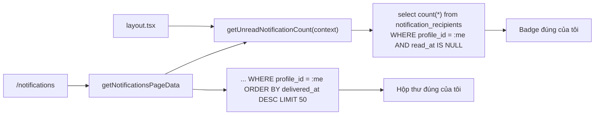
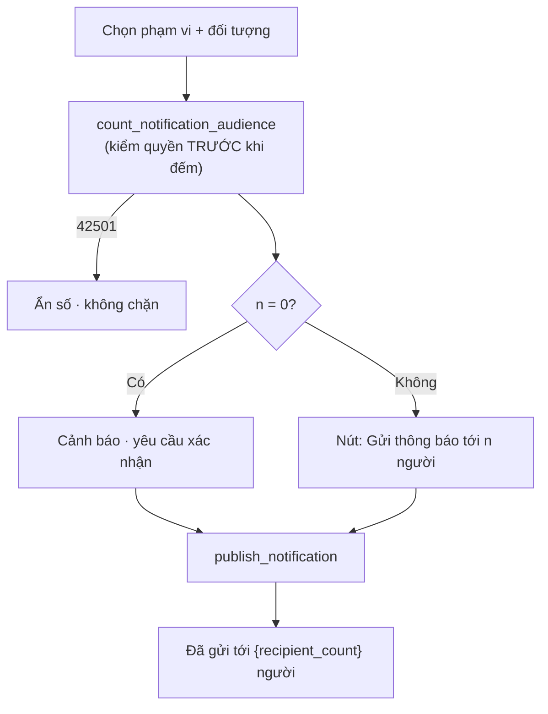

# M10 — THÔNG BÁO · 04. TO-BE FLOWS

> Module **không** PASS toàn bộ: 2 luồng CRITICAL, 1 NEEDS_IMPROVEMENT, 1 NEEDS_CONFIRMATION.
> Các luồng F02, F04, F05, F07 đã PASS — **giữ nguyên, không đề xuất thay đổi**.

---

## TB-M10-01 — Hộp thư và badge chỉ đếm của chính mình (từ F03 + F06, CRITICAL)

### Mục tiêu
Màn hình "của tôi" phải hỏi DB đúng câu hỏi "của tôi", không dựa vào RLS để lọc.

### Actor
Mọi người dùng đăng nhập — nhưng chỉ 6 vai trò global-read hiện đang bị sai.

### Bước mới

1. `getUnreadNotificationCount()` nhận `AuthContext` (hoặc tự gọi `getAuthContext()`) và thêm
   `.eq("profile_id", context.profileId)`.
2. `getNotificationsPageData()` thêm `.eq("profile_id", context.profileId)` vào truy vấn hộp thư.
3. `unreadCount` của trang lấy từ **count thật** (`getUnreadNotificationCount`) thay vì đếm trên 50 dòng
   đã tải (`queries.ts:133`).
4. Xoá hàm chết `getHeaderNotificationState` (`queries.ts:139-142`) hoặc dùng nó thay cho lời gọi
   trực tiếp trong layout — chọn một, không để hai đường.
5. Bọc truy vấn count bằng `cache()` của React như `getAuthContext` (`src/lib/auth/session.ts:18`) để
   không lặp lại trong cùng một request.

### Business rules
- **BR-M10-20** (mới): mọi truy vấn phục vụ màn hình "của tôi" phải lọc tường minh theo `profile_id`,
  không được dựa vào RLS làm bộ lọc nghiệp vụ.
- BR-M10-14, BR-M10-15 giữ nguyên.

### Validation / Permission / Trạng thái
Không đổi ở tầng DB. RLS `notification_recipients_select_self` **giữ nguyên** — nó vẫn cần cho vai trò
global-read khi vào màn hình quản trị (nếu sau này có).

### Error handling
Không phát sinh lỗi mới. Sau khi sửa, badge của vai trò global-read sẽ **giảm mạnh** — cần ghi chú
trong release note để không bị hiểu nhầm là mất dữ liệu.

### Audit
Không đổi.

### So sánh số bước
Không đổi số bước người dùng. Đây là sửa lỗi, không phải thiết kế lại luồng.

### Ảnh hưởng
- Module: chỉ M10; `src/app/(dashboard)/layout.tsx` gọi lại hàm với tham số mới.
- API/Server action: chữ ký `getUnreadNotificationCount` đổi (thêm tham số) — **breaking** cho mọi nơi gọi.
  Hiện chỉ có 2 nơi (`layout.tsx:7`, `queries.ts:141`).
- DB: **không đổi**.

### Rủi ro migration
Không có migration.

### Rollback
Revert 3 dòng. Rủi ro gần bằng 0.

> **Đây là To-Be duy nhất nên làm trước tất cả những cái khác.**

---

## TB-M10-02 — Idempotency cho publish (từ F01)

### Mục tiêu
Bấm "Gửi thông báo" hai lần không tạo hai thông báo.

### Phương án A — Client-generated request id (khuyến nghị)

**Bước mới**
1. `NotificationCenter` sinh `requestId = crypto.randomUUID()` **một lần** khi form được mở (hoặc reset).
2. `publishNotification` nhận thêm `requestId: z.string().uuid()`.
3. `notifications` thêm cột `request_id uuid` + `unique (author_profile_id, request_id)`.
4. `publish_notification` nhận `p_request_id`; nếu đã tồn tại thông báo cùng `(author, request_id)` thì
   **trả về id cũ** thay vì tạo mới (idempotent như `return_equipment` của M09).
5. Sau khi gửi thành công, client sinh `requestId` mới.

**BR mới**: BR-M10-21, BR-M10-22.

**Error handling**: lần gọi lặp trả `ok: true` với **cùng** notification id → UI không hiện lỗi,
không tạo bản thứ hai.

**Trạng thái**: không đổi.

### Phương án B — Chỉ chặn ở UI
Vô hiệu hoá nút trong lúc `pending` (đã có, `notification-center.tsx:150`) + chặn submit lặp bằng ref.
Rẻ nhưng không chống được retry mạng và không chống được double-tab.

**Khuyến nghị**: A. Mẫu idempotent đã có sẵn trong repo (`return_equipment`, `notifications.sql` tương đương
`equipment.sql:208-211`) nên chi phí nhận thức thấp.

**So sánh số bước**: không đổi với người dùng.
**Ảnh hưởng**: DB (1 cột + 1 unique), RPC, action, component.
**Rủi ro migration**: cột nullable, unique partial `where request_id is not null` → dữ liệu cũ không vướng.
**Rollback**: `drop constraint` + `drop column`; RPC giữ tham số optional.

---

## TB-M10-03 — Phạm vi "Một người": mở đường vào từ giao diện (từ F08)

### Mục tiêu
Dùng được chức năng đã tồn tại đầy đủ ở DB.

### Actor
Chỉ global-write (giữ nguyên `app.can_publish_notification` nhánh `else`).

### Bước mới
1. `getPublishOptions` trả thêm `canPublishUser: boolean` (= `isGlobal`).
2. `availableTargets` đẩy `"user"` khi `canPublishUser`.
3. Thay `<select>` bằng **combobox tìm kiếm theo tên/username**, gọi một server action
   `searchNotificationRecipients(query)` giới hạn 20 kết quả — không đổ toàn bộ profile xuống client.
4. Trước khi gửi, hiện dòng xác nhận: "Gửi riêng cho **{tên}**. Chỉ người này nhìn thấy."
5. Sau khi gửi, nếu `recipient_count = 0` → hiện **cảnh báo** (xem TB-M10-04).

### Business rules
- BR-M10-05 giữ nguyên (chỉ global-write).
- **BR-M10-23** (mới): người nhận của phạm vi `user` phải là tài khoản đang hoạt động; nếu không, publish
  bị từ chối trước khi ghi.

### Validation
- Zod: giữ nguyên (`user` đã nằm trong `NOTIFICATION_TARGETS_NEEDING_ID`).
- RPC: **thêm** kiểm `exists (select 1 from profiles where id = p_target_id and account_status = 'active')`
  → `NOTIFICATION_TARGET_INACTIVE`.

### Permission
Không đổi ở DB.

### Error handling
| Tình huống | Mã | Thông điệp |
|---|---|---|
| Người nhận không hoạt động / không có role | `VALIDATION_ERROR` | "Tài khoản này chưa hoạt động nên không nhận được thông báo." |

### Audit
`author_profile_id` đã có; nên hiện trong danh sách "Đã gửi" (TB-M10-05).

**So sánh số bước**: hiện tại **không làm được**; sau: 4 bước (chọn phạm vi → tìm người → nhập → gửi).
**Ảnh hưởng**: M10 + 1 server action tra cứu (chạm bảng `profiles` → cần kiểm RLS `profiles` cho phép
global-write đọc danh sách).
**Rủi ro migration**: chỉ sửa RPC (`create or replace`).
**Rollback**: bỏ `"user"` khỏi `availableTargets`.

---

## TB-M10-04 — Preview và cảnh báo số người nhận (từ F01 cạnh 2–3, F02 cạnh 1)

### Mục tiêu
Người gửi biết mình đang gửi cho bao nhiêu người **trước** khi bấm, và biết ngay khi gửi vào hư không.

### Bước mới
1. Khi chọn xong phạm vi + đối tượng, client gọi `previewNotificationAudience(targetType, targetId)`.
2. Server action gọi RPC `public.count_notification_audience(...)` — **dùng chung đúng mệnh đề `case`**
   với `app.materialize_notification_recipients` (tách mệnh đề đó thành một view/hàm để hai bên không trôi).
3. Nút gửi hiện: "Gửi thông báo tới **{n} người**".
4. Nếu `n = 0`: nút chuyển sang trạng thái cảnh báo, yêu cầu xác nhận "Phạm vi này hiện không có ai.
   Vẫn gửi?".
5. Sau khi gửi, thông điệp thành công nêu số thật: "Đã gửi thông báo tới {recipient_count} người."

### Business rules
- **BR-M10-24** (mới): số người nhận hiển thị trước khi gửi phải dùng **cùng** logic với lúc materialize.
- **BR-M10-25** (mới): publish với `recipient_count = 0` phải được cảnh báo rõ ràng cho người gửi.

### Validation / Permission
Preview phải kiểm quyền y hệt publish — nếu không, nó trở thành công cụ đếm số phụ huynh của lớp khác.
→ `count_notification_audience` **bắt buộc** gọi `app.can_publish_notification` trước khi đếm.

### Error handling
Preview lỗi → không chặn gửi, chỉ ẩn con số (degradation).

**So sánh số bước**: +0 bước bắt buộc (preview là thụ động), +1 bước khi phạm vi rỗng.
**Ảnh hưởng**: DB (+1 hàm, refactor mệnh đề `case` thành hàm dùng chung), M10.
**Rủi ro migration**: refactor `materialize_notification_recipients` — phải giữ nguyên hành vi;
`022_notifications_test.sql` là lưới an toàn (31 assert đang xanh).
**Rollback**: `create or replace` bản cũ.

---

## TB-M10-05 — Thu hồi thông báo và danh sách "Đã gửi" (từ F09)

> Chỉ triển khai sau khi trả lời Q-M10-03 (`08_ACCEPTANCE_CRITERIA.md §5`).

### Phương án A — Thu hồi mềm (khuyến nghị nếu quyết định "cần sửa sai")

**Bước mới**
1. `notifications` thêm `retracted_at timestamptz`, `retracted_by uuid`, `retract_reason text`.
2. RPC `public.retract_notification(p_id, p_reason)`: chỉ **tác giả** hoặc global-write; chỉ trong
   **N phút** đầu (đề xuất 15 phút) hoặc không giới hạn — tuỳ quyết định nghiệp vụ.
3. Bản ghi **không** bị xoá; hộp thư hiển thị "Thông báo này đã được thu hồi" thay cho nội dung;
   badge trừ đi (`read_at` coi như đã đọc, hoặc loại khỏi count unread).
4. Thêm tab **"Đã gửi"** trong `/notifications`: liệt kê thông báo do tôi là `author_profile_id`
   (RLS đã cho phép, `notifications.sql:274`), kèm `recipient_count` và nút "Thu hồi".

**BR mới**: BR-M10-26, BR-M10-27, BR-M10-28.

### Phương án B — Không thu hồi, chỉ đính chính
Giữ bất biến tuyệt đối. Thêm nút "Gửi đính chính" tạo thông báo mới có `replies_to` trỏ về bản cũ,
hộp thư hiển thị hai bản liền nhau. Bảo toàn lịch sử tốt hơn, nhưng người nhận vẫn đọc bản sai.

**So sánh số bước**
| | Hiện tại | PA A | PA B |
|---|---|---|---|
| Sửa một thông báo gửi nhầm | Không thể (phải vào Supabase console) | 2 bước | 3 bước |
| Người nhận thấy gì | Bản sai vĩnh viễn | "Đã thu hồi" | Bản sai + bản đính chính |

**Ảnh hưởng**: DB (3 cột + 1 RPC), M10 UI (tab mới), badge count.
**Rủi ro migration**: cột nullable, không đụng dữ liệu cũ.
**Rollback**: `drop column`; UI ẩn tab.

---

## TB-M10-06 — Hoàn thiện UI theo `docs/06 §14` (từ F01, F03, F07)

### Mục tiêu
Khớp UI-spec và giảm rủi ro đọc sót.

### Bước mới
1. **Filter unread/all** — `docs/06 §14` yêu cầu, hiện chưa có. Dùng `searchParams` để chia sẻ link được.
2. **Scope chip** — đã có nhãn phạm vi (`notification-center.tsx:184`) nhưng ở dạng text mờ;
   nâng thành chip có màu để quét nhanh.
3. **Phân trang / "Tải thêm"** thay cho `limit 50` cứng — hiện thông báo thứ 51 trở đi biến mất hoàn toàn
   mà người dùng không biết (`queries.ts:115`).
4. **Deep-link tới bản ghi cụ thể**: cho phép chọn route gốc **và** dán id (ví dụ
   `/committees/<uuid>`); cả Zod lẫn CHECK đã chấp nhận tiền tố, chỉ UI đang giới hạn (`constants.ts:35-53`).
5. **Cảnh báo deep-link vượt quyền người nhận**: khi gửi cho `guardians`/`students` mà chọn route
   chỉ dành cho staff, hiện cảnh báo mềm "Người nhận có thể không mở được trang này."
6. `FormMessage` thêm `role="status"` để screen reader đọc được kết quả gửi.

**BR liên quan**: BR-M10-16, BR-M10-17, BR-M10-18.
**Ảnh hưởng**: chỉ UI + 1 tham số truy vấn ở query.
**Rủi ro migration**: không có.
**Rollback**: revert component.

---

## Thứ tự triển khai đề xuất

| Thứ tự | To-Be | Lý do |
|---|---|---|
| **1** | **TB-M10-01** | Sửa 2 lỗi CRITICAL bằng 3 dòng code, không migration. Không có lý do trì hoãn |
| 2 | TB-M10-04 | Chặn "gửi vào hư không", đồng thời chuẩn bị hàm dùng chung cho preview |
| 3 | TB-M10-02 | Đóng yêu cầu idempotency đã ghi trong `docs/11 §18` |
| 4 | TB-M10-06 | UI-spec, rẻ, rủi ro thấp |
| 5 | TB-M10-03 | Mở phạm vi "một người" — cần combobox mới |
| 6 | TB-M10-05 | Chỉ sau khi chốt nghiệp vụ thu hồi |
