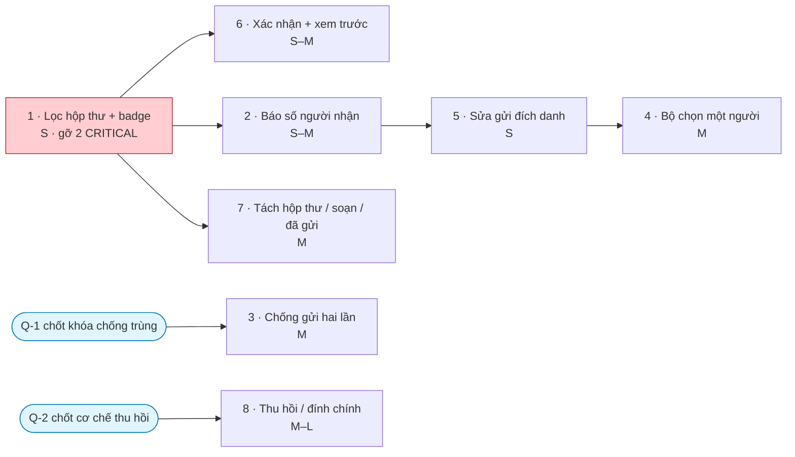

# M10 — THÔNG BÁO · Ảnh hưởng triển khai

> Ước lượng: **S** ≤ nửa ngày · **M** 1–2 ngày · **L** 3–5 ngày (một agent, gồm cả test).

---

## 1. Bảng tổng hợp

| # | Hạng mục | Cỡ | Migration | Đụng RLS | Rủi ro |
|---|---|---|---|---|---|
| 1 | **Lọc hộp thư + badge theo người đăng nhập** | **S** | ❌ | ❌ | **Rất thấp** |
| 2 | Báo số người nhận sau khi công bố; cảnh báo khi bằng 0 | **S–M** | ✅ đổi kiểu trả về RPC | ❌ | Thấp |
| 3 | Chống bấm gửi hai lần | **M** | ✅ thêm cột + unique | ❌ | Thấp |
| 4 | Bộ chọn người nhận cho phạm vi "một người" | **M** | ❌ | ❌ | Thấp |
| 5 | Sửa nhánh gửi đích danh không phụ thuộc phân công vai trò | **S** | ✅ sửa RPC | ❌ | Thấp |
| 6 | Xác nhận + xem trước trước khi gửi | **S–M** | ❌ | ❌ | Rất thấp |
| 7 | Tách hộp thư đến / bảng soạn / "tôi đã gửi" | **M** | ❌ | ❌ | Thấp |
| 8 | Thu hồi / đính chính thông báo | **M–L** | ✅ thêm cột + RPC | ✅ | **Trung bình** |

**Tổng ước lượng module: 7–11 ngày-người**; nhưng **hạng mục 1 chỉ mất nửa ngày và gỡ toàn bộ hai lỗi
CRITICAL** — chênh lệch chi phí/giá trị lớn nhất trong cả dự án.

---

## 2. Hạng mục 1 — sửa hai lỗi CRITICAL (chi tiết)

### File phải sửa
| File | Thay đổi |
|---|---|
| `src/features/notifications/server/queries.ts:42-49` | Thêm `.eq("profile_id", context.profileId)` vào truy vấn đếm chưa đọc; truyền `context` vào hàm |
| `src/features/notifications/server/queries.ts:111-115` | Thêm `.eq("profile_id", context.profileId)` vào truy vấn hộp thư |
| `src/features/notifications/server/queries.ts:133` | Lấy `unreadCount` từ số đếm thật thay vì đếm trên 50 dòng đầu |
| `src/app/(dashboard)/layout.tsx:7` | Truyền `context` xuống (nếu chữ ký hàm đổi) |

### Vì sao rủi ro rất thấp
- **Không đụng cơ sở dữ liệu, không đụng RLS, không đụng RPC.**
- Chỉ **siết chặt** phạm vi dữ liệu trả về — không có khả năng mở rộng quyền ngoài ý muốn.
- Với 8/14 vai trò (không có quyền đọc toàn cục), hành vi **không đổi chút nào** vì RLS vốn đã lọc đúng
  cho họ. Chỉ 6 vai trò quản lý thấy thay đổi, và thay đổi đó là **về đúng**.

### Vì sao phải làm trước mọi hạng mục khác
Mọi hạng mục còn lại đều hiển thị trên chính hai màn hình này. Làm tính năng mới trên nền dữ liệu sai
là xây trên nền lún.

---

## 3. Ảnh hưởng cơ sở dữ liệu

| Hạng mục | Migration | Nội dung | Ghi chú |
|---|---|---|---|
| 1, 4, 6, 7 | **Không cần** | — | Toàn bộ nằm ở tầng ứng dụng |
| 2 | Có | `publish_notification` trả thêm số người nhận thay vì `void`/id đơn thuần | Đổi kiểu trả về ⇒ cần `drop`/`create` trong cùng transaction; sinh lại `src/types/database.ts` |
| 3 | Có | Thêm cột khóa chống trùng + ràng buộc duy nhất | **Cần chốt khóa là gì trước khi code** — xem §6 |
| 5 | Có | Tách nhánh phạm vi "một người" khỏi phép nối bắt buộc với bảng phân công vai trò (`20260723000400:127-128`) | Sửa nội dung hàm, không đổi chữ ký |
| 8 | Có | Thêm cột trạng thái thu hồi + RPC; **sửa policy đọc** để ẩn thông báo đã thu hồi | Rủi ro cao nhất module |

**Nguyên tắc bắt buộc:** không hạng mục nào được cấp quyền INSERT/UPDATE/DELETE trực tiếp trên
`notifications` hoặc `notification_recipients` cho `authenticated`. Tính bất biến của bản ghi
(BR-M10-07 → BR-M10-09) là điểm mạnh nhất của module và phải giữ nguyên. Thu hồi phải làm bằng
**cột trạng thái + RPC**, không phải bằng xóa dòng.

## 4. Ảnh hưởng RLS

| Hạng mục | Đụng RLS? | Chi tiết |
|---|---|---|
| 8 | ✅ | `notifications_select_recipient` (`20260723000400:271-282`) phải loại trừ thông báo đã thu hồi |
| Còn lại | ❌ | — |

⚠️ **Cân nhắc quan trọng cho hạng mục 1:** có thể nảy ra ý tưởng "sửa gốc" bằng cách bỏ nhánh
`or (select app.can_global_read())` khỏi policy `notification_recipients_select_self`
(`20260723000400:283-285`). **Không nên.** Nhánh đó phục vụ mục đích quản trị/kiểm tra hợp lệ.
Sửa đúng chỗ là ở **truy vấn**, không phải ở **policy** — đúng như bài học 5 Whys đã rút ra.

## 5. Ảnh hưởng dữ liệu hiện có

| Hạng mục | Dữ liệu hiện có | Xử lý |
|---|---|---|
| 1 | Không ảnh hưởng — chỉ đổi cách đọc | Sau khi sửa, badge của 6 vai trò sẽ **tụt mạnh** về con số đúng. Cần báo trước cho người dùng để không tưởng là mất dữ liệu |
| 3 | Có thể đã tồn tại thông báo trùng do bấm hai lần | Ràng buộc duy nhất mới chỉ áp dụng từ nay; cần rà và xóa thủ công bằng `service_role` nếu muốn dọn |
| 5 | Có thể đã có thông báo gửi tới 0 người mà không ai biết | Truy vấn rà: `notifications` không có dòng nào trong `notification_recipients` |
| Còn lại | Không ảnh hưởng | — |

## 6. Quyết định phải chốt trước khi code

| # | Quyết định | Vì sao chặn |
|---|---|---|
| Q-1 | **Khóa chống trùng là gì?** (mã yêu cầu do giao diện sinh, hay bộ ba tiêu đề + phạm vi + khoảng thời gian) | Hạng mục 3 không code được nếu chưa chốt. `docs/11 §18` mới chỉ liệt kê yêu cầu, chưa định nghĩa khóa. Cùng tiêu đề, cùng phạm vi, cách nhau vài phút **có thể là chủ ý** |
| Q-2 | **Có làm chức năng thu hồi không?** Nếu có: thu hồi là *ẩn khỏi hộp thư* hay *hiển thị kèm nhãn "đã thu hồi"*? | Hạng mục 8; ảnh hưởng RLS và trải nghiệm |
| Q-3 | **Người chưa có phân công vai trò có nên nhận được thông báo gửi đích danh không?** | Hạng mục 5; hiện tại là "không" và không ai biết |

## 7. Test phải thêm

| Loại | Nội dung | Gắn với | Vì sao bắt buộc |
|---|---|---|---|
| **pgTAP/Integration** | Đăng nhập bằng vai **có quyền đọc toàn cục** (ví dụ Thư ký), kiểm hộp thư **chỉ** chứa thông báo của chính mình và số chưa đọc **chỉ** đếm của chính mình | HM 1 | 🔴 **Đây là lỗ hổng test gốc rễ.** pgTAP hiện chỉ kiểm bằng phiên phụ huynh (`022:186-200`) — vai không có quyền rộng — nên **không bao giờ chạm tới nhánh lỗi** |
| Integration | Thông báo gửi đích danh cho A: B (có quyền đọc toàn cục) **không** thấy trong hộp thư cá nhân | HM 1 | Chống tái phát |
| pgTAP | Công bố trả về đúng số người nhận | HM 2 | |
| pgTAP | Công bố tới phạm vi không có ai ⇒ số người nhận = 0 và người gửi nhận được tín hiệu | HM 2, 5 | |
| pgTAP | Gửi đích danh cho người chưa có phân công vai trò ⇒ vẫn nhận được | HM 5 | |
| pgTAP | Gửi hai lần cùng khóa ⇒ chỉ tạo một thông báo | HM 3 | |
| E2E | Đăng nhập bằng Thư ký, mở chuông, kiểm số hiển thị khớp số thông báo thật của tài khoản đó | HM 1 | E2E hiện chỉ đăng nhập phụ huynh |

## 8. Thứ tự phụ thuộc

**Luật thứ tự:**
1. **Hạng mục 1 làm đầu tiên, không tranh luận.** Nửa ngày công, gỡ hai lỗi CRITICAL, không rủi ro.
2. **Hạng mục 5 trước hạng mục 4** — làm bộ chọn người nhận trong khi nhánh gửi đích danh còn hố đen
   (người chưa có vai trò không nhận được) là giao cho người dùng một công cụ im lặng thất bại.
3. **Hạng mục 3 và 8 bị chặn** cho tới khi user chốt Q-1 và Q-2.

## 9. Ảnh hưởng sang module khác

| Module | Ảnh hưởng | Mức |
|---|---|---|
| M14 Vỏ ứng dụng | Badge chạy ở `layout.tsx:7` ⇒ chạm **mọi** trang dashboard; sửa hạng mục 1 ảnh hưởng toàn ứng dụng theo hướng tốt | ✅ có lợi |
| M13 Cổng phụ huynh | Phụ huynh/thiếu nhi **không bị ảnh hưởng** bởi lỗi CRITICAL (họ không có quyền đọc toàn cục) | ✅ an toàn |
| M09 Ban | Phạm vi "theo Ban" dùng chung cơ chế; hạng mục 2, 3, 6 áp dụng như nhau | Cần kiểm cùng |
| M02, M03, M04 | Cung cấp danh sách người nhận (ngành/lớp/Ban); hạng mục 4 cần truy vấn tìm kiếm người | Phụ thuộc |
| **Toàn hệ thống** | 🔴 Bài học "RLS không phải bộ lọc nghiệp vụ" phải được rà soát ở **mọi** màn hình "của tôi" — xem `04_SYSTEM_WIDE_FINDINGS.md` | **Quan trọng** |
