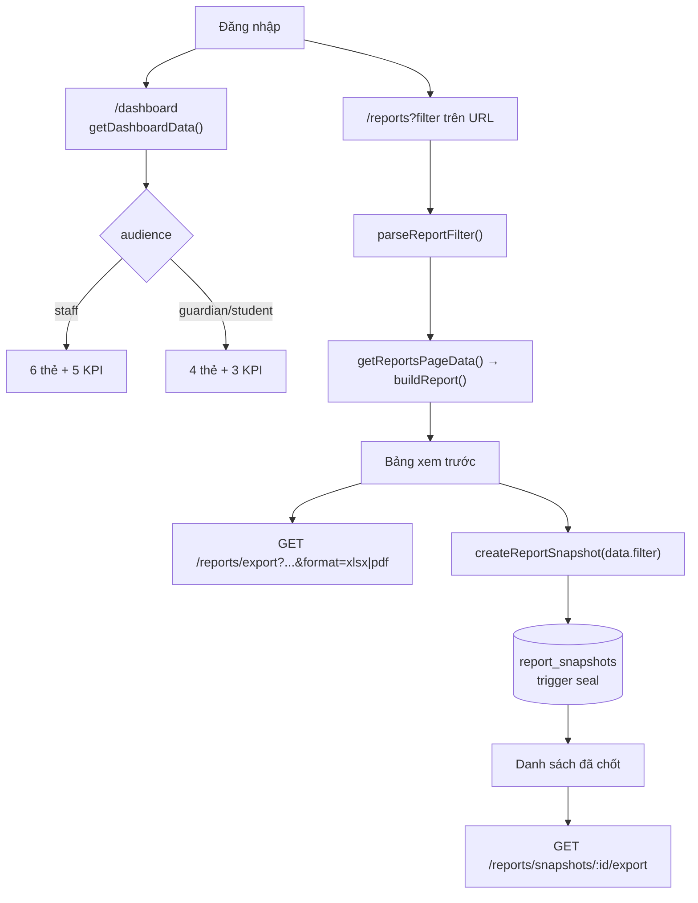
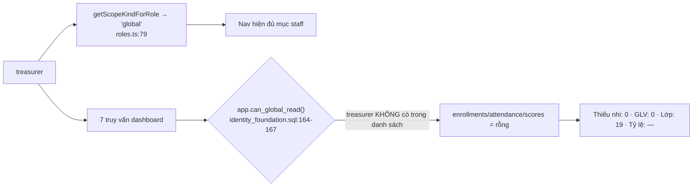
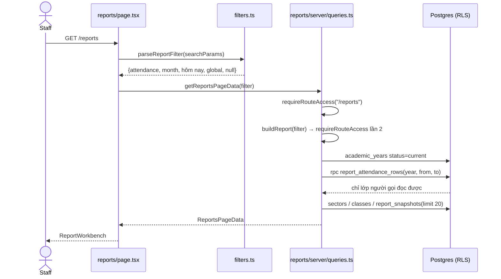
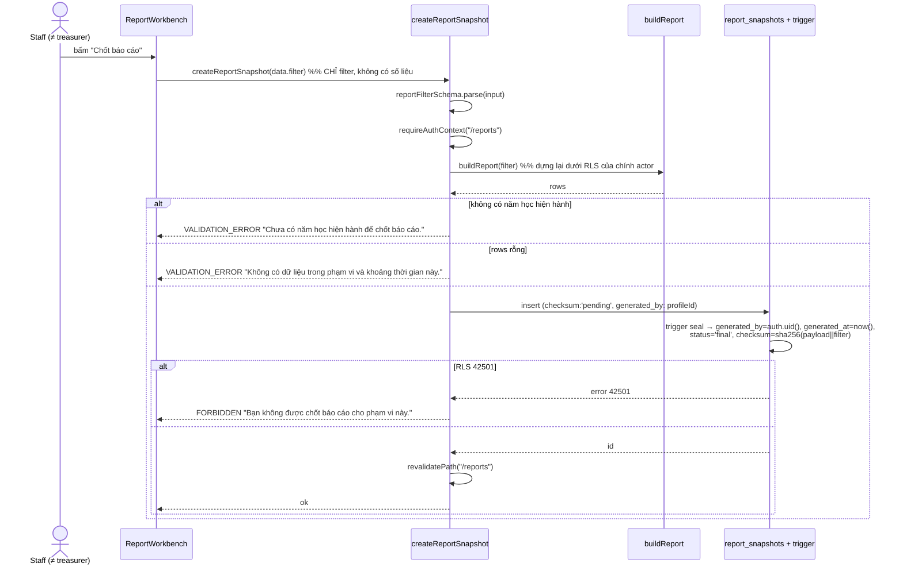

# M11-REPORTS-DASHBOARD — 02. Luồng AS-IS

> Mọi trích dẫn theo `file:line` tại thời điểm audit 2026-07-22.

## Tổng quan luồng

---

## M11-REPORTS-DASHBOARD-F01 — Xem dashboard (vai trò global read)

**Actor:** super_admin / cha sở / cha phó / XĐ trưởng / phó XĐ / thư ký.

| Bước | Nơi thực hiện | Bằng chứng |
|---|---|---|
| 1. Vào `/dashboard` | `src/app/(dashboard)/dashboard/page.tsx:7` | `getDashboardData()` |
| 2. Guard route | `src/features/dashboard/server/queries.ts:75` | `requireRouteAccess("/dashboard")` → `guards.ts:17-21` → `route-map.ts:23` (không giới hạn role) |
| 3. Lấy năm học hiện hành | `queries.ts:78-82` | `.eq("status","current").maybeSingle()` |
| 4. 7 truy vấn song song | `queries.ts:109-142` | `v_dashboard_summary`, `v_students_at_risk` (limit 10), `v_upcoming_teaching_items` (limit 8), `v_upcoming_celebrations` (limit 10), `v_incomplete_student_profiles` (count head), `committee_weekly_plans` (limit 3), `notification_recipients` (limit 5) |
| 5. RLS | migration `20260723000500:18,69,100,120,156` | Tất cả view là `security_invoker` |
| 6. Render | `dashboard-overview.tsx:37-47` | 5 KPI: Thiếu nhi, GLV, Lớp, Tỷ lệ dự lễ, Tỷ lệ học giáo lý |

**Trạng thái cuối:** hiển thị số toàn xứ đoàn. **Đúng.**
**Thông báo lỗi:** không có đường lỗi tường minh; `{ data }` bị bỏ `error` ở mọi truy vấn
(`queries.ts:110-142` destructure chỉ `data`/`count`) → RLS chặn hay lỗi mạng đều ra "0"/"rỗng".

---

## M11-REPORTS-DASHBOARD-F02 — Xem dashboard (GLV lớp / trưởng ngành)

Giống F01 tới bước 5. Khác ở kết quả:

| Ô KPI | Nguồn | Có bị thu hẹp theo phạm vi? | Bằng chứng |
|---|---|---|---|
| Thiếu nhi | CTE `enrolled` trên `enrollments` | **Có** | `enrollments_select_scope` — `20260716000500:139-146` |
| Giáo lý viên | CTE `staffed` trên `class_staff_assignments` | **Có** | `20260721000200:155-160` |
| **Lớp** | CTE `classed` trên `classes` | **KHÔNG** | `classes_select_authenticated` — `20260715000200:305-306` `using (app.current_role() is not null)` |
| Tỷ lệ dự lễ / giáo lý | `v_class_attendance_summary` | **Có** | `student_attendance_records_select_scope` — `20260721000300:320-331` |

**Trạng thái cuối:** GLV lớp Ấu 1 thấy `Thiếu nhi: 30 · Giáo lý viên: 3 · **Lớp: 19**`.
Con số "Lớp" là tổng toàn xứ đoàn — rò phạm vi (nhẹ, chỉ là số đếm cấu trúc lớp)
nhưng làm bộ số liệu **không nhất quán** với nhau.

pgTAP chỉ khẳng định `class_count` cho vai trò global (`023_dashboard_reports_test.sql:64-66`),
không có assertion cho vai trò lớp/ngành → lỗ hổng này không bị test bắt.

---

## M11-REPORTS-DASHBOARD-F03 — Xem dashboard (thủ quỹ)

| Bước | Bằng chứng |
|---|---|
| `treasurer` được xếp `GLOBAL_ROLES` ở tầng UI | `src/lib/permissions/roles.ts:40-47` |
| `app.can_global_read()` **không** có `treasurer` | `20260715000100_identity_foundation.sql:164-167` |
| `role_assignments` của treasurer bắt buộc `sector_id`/`class_id` NULL | `20260715000100:78` |
| ⇒ `scope_class_ids()`/`staff_class_ids()`/`own_student_ids()` đều rỗng | `20260721000200:92-160` |

**Trạng thái cuối:** dashboard hiển thị 0/0/19/—/—.
**Thông báo:** "Không có em nào cần lưu ý trong phạm vi của bạn." (`dashboard-overview.tsx:57`)
— sai bản chất: không phải "không có", mà là "không đọc được".
Trái `docs/05 §4.5` ("Cho phép: Dashboard tổng hợp").

---

## M11-REPORTS-DASHBOARD-F04 — Xem dashboard (phụ huynh / thiếu nhi)

| Bước | Bằng chứng |
|---|---|
| Route mở cho mọi vai trò | `route-map.ts:23` |
| `isStaff = data.audience === "staff"` ẩn 3 thẻ | `dashboard-overview.tsx:22,39,40,146,168` |
| KPI "Thiếu nhi" = số con đọc được | `enrollments_select_scope` cho phép `is_guardian_of_student` — `20260716000500:139-146` |
| KPI "Tỷ lệ dự lễ" = trung bình `v_class_attendance_summary` **chỉ trên hàng của con mình** | `20260721000500:217-233` gộp theo class nhưng RLS chỉ trả record của con |
| Thẻ "Cần quan tâm" có thể ra dữ liệu | `v_students_at_risk` join `v_student_attendance_summary`; guardian đọc được record đã finalize — `20260721000300:326-330` |
| **Link của thẻ trỏ tới `/students/{id}`** | `dashboard-overview.tsx:63` |
| `/students` chỉ dành `STAFF_ROLES` | `route-map.ts:26` |

**Trạng thái cuối:** phụ huynh có con bị cảnh báo → bấm tên con → `requireRouteAccess` redirect
`/access-denied` (`guards.ts:19`). Ngõ cụt.
**Thông báo:** trang "Không có quyền truy cập" — với phụ huynh không rành công nghệ đây là lỗi hệ thống.

---

## M11-REPORTS-DASHBOARD-F05 — Dashboard khi chưa có năm học hiện hành

| Bước | Bằng chứng |
|---|---|
| `currentYear` null → trả khung rỗng sớm | `dashboard/server/queries.ts:86-107` |
| Vẫn nạp 5 thông báo mới nhất | `queries.ts:87-91` |
| UI hiện hướng dẫn | `dashboard-overview.tsx:24-33` "Chưa có năm học nào đang diễn ra. Vào **Quản trị hệ thống**…" |

**Trạng thái cuối: đúng và rõ.** Duy nhất: link `/admin` hiện cho **mọi** vai trò kể cả
phụ huynh/thiếu nhi, trong khi `/admin` chỉ `super_admin` (`route-map.ts:47`).

---

## M11-REPORTS-DASHBOARD-F06 — Mở `/reports` và xem báo cáo mặc định

| Bước | Bằng chứng |
|---|---|
| Bộ lọc nằm trên URL | `reports/page.tsx:12-14` |
| Guard | `reports/server/queries.ts:66` và `:146` (gọi 2 lần) |
| Khoảng ngày | `filters.ts:63-81` `resolveReportRange` |
| RPC SECURITY INVOKER | migration `20260723000500:281,322` + comment `:358-361` |
| Lọc thêm theo scope ở TS | `queries.ts:128-132` |
| Cờ chốt | `queries.ts:182` `canSnapshot: context.role !== null && context.role !== "treasurer"` |

**Trạng thái cuối:** bảng preview + 2 nút tải + (tuỳ vai trò) nút "Chốt báo cáo".
**Empty state:** "Không có dữ liệu trong phạm vi và khoảng thời gian này."
(`report-workbench.tsx:173-175`) — **một câu duy nhất cho mọi nguyên nhân**.

---

## M11-REPORTS-DASHBOARD-F07 — Đổi bộ lọc và bấm "Xem báo cáo"

| Bước | Bằng chứng |
|---|---|
| 4 select + 1 input date | `report-workbench.tsx:78-133` |
| Validation client | Chỉ `required` trên select phạm vi cụ thể (`:122`); không có schema client |
| Submit → `router.push` | `report-workbench.tsx:44-55` |
| Validation server | `parseReportFilter` → `reportFilterSchema` (`filters.ts:34-47`) |
| **Fallback khi parse fail** | `filters.ts:97-105` — trả về mặc định `global` |
| Danh sách ngành/lớp | `queries.ts:151-157` — `sectors` và `classes` đọc được bởi **mọi** tài khoản (`20260715000200:297-306`) |

**Nhánh alternate:** GLV lớp Ấu 1 chọn "Theo lớp → Chiên 3" (lớp không thuộc phạm vi).
- Client: hợp lệ, submit.
- Server: `reportFilterSchema` pass; `buildReport` gọi RPC → RLS trả 0 dòng cho lớp đó → `filtered` rỗng.
- **UI hiện "Không có dữ liệu trong phạm vi và khoảng thời gian này."** → người dùng hiểu nhầm
  là lớp Chiên 3 chưa điểm danh, thay vì "bạn không được xem lớp này".

**Nhánh error:** sửa URL `?scopeType=class` (thiếu `scopeId`) → superRefine fail
(`filters.ts:41-43`) → `parseReportFilter` **im lặng trả về `global`** → phạm vi bị **nới rộng**
chứ không bị chặn, và không có thông báo nào. (RLS vẫn giới hạn nên không rò dữ liệu.)

**Thiếu so với WF-15 bước 1:** không có ô chọn **năm học**
(`academic-year-switcher.tsx:5` là nút `disabled`).

---

## M11-REPORTS-DASHBOARD-F08 — Xuất Excel

| Bước | Bằng chứng |
|---|---|
| Link dựng từ `data.filter` (đúng filter đang xem) | `report-workbench.tsx:68,153` |
| Route đọc lại filter từ chính query string | `reports/export/route.ts:18` |
| Dựng lại số liệu bằng cùng `buildReport` | `route.ts:19` |
| Guard nằm trong `buildReport` | `reports/server/queries.ts:66` |
| Chống formula injection | `report-data.ts:14-15` → `spreadsheet.ts:5-7` |
| Header/Content-Disposition | `lib/exports/http.ts:13-21`, `Cache-Control: private, no-store` |
| Tên file ASCII hoá | `http.ts:4-11` (loại bỏ ký tự ngoài `[a-zA-Z0-9_-]` ⇒ không chèn được `"` vào header) |

**Trạng thái cuối:** file `.xlsx` khớp đúng bảng đang xem.
**Kiểm tấn công:** đổi `?scopeType=global` trên link export khi đang là GLV lớp → route dựng lại
qua `buildReport` dưới RLS của chính người đó → chỉ ra lớp mình. **Không mở rộng được phạm vi.**

---

## M11-REPORTS-DASHBOARD-F09 — Xuất PDF

Giống F08, nhánh `format === "pdf"` (`route.ts:45-50`) → `pdfResponse` (`http.ts:27-74`).

| Điểm | Bằng chứng |
|---|---|
| Font Roboto nhúng giữ dấu tiếng Việt | `http.ts:33-37` |
| A4 ngang, `fontSize: 8` | `http.ts:44-46` |
| Bảng rỗng vẫn render một hàng "—" | `http.ts:54` |
| Dấu thời điểm xuất theo `Asia/Ho_Chi_Minh` | `http.ts:59` |
| `widths: ["*", ...headers.slice(1).map(()=> "auto")]` | `http.ts:53` — nếu `headers` rỗng thì `widths = ["*"]` còn `body` rỗng ⇒ pdfmake ném lỗi (chỉ xảy ra với snapshot payload hỏng) |

---

## M11-REPORTS-DASHBOARD-F10 — Chốt báo cáo (snapshot)

| Kiểm chứng WF-15 bước 4 | Bằng chứng | Kết luận |
|---|---|---|
| Server dựng lại số liệu từ filter đang xem | `actions.ts:32` `buildReport(filter)` | ĐẠT |
| Không nhận số liệu từ client | Chữ ký `createReportSnapshot(input: ReportFilter)` — `actions.ts:26-28` | ĐẠT |
| Người chốt do server đặt | trigger `:242` `new.generated_by := auth.uid()` (đè giá trị gửi lên ở `actions.ts:66`) | ĐẠT |
| Thời điểm do server đặt | trigger `:243` `new.generated_at := now()` | ĐẠT |
| Checksum do server tính | trigger `:245-251` sha256(`payload_json` \|\| `filter_json`) | ĐẠT |
| Không sửa/xóa được | `grant select, insert on report_snapshots to authenticated` — `:262` (không có UPDATE/DELETE); `status` check `= 'final'` — `:204` | ĐẠT (pgTAP `023:132-137`) |
| Bất biến khi nguồn đổi | Lưu `payload_json`, đọc lại không tính lại — `queries.ts:197-216` | ĐẠT (pgTAP `023:139-147`) |
| Thủ quỹ không chốt được | UI: `queries.ts:182`; DB: `can_create_report` → `can_global_read()` false cho treasurer — `:224-232` | ĐẠT (2 lớp) |

**Nhánh alternate quan trọng (chưa xử lý tốt):** nút "Chốt báo cáo" hiện cho **mọi** vai trò
staff ≠ treasurer (`report-workbench.tsx:163`) trong khi phạm vi mặc định là `global`
(`filters.ts:38`). Trưởng ngành / GLV lớp mở `/reports` → bảng có dữ liệu (lớp mình) → bấm chốt →
`can_create_report('global', null)` = `can_global_read()` = **false** → lỗi đỏ
"Bạn không được chốt báo cáo cho phạm vi này." Người dùng thấy dữ liệu nhưng không chốt được,
không có gợi ý "hãy đổi phạm vi sang Theo lớp".

**Nhánh concurrent:** nút bị `disabled` khi `pending` (`:164`) nhưng không có ràng buộc DB nào
chặn chốt trùng — `report_snapshots` không có unique index trên
(`academic_year_id`, `report_type`, `scope_type`, `scope_id`, `period_start`, `period_end`).
Hai tab / hai người ⇒ hai bản chốt giống hệt, **và không xóa được**.

---

## M11-REPORTS-DASHBOARD-F11 — Xem danh sách báo cáo đã chốt

| Bước | Bằng chứng |
|---|---|
| Truy vấn | `reports/server/queries.ts:157-161` — `.order("generated_at", desc).limit(20)` |
| RLS | `report_snapshots_select_scope using (app.can_create_report(scope_type, scope_id))` — `:265-267` |
| Render | `report-workbench.tsx:202-232` — tiêu đề, "Chốt lúc …", 12 ký tự đầu checksum, nút "Tải bản chốt" |

**Vấn đề:**
- `limit(20)` cứng, không phân trang, không lọc theo loại/phạm vi/năm → với retention 5 năm
  (D-51, `docs/10 §9`) các bản cũ **không còn đường nào truy cập** từ UI.
- Không hiện **phạm vi** (`scope_type`/`scope_id`) và **người chốt** — hai bản "Chuyên cần 2026-09-01 – 2026-09-30"
  của hai lớp khác nhau nhìn y hệt nhau (title chỉ gồm loại + khoảng ngày, `actions.ts:46`).
- Không có trang xem lại nội dung snapshot trong trình duyệt (không có `snapshots/[snapshotId]/page.tsx`).

**Trường hợp thủ quỹ:** `can_create_report` = false ở mọi scope ⇒ danh sách luôn rỗng, mâu thuẫn
với chú thích trong mã nguồn "Thủ quỹ xem/xuất được nhưng không chốt báo cáo (D-19)"
(`queries.ts:181`).

---

## M11-REPORTS-DASHBOARD-F12 — Tải lại bản đã chốt

| Bước | Bằng chứng |
|---|---|
| Link chỉ có `format=xlsx` | `report-workbench.tsx:223` |
| Route hỗ trợ cả `pdf` | `snapshots/[snapshotId]/export/route.ts:23-26,34-36` |
| Kiểm UUID trước khi truy vấn | `route.ts:9,20-22` → 404 |
| Guard | `getReportSnapshot` → `requireRouteAccess("/reports")` — `queries.ts:195` |
| Lấy từ `payload_json`, không tính lại | `queries.ts:197-216` + comment `route.ts:11-14` |
| Không tìm thấy / bị RLS chặn | `route.ts:29` → `404 {"error":"Không tìm thấy báo cáo."}` |

**ĐẠT** cho yêu cầu "chỉ user có scope tương ứng tải được snapshot của người khác":
RLS `can_create_report(scope_type, scope_id)` áp dụng khi SELECT nên GLV lớp A không đọc được
snapshot lớp B, và không phân biệt được "không tồn tại" với "không có quyền" (đúng ý đồ bảo mật).

**Điểm trừ:** UI không có nút PDF cho bản chốt dù route hỗ trợ.

---

## M11-REPORTS-DASHBOARD-F13 — Truy cập snapshot bằng ID sai / ngoài phạm vi

| Đầu vào | Kết quả | Bằng chứng |
|---|---|---|
| `/reports/snapshots/abc/export` | `404 JSON` (không chạm DB) | `route.ts:20-22` |
| UUID hợp lệ nhưng không tồn tại | `404 JSON` | `route.ts:29` |
| UUID của snapshot ngoài phạm vi | `404 JSON` (RLS lọc trước) | `route.ts:29` + policy `:265-267` |
| `?format=csv` | `400 JSON "Định dạng xuất không hợp lệ."` | `route.ts:24-26` |
| Chưa đăng nhập | redirect `/login?next=/reports` | `guards.ts:9` |
| Đăng nhập nhưng là guardian | redirect `/access-denied` | `guards.ts:19`, `route-map.ts:39` |

**Không có đường nào ra 500.** ĐẠT.

---

## M11-REPORTS-DASHBOARD-F14 — Thủ quỹ vào `/reports`

| Bước | Kết quả | Bằng chứng |
|---|---|---|
| Nav hiện "Báo cáo" | Có | `navigation.ts:54` (`audiences: staff`, `scopes: global/sector/class`) + `roles.ts:79` treasurer → `global` |
| Route cho phép | Có | `route-map.ts:39` `STAFF_ROLES` gồm `treasurer` |
| `report_attendance_rows` | 0 dòng | `student_attendance_records_select_scope` — `20260721000300:320-331`: treasurer không thoả nhánh nào |
| `report_results_rows` | 0 dòng | `assessment_scores_select_scope` — `20260722000400:554-563` |
| `report_snapshots` | 0 dòng | `can_create_report` false |
| UI | "Không có dữ liệu trong phạm vi và khoảng thời gian này." + "Chưa có báo cáo nào được chốt." | `report-workbench.tsx:174,209` |

**Trạng thái cuối:** trang báo cáo của thủ quỹ **luôn trống**, không có bất kỳ tín hiệu nào
cho biết đó là do phân quyền. Mâu thuẫn `docs/05 §4.5` và `docs/05 §2` (hàng "Báo cáo | Thủ quỹ |
👁/export giới hạn").

---

## M11-REPORTS-DASHBOARD-F15 — Sửa tham số URL thủ công

| Đầu vào | Hành vi | Bằng chứng |
|---|---|---|
| `?anchorDate=không-phải-ngày` | Về mặc định (hôm nay, global, month) **không báo lỗi** | `filters.ts:90-105` |
| `?scopeType=class` (thiếu `scopeId`) | Về `global` — **nới rộng** phạm vi | `filters.ts:41-43,97-105` |
| `?scopeId=<uuid lớp khác>` | Preview rỗng (RLS) | `queries.ts:128-132` + RLS |
| `?reportType=finance` | Về `attendance` | `filters.ts:35` |
| Mảng tham số `?scopeId=a&scopeId=b` | Lấy phần tử đầu | `filters.ts:86-89` |
| `?format=svg` trên `/reports/export` | `400 JSON` | `export/route.ts:14-16` |

**Không rò dữ liệu** (RLS là tuyến chặn thật), nhưng **fallback im lặng** vi phạm tiêu chí
"khó thao tác nhầm" và "trạng thái rõ ràng": người dùng gửi link cho đồng nghiệp, người kia mở ra
thấy phạm vi khác mà không hay biết.
