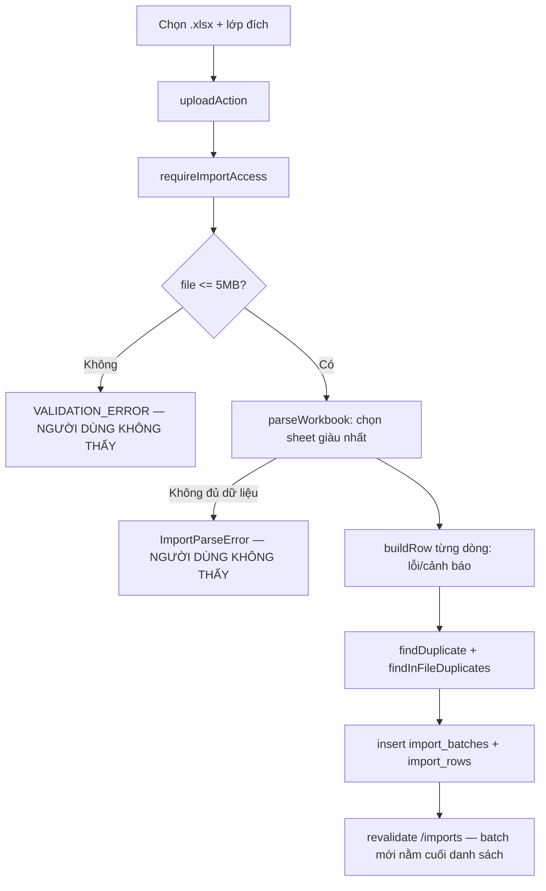
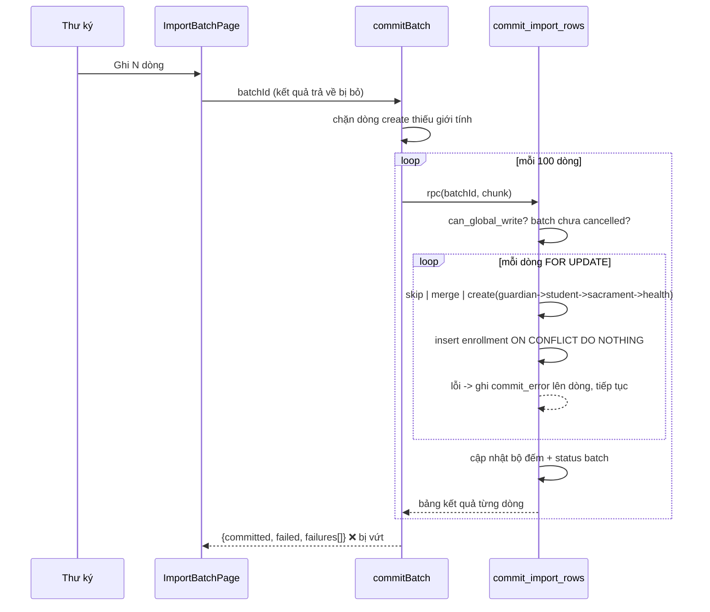

# M12-IMPORTS — 02. Luồng AS-IS

Ký hiệu: `M12-F01` … `M12-F10`.

---

## M12-F01 — Tải file mẫu

| # | Bước | Bằng chứng |
|---|---|---|
| 1 | Bấm "Tải file mẫu" (thẻ `<a download>`, cố ý không dùng `next/link`) | `imports/page.tsx:119-128` |
| 2 | `GET /imports/template` | `imports/template/route.ts:5` |
| 3 | `requireImportAccess()` — sai vai trò thì `AppError('FORBIDDEN')` | `route.ts:7`, `permissions.ts:21-25` |
| 4 | Dựng workbook 24 cột, cột bắt buộc tô nền cam, có `cell.note` hướng dẫn | `template.ts:19-44, 56-79` |
| 5 | Trả `Content-Disposition: attachment`, `Cache-Control: no-store` | `route.ts:10-17` |

**Cố ý không có dòng dữ liệu mẫu** để không ai import nhầm một "em giả" (`template.ts:82-85`) —
quyết định thiết kế tốt.

**Formula injection:** file chỉ chứa **header tĩnh tiếng Việt** do lập trình viên viết
(`template.ts:19-44`), không có bất kỳ dữ liệu nào từ người dùng/DB. Không có vector injection.
Cũng **không có** chức năng xuất lỗi ra Excel (nơi injection sẽ phát sinh).

---

## M12-F02 — Upload và dry-run

**Actor:** 4 vai trò global-write.

| # | Bước | Bằng chứng |
|---|---|---|
| 1 | `/imports` render form với `accept=".xlsx"` + select "Lớp đích (nếu file không có cột lớp)" | `imports/page.tsx:85-115` |
| 2 | Nếu chưa có năm học `current`, trang thay form bằng thông báo | `imports/page.tsx:64-71`, `queries.ts:16-24` |
| 3 | Submit → `uploadAction` → `createDryRunBatch(formData)` — **kết quả trả về bị bỏ đi** | `imports/page.tsx:23-26` |
| 4 | `requireImportAccess()` | `actions.ts:63` |
| 5 | Kiểm file tồn tại, `size > 0`, `size ≤ 5MB` | `actions.ts:66-72` |
| 6 | Lấy năm học hiện hành; không có → `VALIDATION_ERROR` | `actions.ts:74-80` |
| 7 | `parseWorkbook(await file.arrayBuffer())` — nạp **toàn bộ** file vào RAM | `actions.ts:82`, `parse.ts:159-179` |
| 8 | Tìm sheet: quét tối đa 12 dòng đầu tìm header có `fullName` + ≥2 cột nhận diện được | `parse.ts:69-82` |
| 9 | Xử lý cột "họ và tên" tách đôi của sổ lớp (cột kế bên không có header) | `parse.ts:94-107, 127-132` |
| 10 | Bỏ dòng trống và dòng không có tên (dòng tổng cộng, ghi chú) | `parse.ts:120, 135` |
| 11 | Chọn sheet "giàu" nhất: nhiều field khác nhau > nhiều dòng import được > ưu tiên layout | `parse.ts:209-233` |
| 12 | Nếu không sheet nào có đủ `fullName`+`dateOfBirth` → `ImportParseError` với hướng dẫn cụ thể | `parse.ts:199-204` |
| 13 | Nạp `getClassLookup(year.id)` + `getExistingStudents()` song song | `actions.ts:83-86` |
| 14 | Lớp đích chọn ở form được **kiểm lại server-side** (phải thuộc năm hiện hành) | `actions.ts:90-98` |
| 15 | `buildRow` cho từng dòng: chuẩn hóa + gom lỗi/cảnh báo | `actions.ts:100-102`, `build-row.ts:153-249` |
| 16 | `findInFileDuplicates` — trùng trong chính file (theo tên+ngày sinh) | `actions.ts:103`, `dedup.ts:111-130` |
| 17 | Insert `import_batches` (`uploaded_by = actor.profileId`) | `actions.ts:106-117` |
| 18 | Với mỗi dòng: `findDuplicate` với hồ sơ có sẵn → thêm cảnh báo, gán `matched_student_id`; xếp `status` = error / warning / valid | `actions.ts:123-151` |
| 19 | `action` mặc định **`"create"` cho MỌI dòng**, kể cả trùng mức `high` | `actions.ts:149` |
| 20 | Insert toàn bộ `import_rows` một lần | `actions.ts:153-156` |
| 21 | Update bộ đếm batch | `actions.ts:158-161` |
| 22 | `revalidatePath("/imports")`, trả `DryRunSummary` — **bị bỏ đi ở bước 3** | `actions.ts:163-174` |

**Trạng thái cuối:** `import_batches.status='dry_run'`; **không ghi gì vào bảng nghiệp vụ**
(test `011:105-106` khẳng định).

**Error path — vấn đề nghiêm trọng:**

| Tình huống | Điều người dùng thấy |
|---|---|
| File không phải .xlsx hợp lệ | **Trang tải lại y hệt.** Không thông báo. `ImportParseError` bị `uploadAction` nuốt (`imports/page.tsx:23-26`) |
| File > 5MB | **Không thông báo** |
| Chưa có năm học current | Thông báo có (render từ trang), nhưng form đã bị ẩn |
| Sheet chỉ có danh sách tên | **Không thông báo** — dù `parse.ts:199-204` đã soạn sẵn câu tiếng Việt rất tốt |
| Insert batch lỗi | **Không thông báo** |
| Thành công | **Không thông báo, không chuyển trang.** Người dùng phải tự tìm batch mới trong "Lần nhập gần đây" |

---

## M12-F03 — Xem danh sách batch

| # | Bước | Bằng chứng |
|---|---|---|
| 1 | `listBatches()` — `requireImportAccess()` + select 20 batch mới nhất | `queries.ts:99-122` |
| 2 | Render thẻ: tên file, badge trạng thái, `tổng/hợp lệ/cảnh báo/lỗi/đã ghi`, nguồn sheet | `imports/page.tsx:28-50` |
| 3 | Empty state: "Chưa có lần nhập dữ liệu nào." | `imports/page.tsx:136-141` |

**Hạn chế:** `limit(20)` cứng (`queries.ts:108`), không phân trang, không lọc theo năm/trạng thái/người tải,
không hiển thị ai đã tải lên (`uploaded_by` không được select).

---

## M12-F04 — Xem chi tiết batch

| # | Bước | Bằng chứng |
|---|---|---|
| 1 | `/imports/[batchId]` → `requireImportPage()` | `[batchId]/page.tsx:153` |
| 2 | `getBatchDetail(batchId)` — batch + **toàn bộ** dòng, sắp theo `row_number` | `queries.ts:143-191` |
| 3 | Không tìm thấy → `notFound()` (404) | `[batchId]/page.tsx:156` |
| 4 | Thẻ "Xác nhận ghi vào hệ thống": số dòng chờ, nút Ghi / Xóa / Quay lại | `[batchId]/page.tsx:168-199` |
| 5 | Danh sách `RowCard` cho **mọi** dòng, không phân trang, không lọc | `[batchId]/page.tsx:201-208` |

**Edge case:** `batchId` không phải UUID → Supabase trả lỗi cú pháp, `getBatchDetail` nhận `batch = null`
(destructure không kiểm `error`) → `notFound()`. Hành vi cuối đúng, nhưng vì lý do sai.

---

## M12-F05 — Chọn giới tính cho một dòng

Bối cảnh: SYLL của giáo xứ **không có cột giới tính** — ảnh hưởng ~83% dòng (`docs/09` §2b).

| # | Bước | Bằng chứng |
|---|---|---|
| 1 | Form chỉ hiện khi dòng chưa quyết định, chưa có giới tính, `action='create'` | `[batchId]/page.tsx:93` |
| 2 | Chọn Nam/Nữ → `rowGenderForm` kiểm giá trị rồi gọi `setRowGender` — **kết quả bị bỏ đi** | `[batchId]/page.tsx:48-53` |
| 3 | `requireImportAccess()`; đọc `normalized_json` + `warnings_json` của dòng | `actions.ts:204-215` |
| 4 | Gộp `gender` vào `normalized_json`, **xóa** cảnh báo `field='gender'` | `actions.ts:217-221` |
| 5 | Update dòng; `revalidatePath("/imports")` | `actions.ts:223-229` |

**Vấn đề nặng:** mỗi dòng là một form submit riêng → **tải lại toàn bộ trang** mỗi lần.
Một sổ lớp 30 em thiếu giới tính = 30 lần round-trip + 30 lần render lại danh sách đầy đủ.
Không có "áp dụng cho nhiều dòng", không có ghi nhớ vị trí cuộn.

Lưu ý: `select` có `defaultValue=""` và option rỗng `disabled` (`[batchId]/page.tsx:105-107`) →
nếu bấm "Lưu giới tính" mà chưa chọn, form gửi `gender=""` → `rowGenderForm` `return` im lặng
(`[batchId]/page.tsx:51`). Không thông báo.

---

## M12-F06 — Chọn cách xử lý dòng (create / merge / skip)

| # | Bước | Bằng chứng |
|---|---|---|
| 1 | Dòng đã `committed`/`skipped`/`error` chỉ hiển thị quyết định, không cho sửa | `[batchId]/page.tsx:57, 117-120` |
| 2 | Ngược lại: select 3 lựa chọn; "Ghép hồ sơ có sẵn" bị `disabled` nếu không có `matchedStudentId` | `[batchId]/page.tsx:122-142` |
| 3 | Submit → `rowActionForm` → `setRowAction` — **kết quả bị bỏ đi** | `[batchId]/page.tsx:41-46` |
| 4 | Update `import_rows.action`; ràng buộc `import_rows_merge_needs_target` chặn merge không có target | `actions.ts:188`, `…import_batches.sql:62-63` |

**Vấn đề:** UI **không hiển thị em nào là hồ sơ trùng** — chỉ có câu cảnh báo dạng
`[high] Trùng họ tên, ngày sinh và SĐT phụ huynh với TN0123.` (`dedup.ts:85`). Người duyệt
không có liên kết mở hồ sơ đó để so sánh trước khi quyết định ghép.

---

## M12-F07 — Ghi vào hệ thống (commit)

| # | Bước | Bằng chứng |
|---|---|---|
| 1 | Bấm "Ghi N dòng vào hệ thống" → `commitAction` → `commitBatch(batchId)` — **kết quả bị bỏ đi** | `[batchId]/page.tsx:31-34` |
| 2 | `requireImportAccess()` | `actions.ts:249` |
| 3 | Lấy các dòng `valid`/`warning` theo `row_number` | `actions.ts:252-257` |
| 4 | Không còn dòng nào → `VALIDATION_ERROR` (người dùng không thấy) | `actions.ts:260-263` |
| 5 | **Chặn trước** các dòng `create` còn thiếu giới tính, liệt kê tối đa 5 số dòng | `actions.ts:267-283` |
| 6 | Lặp theo chunk 100, mỗi chunk một lần gọi RPC = **một giao dịch** | `actions.ts:288-293` |
| 7 | RPC: kiểm `can_global_write`, batch tồn tại, batch chưa `cancelled` | `…import_batches.sql:145-155` |
| 8 | `for … select … for update` các dòng thuộc batch, trạng thái `valid`/`warning` | `…import_batches.sql:157-163` |
| 9 | `skip` → đặt `status='skipped'`, không ghi bảng nghiệp vụ | `…import_batches.sql:171-180` |
| 10 | Kiểm `normalized_json` và `class_id` đã resolve | `…import_batches.sql:182-190` |
| 11 | `merge` → dùng lại `matched_student_id`, chỉ mở ghi danh | `…import_batches.sql:192-199` |
| 12 | `create` → bắt buộc `guardian_phone`; tìm guardian theo SĐT, chưa có thì tạo | `…import_batches.sql:201-222` |
| 13 | Insert `students` (`student_code` từ default của DB → không trùng) | `…import_batches.sql:224-242` |
| 14 | Insert `student_sacraments` (`on conflict do nothing`), `student_health_profiles` nếu có | `…import_batches.sql:244-269` |
| 15 | Insert `enrollments` với **`on conflict do nothing`** | `…import_batches.sql:274-278` |
| 16 | Đánh dấu dòng `committed` | `…import_batches.sql:280-285` |
| 17 | **Bắt lỗi từng dòng** trong khối `exception when others`: đặt `status='error'`, ghi `commit_error` và nối vào `errors_json` | `…import_batches.sql:292-307` |
| 18 | Tính lại bộ đếm batch; `committed` chỉ khi không còn dòng chờ **và** không còn lỗi | `…import_batches.sql:311-333` |
| 19 | Action gom `committed`/`failures` rồi `revalidatePath` `/imports`, `/students`, `/classes` | `actions.ts:296-310` |

**Nguyên tử:** đúng ở **mức chunk** và **mức dòng** (khối `begin…exception` là subtransaction).
**Không** nguyên tử ở mức batch — đúng theo `docs/09` §7 ("chunk 100 row, mỗi chunk transaction").

**Error path:**

| Tình huống | Hành vi | Người dùng biết? |
|---|---|---|
| Một dòng lỗi ràng buộc | Dòng → `error` + `commit_error`, các dòng khác vẫn ghi | **Có** (sau khi trang render lại, `[batchId]/page.tsx:89-91`) |
| Còn dòng thiếu giới tính | Toàn bộ commit bị chặn với thông điệp rất rõ (`actions.ts:277-282`) | **KHÔNG** — thông điệp bị vứt |
| RPC lỗi cứng giữa chừng (chunk 5/9) | 4 chunk đầu **đã commit**, action ném `CONFLICT` | **KHÔNG** |
| Toàn bộ thành công | `{committed: N, failed: 0}` | **KHÔNG** — chỉ suy ra từ badge batch |
| Em đã có ghi danh mở ở lớp khác | `on conflict do nothing` → **không đổi lớp**, nhưng dòng vẫn `committed` | **KHÔNG** — báo cáo sai sự thật |

---

## M12-F08 — Xóa batch

| # | Bước | Bằng chứng |
|---|---|---|
| 1 | Bấm "Xóa lần nhập này" — **không có hộp xác nhận** | `[batchId]/page.tsx:185-190` |
| 2 | `discardAction` → `deleteBatch(batchId)` — kết quả bị bỏ | `[batchId]/page.tsx:36-39` |
| 3 | `requireImportAccess()`; `delete from import_batches where id = …` | `actions.ts:319-322` |
| 4 | `import_rows` bị **cascade** xóa theo | `…import_batches.sql:47` |
| 5 | `revalidatePath("/imports")` | `actions.ts:323` |

**Vấn đề:**
- **Không kiểm trạng thái** — xóa được cả batch đã `committed`.
- Xóa batch đã commit làm **mất toàn bộ vết** `created_student_id`/`created_guardian_id`
  (`…import_batches.sql:57-58`) → không còn cách biết em nào vào hệ thống từ file nào.
- Nút Xóa đứng **ngay cạnh** nút Ghi, cùng kích thước, chỉ khác `variant`.
- **Không** hoàn tác dữ liệu nghiệp vụ đã tạo.

---

## M12-F09 — Tải file lỗi — **KHÔNG TỒN TẠI**

`docs/09` §2 ("→ Download result") và §9 ("User download được errors") yêu cầu.
Không có route handler, không có action, không có nút nào. Người dùng chỉ đọc lỗi trên màn hình.

---

## M12-F10 — Hoàn tác (rollback) batch đã ghi — **KHÔNG TỒN TẠI**

Không có action, không có RPC. Trạng thái `cancelled` tồn tại trong enum
(`…import_batches.sql:6`) nhưng **không có luồng nào đặt được nó** → trạng thái chết.
Sửa sai phải làm thủ công trên từng hồ sơ ở `/students`.

---

## Edge case đã kiểm

| Tình huống | Kết quả | Bằng chứng |
|---|---|---|
| Empty state danh sách batch | Có | `imports/page.tsx:136-141` |
| Empty state dòng chờ ghi | "Không còn dòng nào chờ ghi." | `[batchId]/page.tsx:174-177` |
| Chưa có năm học current | Có thông báo và ẩn form | `imports/page.tsx:64-71` |
| Trùng trong cùng file | Cảnh báo, không chặn | `dedup.ts:111-130` |
| Trùng với hồ sơ có sẵn | Cảnh báo 3 mức, không chặn, **action mặc định vẫn `create`** | `actions.ts:127-132, 149` |
| Trùng với hồ sơ **đã nghỉ** | **Không phát hiện** — `getExistingStudents` chỉ lấy `status='active'` | `queries.ts:54` |
| Commit 2 lần | Dòng đã `committed` không nằm trong bộ lọc `valid/warning` → không nhân đôi | `…import_batches.sql:160`; test `011:164-168` |
| Hai người commit song song | `for update` từng dòng → không có dòng nào ghi hai lần | `…import_batches.sql:163` |
| GLV lớp / phụ huynh xem batch | Không thấy gì | test `011:85-86, 93` |
| GLV lớp gọi RPC | `42501` | test `011:87-92` |
| `batchId` không hợp lệ | `notFound()` | `[batchId]/page.tsx:156` |
| Dòng `error` | Không được commit (bộ lọc `status in ('valid','warning')`), UI khóa select | `…import_batches.sql:160`, `[batchId]/page.tsx:117` |
| Batch `cancelled` | RPC chặn — nhưng không luồng nào tạo được trạng thái này | `…import_batches.sql:153-155` |
