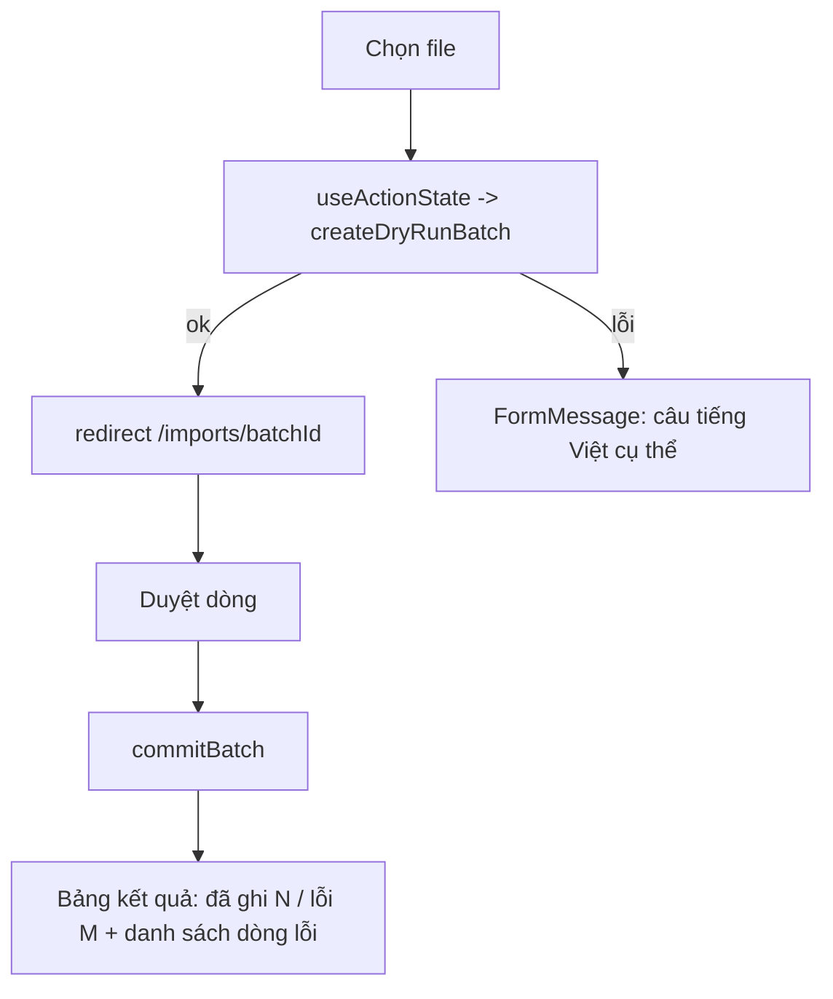

# M12-IMPORTS — 04. Luồng TO-BE

Module không PASS → có To-Be. **Giữ nguyên toàn bộ tầng parse / normalize / dedup / RPC / RLS**
(đã đúng và có test tốt). Thay đổi tập trung ở tầng phản hồi, quyết định mặc định, và 2 luồng còn thiếu.

---

## TO-BE 1 — Phản hồi thật cho mọi thao tác (sửa CRITICAL 4.1)

### Mục tiêu
Mọi thông điệp tiếng Việt đã được soạn ở tầng action phải đến được người dùng.
`docs/09` §7: "Failure một row **không được làm mơ hồ**."

### Actor
4 vai trò global-write.

### Bước mới

1. Tách `ImportUploadForm` và `BatchActions` thành **Client Component** dùng `useActionState`
   (hoặc `useTransition` như M08 đã làm ở `promotion-board.tsx:41`).
2. Sau `createDryRunBatch` thành công → **`redirect(/imports/${batchId})`** ngay, không để người dùng
   tự tìm batch trong danh sách.
3. Sau `createDryRunBatch` thất bại → hiện `FormMessage tone="danger"` với đúng `result.message`
   (ví dụ: "Sheet chỉ có danh sách tên, thiếu ngày sinh nên không đủ để import…" — câu này đã có sẵn
   ở `parse.ts:200-203`).
4. Sau `commitBatch` → hiện bảng kết quả: `Đã ghi N dòng · Lỗi M dòng`, kèm danh sách
   `#rowNumber — message` từ `CommitSummary.failures` (`actions.ts:239`).
5. `setRowGender` / `setRowAction` trả về lỗi → hiện ngay tại dòng đó.

### Phương án (2 phương án vì ảnh hưởng toàn bộ UI module)

**Phương án A — Client Component + `useActionState` (khuyến nghị)**
- Nhất quán với M08 (`promotion-board.tsx`).
- Giữ được trạng thái cuộn khi sửa từng dòng.
- Nhược: thêm JS phía client.

**Phương án B — giữ Server Component, truyền kết quả qua `searchParams`/cookie flash**
- Không thêm JS.
- Nhược: mọi thông điệp phải serialize lên URL hoặc cookie; danh sách `failures` dài không nhét vừa URL; xấu và dễ rò dữ liệu vào lịch sử trình duyệt.
- **Không khuyến nghị.**

### BR
`BR-M12-30`: mọi Server Action của module phải hiển thị kết quả (thành công hoặc lỗi) cho người gọi.

### Validation / Permission / Trạng thái dữ liệu
Không đổi.

### Error handling
Thông điệp giữ nguyên nội dung hiện có; **không** hiển thị `sqlerrm` thô cho dòng lỗi commit —
`commit_error` từ DB (`…import_batches.sql:299`) phải được ánh xạ sang câu tiếng Việt trước khi hiện
(hiện đang hiện thẳng ở `[batchId]/page.tsx:90`).

### Audit
Không phát sinh.

### So sánh số bước
| | AS-IS | TO-BE |
|---|---|---|
| Upload file sai định dạng | Bấm, không thấy gì, thử lại mù | Bấm, đọc lý do, sửa đúng |
| Tìm batch vừa tạo | Cuộn danh sách "Lần nhập gần đây" | Tự động vào trang batch |
| Biết kết quả commit | Suy đoán từ badge | Đọc thẳng |

### Ảnh hưởng
Module M12 (UI). Không đụng API, DB, RLS. Rủi ro migration: **không có**. Rollback: revert code.

---

## TO-BE 2 — Quyết định mặc định an toàn cho dòng trùng (sửa CRITICAL 4.3)

### Mục tiêu
Không để một cú bấm tạo ra hồ sơ trùng.

### Bước mới
1. Thêm trạng thái **"chưa quyết định"** cho dòng có cảnh báo trùng: khi `duplicate.level = 'high'`
   hoặc `'medium'`, đặt `action = 'merge'` (nếu có `matched_student_id`) thay vì `'create'`
   (`actions.ts:149`).
2. `commitBatch` **chặn** commit nếu còn dòng trùng mức `high` mà người duyệt chưa xác nhận —
   giống hệt cách đang chặn dòng thiếu giới tính (`actions.ts:267-283`).
3. Mở rộng dò trùng sang cả hồ sơ **không** `active` (`queries.ts:54`) — em nghỉ rồi quay lại
   phải được ghép, không tạo mới.
4. UI mỗi dòng trùng hiển thị **liên kết mở hồ sơ đối chiếu** (`/students/[matchedStudentId]`)
   kèm tên + ngày sinh + SĐT phụ huynh để so sánh.

### BR
`BR-M12-31`: dòng trùng mức `high` mặc định là `merge`.
`BR-M12-32`: không commit được khi còn dòng trùng `high` chưa được người duyệt xác nhận rõ ràng.
`BR-M12-33`: dò trùng xét mọi hồ sơ, không chỉ hồ sơ đang hoạt động.

### Validation
`commitBatch` thêm một lần kiểm giống `missingGender`, thông điệp liệt kê tối đa 5 số dòng.

### Permission
Không đổi. Lưu ý: liên kết `/students/[id]` chỉ mở được với người có quyền — 4 vai trò import đều có `can_global_read`.

### Trạng thái dữ liệu
Chỉ đổi giá trị `action` mặc định lúc dry-run; **không** đổi schema.

### Error handling
"Còn N dòng nghi trùng chắc chắn (#3, #17…). Hãy chọn Ghép hoặc Tạo mới cho từng dòng trước khi ghi."

### Audit
`import_rows.action` đã lưu quyết định cuối; giữ nguyên.

### So sánh số bước
Không tăng thao tác cho dòng sạch; tăng 1 thao tác/dòng cho đúng những dòng đáng ngờ.

### Ảnh hưởng
`actions.ts` (dry-run + commit), `queries.ts:49-67`, `[batchId]/page.tsx`. Không migration.

---

## TO-BE 3 — Bảo vệ batch đã commit + hủy có kiểm soát (sửa CRITICAL 4.2)

### Mục tiêu
Không mất vết dữ liệu đã ghi; cho phép "bỏ" một batch chưa ghi một cách rõ ràng.

### Bước mới
1. `deleteBatch` **chỉ** cho phép khi `status = 'dry_run'`; ngược lại trả
   `CONFLICT` "Lần nhập này đã ghi dữ liệu vào hệ thống nên không xóa được."
2. Với batch `dry_run`: nút đổi thành **"Hủy lần nhập"** + hộp xác nhận nêu số dòng sẽ mất.
3. Với batch đã ghi: nút đổi thành **"Xóa dữ liệu thô"** — chỉ xóa `raw_json`
   (`update import_rows set raw_json = '{}'`), **giữ** `created_student_id`/`created_guardian_id`.
   Đây mới đúng ý `docs/09` §6 ("có thể xóa raw import sau thời hạn ngắn").
4. Kích hoạt trạng thái `cancelled` (`…import_batches.sql:6`) cho hành động hủy — hết trạng thái chết.

### BR
`BR-M12-34`: batch có `committed_rows > 0` không được xóa.
`BR-M12-35`: hủy batch chưa ghi đặt `status='cancelled'`, không xóa hàng (giữ lịch sử).

### Permission
Cân nhắc: chỉ `super_admin` được "Xóa dữ liệu thô" (cần **NEEDS_CONFIRMATION** — xem 05).

### Trạng thái dữ liệu
Batch cũ đang `committed` không bị ảnh hưởng. Không cần backfill.

### Error handling / Audit
Mọi lần hủy/xóa raw ghi `updated_at`; nếu cần vết đầy đủ thì thêm cột `cancelled_by/cancelled_at` (M).

### Ảnh hưởng
`actions.ts:317-328`, `[batchId]/page.tsx:185-190`. Migration **không bắt buộc**
(dùng `status='cancelled'` sẵn có); nếu thêm `cancelled_by` thì là `alter table add column` (thấp rủi ro).

---

## TO-BE 4 — Điền giới tính hàng loạt (sửa 4.4)

### Mục tiêu
Xử lý được vấn đề đã đo: SYLL không có cột giới tính, ảnh hưởng ~83% dòng.

### Bước mới
1. Bảng dòng có cột "Giới tính" với select inline; chọn xong **không** submit ngay.
2. Nút "Lưu tất cả thay đổi" gọi `setRowGenderBatch(entries: {rowId, gender}[])` một lần.
3. Bổ sung gợi ý: nút "Đoán theo tên đệm" **không** được có — `docs/09` §2b đã chốt
   "không đặt mặc định, không đoán". Thay vào đó: nút **"Áp dụng Nam cho các dòng đang chọn"** /
   "Áp dụng Nữ" (người dùng vẫn là người quyết định, chỉ nhanh hơn).
4. `revalidatePath` đúng `/imports/[batchId]` thay vì `/imports`.

### BR
`BR-M12-36`: hệ thống **không bao giờ** tự suy đoán giới tính; chỉ nhận lựa chọn tường minh của người dùng.

### Validation / Permission
Zod `z.array(z.object({rowId: uuid, gender: enum})).max(200)`.

### Error handling
Trả danh sách dòng lỗi; các dòng khác vẫn lưu.

### So sánh số bước
30 dòng: 30 submit + 30 lần tải trang → **1 submit**.

### Ảnh hưởng
`actions.ts` (+1 action), `[batchId]/page.tsx` (bảng thay card + Client Component). Không migration.

---

## TO-BE 5 — Tải file kết quả / file lỗi (bổ sung M12-F09 còn thiếu)

### Mục tiêu
Đáp ứng `docs/09` §2 ("Download result") và §9 ("User download được errors"), và tạo cầu nối để
GLV lớp (không có quyền vào `/imports`) bổ sung dữ liệu thiếu.

### Bước mới
1. Route handler `GET /imports/[batchId]/errors` (hoặc `/result`) — `requireImportAccess()` trước tiên.
2. Xuất `.xlsx` 2 sheet:
   - `LOI`: `Dòng | Họ tên | Lớp | Lỗi | Cảnh báo`
   - `KET_QUA`: `Dòng | Họ tên | Mã thiếu nhi | Trạng thái` (mapping row → `student_code`, đúng `docs/09` §7)
3. **Bắt buộc chống Excel formula injection**: mọi giá trị chuỗi lấy từ dữ liệu người dùng
   (tên, tên lớp, thông điệp lỗi chứa tên) nếu bắt đầu bằng `= + - @ TAB CR` phải được tiền tố `'`
   trước khi ghi cell. Hiện `template.ts` không cần vì chỉ có header tĩnh, **nhưng file này thì có dữ liệu người dùng**.

### BR
`BR-M12-37`: mọi ô Excel xuất ra chứa dữ liệu do người dùng cung cấp phải được vô hiệu hóa công thức.
`BR-M12-38`: file kết quả phải chứa mapping `row_number → student_code`.

### Permission
Route handler phải authenticate/authorize (`docs/11` §16).

### Audit
Không phát sinh (chỉ đọc).

### Ảnh hưởng
File mới `src/app/(dashboard)/imports/[batchId]/errors/route.ts`, hàm mới trong `template.ts`
(hoặc `export.ts` riêng), `queries.ts` (select thêm `created_student_id`). Không migration.

---

## TO-BE 6 — Không che giấu ghi danh không thực hiện được (sửa 4.5)

### Mục tiêu
Dòng báo "đã ghi" phải đúng là đã ghi.

### Bước mới
Trong `commit_import_rows`, đổi
`insert into public.enrollments … on conflict do nothing;`
thành có `returning id into v_enrollment_id`; nếu `v_enrollment_id is null` thì:
- vẫn đánh dấu dòng `committed` (hồ sơ em đã được tạo/ghép),
- **nhưng** ghi một cảnh báo vào `warnings_json`: "Em đã có ghi danh đang mở ở lớp khác trong năm học này; lớp không được thay đổi.",
- và trả về cột mới `out_enrollment_created boolean` để UI thống kê.

### BR
`BR-M12-39`: khi ghi danh không được tạo do đã tồn tại ghi danh mở, người nhập phải được thông báo.

### Trạng thái dữ liệu
Không đổi dữ liệu hiện có.

### Ảnh hưởng
**Migration bắt buộc**: `create or replace function public.commit_import_rows(uuid, uuid[])`
với **cột trả về mới** → phải `drop function` rồi tạo lại (đổi kiểu `returns table`),
và **cấp lại `grant execute`** (`…import_batches.sql:339-340`).
- Rủi ro: **trung bình** — quên `grant` là gãy toàn bộ import.
- Rollback: chạy lại đúng định nghĩa cũ ở `20260721000100_import_batches.sql:116-340`.

---

## TO-BE 7 — Phân trang / lọc dòng và danh sách batch

- `getBatchDetail(batchId, { status?, page? })`, 50 dòng/trang, bộ lọc `Tất cả / Lỗi / Cảnh báo / Hợp lệ / Đã ghi / Bỏ qua`.
- `listBatches({ page, status, yearId })` thay `limit(20)` cứng (`queries.ts:108`); hiển thị người tải lên.
- Không migration.

---

## TO-BE 8 — Giới hạn kích thước và thời gian chạy (xem 05 — cần xác nhận hạ tầng)

- Hạ `MAX_UPLOAD_BYTES` xuống **4 MB** để nằm dưới giới hạn thân request của nền tảng, và hiển thị
  giới hạn này ngay trên form (hiện chỉ báo sau khi upload xong: `actions.ts:71`).
- Thêm `export const maxDuration` cho route/action commit (giá trị tùy gói triển khai).
- Nếu file lớn hơn: hướng dẫn tách theo lớp (mỗi sổ lớp là một file — đúng thực tế `Excel mẫu/`).

---

## Không đưa vào To-Be (giữ nguyên vì đã đúng)

- Ánh xạ cột theo header, chọn sheet giàu nhất, từ chối sheet chỉ có tên (`parse.ts:69-233`).
- Chuẩn hóa ngày/SĐT/tên/alias lớp (`normalize.ts`).
- Ưu tiên guardian `giám hộ > cha > mẹ`, ứng viên có SĐT thắng, người còn lại lưu vào `general_notes` (`build-row.ts:69-107, 124-136`).
- Guardian reuse theo SĐT chuẩn hóa; `student_code` từ sequence (`…import_batches.sql:201-242`).
- Bắt lỗi từng dòng bằng `begin…exception` và ghi lên chính dòng đó (`…import_batches.sql:292-307`).
- Bộ đếm batch tính lại từ dòng, `committed` chỉ khi sạch hoàn toàn (`…import_batches.sql:311-333`).
- Mô hình quyền 3 tầng + không dùng `service_role`.
- Template không có dòng dữ liệu mẫu (`template.ts:82-85`).
- Không tạo tài khoản đăng nhập khi import.
