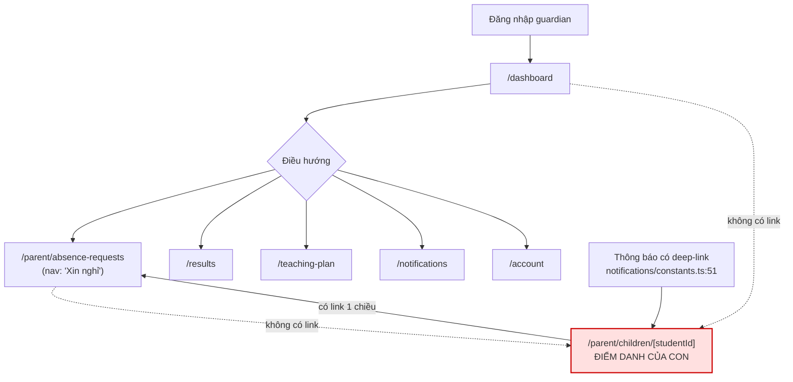
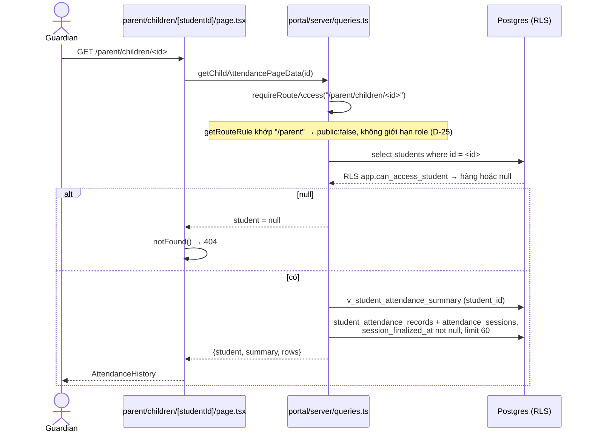
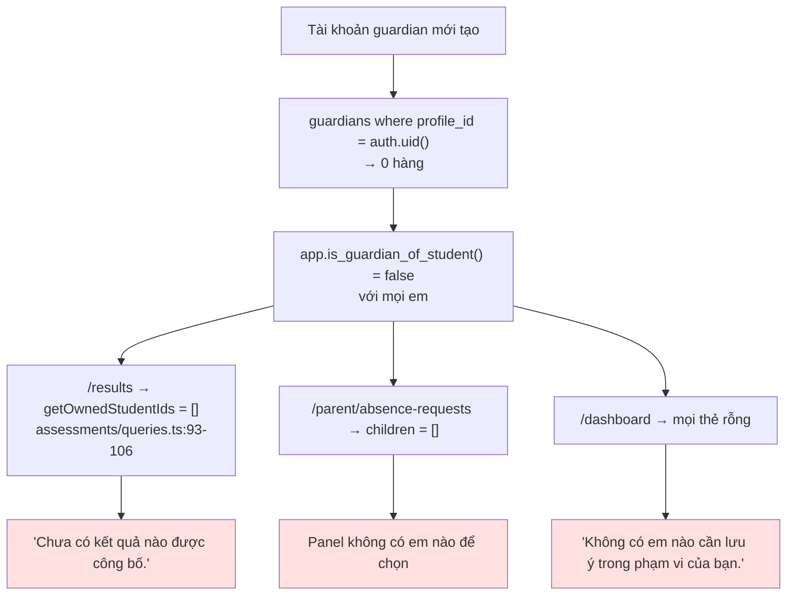
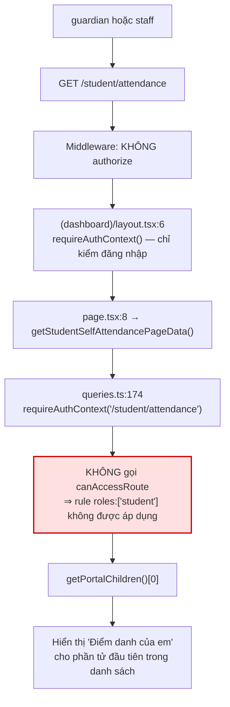

# M13-PORTAL — 02. Luồng AS-IS

> Trích dẫn `file:line` tại thời điểm audit 2026-07-22.

## Bản đồ điều hướng thực tế của phụ huynh

Ô đỏ = trang tồn tại nhưng **không có lối vào** từ giao diện.

---

## M13-PORTAL-F01 — Phụ huynh đăng nhập và tìm đường

| Bước | Nơi thực hiện | Bằng chứng |
|---|---|---|
| 1. Đăng nhập → `/dashboard` | `guards.ts:7-15` | |
| 2. Shell dựng nav | `app-shell.tsx:14-15` | `getDesktopNavigation` / `getMobileNavigation` |
| 3. Lọc theo audience | `navigation.ts:100-107` | `item.audiences.includes("guardian")` |
| 4. Nav desktop cho guardian | `navigation.ts:42,48,49,50,53` | Tổng quan · Đơn xin nghỉ · Giáo án · Kết quả học tập · Thông báo |
| 5. Nav mobile cho guardian | `navigation.ts:84-90` | Trang chủ · Xin nghỉ · Kết quả học tập · Thông báo · Tài khoản |

**Không có mục nào dẫn tới điểm danh của con.**
`grep -rn "parent/children" src/` → chỉ `portal/server/queries.ts:161` và
`features/notifications/constants.ts:51`.

**Trạng thái cuối:** phụ huynh đăng nhập để "xem con đi học thế nào" nhưng không có đường nào tới
thông tin đó, trừ khi được gửi một thông báo có deep-link.

**Ngoài ra:** `/parent` (route mà `docs/06:126` liệt kê) **không tồn tại** —
`src/app/(dashboard)/parent/` chỉ có `absence-requests/` và `children/[studentId]/`.

---

## M13-PORTAL-F02 — Phụ huynh xem điểm danh của con

| Bước | Bằng chứng |
|---|---|
| Guard | `queries.ts:161` `requireRouteAccess(/parent/children/${studentId})` → `route-map.ts:36` |
| Đọc hồ sơ em | `queries.ts:163-167` |
| RLS | `students_select_scope using (app.can_access_student(id))` — `20260716000100:198-200` |
| Chỉ dòng đã chốt | `queries.ts:74` `.not("session_finalized_at", "is", null)` **+** RLS `20260721000300:326-330` |
| Giới hạn 60 buổi gần nhất | `queries.ts:77` |
| Render | `attendance-history.tsx:31-102` |
| Link ra ngoài duy nhất | `page.tsx:25-27` → `/parent/absence-requests` |

**Nội dung hiển thị:** 4 ô tóm tắt (Số buổi · Có mặt lễ · Điểm Thánh lễ · Điểm Giáo lý),
khối cảnh báo WF-06 (`attendance-history.tsx:19-29,61-67`), rồi danh sách từng buổi dạng thẻ
với 2 badge Lễ/Giáo lý.

**Không hiển thị:** sức khỏe, bí tích, ghi chú `staff_only`, điểm chưa publish — các bảng đó
không được truy vấn ở đây và RLS cũng không cho.

**Điểm trừ:** `row.note` được hiển thị cho phụ huynh (`attendance-history.tsx:96`).
Đây là `student_attendance_records.note` do GLV nhập khi điểm danh — **cần xác nhận** đây là ghi chú
dành cho phụ huynh hay ghi chú nội bộ (xem câu hỏi Q4 ở `03_AUDIT_RESULTS.md`).

---

## M13-PORTAL-F03 — Phụ huynh mở hồ sơ em KHÔNG phải con mình

| Bước | Kết quả | Bằng chứng |
|---|---|---|
| `requireRouteAccess("/parent/children/<id lạ>")` | Cho qua (rule `/parent` không giới hạn role) | `route-map.ts:36` |
| `select students where id = <id lạ>` | `data = null` (RLS lọc) | `app.can_access_student` — `20260716000500:90-109`: guardian chỉ thoả `is_guardian_of_student` |
| `if (!student) notFound()` | HTTP **404** | `page.tsx:15-17` |
| Tên em có bị lộ không? | **Không** — `student.label` chỉ được dùng sau khi qua null-check | `page.tsx:14,22` |
| Có ra 500 không? | **Không** | `maybeSingle()` không ném khi 0 hàng |

**ĐẠT đầy đủ yêu cầu kiểm đặc biệt.** Comment tại `page.tsx:15-16` ghi rõ chủ ý:
"trả 404 chứ không báo 'không có quyền', để không lộ sự tồn tại của hồ sơ".

---

## M13-PORTAL-F04 — `studentId` không phải UUID hợp lệ

| Đầu vào | Đường đi | Kết quả |
|---|---|---|
| `/parent/children/abc` | `.eq("id","abc")` trên cột `uuid` → Postgres `22P02` → PostgREST trả lỗi, `data = null` (`queries.ts:163-167` bỏ qua `error`) | `notFound()` → **404** |
| `/parent/children/` (rỗng) | Không khớp route động | 404 của Next |
| UUID hợp lệ nhưng không tồn tại | `data = null` | 404 |

**Không có đường ra 500.** ĐẠT.
**Điểm trừ nhỏ:** vì `error` bị bỏ qua, một lỗi hạ tầng thật (mất kết nối DB) cũng ra 404
"Không tìm thấy" thay vì lỗi hệ thống — sai loại lỗi, khó chẩn đoán.

---

## M13-PORTAL-F05 — Phụ huynh có nhiều con

| Câu hỏi | Trả lời | Bằng chứng |
|---|---|---|
| Có bộ chọn con ở trang điểm danh không? | **Không** — trang nhận `studentId` từ URL, không có select | `page.tsx:8-33` |
| Có trang danh sách con không? | **Không** — không có `parent/children/page.tsx` | `find src/app/(dashboard)/parent -type f` |
| Có bộ chọn con ở nơi khác không? | Có, nhưng chỉ trong **đơn xin nghỉ** | `absence-requests/page.tsx:15` truyền `students={children}` vào `AbsenceRequestPanel` |
| Trang kết quả xử lý nhiều con thế nào? | Xếp chồng nhiều `Card`, mỗi con một thẻ | `published-results-portal.tsx:13-37` |
| `getPortalChildren` có trả đủ các con không? | Có | `queries.ts:46-53` (`students` RLS + `is_guardian_of_student`) |

**Trạng thái cuối:** phụ huynh 3 con muốn xem điểm danh từng em phải có 3 URL chứa 3 UUID khác nhau
và không có nơi nào liệt kê chúng. Trên thực tế **không chuyển đổi giữa các con được**.

---

## M13-PORTAL-F06 — Phụ huynh chưa liên kết `guardians.profile_id`

| Màn hình | Thông điệp thực tế | Đánh giá |
|---|---|---|
| `/results` | "Chưa có kết quả nào được công bố." (`published-results-portal.tsx:9`) | **Sai nguyên nhân** — thật ra là chưa liên kết tài khoản |
| `/parent/absence-requests` | Danh sách em rỗng (`queries.ts:132`) | Không giải thích |
| `/dashboard` | "Không có em nào cần lưu ý…" | Sai nguyên nhân |
| `/parent/children/<id>` | Không vào được (không có id) | — |

**Đối chiếu:** trang thiếu nhi **có** empty state đúng —
"Tài khoản của em chưa gắn với hồ sơ thiếu nhi. Nhờ giáo lý viên kiểm tra giúp."
(`student/attendance/page.tsx:19-21`). Phía phụ huynh **không có** thông điệp tương đương.

---

## M13-PORTAL-F07 — Thiếu nhi xem điểm danh của mình

| Bước | Bằng chứng |
|---|---|
| Nav mobile/desktop có mục "Điểm danh của em" | `navigation.ts:47,92-98` |
| Guard | `queries.ts:174` `requireAuthContext("/student/attendance")` |
| Xác định "mình" | `queries.ts:175-177` — `getPortalChildren()` rồi lấy **phần tử đầu tiên** |
| RLS `students` | `is_self_student` qua `students.profile_id` — `20260716000100:128-130` |
| Dữ liệu | Cùng `getPortalAttendance` như phía phụ huynh |
| Empty state | "Tài khoản của em chưa gắn với hồ sơ thiếu nhi. Nhờ giáo lý viên kiểm tra giúp." (`page.tsx:19-21`) |

**Thiếu nhi có xem được bạn cùng lớp không?**
- `students`: `can_access_student` cho `student` chỉ thoả `is_self_student` → **chỉ chính em**.
- `student_attendance_records`: `own_student_ids()` → **chỉ chính em**.
- Ngoại lệ duy nhất: **Top 5 đã publish** — `leaderboard_entries` chứa
  `saint_name_snapshot`/`full_name_snapshot` của các bạn (`published-results-portal.tsx:34`).
  Đây đúng là ngoại lệ được cho phép.

**ĐẠT.**

---

## M13-PORTAL-F08 — Tài khoản KHÔNG phải `student` mở `/student/attendance`

| Actor | Kết quả thực tế | Có rò dữ liệu ngoài phạm vi không? |
|---|---|---|
| `guardian` | Thấy điểm danh của **con đầu tiên theo `full_name`** dưới tiêu đề "Điểm danh của em" | Không (vẫn trong phạm vi RLS của họ) |
| `class_teacher` | Thấy điểm danh của em đầu tiên trong lớp mình | Không |
| `group_leader` (global read) | Thấy điểm danh của **em đầu tiên toàn xứ đoàn** theo thứ tự tên | Không (họ vốn đọc được) |
| `treasurer` | `getPortalChildren()` rỗng → empty state | — |

**Kết luận:** không rò dữ liệu (RLS giữ vững), nhưng **quy tắc `{ path: "/student", roles: ["student"] }`
tại `route-map.ts:37` không được thực thi ở bất kỳ tầng nào** cho trang này.
Đây là hỏng lớp phòng thủ theo chiều sâu và là sai lệch với `docs/05`/`docs/06`.

**So sánh trong cùng file:** `getChildAttendancePageData` dùng `requireRouteAccess` (`queries.ts:161`)
còn `getStudentSelfAttendancePageData` dùng `requireAuthContext` (`queries.ts:174`) — sự khác biệt
này không có comment giải thích, nhiều khả năng là sơ suất.

---

## M13-PORTAL-F09 — Phụ huynh/thiếu nhi xem kết quả đã công bố

| Bước | Bằng chứng |
|---|---|
| Vào `/results` | Nav `navigation.ts:50` (audiences gồm guardian/student) |
| Guard | `getResultsPageData` → `requireRouteAccess("/results")` — `assessments/server/queries.ts:230`; `route-map.ts:31` không giới hạn role |
| Phân nhánh | `results/page.tsx:16-17` — guardian/student → `PublishedResultsPortal` |
| Xác định con/bản thân | `getOwnedStudentIds` — `assessments/server/queries.ts:93-106` (join `guardians.profile_id` / `students.profile_id`) |
| Chỉ cột điểm đã publish | `.eq("is_published", true)` — `:133` |
| Chỉ điểm đã publish | `.eq("assessment_published", true)` — `:139` |
| Chỉ nhận xét công khai | `.eq("visibility", "student_visible")` — `:143` |
| Chỉ Top 5 đã publish | `.eq("is_published", true)` — `:148` |
| RLS xác nhận lại | `assessments_select_scope` `:519-533`, `assessment_scores_select_scope` `:554-563` (`20260722000400`) |

**Không thấy:** ghi chú `staff_only` (lọc ở cả 2 tầng), điểm của cột chưa publish,
sức khỏe/bí tích (không truy vấn + `can_view_student_sensitive` loại trừ guardian/student).

**ĐẠT.**

**Điểm trừ nhỏ:** trung bình có trọng số được **tính lại ở client-side server component**
(`assessments/server/queries.ts:192-216`) chỉ trên các cột đã publish, trong khi staff xem
`v_student_weighted_average` tính trên **mọi** cột. Hai con số có thể khác nhau — đúng về mặt
nghiệp vụ (phụ huynh không được thấy cột chưa publish) nhưng không có ghi chú nào cho phụ huynh
biết "đây là TB tạm tính trên các cột đã công bố".

---

## M13-PORTAL-F10 — Xem Top 5 của lớp

| Bước | Bằng chứng |
|---|---|
| Chỉ bảng đã publish | `assessments/server/queries.ts:148` |
| Tên hiển thị lấy từ **snapshot** lúc publish, không join `students` | `:181-182` `saint_name_snapshot`, `full_name_snapshot` |
| Render | `published-results-portal.tsx:34` |

**Đánh giá:** dùng snapshot tên là lựa chọn đúng — không cần mở quyền đọc `students` của bạn cùng
lớp để hiển thị bảng vàng. Đây là cách cô lập ngoại lệ gọn gàng. **ĐẠT.**

---

## M13-PORTAL-F11 — Xem giáo án tuần tới

| Bước | Bằng chứng |
|---|---|
| Nav | `navigation.ts:49` (audiences gồm guardian/student) |
| Trang | `teaching-plan/page.tsx:9-14` — `WeekAheadSchedule` hiện cho mọi vai trò |
| Guardian/student **không** đọc bảng gốc | `teaching-plans/server/queries.ts:137-138` — "Guardian/student chỉ đi qua safe RPC" |
| RPC an toàn | `get_week_ahead_teaching_items` (`:100`) |
| Danh sách lớp bên dưới | `data.classes` rỗng với portal ⇒ không render section |

**ĐẠT** ở phần điều hướng/hiển thị portal (nội dung chi tiết thuộc M06).

---

## M13-PORTAL-F12 — Xem thông báo

| Bước | Bằng chứng |
|---|---|
| Nav (desktop + mobile) | `navigation.ts:53`, `:88`, `:96` |
| Chuông + số chưa đọc trên header | `layout.tsx:7` `getUnreadNotificationCount()` |
| Deep-link hợp lệ | `notifications/constants.ts:40-58` — có `/parent/children` và `/student/attendance` |

**ĐẠT.** Ghi nhận: `/parent/children` nằm trong danh sách deep-link cho phép — đây là **lối vào duy
nhất** hiện có tới trang điểm danh của con (xem F01).

---

## M13-PORTAL-F13 — Truy cập `/parent`

| Đầu vào | Kết quả | Bằng chứng |
|---|---|---|
| `/parent` | **404** của Next (không có `page.tsx`) | `src/app/(dashboard)/parent/` chỉ có 2 thư mục con |
| `/parent/children` | **404** | Không có `page.tsx` |
| `docs/06 §6` liệt kê `/parent` là route guardian | Chưa thực hiện | `docs/06:125` |

**Hệ quả:** không có "trang chủ của phụ huynh". Với người dùng gõ tay hoặc lưu bookmark ngắn,
đây là ngõ cụt.

---

## M13-PORTAL-F14 — Điều hướng mobile 360px

| Vai trò | 5 mục bottom nav | Bằng chứng |
|---|---|---|
| guardian | Trang chủ · Xin nghỉ · Kết quả học tập · Thông báo · Tài khoản | `navigation.ts:84-90` |
| student | Trang chủ · Điểm danh · Kết quả học tập · Thông báo · Tài khoản | `navigation.ts:92-98` |

| Yếu tố | Đánh giá | Bằng chứng |
|---|---|---|
| Vùng chạm | `min-h-16` (64px) — vượt ngưỡng 44px | `mobile-bottom-navigation.tsx:16` |
| Cỡ chữ nhãn | `text-[11px]` — **nhỏ** với người lớn tuổi | `:16` |
| Nhãn dài bị cắt | `truncate` — "Kết quả học tập" sẽ bị cắt trong ô 1/5 màn hình 360px (~72px) | `:18` |
| `aria-current` | Có | `:16` |
| Landmark | `<nav aria-label="Điều hướng nhanh">` | `:7` |
| Chừa chỗ cho nav | `pb-24` trên vùng nội dung | `app-shell.tsx:33` |
| Thiếu | **Không có** mục "Điểm danh của con" cho guardian | `navigation.ts:84-90` |
| Tiêu đề header trang con | `getPageTitle("/parent/children/x")` không khớp mục nào → trả "Thiếu Nhi Chợ Quán" | `navigation.ts:122-128` |
