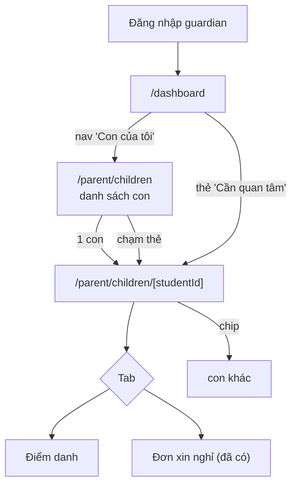

# M13-PORTAL — 04. Luồng TO-BE

> Chỉ đề xuất. Giai đoạn 1 không sửa mã.
> Các luồng **M13-F03, M13-F04, M13-F09, M13-F10, M13-F11, M13-F12** đã PASS — **không có To-Be**,
> giữ nguyên hoàn toàn (kể cả cách trả 404 và cách dùng tên snapshot cho Top 5).
> Nguyên tắc xuyên suốt khi thiết kế lại: **không đụng RLS**. Toàn bộ vấn đề của module nằm ở
> điều hướng và trình bày, không nằm ở phân quyền dữ liệu.

---

## TB-M13-01 — Cổng phụ huynh có lối vào thật (giải quyết C-1: M13-F01, M13-F05, M13-F13)

### Mục tiêu
Phụ huynh đăng nhập trên điện thoại và tới được lịch sử điểm danh của từng con **trong ≤ 2 chạm**,
không cần biết UUID.

### Actor
Phụ huynh (`guardian`), kể cả GLV đồng thời là phụ huynh (D-25).

### Hai phương án

#### Phương án A — Trang "Con của tôi" làm trung tâm (khuyến nghị)
1. Thêm trang `/parent/children` liệt kê các con: tên thánh + họ tên, lớp, badge cảnh báo nếu có.
2. Thêm mục nav **"Con của tôi"** (`audiences: ["guardian"]`, `scopes: ["ownership"]`) trỏ tới trang này,
   đưa vào cả `platformNavigation` lẫn `guardianMobileNavigation`.
3. Trang `/parent` redirect sang `/parent/children` (hết 404).
4. Mỗi thẻ con dẫn tới `/parent/children/[studentId]` (trang hiện tại, giữ nguyên).
5. Trang chi tiết thêm nút "← Con của tôi" và, khi có nhiều con, một dải chip chuyển nhanh giữa các con.
6. Khi chỉ có **một** con: `/parent/children` chuyển thẳng sang trang chi tiết (theo trả lời Q2).

- **Ưu:** khớp `docs/06 §6`; giải quyết luôn F05 và F13; mở rộng về sau (thêm "Điểm của con",
  "Hồ sơ con") chỉ là thêm tab trong trang chi tiết.
- **Nhược:** thêm 1 route + 1 mục nav; nav guardian mobile đã có 5 mục nên phải thay một mục
  (đề xuất: gộp "Xin nghỉ" vào trang chi tiết con, vì nút "Đơn xin nghỉ →" đã có sẵn ở
  `parent/children/[studentId]/page.tsx:25-27`).

#### Phương án B — Nav động sinh theo số con
Không thêm trang; sinh mục nav trực tiếp cho từng con (`/parent/children/<id>`) khi dựng shell.

- **Ưu:** ít route hơn; 1 chạm là tới.
- **Nhược:** `navigation.ts` hiện là **hằng số tĩnh, thuần, có unit test** (`tests/unit/navigation.test.ts`);
  biến nó thành hàm bất đồng bộ phụ thuộc DB là thay đổi kiến trúc lớn; nav 5 ô không chứa nổi
  phụ huynh có 3+ con; header sidebar sẽ dài bất định.

**Khuyến nghị: A.** B chỉ hợp nếu xác nhận đại đa số phụ huynh có đúng 1 con **và** chấp nhận
nav phụ thuộc dữ liệu.

### Bước mới (phương án A)

### Business rule
BR-M13-01, BR-M13-02, BR-M13-09.

### Validation
- `/parent/children` không nhận tham số.
- `/parent/children/[studentId]` giữ nguyên hành vi: RLS lọc → `notFound()`.

### Permission
**Không đổi.** `route-map.ts:36` (`/parent` không giới hạn role — D-25) đã bao trùm route mới;
RLS `students_select_scope` tự lọc danh sách con.

### Trạng thái
Không có trạng thái mới.

### Error handling
- Không có con nào đọc được → empty state của TB-M13-03 (không phải danh sách trống câm lặng).
- `studentId` sai → 404 như hiện tại.

### Audit
Không cần (`docs/10 §7`).

### So sánh số bước

| Việc | Trước | Sau |
|---|---|---|
| Xem điểm danh con (1 con) | **Không thể** qua giao diện | 1–2 chạm |
| Xem điểm danh con (3 con) | **Không thể** | 2 chạm + 1 chạm cho con tiếp theo |
| Từ dashboard tới hồ sơ con bị cảnh báo | `/access-denied` (ngõ cụt) | 1 chạm |

### Ảnh hưởng
| Loại | Chi tiết |
|---|---|
| Module | M13 + M14-NAVIGATION-SHELL (+ M11 cho link dashboard) |
| API/Server action | Không mới — dùng lại `getPortalChildren()` (nên đổi tên, xem TB-M13-05) |
| DB | **Không** |
| Rủi ro migration | Không có migration |
| Rollback | Xoá 2 route mới + revert `navigation.ts`; trang chi tiết không đổi nên không hỏng gì |

---

## TB-M13-02 — Thực thi thật giới hạn role của `/student` (giải quyết C-2: M13-F08)

### Mục tiêu
Quy tắc khai báo trong `route-map.ts` phải được thực thi, và không thể quên với trang mới.

### Actor
Toàn bộ vai trò (đây là hàng rào hệ thống).

### Hai phương án

#### Phương án A — Sửa điểm gọi + chặn hồi quy bằng test cấu trúc (khuyến nghị)
1. `getStudentSelfAttendancePageData` dùng `requireRouteAccess("/student/attendance")` thay cho
   `requireAuthContext` (`portal/server/queries.ts:174`).
2. Thêm unit test duyệt toàn bộ `src/app/(dashboard)/**/page.tsx`, khẳng định mỗi trang có ít nhất
   một lời gọi `requireRouteAccess` (trực tiếp hoặc qua query nó gọi) — hoặc nằm trong danh sách
   miễn trừ có ghi lý do.
3. Cân nhắc đổi tên `requireAuthContext` → `requireSignedIn` để hai hàm không còn nhìn giống nhau.

- **Ưu:** rẻ, đúng trọng tâm, ngăn tái phát.
- **Nhược:** test cấu trúc dựa trên phân tích văn bản, có thể có dương tính giả.

#### Phương án B — Ép ở layout
Cho `(dashboard)/layout.tsx` tự lấy `pathname` (qua header `x-invoke-path` do middleware ghi vào,
hoặc một layout con cho từng nhóm route) và gọi `requireRouteAccess(pathname)` một lần cho tất cả.

- **Ưu:** không thể quên; đúng nguyên tắc "mặc định đóng".
- **Nhược:** phụ thuộc chi tiết nội bộ của Next (header không phải API công khai) hoặc phải tách
  layout theo nhóm route (`(parent)`, `(student)`, `(staff)`) — refactor lớn, đụng M14.

**Khuyến nghị:** A ngay lập tức (đây là CRITICAL), cân nhắc B khi có dịp tái cấu trúc layout.

### Business rule
BR-M13-03, BR-M13-04.

### Validation
Không có input mới.

### Permission
`/student/**` chỉ `student`. RLS **không đổi** — đây thuần tuý là khôi phục lớp phòng thủ ứng dụng.

### Trạng thái / Error handling
Vai trò sai → redirect `/access-denied` (đã có sẵn `guards.ts:19`).

### Audit
Không cần.

### So sánh số bước
Không đổi cho thiếu nhi (0 bước thêm).

### Ảnh hưởng
| Loại | Chi tiết |
|---|---|
| Module | M13 (+ M14 nếu chọn B) |
| API | Đổi 1 dòng |
| DB | Không |
| Rủi ro migration | Không |
| Rollback | Revert 1 dòng |

---

## TB-M13-03 — Empty state nói đúng nguyên nhân (giải quyết M13-F06)

### Mục tiêu
Phụ huynh chưa liên kết tài khoản biết ngay phải làm gì, thay vì tin rằng "trường chưa công bố gì".

### Actor
Phụ huynh chưa có `guardians.profile_id`; phụ huynh đã liên kết nhưng con chưa ghi danh.

### Bước mới
1. `getOwnedStudentIds` (hoặc hàm thay thế ở TB-M13-05) trả thêm lý do:
   `"not_linked"` (không tìm thấy `guardians`/`students` theo `profile_id`) ·
   `"no_children"` (có liên kết nhưng chưa có em nào) ·
   `"no_enrollment"` (có em nhưng chưa ghi danh năm hiện hành) · `"ok"`.
2. Một component `PortalEmptyState` dùng chung cho `/results`, `/parent/children`,
   `/parent/absence-requests`, `/dashboard`:

| Lý do | Thông điệp đề xuất |
|---|---|
| `not_linked` | "Tài khoản của anh/chị chưa được gắn với hồ sơ thiếu nhi nào. Xin liên hệ giáo lý viên của lớp con để được cập nhật." |
| `no_children` | "Chưa có thiếu nhi nào gắn với tài khoản này." |
| `no_enrollment` | "Con chưa được ghi danh vào năm học hiện hành." |
| `ok` + 0 dữ liệu | "Chưa có kết quả nào được công bố." (giữ câu hiện tại) |

3. Lấy trang thiếu nhi làm chuẩn — câu tại `student/attendance/page.tsx:19-21` đã đúng tinh thần.

### Business rule
BR-M13-05, BR-M13-06.

### Validation
Không có input.

### Permission
Không đổi. **Lưu ý bảo mật:** thông điệp chỉ nói về **tài khoản của chính người đang đăng nhập**,
không tiết lộ bất kỳ thông tin nào về em khác — nên không mở rộng bề mặt lộ dữ liệu.

### Trạng thái
Thêm trường `reason` nội bộ.

### Error handling
Khi truy vấn Supabase trả `error` (khác với "0 hàng"), hiện thông điệp lỗi hệ thống riêng
thay vì gộp vào empty state.

### Audit
Không cần.

### So sánh số bước
Trước: phụ huynh chờ vô thời hạn hoặc gọi điện hỏi GLV mà không biết hỏi gì.
Sau: 1 thông điệp nêu rõ việc cần làm.

### Ảnh hưởng
| Loại | Chi tiết |
|---|---|
| Module | M13 + M07 (dùng chung `getOwnedStudentIds`) |
| API | Đổi kiểu trả về của 1 hàm nội bộ |
| DB | Không |
| Rủi ro migration | Không |
| Rollback | Revert TS |

---

## TB-M13-04 — Hoàn thiện trải nghiệm trang điểm danh (giải quyết M13-F02, M13-F07, M13-F14)

### Mục tiêu
Trang đọc được thoải mái ở 360px bởi người lớn tuổi.

### Actor
Phụ huynh, thiếu nhi.

### Bước mới
1. Nút/breadcrumb "← Con của tôi" ở đầu trang chi tiết (hiện chỉ có link 1 chiều sang đơn xin nghỉ).
2. `getPageTitle` nhận diện `/parent/children/*` để header mobile không hiện "Thiếu Nhi Chợ Quán".
3. Khối cảnh báo WF-06 thêm `role="status"` và một câu hành động:
   "Xin anh/chị liên hệ giáo lý viên của lớp."
4. Nâng cỡ chữ tối thiểu: `text-xs` → `text-sm` cho ghi chú và ngày tháng trong portal;
   nhãn bottom nav `text-[11px]` → `text-xs` và rút gọn nhãn ("Kết quả học tập" → "Kết quả")
   để không bị `truncate` cắt.
5. Bảng điểm ở `PublishedResultsPortal` thêm `<caption class="sr-only">` và `scope="col"`;
   vùng `overflow-x-auto` thêm `tabIndex={0}` để cuộn được bằng bàn phím.
6. Ghi chú dưới ô trung bình: "Tạm tính trên các cột điểm đã công bố." (theo trả lời Q6).
7. Nếu Q4 xác nhận `note` là ghi chú nội bộ → **bỏ** hiển thị `row.note`
   (`attendance-history.tsx:96`); nếu là lời nhắn cho phụ huynh → đặt nhãn "Lời nhắn của giáo lý viên".

### Business rule
BR-M13-07, BR-M13-08, BR-M13-10.

### Validation
Không có input.

### Permission
Không đổi (trừ mục 7 nếu Q4 cho kết quả "nội bộ" — khi đó phải **bỏ khỏi cả truy vấn**
`portal/server/queries.ts:73` chứ không chỉ ẩn ở giao diện).

### Trạng thái
Không đổi.

### Error handling
Không đổi.

### Audit
Không cần.

### So sánh số bước
Quay lại danh sách con: trước = dùng nút back trình duyệt (không có ở PWA standalone);
sau = 1 chạm rõ ràng.

### Ảnh hưởng
| Loại | Chi tiết |
|---|---|
| Module | M13 + M14 (`getPageTitle`, nhãn nav) |
| API | Không (trừ mục 7) |
| DB | Không |
| Rủi ro migration | Không |
| Rollback | Revert component |

---

## TB-M13-05 — Đặt lại tên và ngữ nghĩa `getPortalChildren` (nợ kỹ thuật, ngăn tái phát C-2)

### Mục tiêu
Tên hàm nói đúng việc nó làm, để không ai dùng nhầm lần nữa.

### Vấn đề hiện tại
`getPortalChildren()` (`portal/server/queries.ts:46-53`) chỉ là
`select id, saint_name, full_name from students order by full_name` — với staff nó trả **toàn bộ**
thiếu nhi trong phạm vi. Nó đang được dùng ở:
- `getAbsenceRequestsPageData` (`:132`) — ở đây "mọi em đọc được" có thể là **chủ ý** (GLV nộp đơn hộ),
- `getStudentSelfAttendancePageData` (`:175-177`) — ở đây lấy `[0]` làm "chính em", **sai** với mọi
  vai trò không phải `student`.

### Bước mới
1. Đổi tên thành `getAccessibleStudents()` (mô tả đúng) và bổ sung comment về hành vi với staff.
2. Thêm `getSelfStudent()` riêng cho `/student/attendance`, lọc tường minh
   `students.profile_id = context.profileId` thay vì lấy `[0]`.
3. Thêm `getMyChildren()` cho cổng phụ huynh, lọc qua `guardians.profile_id`.
4. Ba hàm, ba ngữ nghĩa rõ ràng; RLS vẫn là hàng rào cuối, lọc ứng dụng chỉ để **đúng nghiệp vụ**.

### Business rule
BR-M13-11.

### Permission
Không đổi ở DB. Kết hợp với TB-M13-02, ngay cả khi ai đó lại quên `requireRouteAccess` thì
`/student/attendance` cũng không còn hiển thị nhầm người.

### Ảnh hưởng
| Loại | Chi tiết |
|---|---|
| Module | M13 + module đơn xin nghỉ (đổi tên hàm được dùng chung) |
| API | Đổi tên + thêm 2 hàm |
| DB | Không |
| Rủi ro | Cần phối hợp với agent audit đơn xin nghỉ để không đổi hành vi trang đó |
| Rollback | Revert TS |

---

## TB-M13-06 — Đối chiếu route đặc tả với route đã làm (giải quyết M13-F13, cross X-5)

### Mục tiêu
Không còn route mồ côi và không còn tài liệu lệch mã.

### Bước mới
1. Lập bảng đối chiếu 3 cột: **route trong `docs/06 §6`** ↔ **route đã hiện thực** ↔ **lối vào từ nav**.
2. Với mỗi route đã hiện thực mà không có lối vào: hoặc thêm lối vào, hoặc ghi rõ "chỉ vào bằng deep-link".
3. Với mỗi route đặc tả mà chưa làm: đánh dấu trạng thái trong `docs/06` (chưa làm / đã bỏ / Phase sau).
4. Thêm unit test: mọi `href` trong `platformNavigation` phải khớp một `page.tsx` tồn tại
   (bổ sung cho `tests/unit/navigation.test.ts` hiện có).

### Business rule
BR-M13-12.

### Ảnh hưởng
| Loại | Chi tiết |
|---|---|
| Module | M13 + M14 + tài liệu |
| DB | Không |
| Rủi ro | Không |

---

## Bảng ưu tiên triển khai

| Đợt | Nội dung | Lý do |
|---|---|---|
| 0 | TB-M13-02 (1 dòng) | CRITICAL, sửa được ngay, rủi ro gần bằng 0 |
| 1 | TB-M13-01 phương án A | CRITICAL, mở khoá chức năng cốt lõi |
| 2 | TB-M13-03 | Ảnh hưởng lớn tới nhóm người dùng dễ tổn thương nhất |
| 3 | TB-M13-04 | Sửa UI/a11y, không rủi ro |
| 4 | TB-M13-05 | Nợ kỹ thuật, cần phối hợp với module đơn xin nghỉ |
| 5 | TB-M13-06 | Việc tài liệu + test, làm sau khi 4 đợt trên đã ổn định |
