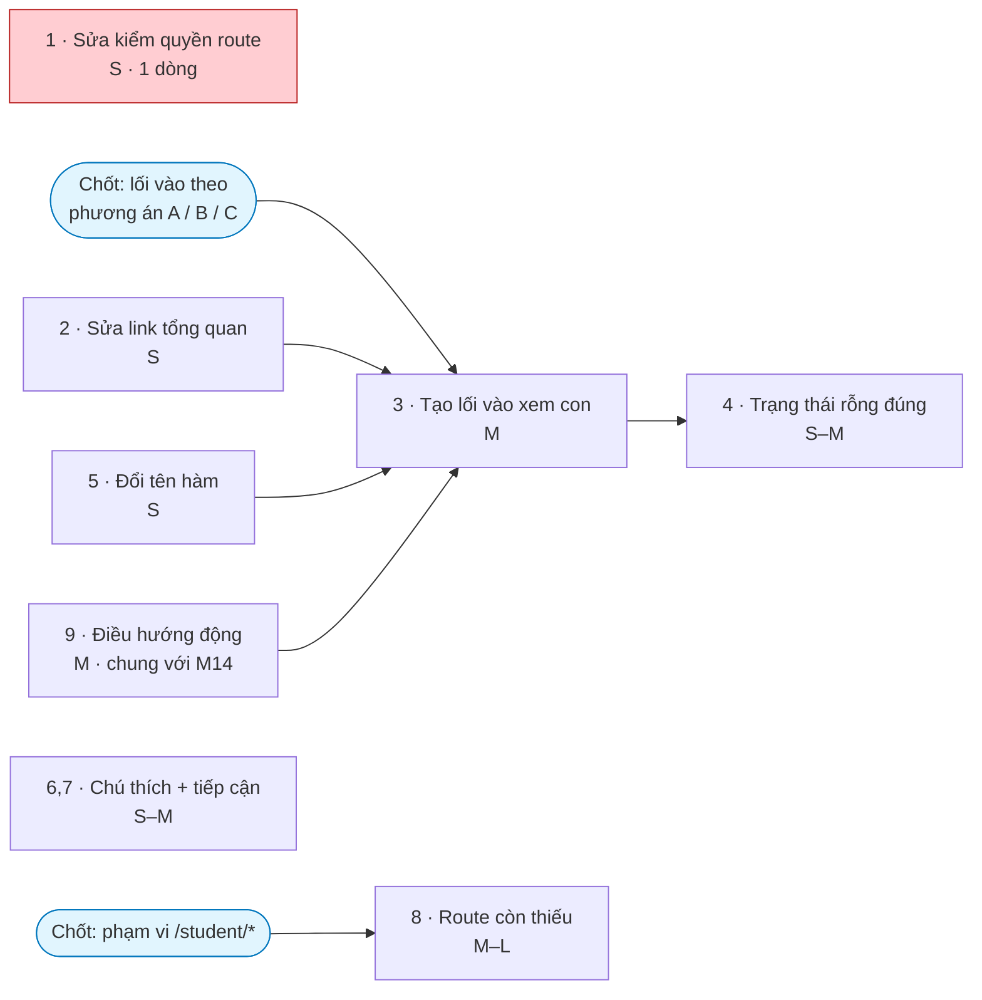

# M13 — CỔNG PHỤ HUYNH & THIẾU NHI · Ảnh hưởng triển khai

> Ước lượng: **S** ≤ nửa ngày · **M** 1–2 ngày · **L** 3–5 ngày (một agent, gồm cả test).

---

## 1. Bảng tổng hợp

| # | Hạng mục | Cỡ | Migration | Đụng RLS | Rủi ro |
|---|---|---|---|---|---|
| 1 | **Sửa `/student/attendance` dùng đúng hàm kiểm quyền route** | **S** (1 dòng) | ❌ | ❌ | **Rất thấp** |
| 2 | **Sửa link bảng tổng quan trỏ vào route nhân sự** | **S** | ❌ | ❌ | Rất thấp |
| 3 | **Tạo lối vào cho trang xem con** | **M** | ❌ | ❌ | Thấp |
| 4 | Sửa trạng thái rỗng nói đúng nguyên nhân | **S–M** | ❌ | ❌ | Rất thấp |
| 5 | Đổi tên/tách hàm `getPortalChildren()` cho đúng ngữ nghĩa | **S** | ❌ | ❌ | Thấp |
| 6 | Chú thích cách tính trung bình cho phụ huynh | **S** | ❌ | ❌ | Rất thấp |
| 7 | Cải thiện tiếp cận: chú thích bảng, vai trò thông báo, cỡ chữ | **S–M** | ❌ | ❌ | Rất thấp |
| 8 | Bổ sung các route `/student/*` còn thiếu so với đặc tả | **M–L** | ❌ | ❌ | Thấp — **chờ chốt phạm vi** |
| 9 | Xử lý hạn chế "điều hướng chỉ hỗ trợ đường dẫn tĩnh" | **M** | ❌ | ❌ | Trung bình (chạm M14) |

**Tổng ước lượng module: 5–9 ngày-người.**
**Điểm đáng chú ý: KHÔNG hạng mục nào cần migration hay đụng RLS.** Toàn bộ vấn đề của module nằm ở
tầng giao diện và điều hướng — tầng bảo mật đã đúng và không cần sửa.

---

## 2. Hạng mục 1 — sửa lỗ hổng phòng thủ theo chiều sâu

### File phải sửa
| File | Thay đổi |
|---|---|
| `src/features/portal/server/queries.ts:174` | Đổi `requireAuthContext("/student/attendance")` → `requireRouteAccess("/student/attendance")` |

Một dòng. Cùng file đã có mẫu đúng ở `:161` (trang phụ huynh) — chỉ cần làm nhất quán.

### Vì sao phải làm dù RLS đã chặn rò dữ liệu
1. Quy tắc `{ path: "/student", roles: ["student"] }` (`route-map.ts:37`) hiện là **lời hứa không được giữ**.
2. **Sai nghiệp vụ rõ ràng dù không sai quyền:** Xứ đoàn trưởng mở đường dẫn này sẽ thấy hồ sơ điểm danh
   của **một em bất kỳ** dưới tiêu đề "Điểm danh của em".
3. **Tạo tiền lệ nguy hiểm:** mọi trang thêm vào `/student/*` sau này mà tin vào `route-map` đều sẽ hở.
4. **Làm sai lệch mọi bài kiểm thử leo thang quyền** dựa trên `route-map`.

### Đề xuất kèm theo — chống tái phát
Thêm một bài kiểm thử duyệt **toàn bộ** `src/app/(dashboard)/**/page.tsx` và đối chiếu với `ROUTE_RULES`:
mọi trang có quy tắc khai báo `roles` phải đi qua `requireRouteAccess`. Đây là cách duy nhất biến hàng rào
**từ quy ước thành cấu trúc** — chính là nguyên nhân gốc rễ đã rút ra ở 5 Whys (§5.2 của `03_AUDIT_RESULTS.md`).

## 3. Hạng mục 3 — tạo lối vào (cần user chốt hình thức)

### Ba phương án

| | Phương án A — Trang danh sách con | Phương án B — Mục nav thông minh | Phương án C — Gộp vào bảng tổng quan |
|---|---|---|---|
| **Cách làm** | Thêm `/parent/children/page.tsx` liệt kê các con; thêm mục "Con của tôi" vào nav trỏ tới đó | Nav trỏ `/parent/children`; nếu chỉ có 1 con thì chuyển thẳng tới trang con đó | Bảng tổng quan của phụ huynh hiện thẻ mỗi con, bấm vào là mở |
| **Số bước (1 con)** | 3 | **2** | **2** |
| **Số bước (nhiều con)** | 3 | 3 | 3 |
| **File mới** | 1 route + 1 mục nav | 1 route + 1 mục nav | 0 route mới |
| **Ưu** | Rõ ràng, nhất quán, dễ mở rộng | Ít bước nhất cho đa số phụ huynh | Không thêm điều hướng |
| **Nhược** | Phụ huynh 1 con phải qua một màn hình thừa | Hành vi khác nhau tùy số con — khó giải thích | Bảng tổng quan đang dùng chung với nhân sự, dễ rối |

**Khuyến nghị: B** — đa số phụ huynh có 1–2 con, và B giữ được sự nhất quán của A trong khi bỏ được
màn hình thừa cho trường hợp phổ biến nhất. **Nhưng cần user chốt** (xem `08_ACCEPTANCE_CRITERIA.md`).

### File phải sửa (theo phương án B)
| File | Thay đổi |
|---|---|
| `src/app/(dashboard)/parent/children/page.tsx` | **Mới** — liệt kê con; nếu đúng 1 con thì chuyển hướng thẳng |
| `src/config/navigation.ts:41-57` | Thêm mục "Con của tôi" cho nhóm phụ huynh |
| `src/config/navigation.ts:84-90` | Đưa vào thanh dưới — **lưu ý thanh dưới cắt còn 5 mục**, phải quyết định bỏ mục nào |
| `src/features/dashboard/components/dashboard-overview.tsx:63` | Sửa link (hạng mục 2) |

⚠️ **Ràng buộc phải giải quyết:** thanh dưới của phụ huynh đang đủ 5 mục (Trang chủ · Xin nghỉ · Kết quả ·
Thông báo · Tài khoản) và bị cắt ở 5. Thêm "Con của tôi" buộc phải bỏ một mục. Đây là quyết định
sản phẩm, không phải kỹ thuật.

## 4. Ảnh hưởng cơ sở dữ liệu và RLS

**Không hạng mục nào cần migration. Không hạng mục nào đụng RLS.**

Đây là kết luận quan trọng: tầng bảo mật của portal (lọc hai tầng, 404 thay vì 403, tên chụp lại cho Top 5)
đã đúng và có kiểm thử bảo vệ. Mọi công việc còn lại nằm ở giao diện.

**Nguyên tắc bắt buộc khi làm hạng mục 3:** trang danh sách con mới **phải** dùng đúng `own_student_ids()`
qua RLS, tuyệt đối không dùng quyền quản trị để lấy danh sách "cho tiện".

## 5. Ảnh hưởng dữ liệu hiện có

Không hạng mục nào ảnh hưởng dữ liệu. Portal thuần đọc.

Một lưu ý vận hành: sau hạng mục 4, những tài khoản phụ huynh **chưa được liên kết hồ sơ giám hộ** sẽ
bắt đầu thấy thông điệp đúng ("tài khoản chưa nối với con, liên hệ …"). Điều này có thể làm lộ ra
**số lượng tài khoản đang ở trạng thái chưa liên kết** mà trước nay không ai biết. Nên rà trước:
`profiles` có vai trò `guardian` nhưng `guardians.profile_id` chưa trỏ tới.

## 6. Test phải thêm

| Loại | Nội dung | Gắn với | Vì sao bắt buộc |
|---|---|---|---|
| **E2E** | 🔴 Phụ huynh đăng nhập → **từ màn hình đăng nhập** bấm tới được trang điểm danh của con | HM 3 | Đây là dạng test còn thiếu hoàn toàn: kiểm **hành trình**, không kiểm đường dẫn. Chính khoảng trống này để lọt lỗi CRITICAL |
| **E2E** | Phụ huynh nhiều con: chuyển đổi được giữa các con | HM 3 | Chưa có |
| **E2E** | Vai trò **không phải** thiếu nhi mở `/student/attendance` → bị chặn | HM 1 | Chưa có; hiện đang vào được |
| **E2E** | Phụ huynh mở `/parent/children/<mã em không phải con mình>` → 404, không lộ tên | hồi quy | Chưa có E2E dù pgTAP đã phủ RLS |
| **E2E** | Tài khoản phụ huynh chưa liên kết → thấy thông điệp đúng nguyên nhân | HM 4 | Chưa có |
| **Unit/kiến trúc** | Duyệt mọi `page.tsx` trong `(dashboard)`, đối chiếu `ROUTE_RULES`: trang có khai `roles` phải gọi `requireRouteAccess` | HM 1 | **Chống tái phát ở mức cấu trúc** |
| pgTAP | *(giữ nguyên)* | — | `012/016/018` đã phủ tốt phần RLS |

## 7. Thứ tự phụ thuộc

**Luật thứ tự:**
1. **Hạng mục 1 và 2 làm ngay** — mỗi cái vài phút, không phụ thuộc gì, gỡ lỗi thật.
2. **Hạng mục 5 trước 3** — sửa ngữ nghĩa hàm trước khi xây thêm màn hình dựa trên nó, tránh nhân rộng
   cách dùng sai.
3. **Hạng mục 3 bị chặn** cho tới khi user chốt phương án lối vào và chốt bỏ mục nào khỏi thanh dưới.
4. **Hạng mục 8 bị chặn** cho tới khi user chốt phạm vi các route thiếu nhi.
5. **Hạng mục 9 nên làm cùng M14**, không làm riêng.

## 8. Ảnh hưởng sang module khác

| Module | Ảnh hưởng | Mức |
|---|---|---|
| M14 Vỏ ứng dụng | Hạng mục 3 và 9 đụng `navigation.ts` và thanh dưới — **phải làm phối hợp**; hạn chế "chỉ hỗ trợ đường dẫn tĩnh" là vấn đề chung | **Bắt buộc phối hợp** |
| M11 Bảng tổng quan | Hạng mục 2 sửa link trong `dashboard-overview.tsx` | Cần phối hợp |
| M07 Bảng điểm | Hạng mục 6 (chú thích cách tính trung bình) là mặt kia của TB-M07-07 — **cùng một việc, làm một lần** | **Bắt buộc phối hợp** |
| M05 Điểm danh | Câu hỏi "phụ huynh có được đọc ghi chú điểm danh không" thuộc cả hai module | Cần chốt chung |
| M03 Thiếu nhi & Phụ huynh | Đổi người giám hộ làm đổi ngay danh sách con phụ huynh nhìn thấy | ⚠️ nhạy cảm |
| M10 Thông báo | Phụ huynh/thiếu nhi **không** bị ảnh hưởng bởi lỗi badge của M10 (họ không có quyền đọc toàn cục) | ✅ an toàn |
