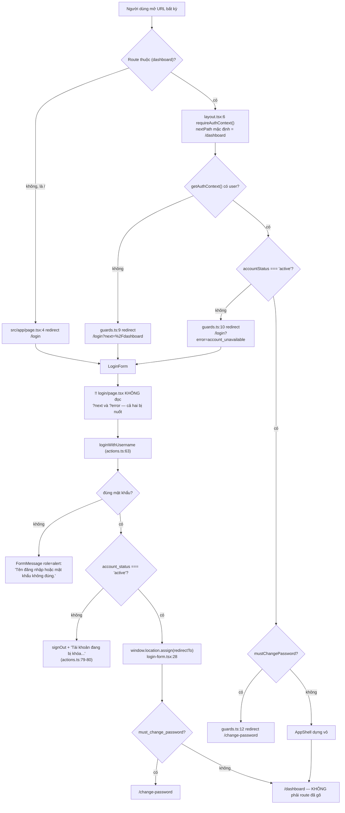
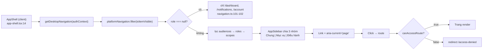
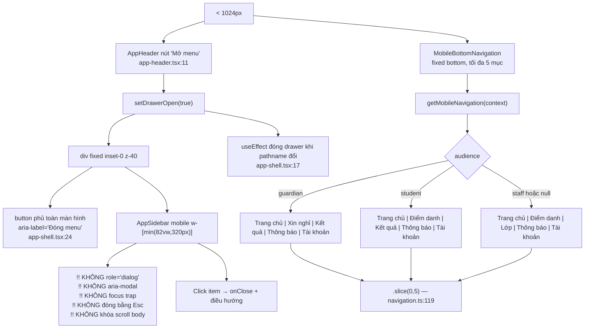
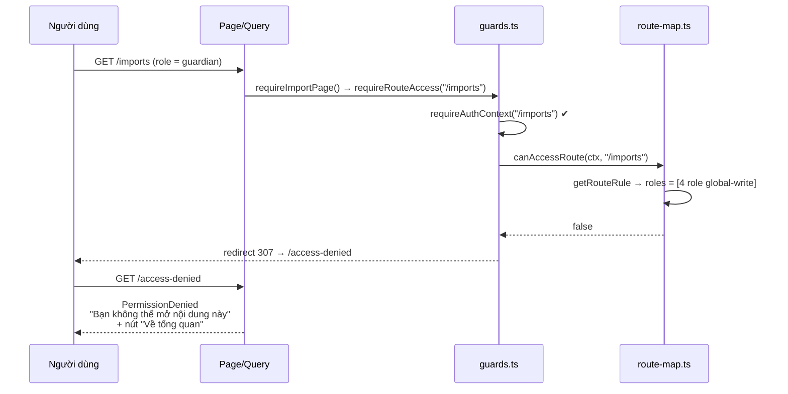
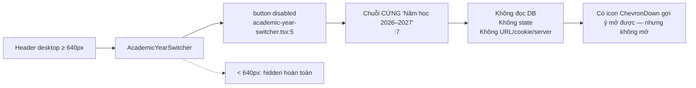
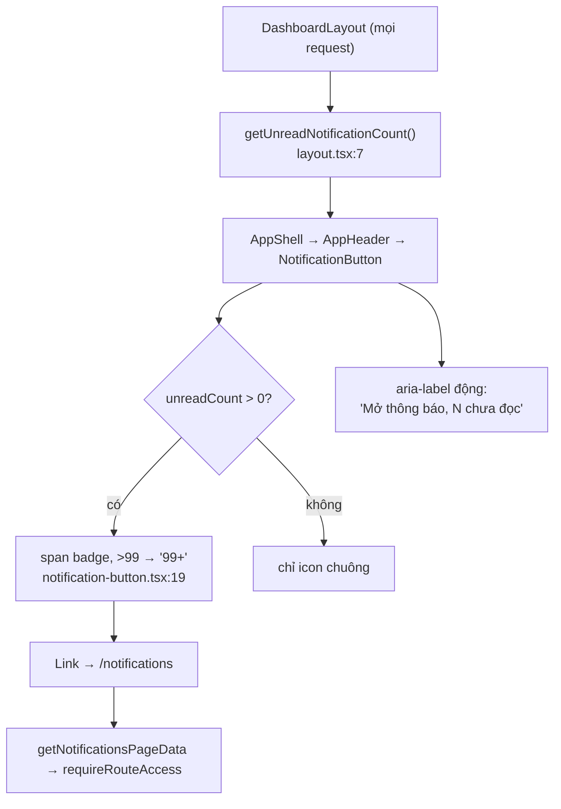
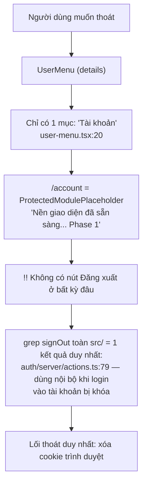
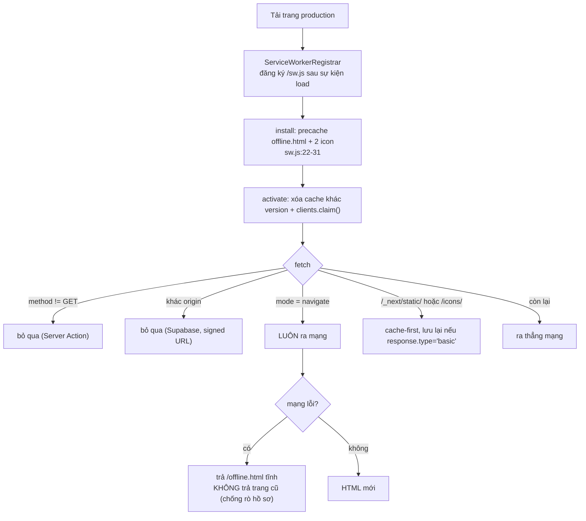

# M14-NAVIGATION-SHELL — Luồng AS-IS

> Mô tả **đúng những gì code đang làm**, không phải những gì tài liệu mong muốn.

## Danh mục luồng

| ID | Tên luồng | Điểm vào | Điểm ra |
|---|---|---|---|
| `M14-NAVIGATION-SHELL-F01` | Đăng nhập → vào ứng dụng | `/` hoặc deep-link | `/dashboard` hoặc `/change-password` |
| `M14-NAVIGATION-SHELL-F02` | Điều hướng desktop (sidebar ≥ 1024px) | `/dashboard` | route bất kỳ |
| `M14-NAVIGATION-SHELL-F03` | Điều hướng mobile (bottom nav + drawer) | `/dashboard` | route bất kỳ |
| `M14-NAVIGATION-SHELL-F04` | Truy cập bị từ chối | URL ngoài quyền | `/access-denied` |
| `M14-NAVIGATION-SHELL-F05` | Đổi năm học | header desktop | **không có điểm ra** |
| `M14-NAVIGATION-SHELL-F06` | Thông báo và badge chưa đọc | header | `/notifications` |
| `M14-NAVIGATION-SHELL-F07` | Đăng xuất | — | **không tồn tại** |
| `M14-NAVIGATION-SHELL-F08` | Ngoại tuyến / PWA | mất mạng | `/offline.html` |

---

## F01 — Đăng nhập → vào ứng dụng

### Mermaid

### Bước AS-IS

1. `/` → `redirect("/login")` (`src/app/page.tsx:4`).
2. Deep-link `(dashboard)` khi chưa đăng nhập → `/login?next=%2Fdashboard` **bất kể** route gõ vào, vì
   layout chạy trước page và gọi `requireAuthContext()` không tham số (`src/app/(dashboard)/layout.tsx:6`).
3. `LoginForm` submit qua Server Action, nhận `{ redirectTo }` rồi `window.location.assign`
   (`src/features/auth/components/login-form.tsx:23-28`).
4. **Tham số `next` và `error` không được đọc ở bất kỳ đâu.** Người dùng luôn về `/dashboard`.
5. Tài khoản `locked`/`disabled` đang có phiên hợp lệ → `guards.ts:10` đá về `/login?error=...`, nhưng
   trang login hiện ra **sạch trơn, không một dòng giải thích**. Nếu người dùng nhập lại đúng mật khẩu,
   `loginWithUsername` mới báo "Tài khoản đang bị khóa hoặc đã vô hiệu hóa"
   (`src/features/auth/server/actions.ts:80`) — tức là phải đoán và thử lại mới biết lý do.

---

## F02 — Điều hướng desktop

Đặc điểm AS-IS:

- Sidebar `fixed inset-y-0 w-[264px]`, chỉ hiện `lg:` trở lên (`app-sidebar.tsx:21-23`); content bù
  `lg:pl-[264px]` (`app-shell.tsx:30`).
- Tối đa **15 mục** trong 3 nhóm. `Tài khoản` **không** nằm trong sidebar — chỉ trong `UserMenu`
  (`user-menu.tsx:20`) và bottom nav.
- Footer sidebar in cố định *"Bản nền giao diện / Phân quyền route hoàn thiện ở P0-T3"*
  (`app-sidebar.tsx:72-75`) — văn bản của giai đoạn dựng khung, vẫn còn ở bản production.
- `role = null` vẫn vào được `/dashboard` vì rule `:22` không giới hạn role
  (`route-map.ts:22` + `:61` `if (!rule.roles) return true`).

---

## F03 — Điều hướng mobile

Đặc điểm AS-IS:

- `classStaffMobileNavigation` là **preset duy nhất cho cả 12 role staff** — thiết kế cho GLV lớp,
  dùng luôn cho Super Admin, Xứ đoàn trưởng, Trưởng ngành, Thủ quỹ, Cha sở.
- Mục cuối luôn là `/account`, hiện là **trang placeholder** (`account/page.tsx:4`).
- `.slice(0, 5)` không bao giờ thực sự cắt: cả ba preset chỉ có đúng 5 phần tử. Việc "mất mục" đến từ
  **preset chọn sai mục**, không từ `slice`.

---

## F04 — Truy cập bị từ chối

- Được `tests/e2e/authenticated-shell.spec.ts:105-112` bảo vệ cho 4 route với tài khoản phụ huynh.
- Trang không nói **vai trò hiện tại là gì** và **cần vai trò nào**, chỉ khuyên "liên hệ người quản trị"
  (`permission-denied.tsx:12`).
- `AppHeader` trên trang này in tiêu đề `"Thiếu Nhi Chợ Quán"` vì `getPageTitle("/access-denied")` không
  khớp mục nav nào (`navigation.ts:127`).

---

## F05 — Đổi năm học

- Không có bất kỳ nơi nào lưu "năm học đang chọn". Mọi query tự đọc
  `academic_years where status = 'current'` (ví dụ `src/features/dashboard/server/queries.ts:19-23`).
- Nhãn hiển thị là **hằng số trong code**, không đồng bộ với `academic_years.status='current'` của DB.
- `aria-label="Năm học hiện tại, dữ liệu mẫu"` (`:5`) thừa nhận đây là dữ liệu mẫu — nhưng người dùng
  cuối chỉ nghe được nếu dùng screen reader.

---

## F06 — Thông báo và badge

- Badge dùng số thật (`notification_recipients`), không phải số giả.
- Đếm chạy ở layout ⇒ **mỗi lần điều hướng đều query lại**, không cache, không `<Suspense>` — làm chậm
  cả những trang không liên quan.
- Sau khi đánh dấu đã đọc ở `/notifications`, badge chỉ đổi khi layout render lại; không có `aria-live`
  nên screen reader không được báo.

---

## F07 — Đăng xuất

**Luồng này không tồn tại trong sản phẩm.** Trên máy dùng chung ở phòng học — đúng bối cảnh mà
`public/sw.js:4-7` viện dẫn để từ chối cache HTML — người dùng không có cách nào kết thúc phiên.

---

## F08 — Ngoại tuyến / PWA

- `/offline.html` nói thẳng: không có chế độ làm việc ngoại tuyến, thao tác chưa gửi sẽ mất
  (`public/offline.html:66-69`). Đây là quyết định cố ý (D-29..D-33).
- Manifest `start_url: "/login"` (`src/app/manifest.ts:12`) → mở app đã cài luôn bắt đầu ở `/login`, và
  nếu đã có phiên thì `/login` **không** tự chuyển sang `/dashboard` (login page không kiểm phiên).
- Không có prompt cài đặt (`beforeinstallprompt`): grep toàn `src/` không có. Người dùng phải tự dùng
  menu "Thêm vào màn hình chính" của trình duyệt.
