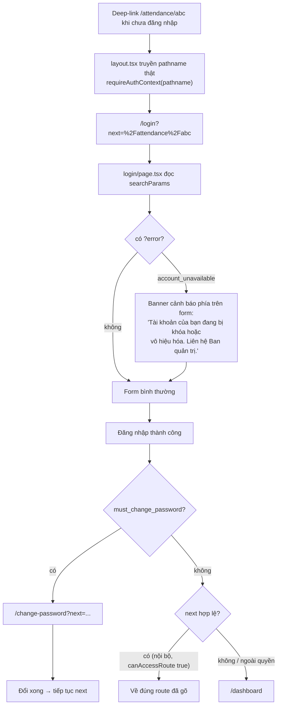
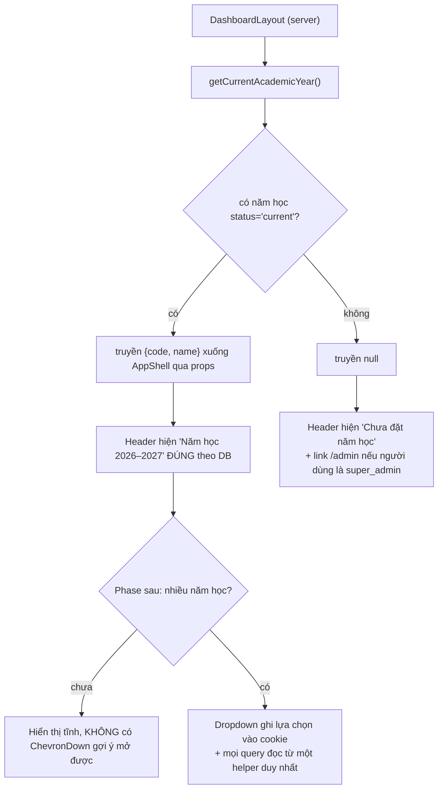
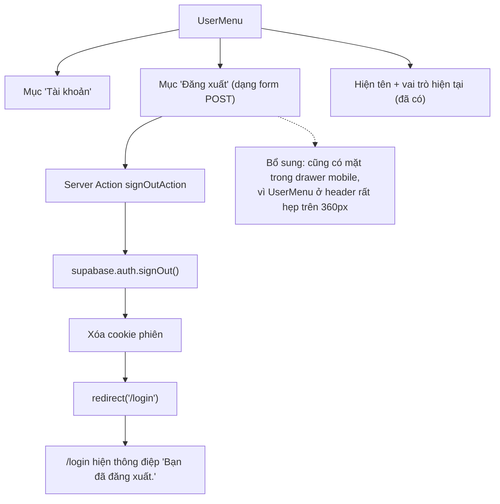

# M14-NAVIGATION-SHELL — Luồng TO-BE

> Chỉ viết TO-BE cho luồng **không** đạt `PASS`. Luồng đã tốt giữ nguyên.
> Đây là đặc tả hành vi, **không** phải đề xuất đổi design system.

## Nguyên tắc giữ nguyên (không được đụng)

| Hạng mục | Lý do | Nguồn |
|---|---|---|
| `Button size="sm"` cao 44px | `sm` là nút **hẹp ngang**, không phải nút thấp; đã có E2E quét 15 route × 3 viewport | `button.tsx:5-8`, `WORKLOG.md` dòng 77–79 |
| `sw.js` không cache HTML | Máy phòng học dùng chung; cache trang roster là rò hồ sơ thiếu nhi | `public/sw.js:4-7`, `WORKLOG.md` dòng 70–74 |
| `/offline.html` nói thẳng "không làm việc ngoại tuyến" | D-29..D-33 | `public/offline.html:64-69` |
| Ô tick đo vùng bấm theo `<label>` bao quanh | Ô tick gốc luôn 16–20px | `WORKLOG.md` dòng 81–83 |
| Middleware chỉ refresh token, không authorize | `docs/04` §3 | `src/lib/supabase/middleware.ts:8-11` |
| `/parent` và `/teaching-plan`, `/results` không giới hạn `roles` | Một GLV vẫn có thể là phụ huynh (D-25); RLS lọc dữ liệu | `route-map.ts:33-36` |
| `notFound()` thay vì "không có quyền" ở `/parent/children/[id]` | Không lộ sự tồn tại của hồ sơ | `parent/children/[studentId]/page.tsx:15-17` |

---

## F01 TO-BE — Đăng nhập → vào ứng dụng

### Yêu cầu TO-BE

1. `src/app/(dashboard)/layout.tsx` truyền pathname thật vào `requireAuthContext(...)` để `next` mang
   đúng đích đến (lấy pathname từ `headers()` hoặc từ page-level guard chạy trước).
2. `/login` đọc `searchParams` và render:
   - `error=account_unavailable` → banner cảnh báo, `role="alert"`.
   - `error` khác → thông điệp chung, không lộ chi tiết kỹ thuật.
3. Sau khi đăng nhập thành công, redirect tới `next` **chỉ khi** `next` bắt đầu bằng `/`, không chứa
   `//` hoặc `\`, và `canAccessRoute(context, next) === true`; ngược lại về `/dashboard`.
4. `/change-password` giữ `next` qua bước đổi mật khẩu.
5. Tập mã lỗi cho `?error=` khai báo tập trung, cùng chỗ với `APP_ERROR_CODES` để không tái diễn tình
   trạng "phát tín hiệu mà không ai nhận".

### Tiêu chí chấp nhận rút gọn

- Chưa đăng nhập, mở `/reports?type=weekly` → đăng nhập xong về đúng `/reports?type=weekly`.
- Tài khoản `locked` có cookie hợp lệ → thấy banner giải thích ngay ở lần bị đá về đầu tiên.
- `next=https://evil.example` hoặc `next=//evil.example` → về `/dashboard`.

---

## F03 TO-BE — Điều hướng mobile

```mermaid
flowchart TD
    A["Chạm nút Mở menu"] --> B["Drawer mở"]
    B --> C["role='dialog' aria-modal='true'<br/>aria-label='Điều hướng chính'"]
    B --> D["Focus chuyển vào nút Đóng trong drawer"]
    B --> E["Tab quay vòng trong drawer (focus trap)"]
    B --> F["Esc đóng drawer, focus trả về nút hamburger"]
    B --> G["body khóa cuộn khi drawer mở"]
    B --> H["Lớp phủ là div + onClick, KHÔNG phải button trong tab order"]
    I["Bottom nav"] --> J{"role"}
    J -- "super_admin" --> K["Trang chủ | Điểm danh | Lớp | Quản trị | Tài khoản"]
    J -- "global staff" --> L["Trang chủ | Thiếu nhi | Điểm danh | Báo cáo | Tài khoản"]
    J -- "sector staff" --> M["Trang chủ | Điểm danh | Lên lớp | Thông báo | Tài khoản"]
    J -- "class staff" --> N["Trang chủ | Điểm danh | Lớp | Thông báo | Tài khoản (giữ nguyên)"]
    J -- "chỉ đọc (cha sở/cha phó/thủ quỹ)" --> O["Trang chủ | Thiếu nhi | Kết quả | Báo cáo | Tài khoản"]
    J -- "guardian" --> P["Trang chủ | Con của tôi | Xin nghỉ | Kết quả | Tài khoản"]
    J -- "student" --> Q["Trang chủ | Điểm danh | Kết quả | Thông báo | Tài khoản"]
```

### Yêu cầu TO-BE

1. Drawer đạt đủ 5 điều kiện của một dialog: `role`/`aria-modal`, focus vào trong khi mở, focus trap,
   `Escape` đóng, trả focus về nút kích hoạt. `docs/06` §16 đã yêu cầu.
2. Preset bottom nav tách theo `scopeKind` (`global`/`sector`/`class`) thay vì một preset chung cho toàn
   bộ staff, cộng một preset cho nhóm chỉ đọc (Cha sở, Cha phó, Thủ quỹ).
3. **Không mục nào trong bottom nav được dẫn tới route mà `canAccessRoute` trả `false`** — kiểm bằng
   unit test chạy qua toàn bộ 14 role.
4. Tab thứ 5: giữ `Tài khoản` **sau khi** `/account` có nội dung thật (xem F07); trước đó thay bằng
   `Thông báo`.
5. Nhãn ≥ 12px (thoả hiệp với chiều rộng 360px chia 5 cột) hoặc chuyển sang 2 dòng — không dùng 11px.

---

## F05 TO-BE — Năm học hiển thị trong header

### Yêu cầu TO-BE (giai đoạn hiện tại — mức tối thiểu)

1. Nhãn năm học lấy từ DB, không hardcode.
2. Khi chưa có năm học hiện hành: nói rõ "Chưa đặt năm học", không im lặng hiển thị một năm bịa.
3. Bỏ `ChevronDown` khi chưa đổi được — icon mũi tên là lời hứa suông (`docs/06` §16: "Không chỉ dùng
   màu/hình để biểu thị trạng thái", và một control `disabled` trông như dropdown là chỉ dẫn sai).
4. Hiện cả ở mobile (hiện đang `hidden sm:flex`) — ít nhất dưới dạng dòng phụ trong header.

### Ghi chú cho phase sau (khi thật sự cần đổi năm học)

Nếu quyết định cho phép chọn năm học khác năm hiện hành, phải chốt **một** nơi lưu trạng thái. Đề xuất:
cookie server-readable, để mọi Server Component đọc được cùng giá trị mà không cần truyền qua URL từng
trang. Tuyệt đối không để mỗi trang tự đọc `status='current'` như hiện nay **và đồng thời** có bộ chọn ở
header — hai nguồn sự thật sẽ lệch nhau.

---

## F07 TO-BE — Đăng xuất

### Yêu cầu TO-BE

1. Có `signOutAction` là Server Action (`"use server"`), gọi `supabase.auth.signOut()` rồi
   `redirect("/login")`. Dùng `<form action={...}>` chứ không phải link GET — đăng xuất là thao tác thay
   đổi trạng thái.
2. Nút "Đăng xuất" xuất hiện ở: `UserMenu` (desktop + mobile) **và** cuối drawer mobile.
3. Trang `/login` sau khi đăng xuất hiển thị xác nhận ngắn.
4. `/account` (khi làm thật ở phase tương ứng) cũng có nút đăng xuất, nhưng đăng xuất **không được** phụ
   thuộc vào `/account` hoàn thành.
5. Cân nhắc "Đăng xuất khỏi mọi thiết bị" (`signOut({ scope: 'global' })`) cho máy dùng chung — xem
   `05_BUSINESS_RULES.md` §BR-14.

---

## F02 / F04 / F06 / F08 — sửa nhỏ, không đổi luồng

Bốn luồng này giữ nguyên hình dạng; chỉ áp các sửa nhỏ đã liệt kê ở
`06_UI_UX_RECOMMENDATIONS.md`:

| Luồng | Sửa |
|---|---|
| F02 | Gỡ text tạm ở footer sidebar; thêm `roles` cho mục `Điểm danh`; thêm `Tài khoản` vào sidebar |
| F04 | Nâng tương phản chữ cảnh báo; nói rõ vai trò hiện tại; sửa `getPageTitle` cho `/access-denied` |
| F06 | `aria-live="polite"` cho badge; cân nhắc `<Suspense>` cho phần đếm |
| F08 | Thêm link "Về trang đăng nhập" trong `/offline.html`; cân nhắc prompt cài đặt |
