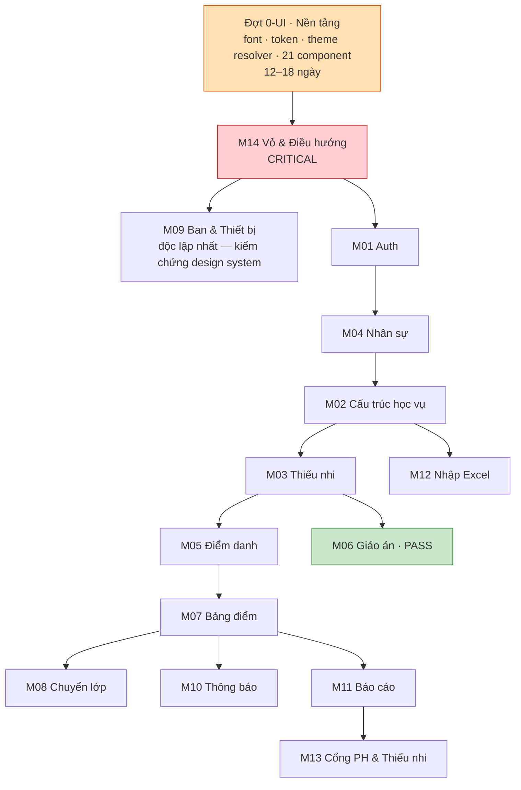

# 06 — Kế hoạch UI/UX theo từng module

> **Quy tắc xử lý theo trạng thái Giai đoạn 1** (chủ dự án đã nêu):
> `PASS` → giữ nghiệp vụ, **vẫn đồng bộ giao diện** · `PASS_WITH_MINOR_UI_FIX` → giữ nghiệp vụ, sửa UI ·
> `NEEDS_IMPROVEMENT` → **sửa nghiệp vụ trước**, rồi thiết kế lại UI · `CRITICAL` → **nghiệp vụ/dữ liệu/quyền/bảo mật trước**.
>
> Thứ tự dựa trên đồ thị phụ thuộc (`01_SYSTEM_MODULE_MAP.md` §5) và kế hoạch 6 đợt (`05_REDESIGN_PRIORITY_PLAN.md`).
> **Không module nào được redesign trước khi nền tảng ở Đợt 0-UI xong.**

---

## 0. Đợt 0-UI — Nền tảng (phải xong trước mọi module)

| # | Việc | Cỡ | Chặn cái gì |
|---|---|---|---|
| 0.1 | Tải font Be Vietnam Pro bằng `next/font` | **S** | Mọi thứ |
| 0.2 | Viết lại bộ token: màu đạt AA · typography · spacing · radius · shadow · z-index · motion | **M** | Mọi thứ |
| 0.3 | `sector-palette.ts` + unit test canh với `seed.sql` + test tương phản 6 bộ | **S** | Theme |
| 0.4 | `resolveThemeContext()` + `ThemeScope` + 25 unit test | **L** | Theme |
| 0.5 | Sửa 7 component hiện có sang token mới (§3.1 của `05`) | **M** | Mọi module |
| 0.6 | Làm 8 component ưu tiên: `Select`, `Dialog`, `ConfirmDialog`, `Skeleton`, `Alert`, `Textarea`, `BranchChip`, `EmptyState` (3 variant) | **L** | Mọi module |
| 0.7 | Sửa a11y vỏ: drawer thành dialog · skip link · thứ bậc heading · breadcrumb | **M** | M14 |
| 0.8 | 13 component còn lại (`SearchInput`, `Pagination`, `FilterBar`, `DataTable`, `Tabs`, `Dropdown`, `Toast`, `Tooltip`, `Avatar`, `Progress`, `FileUpload`, `SegmentedControl`, `Chart`) | **L** | M03, M05, M07, M11, M12 |

**Ước lượng Đợt 0-UI: 12–18 ngày.** Đây là chi phí **một lần**, không nhân theo module.

---

## 1. Bảng tổng hợp 14 module

| Thứ tự | Module | Trạng thái GĐ1 | Nghiệp vụ | Giao diện | Đợt nghiệp vụ | Cỡ UI |
|--:|---|---|---|---|---|:--:|
| 1 | **M14** Vỏ & Điều hướng | `CRITICAL` | **Sửa** (đăng xuất, bộ chọn năm học) | **Redesign** | Đợt 1 + 2 | **L** |
| 2 | **M09** Ban & Thiết bị | `PASS_WITH_MINOR_UI_FIX` (1 CRITICAL) | Sửa F11, F16, D-76, D-78 | Tinh chỉnh | Đợt 3 + 4 | **M** |
| 3 | **M01** Auth & Tài khoản | `CRITICAL` (4) | **Sửa nhiều** | **Redesign** | Đợt 1 + 2 | **L** |
| 4 | **M04** Nhân sự | `CRITICAL` (5) | **Sửa nhiều** | **Redesign** | Đợt 2 | **L** |
| 5 | **M02** Cấu trúc học vụ | `CRITICAL` (2) | **Sửa** (sinh lớp, đóng năm, D-71, D-73) | Tinh chỉnh | Đợt 1 + 4 | **M** |
| 6 | **M03** Thiếu nhi & Phụ huynh | `CRITICAL` (2) | **Sửa nhiều** (D-63, D-67, D-70) | **Redesign** | Đợt 2 + 3 | **L** |
| 7 | **M12** Nhập Excel | `CRITICAL` (3) | **Sửa nhiều** | **Redesign** | Đợt 3 | **L** |
| 8 | **M05** Điểm danh | `NEEDS_IMPROVEMENT` | Sửa (giờ VN, đơn xin nghỉ, D-75) | **Redesign** | Đợt 1 + 4 | **L** |
| 9 | **M06** Giáo án | **`PASS_WITH_MINOR_UI_FIX`** | **Giữ nguyên** | Tinh chỉnh | — | **S** |
| 10 | **M07** Bảng điểm | `NEEDS_IMPROVEMENT` | Sửa (D-74, ẩn cột, Top 5) | Tinh chỉnh | Đợt 4 | **M** |
| 11 | **M08** Chuyển lớp | `NEEDS_IMPROVEMENT` (1 CRITICAL) | Sửa (truy vấn lặp, CM-04) | Tinh chỉnh | Đợt 4 | **M** |
| 12 | **M10** Thông báo | `CRITICAL` (2) | **Sửa** (lọc hộp thư, D-77) | Tinh chỉnh | Đợt 1 + 4 | **M** |
| 13 | **M11** Báo cáo & Dashboard | `NEEDS_IMPROVEMENT` | Sửa (D-66, link sai) | **Redesign** | Đợt 1 + 4 | **L** |
| 14 | **M13** Cổng PH & Thiếu nhi | `CRITICAL` (3) | **Sửa** (D-64, D-70, D-75) | **Redesign** | Đợt 4 | **L** |

---

## 2. Chi tiết từng module

> Mỗi mục: nghiệp vụ · giao diện · thành phần dùng chung · thành phần riêng · theme · màn hình ảnh hưởng ·
> responsive · accessibility · tiêu chí nghiệm thu UI/UX.

---

### M14 — Vỏ ứng dụng & Điều hướng · `CRITICAL` · thứ tự **1**

**Nghiệp vụ — SỬA:** F07 Đăng xuất (`CRITICAL`, hiện **không tồn tại**) · F05 bộ chọn năm học (nút chết) ·
`/student/attendance` phải dùng `requireRouteAccess` (`CRITICAL`, an ninh) · D-68 mở `/attendance` cho Cha sở/Cha phó/Thủ quỹ.

**Giao diện — REDESIGN.**

| Hạng mục | Nội dung |
|---|---|
| Dùng chung | `ThemeScope`, `Breadcrumb`, `Dialog`, `Dropdown`, `Alert`, `Avatar`, `AcademicYearSwitcher`, `ContextIndicator`, `UnassignedBanner` |
| Riêng | `AppSidebar`, `AppHeader`, `MobileBottomNavigation`, `SkipLink` |
| Theme | **Nơi bơm theme duy nhất.** Dải 4px dưới header · thanh dọc mục sidebar đang chọn |
| Màn hình ảnh hưởng | **Toàn bộ** |

**Việc cụ thể:**
1. 🔴 Bỏ chữ tạm *"Bản nền giao diện · P0-T3"*; thay bằng khối tài khoản + **nút Đăng xuất**.
2. 🔴 `AcademicYearSwitcher`: nhận năm học thật từ layout server; hiện cả trên **mobile**; bỏ `ChevronDown` khi chưa đổi được; bỏ chữ *"dữ liệu mẫu"* khỏi `aria-label`.
3. Breadcrumb thật 3 cấp (`Tổng quan / Thiếu nhi / Nguyễn Văn A`), cấp giữa là link, **hiện cả trên mobile**.
4. Đổi tên nhóm sidebar sang ngôn ngữ công việc: `Hằng ngày` · `Hồ sơ` · `Quản lý`. Ẩn tiêu đề nhóm khi ≤5 mục.
5. Rút nhãn: `Huynh trưởng/Giáo lý viên` → `Giáo lý viên`; `Ban` → `Ban chuyên môn`; `Lên lớp/chuyển lớp` → `Lên lớp`.
6. **Tách preset bottom nav theo `scopeKind`** — hiện 12 role staff dùng chung một preset thiết kế cho GLV lớp.
7. `ContextIndicator` đầu sidebar: *"Đang xem: **Ngành Ấu Nhi** · Năm học 2026–2027"*.
8. Drawer thành dialog thật (5 yêu cầu a11y).

**Responsive:** sidebar ẩn <1024px → drawer · bottom nav ≤5 mục · breadcrumb rút thành nút "←" trên mobile · không tràn ngang ở 360px.

**Accessibility:** skip link · focus trap drawer · `Escape` đóng · `aria-live` cho badge chưa đọc · nhãn bottom nav 11px → **12px, cho xuống 2 dòng** · badge chưa đọc 10px → 12px.

**Nghiệm thu:**
- [ ] Mọi vai trò đăng xuất được **trong ≤2 lần chạm** từ bất kỳ trang nào.
- [ ] Bottom nav **không** chứa mục nào mà `canAccessRoute` trả `false` cho chính vai trò đó (unit test 14 vai trò × mọi mục).
- [ ] Header hiện **năm học thật**, khớp `academic_years.status='current'`, ở cả 3 viewport.
- [ ] Không còn chuỗi "P0-T3" trong toàn bộ mã nguồn.
- [ ] `Tab` từ đầu trang tới nội dung chính ≤2 lần nhấn (skip link).
- [ ] Drawer: `Escape` đóng và trả focus về nút hamburger.
- [ ] Không có `<h1>` và `<h2>` trùng nguyên văn.

---

### M09 — Ban & Thiết bị · `PASS_WITH_MINOR_UI_FIX` · thứ tự **2**

> **Chọn làm module đầu tiên sau vỏ vì độc lập nhất** (`01_SYSTEM_MODULE_MAP.md` §5 bậc 1) —
> rủi ro lan thấp nhất, là nơi tốt để kiểm chứng design system trên một module thật.

**Nghiệp vụ — SỬA có giới hạn:** F11 công việc tuần ghi đè mất dữ liệu (`CRITICAL`) · D-76 trả một phần = còn nợ,
tách "Báo hỏng/mất" · D-78 mỗi Ban một Trưởng ban · bỏ auto-save trên select chức vụ (**thao tác đổi quyền**).

> **Không đụng:** mượn/trả thiết bị có khoá dòng · idempotent · người ngoài Ban mở link trực tiếp không thấy gì. (75/75)

| Hạng mục | Nội dung |
|---|---|
| Dùng chung | `Tabs`, `ConfirmDialog`, `Select`, `Textarea`, `EmptyState`, `Alert`, `Toast` |
| Riêng | `CommitteeCard`, `EquipmentLoanRow`, `WeeklyPlanEditor` |
| Theme | **Đỏ–vàng mặc định** — Ban không thuộc ngành nào |

**Nghiệm thu:**
- [ ] Form công việc tuần **nạp bản đã có**, nhãn nút đổi thành "Cập nhật".
- [ ] "Ghi nhận trả" tách rõ *nhận lại hàng* / *báo hỏng-mất*; báo hỏng/mất có xác nhận nêu **tổng kho sẽ giảm bao nhiêu**.
- [ ] Đổi chức vụ Ban **không tự lưu**; có nút lưu + xác nhận nêu *"thay đổi quyền ghi nội dung Ban"*.
- [ ] Bổ nhiệm Trưởng ban khi đã có người: hỏi *"Kết thúc nhiệm kỳ của [tên] và bổ nhiệm [tên mới]?"*, không báo lỗi khô khan.
- [ ] Lỗi Zod trả **theo từng trường**.

---

### M01 — Auth & Tài khoản · `CRITICAL` (4) · thứ tự **3**

**Nghiệp vụ — SỬA:** F11 đăng xuất · F12 **màn hình gán/đổi vai trò** (hiện không có; tài khoản mất vai trò không cứu được) ·
F03 chặn tạo Super Admin thứ hai · F08 xoá tài khoản không xoá lịch sử vai trò · D-62 nút "Cần tạo tài khoản" + hàng chờ duyệt ·
D-65 ghi nhật ký toàn bộ thao tác tài khoản.

**Giao diện — REDESIGN.** `/account` hiện là placeholder ghi *"Phase 1"* — là tab thứ 5 của **cả ba preset mobile**.

| Hạng mục | Nội dung |
|---|---|
| Dùng chung | `Dialog`, `ConfirmDialog`, `Select`, `SearchInput`, `Pagination`, `Alert`, `Toast`, `Badge`, `Tabs` |
| Riêng | `AccountAdminPanel`, `RoleAssignmentForm`, `PendingAccountQueue`, `PasswordField` |
| Theme | `/admin` **luôn đỏ–vàng**; `/account` theo ngữ cảnh cá nhân |

**Nghiệm thu:**
- [ ] `/account` hiện: tên · tên đăng nhập · vai trò · ngành hiện tại · đổi mật khẩu · **đăng xuất**.
- [ ] Có màn hình gán/đổi vai trò; tài khoản mất vai trò **cứu được không cần xoá và tạo lại**.
- [ ] Danh sách tài khoản có tìm kiếm + phân trang.
- [ ] Không còn `window.confirm` (thay bằng `ConfirmDialog`).
- [ ] Dropdown chọn hồ sơ **thật sự lọc** theo lớp/capacity (hiện placeholder nói dối).
- [ ] Trang chi tiết GLV có nút **"Cần tạo tài khoản"** + trạng thái *Chưa có / Đang chờ cấp / Đã có*.

---

### M04 — Nhân sự · `CRITICAL` (5) · thứ tự **4**

> M01 và M04 **phải đi cùng nhau** — trigger `validate_staff_role_link` buộc mọi tài khoản vai trò GLV
> phải liên kết đúng một `staff_profiles`.

**Nghiệp vụ — SỬA:** F02 thao tác im lặng sinh hồ sơ trùng · F03 **không có màn hình sửa hồ sơ** ·
F06 **đổi lớp làm mất vai trò vĩnh viễn** (lỗi nghiêm trọng nhất của CM-01) · F08 không có màn hình đổi trạng thái phục vụ ·
tách `service_status` khỏi trạng thái tài khoản.

| Hạng mục | Nội dung |
|---|---|
| Dùng chung | `Dialog`, `ConfirmDialog`, `Select`, `SearchInput`, `Pagination`, `Tabs`, `BranchChip`, `Alert`, `Toast` |
| Riêng | `StaffDetailPage` (**mới** — `/staff/[staffId]`), `AssignmentHistoryTimeline` |
| Theme | Ngành của lớp đang phụ trách; đỏ–vàng ở danh sách toàn xứ đoàn |

**Nghiệm thu:**
- [ ] Có `/staff/[staffId]`: sửa hồ sơ · trạng thái phục vụ · lịch sử phân công · khối tài khoản.
- [ ] **Đổi lớp không làm mất vai trò** — kiểm thử bằng tài khoản thật.
- [ ] Cả 3 thao tác ghi có phản hồi thành công/lỗi (D-61).
- [ ] Danh sách hiện `service_status` **và** tình trạng tài khoản, tách bạch.
- [ ] Cảnh báo khi lớp đã có Giáo lý viên đại diện.
- [ ] "Kết thúc phân công" có xác nhận **nói đúng hệ quả**.

---

### M02 — Cấu trúc học vụ · `CRITICAL` (2) · thứ tự **5**

**Nghiệp vụ — SỬA:** F02 sinh 19 lớp **tạo 0 lớp và báo thành công** (đã gây sự cố production) ·
F09 quy trình đóng năm học **chưa cài bước nào** (D-73) · D-71 thêm ngày kết thúc học kỳ 1 ·
ẩn nút "Sinh lớp mặc định" ở năm đã đóng.

| Hạng mục | Nội dung |
|---|---|
| Dùng chung | `ConfirmDialog`, `Select`, `Alert`, `EmptyState`, `BranchChip`, `DataTable` |
| Riêng | `AcademicYearForm`, `ClassGrid` (nhóm theo ngành), `YearClosingWizard` (**mới**) |
| Theme | `/classes` shell **đỏ–vàng**; **mỗi thẻ lớp bọc `ThemeScope` ngành mình** |

**Nghiệm thu:**
- [ ] Sinh lớp trả 0 → **báo lỗi rõ ràng**, không báo thành công.
- [ ] Nút "Sinh lớp mặc định" ẩn ở năm `archived`.
- [ ] Có quy trình đóng năm học 3 giai đoạn (`15` §4), chỉ Super Admin.
- [ ] Màn hình **xem trước theme** trước khi kích hoạt năm mới (nếu Q-11 duyệt).
- [ ] `/classes` nhóm theo 5 ngành, mỗi nhóm có tiêu đề + viền trái màu ngành + **tên ngành bằng chữ**.
- [ ] Trạng thái năm học/lớp hiển thị **tiếng Việt**, ngày theo định dạng Việt Nam (hiện là enum tiếng Anh + ISO).

---

### M03 — Thiếu nhi & Phụ huynh · `CRITICAL` (2) · thứ tự **6**

**Nghiệp vụ — SỬA:** F10 "Tạm nghỉ" **luôn thất bại im lặng** · F13 **không có cảnh báo trùng** khi nhập tay ·
D-63 Trưởng/Phó ngành tạo được hồ sơ trong ngành mình · D-67 mức đọc riêng cho Thủ quỹ ·
D-70 phụ huynh/thiếu nhi chỉ thấy lớp mình · màn hình sửa người giám hộ · sửa bản ghi bí tích.

| Hạng mục | Nội dung |
|---|---|
| Dùng chung | `SearchInput`, `FilterBar`, `Pagination`, `Tabs`, `ConfirmDialog`, `Select`, `BranchChip`, `EmptyState` (3 variant), `Avatar`, `Toast` |
| Riêng | `StudentCard`, `GuardianPicker` (**combobox có tìm kiếm** — ~900 hồ sơ), `DuplicateWarningPanel`, `SacramentEditor` |
| Theme | Chi tiết em → ngành của em; danh sách toàn xứ đoàn → đỏ–vàng + chip từng hàng |

> **Không đụng:** danh sách dùng **card thay vì bảng** (đã cân nhắc cho 360px) · không hiện mã thiếu nhi ·
> không hiện đề xuất chuyển lớp ở trang chi tiết (D-42) · ẩn tab sức khoẻ/bí tích với phụ huynh, thiếu nhi, thủ quỹ.

**Nghiệm thu:**
- [ ] `/students` có tìm kiếm (bỏ dấu) + lọc ngành/lớp/trạng thái + phân trang; dùng được với **900 hồ sơ trên máy 360px**.
- [ ] Cảnh báo trùng khi nhập tay dùng **chung định nghĩa** với đường Excel.
- [ ] "Tạm nghỉ" hoạt động; có "Khôi phục".
- [ ] Kết thúc ghi danh có xác nhận **nêu tên em và tên lớp**.
- [ ] Ba loại trạng thái rỗng dùng đúng chỗ; `out-of-scope` **không** áp cho hồ sơ em (BR-25).
- [ ] Đổi người giám hộ có xác nhận nêu *"thay đổi ngay quyền xem của cả hai phụ huynh"* + ghi nhật ký (D-65, CM-09).
- [ ] Kiểm thử: Trưởng ngành A **không** tạo/sửa được hồ sơ em ngành B.

---

### M12 — Nhập Excel · `CRITICAL` (3) · thứ tự **7**

**Nghiệp vụ — SỬA:** bỏ mặc định "tạo mới" cho dòng trùng chắc chắn · chặn xoá lô đã ghi, thêm xác nhận ·
báo rõ khi ghi danh bị bỏ qua · tải file lỗi về cho GLV sửa (**cầu nối tổ chức** — người sửa dữ liệu là GLV,
nhưng GLV không có quyền vào trang nhập).

| Hạng mục | Nội dung |
|---|---|
| Dùng chung | `FileUpload`, `Progress`, `DataTable`, `Pagination`, `FilterBar`, `ConfirmDialog`, `Badge`, `Alert`, `Toast` |
| Riêng | `ImportRowEditor`, `DuplicateResolutionPanel`, `CommitSummaryDialog` |
| Theme | **Đỏ–vàng** — `/imports` là trang toàn hệ thống |

**Nghiệm thu:**
- [ ] Upload xong → chuyển thẳng sang trang lô.
- [ ] Dòng trùng chắc chắn mặc định **"chưa quyết định"**, buộc người dùng chọn.
- [ ] Trước khi "Ghi": dialog tóm tắt **tạo mới / ghép / bỏ qua / nghi trùng** kèm số lượng.
- [ ] Xoá lô đã ghi **bị chặn**; xoá lô chưa ghi có xác nhận.
- [ ] Có nút tải **file lỗi** và **file kết quả**.
- [ ] `[high]` đổi thành badge "Nghi trùng cao / vừa / thấp" bằng **chữ**.
- [ ] Mọi thao tác có phản hồi (upload, ghi, xoá, sửa dòng).

---

### M05 — Điểm danh · `NEEDS_IMPROVEMENT` · thứ tự **8**

> Màn hình **quan trọng nhất hệ thống**: ~40 GLV dùng hằng tuần, chủ yếu điện thoại 360px ngoài sân nhà thờ.

**Nghiệp vụ — SỬA:** buổi mặc định theo **giờ Việt Nam** (sáng Chúa nhật đang chọn nhầm buổi thứ Năm) ·
màn hình ghi nhận đơn xin nghỉ (CM-07 — hàm đã viết, **không nơi nào gọi**, phụ huynh thấy "Đang chờ" mãi mãi) ·
D-75 ẩn ghi chú khỏi cổng phụ huynh · D-68 mở route cho Cha sở/Cha phó/Thủ quỹ.

**Giao diện — REDESIGN.**

| Hạng mục | Nội dung |
|---|---|
| Dùng chung | `SegmentedControl`, `SearchInput`, `FilterBar`, `ConfirmDialog`, `Toast`, `Alert`, `Skeleton`, `DataTable` (desktop) |
| Riêng | `TodaySessionHub` (**mới**), `AttendanceEditor`, `AbsenceRequestPanel` |
| Theme | Ngành của lớp đang điểm danh |

> **Không đụng:** mặc định "Có mặt", chỉ sửa ngoại lệ (**là lý do luồng này nhanh**) · claim/lease/tiếp quản ·
> đơn xin nghỉ chỉ là gợi ý · hai select độc lập Thánh lễ / Giáo lý · vùng bấm đo theo `<label>` bao quanh ô tick.

**Việc cụ thể:**
1. Khối **"Hôm nay"** đầu trang: thẻ lớn mỗi lớp mình phụ trách, nhãn theo ngữ cảnh — *Bắt đầu / Tiếp tục / Xem (đã chốt) / {Tên} đang phụ trách*.
2. Thay `<select>` bằng **`SegmentedControl` 2 lựa chọn** (Có mặt / Vắng) + nút "…" cho 3 trạng thái đuôi dài. >90% thao tác là chuyển giữa 2 giá trị.
3. **Nén thẻ em** khi không có ngoại lệ thành một dòng → giảm cuộn ~80% (lớp 50 em hiện ~9000px).
4. Thanh lọc dính: **Tất cả · Đang vắng · Có đơn · Cảnh báo** + tìm tên bỏ dấu (thuần client).
5. Dialog xác nhận **trước** khi Hoàn tất, có bảng phân bố 5 trạng thái × 2 cột.
6. 🔴 Đưa vùng thông báo **vào thanh hành động dính ở đáy** — hiện lỗi hiện ở đầu trang trong khi nút ở đáy.
7. Ghi chú có nhãn *"Ghi chú nội bộ — phụ huynh không nhìn thấy"* (D-75).

**Nghiệm thu:**
- [ ] Sáng Chúa nhật trước 7h chọn **đúng buổi Chúa nhật**.
- [ ] Điểm danh lớp 50 em trên 360px: ≤3 lần cuộn để soát lại các em vắng.
- [ ] Thông báo lỗi hiện **trong tầm mắt của nút vừa bấm**.
- [ ] `aria-live` cho trạng thái giữ quyền sửa; mất quyền là `assertive`.
- [ ] Focus không rơi về `<body>` sau khi làm mới.
- [ ] Có màn hình GLV xem/ghi nhận đơn xin nghỉ; trạng thái "đã ghi nhận" **đạt tới được**.

---

### M06 — Giáo án · **`PASS_WITH_MINOR_UI_FIX`** · thứ tự **9**

> 🔴 **Nghiệp vụ PASS 65/75 — tuyệt đối không thiết kế lại luồng.**
> Phân quyền chặt, tài liệu trong bucket kín với link hết hạn 60 giây, cổng phụ huynh chỉ thấy phần được phép của tuần tới.

**Nghiệp vụ — GIỮ NGUYÊN.** Chỉ đồng bộ giao diện.

| Hạng mục | Nội dung |
|---|---|
| Dùng chung | `Dialog` (thay `window.confirm` × 2), `Select`, `Textarea`, `EmptyState`, `Tabs`, `Toast` |
| Riêng | `TeachingPlanEditor`, `WeekAheadSchedule` |
| Theme | Ngành của lớp |

**Nghiệm thu:**
- [ ] `FormMessage` trong `ItemCard` có `tone` đúng (**hiện thông báo thành công hiển thị màu lỗi**).
- [ ] Tách trải nghiệm cổng phụ huynh/thiếu nhi khỏi trang quản trị giáo án.
- [ ] 12 trường của `ItemFields` được nhóm lại; mobile dùng drawer, desktop sửa tại chỗ.
- [ ] Không còn `window.confirm`.
- [ ] Không có thay đổi nào ở tầng phân quyền, RPC, hay RLS. **Kiểm chứng bằng diff.**

---

### M07 — Bảng điểm · `NEEDS_IMPROVEMENT` · thứ tự **10**

**Nghiệp vụ — SỬA:** D-74 siết quyền khoá bảng điểm về GLV đại diện + GLV lớp ·
nhận xét **mặc định nội bộ** · xoá/ẩn cột điểm · vòng đời Top 5 rõ ràng · chống công thức lạ trong file xuất.

| Hạng mục | Nội dung |
|---|---|
| Dùng chung | `DataTable` (cột đầu sticky), `ConfirmDialog`, `Select`, `Tooltip`, `Toast`, `Alert`, `SearchInput` |
| Riêng | `GradebookEditor`, `LeaderboardPanel`, `PublishedResultsPortal` |
| Theme | Ngành của lớp |

> **Không đụng:** ô để trống là rỗng, không phải 0 · điểm chuyên cần hệ thống đề xuất không ghi đè sửa tay ·
> Top 5 dùng tên đã chụp lại.

**Nghiệm thu:**
- [ ] Nhận xét **mặc định "Nội bộ"**; chọn công khai có cảnh báo.
- [ ] "Công bố" cột điểm có xác nhận; "Ẩn khỏi portal" nói rõ hệ quả.
- [ ] Cột tên em `sticky left-0` (file Excel xuất ra **đã làm đúng**, web thì chưa).
- [ ] Bảng có `<caption>`; có chỉ báo cuộn ngang.
- [ ] Nút "Lưu điểm" dính đáy + chỉ báo "có thay đổi chưa lưu".
- [ ] `Tooltip` giải thích cách tính trung bình có trọng số.
- [ ] Kiểm thử: Xứ đoàn trưởng **không** khoá được bảng điểm (D-74 siết quyền).

---

### M08 — Chuyển lớp · `NEEDS_IMPROVEMENT` · thứ tự **11**

**Nghiệp vụ — SỬA:** bảng chuyển lớp gọi **2 truy vấn cho mỗi ghi danh**, không giới hạn năm, không phân trang ·
CM-04 chặn đường tắt đóng ghi danh khi đang có đề xuất chờ duyệt.

| Hạng mục | Nội dung |
|---|---|
| Dùng chung | `DataTable`, `Pagination`, `FilterBar`, `ConfirmDialog`, `Textarea`, `BranchChip`, `Toast` |
| Riêng | `PromotionBoard` |
| Theme | Ngành của Trưởng ngành; đỏ–vàng nếu vai trò toàn cục |

**Nghiệm thu:**
- [ ] Lọc theo ngành/lớp + phân trang; ≥20 dòng chuyển sang bảng.
- [ ] "Duyệt" có xác nhận **nêu rõ lớp cũ → lớp mới**.
- [ ] "Từ chối" **bắt buộc nhập lý do**.
- [ ] Hiện người đề xuất / người duyệt / thời điểm.
- [ ] Không đóng được ghi danh đang có đề xuất chờ duyệt.

---

### M10 — Thông báo · `CRITICAL` (2) · thứ tự **12**

**Nghiệp vụ — SỬA:** 🔴 **6 vai trò thấy thông báo riêng của người khác** (SW-02 — sửa **hai dòng**, làm ở Đợt 1) ·
D-77 thu hồi thông báo · báo số người nhận, cảnh báo khi bằng 0.

| Hạng mục | Nội dung |
|---|---|
| Dùng chung | `Tabs` (Hộp thư / Tôi đã gửi), `ConfirmDialog`, `Select`, `Textarea`, `Badge`, `EmptyState`, `Toast` |
| Riêng | `NotificationCenter`, `RecipientPicker`, `NotificationPreview` |
| Theme | Đỏ–vàng (thông báo đi xuyên ngành) |

> **Không đụng:** đường dẫn kèm theo bị chặn ở tầng DB + unit test canh đồng bộ (**mẫu tốt nhất dự án**) ·
> danh sách người nhận chốt trong cùng giao dịch · thông báo là bản ghi bất biến — thu hồi phải là **đánh dấu**, không xoá.

**Nghiệm thu:**
- [ ] Hộp thư và chuông lọc **theo người đang đăng nhập** (kiểm thử bằng vai trò **quyền cao**, không chỉ phụ huynh).
- [ ] Hiện số người nhận **trước** khi gửi + xác nhận; cảnh báo khi = 0.
- [ ] Tách "Hộp thư đến" khỏi bảng soạn; thêm "Tôi đã gửi".
- [ ] Thu hồi = đánh dấu, biến khỏi hộp thư người nhận, **không xoá bản ghi**, ghi nhật ký.
- [ ] Chống bấm gửi hai lần.

---

### M11 — Báo cáo & Dashboard · `NEEDS_IMPROVEMENT` · thứ tự **13**

**Nghiệp vụ — SỬA:** D-66 Cha sở/Cha phó **không chốt** báo cáo (tách quyền xem khỏi quyền chốt) ·
link dashboard trỏ `/students/{id}` — route chỉ dành nhân sự, phụ huynh bấm bị từ chối · `class_count` sai theo phạm vi.

**Giao diện — REDESIGN.**

| Hạng mục | Nội dung |
|---|---|
| Dùng chung | `Chart` (**mới**), `DataTable`, `FilterBar`, `Pagination`, `ConfirmDialog`, `BranchChip`, `EmptyState` (3 variant), `Skeleton` |
| Riêng | `DashboardOverview` (**tách theo audience**), `ReportWorkbench`, `SnapshotList` |
| Theme | Đỏ–vàng; **Q-07**: có đổi accent khi lọc về một ngành không? |

> **Không đụng:** bản báo cáo đã chốt là **bất biến** — không cấp quyền sửa/xoá, metadata do máy chủ đặt.

**Nghiệm thu:**
- [ ] Bố cục dashboard **tách theo audience**: nhân sự / phụ huynh / thiếu nhi.
- [ ] Không link nào trỏ tới route mà audience đó không vào được.
- [ ] Biểu đồ chuyên cần theo tuần + xu hướng vắng có phép/không phép (`docs/06` §7).
- [ ] Biểu đồ đa ngành dùng **bộ màu riêng** + **nhãn trực tiếp**, không chỉ chú giải màu.
- [ ] Empty state 3 nhánh cho báo cáo.
- [ ] Dropdown ngành/lớp **lọc theo phạm vi** người dùng.
- [ ] Nút chốt phản chiếu đúng `can_create_report`; Cha sở/Cha phó **không thấy nút chốt**.

---

### M13 — Cổng phụ huynh & Thiếu nhi · `CRITICAL` (3) · thứ tự **14**

> **Nhóm người dùng đông nhất và ít rành công nghệ nhất.**
> Đề xuất áp thang chữ lớn hơn một bậc theo hướng C (body 17px, nút 48px) — **Q-04**.

**Nghiệp vụ — SỬA:** D-64 mục **"Con của tôi"** (1 con vào thẳng, nhiều con hiện danh sách) ·
🔴 trang xem con **đã xây đầy đủ và an toàn nhưng không có lối vào nào** · D-70 chỉ thấy lớp mình ·
D-75 ẩn ghi chú điểm danh.

**Giao diện — REDESIGN.**

| Hạng mục | Nội dung |
|---|---|
| Dùng chung | `Avatar`, `BranchChip`, `Tabs`, `EmptyState` (3 variant), `Alert`, `DataTable`, `Tooltip`, `ChildSwitcher` |
| Riêng | `ChildrenListPage` (**mới**), `ChildOverviewCard`, `AttendanceHistory`, `PublishedResultsPortal` |
| Theme | 1 con → ngành con đó · nhiều con khác ngành ở trang danh sách → **đỏ–vàng**, mỗi con có chip riêng |

> **Không đụng:** trả **404** thay vì "không có quyền" khi mở hồ sơ em không phải con mình ·
> lọc **hai tầng** cho dữ liệu chưa chốt/chưa công bố · component lịch sử điểm danh dùng chung phụ huynh–thiếu nhi ·
> `/parent` không giới hạn vai trò (D-25) · portal thuần đọc (D-46).

**Nghiệm thu:**
- [ ] Phụ huynh tới được trang xem con **trong ≤2 lần chạm** từ màn hình đăng nhập.
- [ ] 1 con → vào thẳng; nhiều con → danh sách chọn, mỗi con có avatar + tên + lớp + **chip ngành bằng chữ**.
- [ ] Chọn con → **cả nội dung lẫn theme đổi**; tiêu đề trang là **tên con**.
- [ ] Trang chi tiết con có nút **Quay lại**.
- [ ] Trạng thái rỗng nói **đúng nguyên nhân** (chưa liên kết / chưa công bố / chưa có dữ liệu).
- [ ] Ghi chú điểm danh **không hiển thị** (kiểm cả ở tầng cơ sở dữ liệu, không chỉ ẩn trên giao diện).
- [ ] Bảng điểm có `<caption>`; khối cảnh báo chuyên cần có vai trò thông báo.
- [ ] Chú thích rõ trung bình đang tính trên **bao nhiêu cột đã công bố** (khác trung bình GLV thấy).
- [ ] Không nhãn nào < 12px.
- [ ] Sau khi siết D-70: **kiểm lại toàn bộ cổng** — không đâu hiện *"lớp không xác định"*.

---

## 3. Thứ tự triển khai tổng thể

**M09 làm sớm và song song** — độc lập nhất, dùng để kiểm chứng design system trên một module thật
trước khi áp cho các module rủi ro cao.

---

## 4. Nghiệm thu chung — áp cho **mọi** module

Trước khi đánh dấu một module "xong":

- [ ] `npm run build` · `lint` · `type-check` · `test` **xanh**.
- [ ] E2E responsive 3 viewport (360 / 768 / 1366): **không tràn ngang**.
- [ ] Mọi vùng chạm ≥44px.
- [ ] Không cỡ chữ < 12px.
- [ ] Không màu hardcode khi có token.
- [ ] Không `window.confirm` / `window.alert`.
- [ ] Không `<select>` native mới.
- [ ] Mọi thao tác ghi có phản hồi (D-61) và **kiểm số dòng thay đổi** (SW-04).
- [ ] Trạng thái rỗng dùng đúng 1 trong 3 loại chuẩn.
- [ ] Thao tác nguy hiểm có `ConfirmDialog` nêu hậu quả **bằng tên riêng**.
- [ ] Thao tác nhạy cảm ghi nhật ký (D-65).
- [ ] Kiểm bằng bàn phím: `Tab` đi hết được, focus thấy được, `Escape` đóng được lớp nổi.
- [ ] Không dùng màu làm tín hiệu duy nhất.
- [ ] Nếu siết quyền: **kiểm thử phân quyền âm tính bằng JWT thật của từng vai trò**.
- [ ] Cập nhật `00_SYSTEM_AUDIT_BOARD.md` + implementation log + `WORKLOG.md` với **số kiểm thử thật**.
