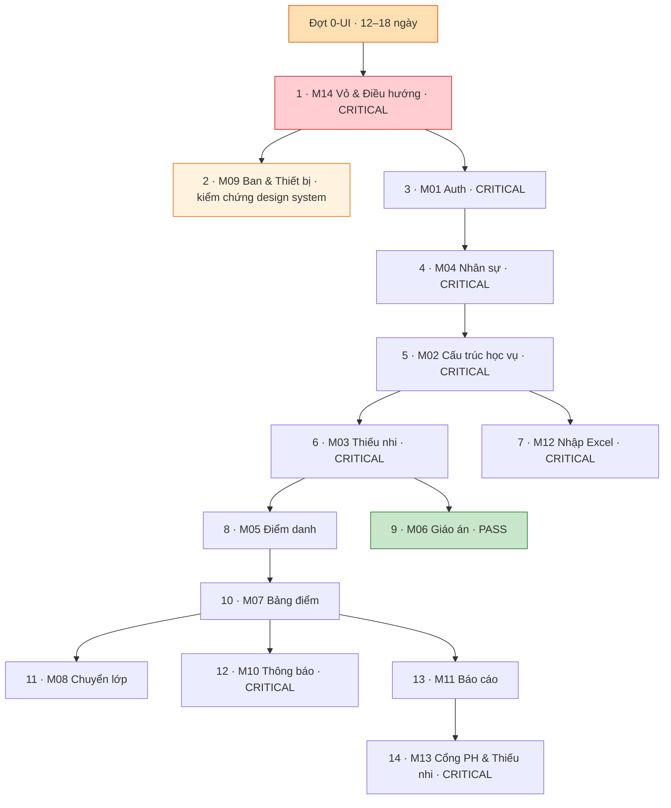

# 11 — KẾ HOẠCH MODULE ĐÃ PHÊ DUYỆT

> **Ngày duyệt: 2026-07-23. Người duyệt: chủ dự án.**
> Nguồn sự thật cho thứ tự và phạm vi công việc Giai đoạn 2B.
> Chi tiết từng module: `06_MODULE_UI_REDESIGN_PLAN.md` §2 — **không lặp lại ở đây**.

---

## 1. Phạm vi đã chốt

| Điều | Chốt |
|---|---|
| Hướng thiết kế | **A · Sân Giáo Xứ** + dải màu ngành 4px + thang chữ lớn cho M13 |
| Kiến trúc theme | **D + R3** — xem `10_APPROVED_THEME_RULES.md` |
| Bảng màu | **A + pastel** — xem `09_APPROVED_DESIGN_SYSTEM.md` |
| GLV nhiều lớp | **Không** — Q-01 = A ⇒ **0 migration cho theme** |
| Biểu đồ | SVG tự vẽ, dùng thẳng màu ngành, không xử lý mù màu |
| Số module | **14/14**, kể cả module `PASS` |

---

## 2. Đợt 0-UI — Nền tảng (chặn mọi module)

**Ước lượng 12–18 ngày.** Chi phí **một lần**, không nhân theo module.
Chia hai mốc để có kết quả nhìn thấy được sớm hơn.

### Mốc 0A — 6–9 ngày

| # | Việc | Cỡ |
|---|---|:--:|
| 0.1 | Tải **Be Vietnam Pro** qua `next/font/google` ở `src/app/layout.tsx` | S |
| 0.2 | Viết lại bộ token: màu trung tính/trạng thái · typography · spacing · radius · shadow · z-index · motion | M |
| 0.3 | `sector-palette.ts` + **5 unit test canh màu** (`09` §4.5) | S |
| 0.4 | `resolveThemeContext()` + `ThemeScope` + **30 unit test** (`10` §12) | L |
| 0.5 | Sửa 7 component hiện có sang token mới | M |
| 0.6 | 8 component ưu tiên: `Select` · `Dialog` · `ConfirmDialog` · `Skeleton` · `Alert` · `Textarea` · `BranchChip` · `EmptyState` (3 variant) | L |

### Mốc 0B — 6–9 ngày

| # | Việc | Cỡ |
|---|---|:--:|
| 0.7 | Sửa a11y vỏ: drawer thành dialog thật · skip link · thứ bậc heading · breadcrumb | M |
| 0.8 | 13 component còn lại: `SearchInput` · `Pagination` · `FilterBar` · `DataTable` · `Tabs` · `Breadcrumb` · `Dropdown` · `Toast` · `Tooltip` · `Avatar` · `Progress` · `FileUpload` · `SegmentedControl` · `Chart` | L |
| 0.9 | 6 component theme: `ContextIndicator` · `ChildSwitcher` · `AcademicYearSwitcher` (viết lại) · `UnassignedBanner` · `ArchivedYearBanner` · `ThemePreviewTable` (cho Q-12) | M |

> `BranchContextSwitcher` **không xây** (Q-01 = một lớp). Kiểu dữ liệu `availableThemeContexts`
> vẫn giữ dạng mảng để mở đường sau này.

---

## 3. Thứ tự 14 module

| # | Module | Trạng thái GĐ1 | Nghiệp vụ | Giao diện | Cỡ UI |
|--:|---|---|---|---|:--:|
| 1 | M14 Vỏ & Điều hướng | `CRITICAL` | Sửa | **Redesign** | L |
| 2 | M09 Ban & Thiết bị | `PASS_WITH_MINOR_UI_FIX` | Sửa có giới hạn | Tinh chỉnh | M |
| 3 | M01 Auth & Tài khoản | `CRITICAL` (4) | Sửa nhiều | **Redesign** | L |
| 4 | M04 Nhân sự | `CRITICAL` (5) | Sửa nhiều | **Redesign** | L |
| 5 | M02 Cấu trúc học vụ | `CRITICAL` (2) | Sửa | Tinh chỉnh | M |
| 6 | M03 Thiếu nhi & Phụ huynh | `CRITICAL` (2) | Sửa nhiều | **Redesign** | L |
| 7 | M12 Nhập Excel | `CRITICAL` (3) | Sửa nhiều | **Redesign** | L |
| 8 | M05 Điểm danh | `NEEDS_IMPROVEMENT` | Sửa | **Redesign** | L |
| 9 | M06 Giáo án | **`PASS_WITH_MINOR_UI_FIX`** | 🔴 **GIỮ NGUYÊN** | Tinh chỉnh | S |
| 10 | M07 Bảng điểm | `NEEDS_IMPROVEMENT` | Sửa | Tinh chỉnh | M |
| 11 | M08 Chuyển lớp | `NEEDS_IMPROVEMENT` | Sửa | Tinh chỉnh | M |
| 12 | M10 Thông báo | `CRITICAL` (2) | Sửa | Tinh chỉnh | M |
| 13 | M11 Báo cáo & Dashboard | `NEEDS_IMPROVEMENT` | Sửa | **Redesign** | L |
| 14 | M13 Cổng PH & Thiếu nhi | `CRITICAL` (3) | Sửa | **Redesign** | L |

**M09 làm sớm và song song** — độc lập nhất trong đồ thị phụ thuộc, dùng để kiểm chứng
design system trên một module thật trước khi áp cho các module rủi ro cao.

---

## 4. Quy trình bắt buộc cho mỗi module

1. Đọc `03_AUDIT_RESULTS.md` và `04_TO_BE_FLOWS.md` của module đó.
2. Xác định nghiệp vụ `PASS` hay cần sửa.
3. **Nếu cần sửa: sửa cơ sở dữ liệu / domain / API / phân quyền TRƯỚC, rồi mới sửa giao diện.**
4. Áp design system đã duyệt (`09`).
5. Đồng bộ desktop và mobile.
6. Chạy build · lint · type-check · test.
7. Kiểm accessibility.
8. Cập nhật implementation log + `00_SYSTEM_AUDIT_BOARD.md` + `WORKLOG.md` với **số kiểm thử thật**.
9. Sang module tiếp theo.

---

## 5. Nghiệm thu chung — áp cho **mọi** module

- [ ] `npm run build` · `lint` · `type-check` · `test` **xanh**
- [ ] E2E responsive 3 viewport (360 / 768 / 1366): **không tràn ngang**
- [ ] Mọi vùng chạm ≥44px
- [ ] Không cỡ chữ < 12px
- [ ] Không màu hardcode khi có token
- [ ] Không `window.confirm` / `window.alert`
- [ ] Không `<select>` native mới
- [ ] Mọi thao tác ghi có phản hồi (D-61) **và kiểm số dòng thay đổi** (SW-04)
- [ ] Trạng thái rỗng dùng đúng 1 trong 3 loại chuẩn
- [ ] Thao tác nguy hiểm có `ConfirmDialog` nêu hậu quả **bằng tên riêng**
- [ ] Thao tác nhạy cảm ghi nhật ký (D-65)
- [ ] `Tab` đi hết được · focus thấy được · `Escape` đóng được lớp nổi
- [ ] Không dùng màu làm tín hiệu duy nhất — **chip ngành luôn có tên ngành bằng chữ**
- [ ] Nếu siết quyền: **kiểm thử phân quyền âm tính bằng JWT thật của từng vai trò**
- [ ] Cập nhật tài liệu và implementation log

---

## 6. Sáu thay đổi phân quyền — nhắc lại từ `06_DECISION_LOG.md`

Đều cần sửa cơ sở dữ liệu và **đều phải có kiểm thử phân quyền bằng tài khoản thật**:

| # | Mã | Thay đổi | Hướng | Module |
|---|---|---|---|---|
| 1 | D-63 | Trưởng/Phó ngành tạo hồ sơ trong ngành mình | Nới | M03 |
| 2 | D-67 | Thủ quỹ có mức đọc riêng | Nới | M03/M11 |
| 3 | D-66 | Cha sở/Cha phó **không** chốt báo cáo | **Siết** | M11 |
| 4 | D-70 | Phụ huynh/Thiếu nhi chỉ thấy lớp mình | **Siết** | M02/M13 |
| 5 | D-74 | Khoá bảng điểm về GLV đại diện + GLV lớp | **Siết** | M07 |
| 6 | D-75 | Ẩn ghi chú điểm danh khỏi cổng phụ huynh | **Siết** | M05/M13 |

> ⚠️ **Bốn thay đổi siết quyền làm giảm quyền của người đang dùng.**
> Phải báo trước, nếu không họ tưởng hệ thống hỏng.
> Riêng D-70 phải **rà lại toàn bộ cổng phụ huynh** — siết quá tay sẽ hiện *"lớp không xác định"*.

---

## 7. Khối lượng tổng

| Hạng mục | Ngày-người |
|---|--:|
| Nghiệp vụ (6 đợt, `05_REDESIGN_PRIORITY_PLAN.md`) | 60–86 |
| **+ Đợt 0-UI** (font, token, theme resolver, 27 component) | **12–18** |
| **+ Áp design system cho 14 module** | **20–30** |
| **Tổng** | **92–134** |

**Migration phát sinh từ Giai đoạn 2A: 0.** Q-01 = một lớp đã loại bỏ hoàn toàn nhu cầu migration cho theme.

---

## 8. Đầu vào cho Giai đoạn 3

| Đầu vào | Nguồn |
|---|---|
| Tiêu chí nghiệm thu UI/UX từng module | `06_MODULE_UI_REDESIGN_PLAN.md` §2 |
| Tiêu chí nghiệm thu chung (15 mục) | §5 tài liệu này |
| 30 unit test + 7 E2E cho theme resolver | `10_APPROVED_THEME_RULES.md` §12 |
| 10 integration + 5 E2E cho chuyển năm học | `15_ACADEMIC_YEAR_THEME_TRANSITION.md` §7 |
| 67 tình huống biên của theme, có kết quả kỳ vọng | `14_THEME_EDGE_CASE_MATRIX.md` |
| Ngưỡng tương phản đo được cho mọi token | `09_APPROVED_DESIGN_SYSTEM.md` §3–§4 |
| Danh sách "không được đụng" | `09` §11 + mục "Không đụng" trong từng module ở `06` |
| Script tái lập số liệu màu | `scripts/palette.mjs` · `cvd.mjs` · `pastel.mjs` · `approved.mjs` · `chart-check.mjs` · `accent-check.mjs` |
